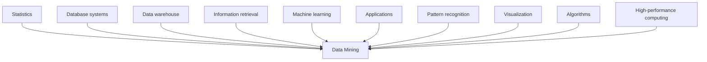
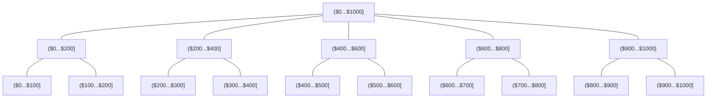

# Data Intensive Systems (DIS)
## KBH-SW7 E25
### 5. Foundation of Data Mining

The background of the slide features a large, multi-story modern atrium with wooden-slatted walls and concrete pillars. Numerous white square panels are suspended from the high ceiling at various heights. On the ground floor, there is an open area with tables and chairs where people are sitting and working. Large glass windows in the background provide a view of an outdoor area near water.

AALBORG UNIVERSITY

---

# Agenda

* Introduction to Data Mining
    - Data Mining Process
    - Different Types of Data Mining
    - Technologies used in Data Mining
* Data Preprocessing

AALBORG UNIVERSITET SIDE 2

---

# What is Data Mining?

* Data mining turns a large collection of data into knowledge.

The page features two illustrations depicting the concept of data mining:

1.  The first illustration shows a person standing amidst many stacks of cylinders, representing a large volume of data. A thought bubble above the person's head contains the question: "How can I analyze these data?"
2.  The second illustration shows the same person as a miner, equipped with a pickaxe and a shovel, standing next to a tall stack of cylinders. Next to them is a mining cart filled with small, extracted pieces, and the cart is labeled "Knowledge".

AALBORG UNIVERSITET
SIDE 3

---

# Limitation of First-oder Logic

* First-order logic
    - "All men are mortal. Socrates is a man. Therefore, Socrates is mortal." $(\forall x . \text{man}(x) \rightarrow \text{mortal}(x)) \wedge \text{man}(\text{Socrates}) \rightarrow \text{mortal}(\text{Socrates})$
* We can only represent the facts, which are either true or false. First-order logic is not sufficient to represent the complex sentences or natural language statements.
    - $\forall x . \text{car}(x) \wedge \text{black}(x) \rightarrow \text{brake}(\text{self})$
    - $\forall x . \text{truck}(x) \wedge \text{red}(x) \rightarrow \text{brake}(\text{self})?$
    - $\forall x . \text{car}(x) \wedge \text{blue}(x) \rightarrow \text{brake}(\text{self})?$

AALBORG UNIVERSITET
SIDE 4

---

# Data Mining Process

* Data cleaning (to remove noise and inconsistent data)
* Data integration (where multiple data sources may be combined)
* Data selection (where data relevant to the analysis task are retrieved from the database)
* Data transformation (where data are transformed and consolidated into forms appropriate for mining by performing summary or aggregation operations)
* Data mining (an essential process where intelligent methods are applied to extract data patterns)
* Pattern evaluation (to identify the truly interesting patterns representing knowledge based on interestingness measures)
* Knowledge presentation (where visualization and knowledge representation techniques are used to present mined knowledge to users)

AALBORG UNIVERSITET
SIDE 5

---

# Different Types of Data Mining

<table>
  <thead>
    <tr>
        <th>Tasks</th>
        <th>Description</th>
        <th>Algorithms</th>
        <th>Examples</th>
    </tr>
  </thead>
  <tbody>
    <tr>
        <td>Classification</td>
<td>Predict if a data point belongs to one of the predefined classes. The prediction will be based on learning from a known dataset</td>
<td>Decision trees, neural networks, Bayesian models, induction rules, k-nearest neighbors</td>
<td>Assigning voters into known buckets by political parties, e.g., soccer moms
Bucketing new customers into one of the known customer groups</td>
    </tr>
<tr>
        <td>Regression</td>
<td>Predict the numeric target label of a data point. The prediction will be based on learning from a known dataset</td>
<td>Linear regression, logistic regression</td>
<td>Predicting the unemployment rate for the next year
Estimating insurance premium</td>
    </tr>
<tr>
        <td>Anomaly detection</td>
<td>Predict if a data point is an outlier compared to other data points in the dataset</td>
<td>Distance-based, density-based, LOF</td>
<td>Detecting fraudulent credit card transactions and network intrusion</td>
    </tr>
<tr>
        <td>Time series forecasting</td>
<td>Predict the value of the target variable for a future timeframe based on historical values</td>
<td>Exponential smoothing, ARIMA regression</td>
<td>Sales forecasting, production forecasting, virtually any growth phenomenon that needs to be extrapolated</td>
    </tr>
<tr>
        <td>Clustering</td>
<td>Identify natural clusters within the dataset based on inherit properties within the dataset</td>
<td>k-Means, density-based clustering (e.g., DBSCAN)</td>
<td>Finding customer segments in a company based on transaction, web, and customer call data</td>
    </tr>
<tr>
        <td>Association analysis</td>
<td>Identify relationships within an item set based on transaction data</td>
<td>FP-growth algorithm, a priori algorithm</td>
<td>Finding cross-selling opportunities for a retailer based on transaction purchase history</td>
    </tr>
<tr>
        <td>Recommendation engines</td>
<td>Predict the preference of an item for a user</td>
<td>Collaborative filtering, content-based filtering, hybrid recommenders</td>
<td>Finding the top recommended movies for a user</td>
    </tr>
  </tbody>
</table>

AALBORG UNIVERSITET
SIDE 6

---

# Which Technologies Are Used?

* **Statistics** studies the collection, analysis, interpretation or explanation, and presentation of data. Data mining has an inherent connection with statistics.
* **Machine learning** investigates how computers can automatically learn to recognize complex patterns and make intelligent decisions (or improve their performance) based on data.
* **Database systems** focuses on the creation, maintenance, and use of databases for organizations and end-users.
* **Information retrieval** is the science of searching for documents or information in documents. Documents can be text or multimedia, and may reside on the Web.

AALBORG UNIVERSITET
SIDE 7

---

# Data Mining Settings

<table>
  <thead>
    <tr>
        <th>Criteria</th>
        <th>Supervised</th>
        <th>Unsupervised</th>
        <th>Reinforcement</th>
    </tr>
  </thead>
  <tbody>
    <tr>
        <td>Definition</td>
<td>Use labeled data</td>
<td>Use unlabeled data without any guidance.</td>
<td>Work on interacting with the environment</td>
    </tr>
<tr>
        <td>Type of data</td>
<td>Labeled data</td>
<td>Unlabeled data</td>
<td>No – predefined data</td>
    </tr>
<tr>
        <td>Type of problems</td>
<td>Regression and classification</td>
<td>Association and Clustering</td>
<td>Exploitation or Exploration</td>
    </tr>
<tr>
        <td>Supervision</td>
<td>Extra supervision</td>
<td>No supervision</td>
<td>No supervision</td>
    </tr>
<tr>
        <td>Algorithms</td>
<td>Linear Regression, Logistic Regression, SVM, KNN etc.</td>
<td>K – Means, C – Means, Apriori</td>
<td>Q – Learning, SARSA</td>
    </tr>
<tr>
        <td>Aim</td>
<td>Calculate outcomes</td>
<td>Discover underlying patterns</td>
<td>Learn a series of action</td>
    </tr>
<tr>
        <td>Application</td>
<td>Risk Evaluation, Forecast Sales</td>
<td>Recommendation System, Anomaly Detection</td>
<td>Self Driving Cars, Gaming, Healthcare</td>
    </tr>
  </tbody>
</table>

AALBORG UNIVERSITET
SIDE 8

---

# Agenda

* Introduction to Data Mining
* Data Preprocessing
    - Motivation of Data Preprocessing
    - Data Cleaning
    - Data Integration
    - Data Reduction
    - Data Transformation

AALBORG UNIVERSITET
SIDE 9

---

# Prior Knowledge

* **Objective:** the data mining process starts with a need for analysis, a question, or a business objective.
* **Subject area:** it is essential to know the subject matter, the context, and the business process generating the data.
* **Data:** quality of the data, quantity of data, availability of data, gaps in data, labels...

<table>
  <thead>
    <tr>
        <th colspan="3">Table 2.1 Dataset</th>
    </tr>
<tr>
        <th>Borrower ID</th>
        <th>Credit Score</th>
        <th>Interest Rate (%)</th>
    </tr>
  </thead>
  <tbody>
    <tr>
        <td>01</td>
<td>500</td>
<td>7.31</td>
    </tr>
<tr>
        <td>02</td>
<td>600</td>
<td>6.70</td>
    </tr>
<tr>
        <td>03</td>
<td>700</td>
<td>5.95</td>
    </tr>
<tr>
        <td>04</td>
<td>700</td>
<td>6.40</td>
    </tr>
<tr>
        <td>05</td>
<td>800</td>
<td>5.40</td>
    </tr>
<tr>
        <td>06</td>
<td>800</td>
<td>5.70</td>
    </tr>
<tr>
        <td>07</td>
<td>750</td>
<td>5.90</td>
    </tr>
<tr>
        <td>08</td>
<td>550</td>
<td>7.00</td>
    </tr>
<tr>
        <td>09</td>
<td>650</td>
<td>6.50</td>
    </tr>
<tr>
        <td>10</td>
<td>825</td>
<td>5.70</td>
    </tr>
  </tbody>
</table>

<table>
  <thead>
    <tr>
        <th colspan="3">Table 2.2 New Data With Unknown Interest Rate</th>
    </tr>
<tr>
        <th>Borrower ID</th>
        <th>Credit Score</th>
        <th>Interest Rate</th>
    </tr>
  </thead>
  <tbody>
    <tr>
        <td>11</td>
<td>625</td>
<td>?</td>
    </tr>
  </tbody>
</table>

AALBORG UNIVERSITET
SIDE 10

---

# Data Preprocessing

* Preparing the dataset to suit a data mining task is the most time-consuming part of the process.
* It is extremely rare that datasets are available in the form required by the data mining algorithms.
* Most of the data mining algorithms would require data to be structured.

AALBORG UNIVERSITET
SIDE 11

---

# Data Preprocessing

* **Data exploration:** in-depth exploration of the data and gaining a better understanding of the dataset.
* **Data quality:** errors in data will impact the representativeness of the model.
* **Missing values:** the most common data quality issues is that some records have missing attribute values.
* **Data type:** different data mining algorithms impose different restrictions on the attribute data types.
* **Transformation:** in some data mining, the input attributes are expected to be numeric and normalized.
* **Outliers:** the presence of outliers needs to be understood and will require special treatments.
* **Feature selection:** a large number of attributes in the dataset significantly increases the complexity of a model and may degrade the performance of the model.
* **Data sampling:** the sample data serve as a representative of the original dataset with similar properties.

AALBORG UNIVERSITET
SIDE 12

---

# Motivation of Data Preprocessing

* Problem
    - Real-world databases are highly susceptible to noisy, missing, and inconsistent data due to their typically huge size and their likely origin from multiple, heterogenous sources.
    - Low-quality data will lead to low-quality mining results.
* Why Preprocess the Data?
    - Incomplete (lacking attribute values or certain attributes of interest, or containing only aggregate data).
    - Inaccurate (containing errors, or values that deviate from the expected).
    - Inconsistent (e.g., containing discrepancies in the department codes used to categorize items).

AALBORG UNIVERSITET
SIDE 13

---

# Tasks in Data Preprocessing

* Major Tasks in Data Preprocessing
    - Data cleaning.
    - Data integration.
    - Data reduction.
    - Data transformation.

AALBORG UNIVERSITET
SIDE 14

---

AALBORG UNIVERSITET
SIDE 15

# Data Cleaning

* Missing Values
    * What is missing values? Missing values are the empty values due to the error of recording devices or end-users.
    * What is the problem of missing values? Most of the data mining methods cannot handle missing values.

<table>
  <thead>
    <tr>
        <th>ID</th>
        <th>sepal_length</th>
        <th>sepal_width</th>
        <th>petal_length</th>
        <th>petal_width</th>
    </tr>
  </thead>
  <tbody>
    <tr>
        <td>1</td>
<td>5.1</td>
<td>3.4</td>
<td>1.4</td>
<td>0.2</td>
    </tr>
<tr>
        <td>2</td>
<td></td>
<td>3</td>
<td>1.4</td>
<td>0.2</td>
    </tr>
<tr>
        <td>3</td>
<td>4.6</td>
<td>3.2</td>
<td></td>
<td>0.3</td>
    </tr>
  </tbody>
</table>

---

# Data Cleaning

* Missing Values
    - Ignore the tuples.

<table>
  <thead>
    <tr>
      <th>ID</th>
      <th>sepal_length</th>
      <th>sepal_width</th>
      <th>petal_length</th>
      <th>petal_width</th>
    </tr>
  </thead>
  <tbody>
    <tr>
      <td>1</td>
<td>5.1</td>
<td>3.4</td>
<td>1.4</td>
<td>0.2</td>
    </tr>
  </tbody>
</table>

AALBORG UNIVERSITET SIDE 16

---

# Data Cleaning

* Missing Values
    - Fill in the missing value manually.

<table>
  <thead>
    <tr>
      <th>ID</th>
      <th>sepal_length</th>
      <th>sepal_width</th>
      <th>petal_length</th>
      <th>petal_width</th>
    </tr>
  </thead>
  <tbody>
    <tr>
      <td>1</td>
<td>5.1</td>
<td>3.4</td>
<td>1.4</td>
<td>0.2</td>
    </tr>
<tr>
      <td>2</td>
<td>5.0</td>
<td>3</td>
<td>1.4</td>
<td>0.2</td>
    </tr>
<tr>
      <td>3</td>
<td>4.6</td>
<td>3.2</td>
<td>1.2</td>
<td>0.3</td>
    </tr>
  </tbody>
</table>

AALBORG UNIVERSITET
SIDE 17

---

# Data Cleaning

* Missing Values
    - Use a global constant.

<table>
  <thead>
    <tr>
      <th>ID</th>
      <th>sepal_length</th>
      <th>sepal_width</th>
      <th>petal_length</th>
      <th>petal_width</th>
    </tr>
  </thead>
  <tbody>
    <tr>
      <td>1</td>
<td>5.1</td>
<td>3.4</td>
<td>1.4</td>
<td>0.2</td>
    </tr>
<tr>
      <td>2</td>
<td>0.0</td>
<td>3</td>
<td>1.4</td>
<td>0.2</td>
    </tr>
<tr>
      <td>3</td>
<td>4.6</td>
<td>3.2</td>
<td>0.0</td>
<td>0.3</td>
    </tr>
  </tbody>
</table>

AALBORG UNIVERSITET
SIDE 18

---

# Data Cleaning

* Missing Values
    * Use a measure of central tendency.

$$\text{sepal\_length} = \frac{5.1 + 4.6}{2}$$
$$\text{petal\_length} = \frac{1.4 + 1.4}{2}$$
$$x_i = \frac{1}{N} \sum_{1}^{N} x$$

<table>
  <thead>
    <tr>
        <th>ID</th>
        <th>sepal_length</th>
        <th>sepal_width</th>
        <th>petal_length</th>
        <th>petal_width</th>
    </tr>
  </thead>
  <tbody>
    <tr>
        <td>1</td>
<td>5.1</td>
<td>3.4</td>
<td>1.4</td>
<td>0.2</td>
    </tr>
<tr>
        <td>2</td>
<td>4.9</td>
<td>3</td>
<td>1.4</td>
<td>0.2</td>
    </tr>
<tr>
        <td>3</td>
<td>4.6</td>
<td>3.2</td>
<td>1.4</td>
<td>0.3</td>
    </tr>
  </tbody>
</table>

AALBORG UNIVERSITET
SIDE 19

---

# Data Cleaning

* Missing Values
    * Use the most probable value.

$$x = \alpha * y + \beta * z$$

<table>
  <thead>
    <tr>
      <th>ID</th>
      <th>sepal_length</th>
      <th>sepal_width</th>
      <th>petal_length</th>
      <th>petal_width</th>
    </tr>
  </thead>
  <tbody>
    <tr>
      <td>1</td>
<td>5.1</td>
<td>3.4</td>
<td>1.4</td>
<td>0.2</td>
    </tr>
<tr>
      <td>2</td>
<td>4.9</td>
<td>3</td>
<td>1.4</td>
<td>0.2</td>
    </tr>
<tr>
      <td>3</td>
<td>4.6</td>
<td>3.2</td>
<td>1.4</td>
<td>0.3</td>
    </tr>
  </tbody>
</table>

AALBORG UNIVERSITET
SIDE 20

---

# Data Cleaning

* Noisy Data
    * What is noise? Noise is a random error or variance in a measured variable.
    * Sometimes, noise is considered as outliers.

<table>
  <thead>
    <tr>
      <th>ID</th>
      <th>sepal_length</th>
      <th>sepal_width</th>
      <th>petal_length</th>
      <th>petal_width</th>
    </tr>
  </thead>
  <tbody>
    <tr>
      <td>1</td>
<td>5.1</td>
<td>3.4</td>
<td>1.4</td>
<td>0.2</td>
    </tr>
<tr>
      <td>2</td>
<td>10.7</td>
<td>3</td>
<td>1.4</td>
<td>0.2</td>
    </tr>
<tr>
      <td>3</td>
<td>4.6</td>
<td>3.2</td>
<td>5.3</td>
<td>0.3</td>
    </tr>
  </tbody>
</table>

AALBORG UNIVERSITET
SIDE 21

---

# Data Cleaning

* Noisy Data
    - Smooth data by binning method
    - Predefine bin from minimum values to maximum values
    - Assign the noisy value to a specific bin

<table>
  <thead>
    <tr>
        <th>ID</th>
        <th>sepal_length</th>
        <th>sepal_width</th>
        <th>petal_length</th>
        <th>petal_width</th>
    </tr>
  </thead>
  <tbody>
    <tr>
        <td>1</td>
<td>5.1 =&gt; [4.9, 5.1]</td>
<td>3.4</td>
<td>1.4 =&gt; [1.2, 1.4]</td>
<td>0.2</td>
    </tr>
<tr>
        <td>2</td>
<td>10.7 =&gt; [5.1, 5.3]</td>
<td>3</td>
<td>1.4 =&gt; [1.2, 1.4]</td>
<td>0.2</td>
    </tr>
<tr>
        <td>3</td>
<td>4.6 =&gt; [4.5, 4.7]</td>
<td>3.2</td>
<td>5.3 =&gt; [1.6, 1.8]</td>
<td>0.3</td>
    </tr>
  </tbody>
</table>

AALBORG UNIVERSITET
SIDE 22

---

# Data Cleaning

* Data Cleaning as a Process
    * Use metadata.
        - Data type
    * Use rules.
        - Unique rule
        - Null rule
        - Consecutive rule

AALBORG UNIVERSITET
SIDE 23

---

# Data Integration

* Data Integration
    - Data mining often requires data integration—the merging of data from multiple data stores.
    - Careful integration can help reduce and avoid redundancies and inconsistencies.
    - Thus, improve the accuracy and speed of the subsequent data mining process.

AALBORG UNIVERSITET
SIDE 24

---

# Data Integration

* Entity Identification Problem
    * How can the data analyst or the computer be sure that *customer_id* in one database and *cust_number* in another refer to the same attribute.
    * When matching attributes from one database to another during integration, special attention must be paid to the structure of the data.

AALBORG UNIVERSITET SIDE 25

---

# Data Integration

* Redundancy Problem
    - Redundancy is another important issue in data integration. An attribute (such as annual revenue) may be redundant if it can be “derived” from another attribute or set of attributes.
    - Inconsistencies in attribute or dimension naming can also cause redundancies in the resulting data set.

AALBORG UNIVERSITET
SIDE 26

---

# Data Integration

* Tuple Duplication Problem
    * Redundancy is another important issue in data integration. An attribute (such as annual revenue, for instance) may be redundant if it can be "derived" from another attribute or set of attributes.
    * Inconsistencies in attribute or dimension naming can also cause redundancies in the resulting data set.

AALBORG UNIVERSITET
SIDE 27

---

# Data Integration

* Data integration also involves the detection and resolution of data value conflicts. For example, for the same real-world entity, attribute values from different sources may differ.
* This may be due to differences in representation, scaling, or encoding.
* For instance, a weight attribute may be stored in metric units in one system and British imperial units in another.
* For a hotel chain, the price of rooms in different cities may involve not only different currencies but also different services (e.g., free breakfast) and taxes.

AALBORG UNIVERSITET
SIDE 28

---

# Data Reduction

* Data reduction techniques can be applied to obtain a reduced representation of the data set that is much smaller in volume, yet closely maintains the integrity of the original data.
* That is, mining on the reduced data set should be more efficient yet produce the same (or almost the same) analytical results.

AALBORG UNIVERSITET
SIDE 29

---

# Data Reduction

* **Dimensionality reduction** is the process of reducing the number of random variables or attributes under consideration.
* Dimensionality reduction methods include wavelet transforms and principal components analysis, which transform or project the original data onto a smaller space.
* Attribute subset selection is a method of dimensionality reduction in which irrelevant, weakly relevant, or redundant attributes or dimensions are detected and removed.

AALBORG UNIVERSITET
SIDE 30

---

# Data Reduction

* **Numerosity reduction** techniques replace the original data volume by alternative, smaller forms of data representation. These techniques may be parametric or non-parametric.
* For parametric methods, a model is used to estimate the data, so that typically only the data parameters need to be stored, instead of the actual data. Regression and log-linear models are examples.
* Nonparametric methods for storing reduced representations of the data include histograms, clustering, sampling, and data cube aggregation

AALBORG UNIVERSITET
SIDE 31

---

# Data Reduction

* In **data compression**, transformations are applied so as to obtain a reduced or “compressed” representation of the original data.
* If the original data can be reconstructed from the compressed data without any information loss, the data reduction is called lossless. If, instead, we can reconstruct only an approximation of the original data, then the data reduction is called lossy.

AALBORG UNIVERSITET
SIDE 32

---

# Data Transformation

* Overview
    * In data transformation, the data are transformed or consolidated into forms appropriate for mining so that the resulting mining process may be more efficient, and the patterns found may be easier to understand.
    * Standard data transformation techniques are aggregation, normalization and discretization.

AALBORG UNIVERSITET
SIDE 33

---

# Data Transformation

* Aggregation
    * Summary or aggregation operations are applied to the data. For example, the daily sales data may be aggregated so as to compute monthly and annual total amounts.

<table>
  <thead>
    <tr>
        <th>ID</th>
        <th>name</th>
        <th>salary</th>
        <th>age</th>
    </tr>
  </thead>
  <tbody>
    <tr>
        <td>1</td>
<td>Jose</td>
<td>14,500</td>
<td>27</td>
    </tr>
<tr>
        <td>2</td>
<td>Remy</td>
<td>30,000</td>
<td>42</td>
    </tr>
<tr>
        <td>3</td>
<td>Ben</td>
<td>7,500</td>
<td>35</td>
    </tr>
<tr>
        <td>4</td>
<td>Daniel</td>
<td>24,000</td>
<td>31</td>
    </tr>
<tr>
        <td>5</td>
<td>John</td>
<td>16,000</td>
<td>22</td>
    </tr>
<tr>
        <td>6</td>
<td>Mary</td>
<td>26,300</td>
<td>28</td>
    </tr>
<tr>
        <td>7</td>
<td>Walker</td>
<td>8,700</td>
<td>36</td>
    </tr>
<tr>
        <td>8</td>
<td></td>
<td>(SUM) 127,000</td>
<td></td>
    </tr>
  </tbody>
</table>

AALBORG UNIVERSITET
SIDE 34

---

# Data Transformation

* Normalization
    - **Min-max Normalization.** Min-max normalization performs a linear transformation on the original data. Suppose that $min_A$ and $max_A$ are the minimum and maximum values of an attribute, $A$. Min-max normalization maps a value, $v_i$, of $A$ to $v'_i$ in the range $[newmin_A, newmax_A]$
    - $$v'_i = \frac{v_i - min_A}{max_A - min_A} (newmax_A - newmin_A) + newmin_A$$

AALBORG UNIVERSITET
SIDE 35

---

# Data Transformation

* Mini-quiz 1
    - Suppose that the minimum and maximum values for the attribute income are $12,000 and $98,000, respectively. We would like to map income to the range [0.0,1.0]. By min-max normalization, what is the value of $73,600?
    - $$v'_i = \frac{v_i - minA}{maxA - minA}(newmaxA - newminA) + newminA$$
    - $$\frac{73,600 - 12,000}{98,000 - 12,000}(1.0 - 0) + 0 = 0.716$$

AALBORG UNIVERSITET
SIDE 36

---

# Data Transformation

* Normalization
    * **z-score Normalization.** In z-score normalization, the values for an attribute, $A$, are normalized based on the mean and standard deviation of $A$. A value, $v_i$, of $A$ is normalized to $v'_i$ by computing

$$v'_i = \frac{v_i - \bar{A}}{\sigma_A}$$

AALBORG UNIVERSITET
SIDE 37

---

# Data Transformation

* Mini-quiz 2
    - Suppose that the mean and standard deviation of the values for the attribute income are $54,000 and $16,000, respectively. With z-score normalization, what is the value of $73,600?

AALBORG UNIVERSITET
SIDE 38

---

# Data Transformation

* Mini-quiz 2
    * Suppose that the mean and standard deviation of the values for the attribute income are $54,000 and $16,000, respectively. With z-score normalization, what is the value of $73,600?
    * $$v'_i = \frac{v_i - \bar{A}}{\sigma_A}$$
    * $$\frac{73,600 - 54,000}{16,000} = 1.225$$

AALBORG UNIVERSITET
SIDE 39

---

# Data Transformation

* Normalization
    - Decimal Scaling. Decimal scaling normalizes by moving the decimal point of values of attribute A. The number of decimal points moved depends on the maximum absolute value of A. A value, vi, of A is normalized to v'i by computing

$$v'_i = \frac{v_i}{10^j}$$

AALBORG UNIVERSITET
SIDE 40

---

# Data Transformation

* Discretization
    * **Binning.** Binning is a top-down splitting technique based on a specified number of bins. The continuous data is then discretized by putting into appropriate bins

AALBORG UNIVERSITET
SIDE 41

---

# Data Transformation

* Discretization
    - **Binning.** Binning is a top-down splitting technique based on a specified number of bins. The continuous data is then discretized by putting into appropriate bins

<table>
  <thead>
    <tr>
        <th>ID</th>
        <th>name</th>
        <th>salary</th>
        <th>age</th>
    </tr>
  </thead>
  <tbody>
    <tr>
        <td>1</td>
<td>Jose</td>
<td>14,500 =&gt; [10,000-20,000]</td>
<td>27 =&gt; [20-30]</td>
    </tr>
<tr>
        <td>2</td>
<td>Remy</td>
<td>30,000 =&gt; [30,000-40,000]</td>
<td>42 =&gt; [40-50]</td>
    </tr>
<tr>
        <td>3</td>
<td>Ben</td>
<td>7,500 =&gt; [0-10,000]</td>
<td>35 =&gt; [30-40]</td>
    </tr>
<tr>
        <td>4</td>
<td>Daniel</td>
<td>24,000 =&gt; [20,000-30,000]</td>
<td>31 =&gt; [30-40]</td>
    </tr>
<tr>
        <td>5</td>
<td>John</td>
<td>16,000 =&gt; [10,000-20,000]</td>
<td>22 =&gt; [20-30]</td>
    </tr>
<tr>
        <td>6</td>
<td>Mary</td>
<td>26,300 =&gt; [20,000-30,000]</td>
<td>28 =&gt; [20-30]</td>
    </tr>
<tr>
        <td>7</td>
<td>Walker</td>
<td>8,700 =&gt; [0-10,000]</td>
<td>36 =&gt; [30-40]</td>
    </tr>
  </tbody>
</table>

AALBORG UNIVERSITET
SIDE 42

---

# Data Transformation

* Discretization
    * **Clustering.** A clustering algorithm can be applied to discretize a numeric attribute, A, by partitioning the values of A into clusters or groups so that objects within a cluster are "similar" to one another and "dissimilar" to objects in other clusters.
    * **Decision Tree.** Decision trees can be applied to discretize. Such techniques employ a top-down splitting approach. Unlike the other methods mentioned so far, decision tree approaches to discretize are supervised (use of class label information)..

AALBORG UNIVERSITET
SIDE 43

---

# Summary

* What is data mining?
* What is data mining process?
* What are data mining types?
* What are data mining settings?
* Why do we need to do the data preprocessing?
* What are data preprocessing tasks?
* How to do data preprocessing?

AALBORG UNIVERSITET
SIDE 44

---

# References

* Mandatory Reading
    - Jiawei Han, Micheline Kamber, Jian Pei: Data Mining Concepts and Techniques, 3rd Edition, Chapter 1: Introduction
    - Jiawei Han, Micheline Kamber, Jian Pei: Data Mining Concepts and Techniques, 3rd Edition, Chapter 2: Getting to Know Your Data
    - Jiawei Han, Micheline Kamber, Jian Pei: Data Mining Concepts and Techniques, 3rd Edition, Chapter 3: Data Preprocessing

AALBORG UNIVERSITET SIDE 45

---

# Exercises

* Download IRIS dataset
    - https://www.kaggle.com/datasets/uciml/iris
    - OR https://scikit-learn.org/1.5/auto_examples/datasets/plot_iris_dataset.html
* Install Python Environment (Conda, WinPython)
* Write code to read IRIS dataset
* Implementing normalization methods and apply them to IRIS

AALBORG UNIVERSITET
SIDE 46
