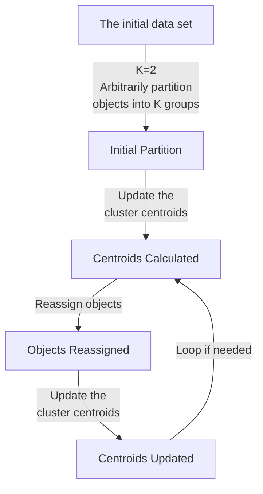
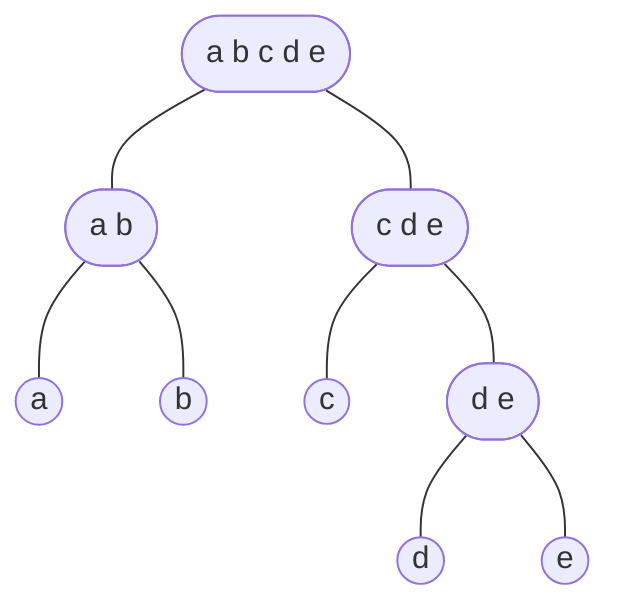
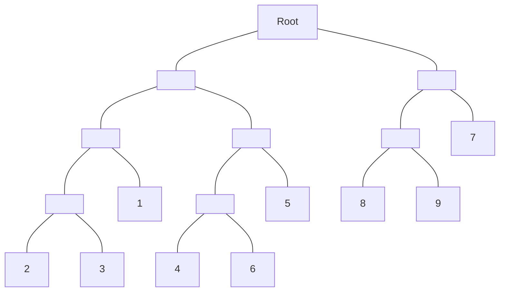
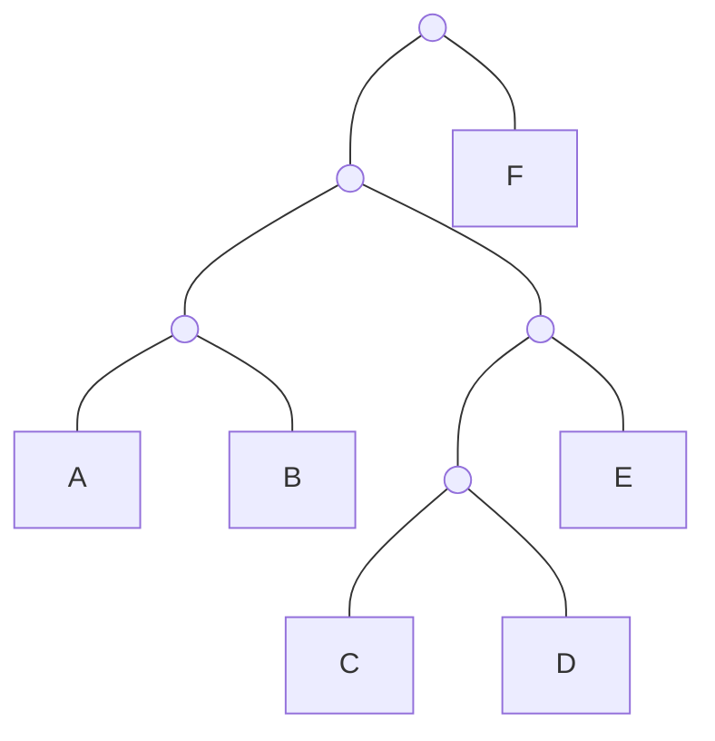
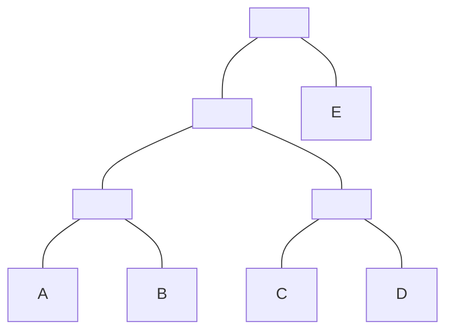
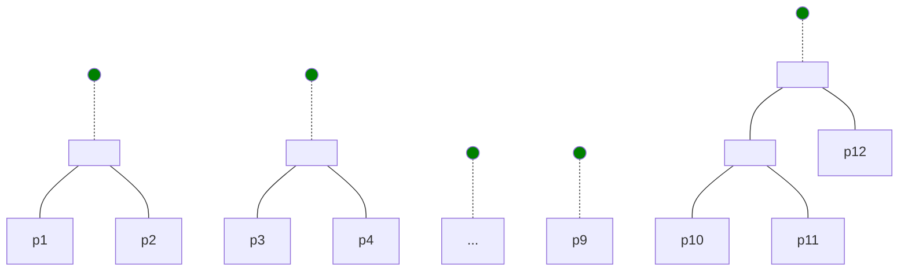
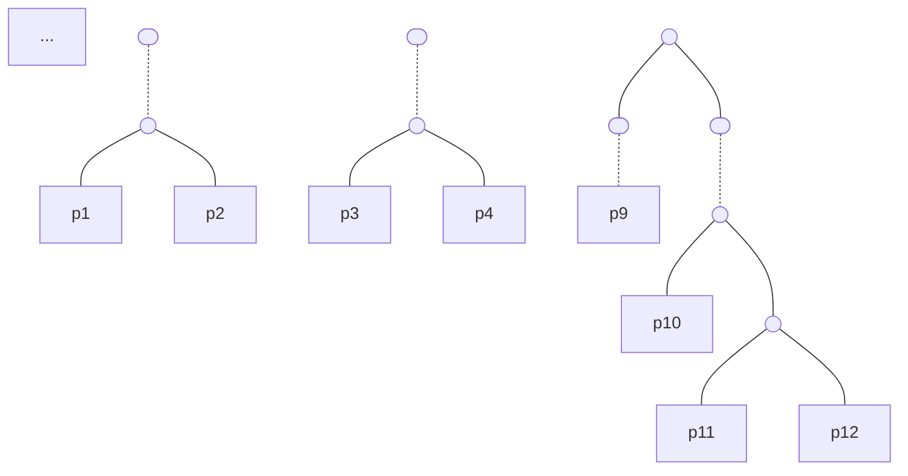
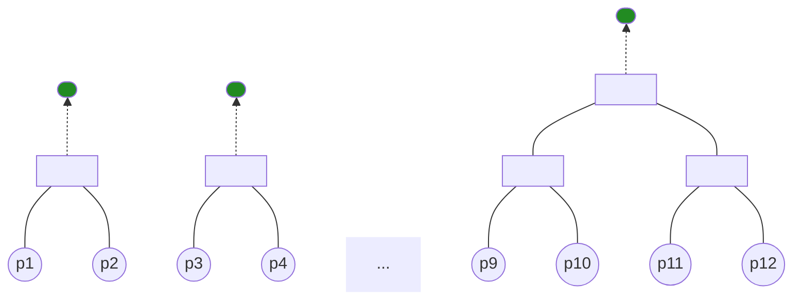
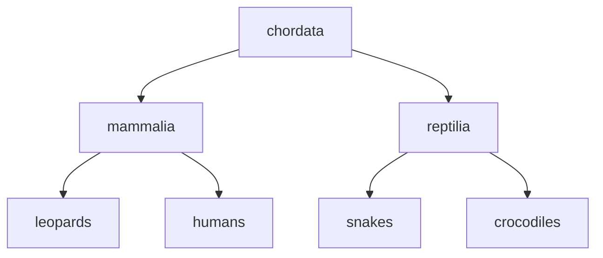
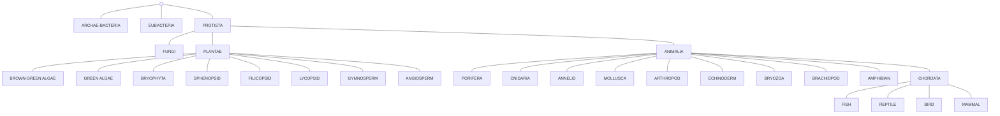

# Data Intensive Systems (DIS)
## KBH-SW7 E25

### 8. Clustering

The background of the slide is a photograph of a large, modern, multi-story indoor atrium, likely a campus building at Aalborg University. The space features multiple levels with wooden-slatted balconies, large concrete pillars, and floor-to-ceiling windows looking out onto a waterfront. Numerous white square panels are suspended from the ceiling in the central atrium. People are seen working and socializing at various tables and seating areas on the ground floor.

AALBORG UNIVERSITY


---

# Supervised vs. Unsupervised Learning

* Supervised learning generalizes from *known examples* to automate decision-making processes.
    * Classification: Predict a discrete value from a *pre-defined* set of class labels
    * Regression: Predict a continuous value from a continuous range
* Unsupervised learning does *not* need any known examples. It works on input data directly.
    * Clustering
    * Association rules
    * Dimensionality reduction

AALBORG UNIVERSITET
SIDE 2


---

# Agenda

* Clustering in general
* k-Means
* Hierarchical clustering
* DBSCAN
* Evaluation of clustering

AALBORG UNIVERSITET SIDE 3


---

# What is Clustering?

* Grouping of objects, *s.t.* the objects in a group (*cluster*) are similar (or related) to each other and different from (or unrelated to) objects in other groups

The diagram shows three clusters of hexagonal objects in a 3D coordinate system, with the following annotations:

* **Intra-cluster dissimilarities are minimized** (indicated by an arrow within a cluster)
* **Inter-cluster dissimilarities are maximized** (indicated by an arrow between two clusters)

**Notes:**
* Dissimilarity is often measure as **distance**.
* A clustering is a set of clusters. Sometimes we use clustering (analysis) to refer to the process of deciding all clusters.

AALBORG UNIVERSITET
SIDE 4


---

# A More Formal Definition of Clustering

* **Input**: A collection *C* of data objects
* **Output**: A set of *disjoint* clusters whose union is *C*.
    - Objects in the same clusters are *similar* to each other.
    - Objects in one cluster are *dissimilar* to those in other clusters.
* **Process**: Finding similarities between data objects according to the characteristics in the data and grouping similar data objects into clusters.
* Typical use of clustering
    - As a **stand-alone tool** to get insight into data distribution
    - As a **preprocessing step** for other algorithms
* **Unsupervised learning**: clusters are *not* pre-defined
    - Classification is *supervised learning*: we have training data with known class labels

AALBORG UNIVERSITET
SIDE 5


---


# Classification vs. Clustering

## Classification

* Predefined classes
    - Number of classes
    - Meaning of classes
* Training
    - Supervised learning
* Work for any number of objects
    - Given an object, a classifier (trained model) assigns it to a class

## Clustering

* No prior knowledge about
    - Number of clusters *
    - Meaning of clusters
* No training
    - Unsupervised learning
* There must be a sufficient number of objects
    - Meaningless to conduct clustering analysis on one or few objects

AALBORG UNIVERSITET
SIDE 6


---


# Basic Steps of Clustering

<table>
  <thead>
    <tr>
        <th>Step</th>
        <th>Details</th>
        <th>Key Questions / Notes</th>
    </tr>
  </thead>
  <tbody>
    <tr>
        <td>1. Feature selection</td>
<td>• Select info concerning the task of interest
• Minimal information redundancy</td>
<td>What attributes should we consider?</td>
    </tr>
<tr>
        <td>2. Proximity measure</td>
<td>• Similarity of two feature vectors</td>
<td>How to measure similarity?</td>
    </tr>
<tr>
        <td>3. Clustering criterion</td>
<td>• Expressed via a cost function or some rules</td>
<td>How close two points should be to get into the same cluster?</td>
    </tr>
<tr>
        <td>4. Clustering algorithms</td>
<td>• Choice of algorithms</td>
<td></td>
    </tr>
<tr>
        <td>5. Validation of the results</td>
<td>• Validation test (also, *clustering tendency test*)</td>
<td></td>
    </tr>
<tr>
        <td>6. Interpretation of the results</td>
<td>• Integration with applications</td>
<td>Domain expertise may be needed.</td>
    </tr>
  </tbody>
</table>

AALBORG UNIVERSITET
SIDE 7


---


AALBORG UNIVERSITET
SIDE 8

# Similarity and Distance

<table>
  <thead>
    <tr>
        <th>age</th>
        <th>income</th>
    </tr>
  </thead>
  <tbody>
    <tr>
        <td>64</td>
<td>87083.24</td>
    </tr>
<tr>
        <td>33</td>
<td>76807.82</td>
    </tr>
<tr>
        <td>24</td>
<td>12043.60</td>
    </tr>
<tr>
        <td>33</td>
<td>61972.00</td>
    </tr>
<tr>
        <td>78</td>
<td>60120.32</td>
    </tr>
<tr>
        <td>62</td>
<td>40058.42</td>
    </tr>
  </tbody>
</table>

* If we calculate distance directly on this dataset, the distance will very likely be dominated by the income values.
    - Dimensions age and income are not measured in the same scale.
* Data (re)scaling is needed before reasonable distances can be calculated on the two dimensions.
    - This is part of preprocessing of the data before distance based ML algorithms, e.g., kNN for classification and those for clustering

---


# Preprocessing and Scaling

<table>
  <thead>
    <tr>
        <th></th>
        <th>Original Data</th>
        <th>StandardScaler</th>
        <th>MinMaxScaler</th>
    </tr>
  </thead>
  <tbody>
    <tr>
        <td></td>
<td>**Scatter Plot**

**Axes:**
- X-axis: -10, -5, 0, 5, 10, 15
- Y-axis: -7.5, -5.0, -2.5, 0.0, 2.5, 5.0, 7.5, 10.0

**Data Distribution:**
Points are clustered in the upper right quadrant. Red points are located roughly between Y=6 and Y=10. Blue points are located roughly between Y=2.5 and Y=6. Both are centered around X=12.5.</td>
<td>**Scatter Plot**

**Axes:**
- X-axis: -2, -1, 0, 1, 2
- Y-axis: -2.0, -1.5, -1.0, -0.5, 0.0, 0.5, 1.0, 1.5, 2.0

**Data Distribution:**
The data is centered at (0,0). The relative distribution of red and blue points remains the same as the original data.</td>
<td>**Scatter Plot**

**Axes:**
- X-axis: -2, -1, 0, 1, 2
- Y-axis: -2.0, -1.5, -1.0, -0.5, 0.0, 0.5, 1.0, 1.5, 2.0

**Data Distribution:**
The data is scaled such that all points fall within the [0, 1] range on both the X and Y axes.</td>
    </tr>
<tr>
        <td></td>
<td>-</td>
<td>**Standard Scaling (aka standardization or Z-score normalization)**

* Afterwards, for each feature has mean=0 and variance=1</td>
<td>**Min-Max Scaling (aka Normalization)**

* Shifts the data, *s.t.* each feature falls in [0..1]</td>
    </tr>
  </tbody>
</table>

AALBORG UNIVERSITET
SIDE 9


---

# Typical Clustering Algorithms

* Partitioning approach (centroid-based )
    - Construct various partitions and then evaluate them by some criterion, e.g., minimizing the sum of square errors
    - Typical method: **K-means**
* Hierarchical approach (connectivity-based)
    - Create a hierarchical decomposition of the set of data (or objects) using some criterion
    - Typical method: **Bottom-up** or **top-down**
* Density-based approach
    - Based on connectivity and density functions
    - Typical method: **DBSCAN**

AALBORG UNIVERSITET
SIDE 10


---

# Agenda

* Clustering in general
* k-Means
* Hierarchical clustering
* DBSCAN
* Evaluation of clustering

AALBORG UNIVERSITET
SIDE 11


---

# The K-Means Clustering Method

* Given K, the K-means algorithm works in four steps

**Initialization**
1. Partition all objects *randomly* into K nonempty subsets

**Iterations**
2. Compute *seed points* as the *centroids* of the clusters of the current partitioning
    * The centroid is the center, i.e., *mean*, of all data objects in a cluster
    $$centroid = C_m = \frac{\sum_{i=1}^{N}(t_{mi})}{N}$$
3. Assign each object to the cluster with the *nearest* seed point

**Convergence**
4. Go back to Step 2, repeat and stop when the assignment does not change or the change is sufficiently small

AALBORG UNIVERSITET
SIDE 12


---


# An Example of K-Means Clustering



The diagram illustrates the iterative process of the K-Means clustering algorithm:
1.  **The initial data set**: Starts with a collection of unorganized data points.
2.  **Initial Partition**: Objects are arbitrarily partitioned into $K$ groups (in this example, $K=2$).
3.  **Update the cluster centroids**: The mean point (centroid) for each cluster is calculated.
4.  **Reassign objects**: Each object is reassigned to the cluster of its nearest centroid.
5.  **Update the cluster centroids**: Centroids are recalculated based on the new assignments.
6.  **Loop if needed**: The process repeats from step 3 until convergence is reached.

> **Partition objects into $k$ nonempty subsets**
> **Repeat**
> * Compute centroid (i.e., mean point) for each cluster
> * Assign each object to the cluster of its nearest centroid
> **Until** convergence

AALBORG UNIVERSITET
SIDE 13


---

# Note on K

* The time complexity of K-means depends on K
* A larger K:
    - More clusters to maintain, more mean points to calculate, and more distance calculations and comparisons in the reassignment step.
* A smaller K:
    - Less clusters to maintain, less mean points to calculate, and less distance calculations and comparisons in the reassignment step.
* K may also affect the clustering quality
* We may use EDA and visualization to decide K.

A scatter plot visualization is shown on the right, displaying several clusters of data points in a 2D coordinate system. The x-axis ranges from -12 to 0, and the y-axis ranges from -10.0 to 7.5.
- In the upper right (around x=-2, y=5), there is a dense grouping of blue circles and red diamonds.
- In the middle left (around x=-10, y=-3), there is a grouping of purple squares and orange triangles.
- In the lower middle (around x=-7, y=-8), there is a grouping of green inverted triangles.

AALBORG UNIVERSITET
SIDE 14


---


# Elbow Method: To decide the best K

* Let $c_i$ be the *centroid/mean* of cluster $C_i$ in a given clustering result.
* We check the **Sum of Squared Distance** (aka sum of squared error **SSE**) for all points $ps$ in all clusters: $$E = \sum_{i=1}^{k} \sum_{p \in C_i} (p - c_i)^2$$
* Vary K from 1 to a max (e.g., 10), plot a graph for (K, SSE), and find the K value *after which* the performance gain is *insignificant*.

<table>
  <thead>
    <tr>
        <th>Number of Clusters</th>
        <th>Within Sum of Square Err</th>
    </tr>
  </thead>
  <tbody>
    <tr>
        <td>2</td>
<td>11000</td>
    </tr>
<tr>
        <td>3</td>
<td>5000</td>
    </tr>
<tr>
        <td>4</td>
<td>4000</td>
    </tr>
<tr>
        <td>5</td>
<td>3500</td>
    </tr>
<tr>
        <td>6</td>
<td>3000</td>
    </tr>
<tr>
        <td>7</td>
<td>2800</td>
    </tr>
<tr>
        <td>8</td>
<td>2600</td>
    </tr>
<tr>
        <td>9</td>
<td>2400</td>
    </tr>
<tr>
        <td>10</td>
<td>2200</td>
    </tr>
  </tbody>
</table>

> In this case, we can choose K=6.
> This point is called **Elbow Point**.

The figure is from *Introduction to R for Business Intelligence* by Jay Gendron

AALBORG UNIVERSITET
SIDE 15


---

# Another K-Means Example

* Given: {2, 4, 10, 12, 3, 20, 30, 11, 25}, K=2
* Randomly assign means: m<sub>1</sub>=3, m<sub>2</sub>=4
> **Note**
> * Here we start with two randomly decided means, not K (=2) subsets.
> * The overall effect is the same
* C<sub>1</sub>={2, 3}, C<sub>2</sub>={4, 10, 12, 20, 30, 11, 25}
    * Update means: m<sub>1</sub>=2.5, m<sub>2</sub>=16
    * Need to move 4 as 4 is closer to 2.5 than to 16
* C<sub>1</sub>={2, 3, **4**}, C<sub>2</sub>={10, 12, 20, 30, 11, 25}
    * Update means: m<sub>1</sub>=3, m<sub>2</sub>=18
    * Need to move 10 as 10 is closer to 3 than to 18
* C<sub>1</sub>={2, 3, 4, **10**}, C<sub>2</sub>={12, 20, 30, 11, 25}
    * Update means: m<sub>1</sub>=4.75, m<sub>2</sub>=19.6
    * Need to move 11 and 12 as they are closer to 4.75
* C<sub>1</sub>={2, 3, 4, 10, **11**, **12**}, C<sub>2</sub>={20, 30, 25}
    * Update means: m<sub>1</sub>=7, m<sub>2</sub>=25
    * Nothing to move, and the algorithm stops

> **Exercises** --- using the same set of numbers:
> * Work out the clustering result using 2-means but starting with m<sub>1</sub>=10, m<sub>2</sub>=20
> * Work out the clustering result using 3-means.
>     - Start with 3 initial random means
>     - Or with 3 initial random clusters

AALBORG UNIVERSITET
SIDE 16


---

# Weaknesses of K-Means

* Applicable only to objects in a *continuous* n-dimensional space
    - We cannot calculate means on categorical values, e.g., {CPH, RO, AAL}
* Initialization matters. Need to specify K, the number of clusters, in advance
    - In literature, there are ways to automatically determine the best k
* Convergence
    - Stop condition can be 'Relatively few points change clusters'.
    - Often terminates at a *local* optimal.
* Sensitive to noisy data and outliers
* Not suitable to discover clusters with non-convex shapes

AALBORG UNIVERSITET
SIDE 17


---

# K-means on Non-convex Shapes

The page illustrates the performance of K-means clustering compared to a desired clustering result on a non-convex dataset consisting of two interlocking crescent shapes.

## K-means clustering result (K=2)

In this plot, the K-means algorithm has divided the data into two clusters using a vertical boundary. The left portions of both crescents are colored red, and the right portions are colored blue. This shows that K-means fails to correctly identify the two separate crescent shapes because it clusters based on spatial proximity to centroids rather than the density-based structure of the data.

**Legend:**

<table>
  <thead>
    <tr>
        <th></th>
        <th></th>
    </tr>
  </thead>
  <tbody>
    <tr>
        <td>Symbol</td>
<td>Label</td>
    </tr>
<tr>
        <td>Blue circle</td>
<td>Cluster 0</td>
    </tr>
<tr>
        <td>Black triangle</td>
<td>Cluster 1</td>
    </tr>
  </tbody>
</table>

**Annotations:**
- **Mean 0**: A yellow callout pointing to the centroid (represented by a black triangle) of the left cluster.
- **Mean 1**: A yellow callout pointing to the centroid (represented by a black triangle) of the right cluster.

## Desired clustering result

This plot shows the ideal clustering where each crescent shape is identified as its own cluster. The top crescent is colored blue, and the bottom crescent is colored orange.

**Legend:**

<table>
  <thead>
    <tr>
        <th></th>
        <th></th>
    </tr>
  </thead>
  <tbody>
    <tr>
        <td>Symbol</td>
<td>Label</td>
    </tr>
<tr>
        <td>Blue circle</td>
<td>Cluster 0</td>
    </tr>
<tr>
        <td>Orange circle</td>
<td>Cluster 1</td>
    </tr>
  </tbody>
</table>

**Annotation:**
- A yellow callout points to this result with the text: **Density Based Spatial Clustering of Applications with Noise (DBSCAN)**.

AALBORG UNIVERSITET
SIDE 18


---

# Impact of Outliers on k-Means

The following charts illustrate how an outlier can significantly affect the results of k-means clustering by comparing a dataset with an outlier across different values of K.

### Dataset and Clustering Results

<table>
  <thead>
    <tr>
        <th>Point Type</th>
        <th>Coordinates (approx)</th>
        <th>K=3 Cluster Assignment</th>
        <th>K=2 Cluster Assignment</th>
    </tr>
  </thead>
  <tbody>
    <tr>
        <td>Outlier</td>
<td>(1.5, 9.3)</td>
<td>Cluster 1</td>
<td>Cluster 1</td>
    </tr>
<tr>
        <td>Group A</td>
<td>(2.2, 3.0)</td>
<td>Cluster 2</td>
<td>Cluster 2</td>
    </tr>
<tr>
        <td>Group A</td>
<td>(3.0, 4.5)</td>
<td>Cluster 2</td>
<td>Cluster 2</td>
    </tr>
<tr>
        <td>Group A</td>
<td>(3.5, 3.1)</td>
<td>Cluster 2</td>
<td>Cluster 2</td>
    </tr>
<tr>
        <td>Group A</td>
<td>(3.5, 1.8)</td>
<td>Cluster 2</td>
<td>Cluster 2</td>
    </tr>
<tr>
        <td>Group A</td>
<td>(3.5, 3.8)</td>
<td>Cluster 2</td>
<td>Cluster 2</td>
    </tr>
<tr>
        <td>Group A</td>
<td>(4.0, 4.6)</td>
<td>Cluster 2</td>
<td>Cluster 2</td>
    </tr>
<tr>
        <td>Group A</td>
<td>(4.3, 4.0)</td>
<td>Cluster 2</td>
<td>Cluster 2</td>
    </tr>
<tr>
        <td>Group B</td>
<td>(5.0, 7.7)</td>
<td>Cluster 3</td>
<td>Cluster 2</td>
    </tr>
<tr>
        <td>Group B</td>
<td>(5.3, 8.8)</td>
<td>Cluster 3</td>
<td>Cluster 2</td>
    </tr>
<tr>
        <td>Group B</td>
<td>(5.3, 6.0)</td>
<td>Cluster 3</td>
<td>Cluster 2</td>
    </tr>
<tr>
        <td>Group B</td>
<td>(5.6, 7.7)</td>
<td>Cluster 3</td>
<td>Cluster 2</td>
    </tr>
<tr>
        <td>Group B</td>
<td>(6.0, 9.2)</td>
<td>Cluster 3</td>
<td>Cluster 2</td>
    </tr>
<tr>
        <td>Group B</td>
<td>(6.3, 8.1)</td>
<td>Cluster 3</td>
<td>Cluster 2</td>
    </tr>
<tr>
        <td>Group B</td>
<td>(6.4, 6.7)</td>
<td>Cluster 3</td>
<td>Cluster 2</td>
    </tr>
  </tbody>
</table>

### Summary of Scenarios

<table>
  <thead>
    <tr>
        <th>Scenario</th>
        <th>Clustering Result</th>
    </tr>
  </thead>
  <tbody>
    <tr>
        <td>Dataset with outlier</td>
<td>Initial dataset showing two natural groups and one outlier at approximately (1.5, 9.3). The outlier is highlighted with a red dashed circle and a yellow callout box.</td>
    </tr>
<tr>
        <td>K=3</td>
<td>The k-means algorithm with K=3 identifies three clusters (indicated by blue circles): one cluster containing only the outlier, and two clusters corresponding to the two natural groups of data points.</td>
    </tr>
<tr>
        <td>K=2</td>
<td>The k-means algorithm with K=2 identifies two clusters (indicated by gold circles): one cluster containing only the outlier, and a second large cluster that encompasses all other data points, merging the two natural groups.</td>
    </tr>
  </tbody>
</table>

AALBORG UNIVERSITET
SIDE 19


---


# Agenda

* Clustering problem
* k-Means
* Hierarchical clustering
* DBSCAN
* Evaluation of clustering

AALBORG UNIVERSITET
SIDE 20


---

# Why Hierarchical Clustering?

* Sometimes, global parameters to separate all clusters with a partitioning clustering method may _not_ exist.

<table>
  <tbody>
    <tr>
        <td>[A scatter plot showing three large circular clusters, each containing smaller, denser sub-clusters within them.]</td>
<td>hierarchical cluster structure</td>
<td>and/or</td>
<td>[A scatter plot showing four clusters of varying sizes and point densities, ranging from a small, very dense cluster to a large, sparse cluster.]</td>
<td>largely differing densities and sizes</td>
    </tr>
  </tbody>
</table>

* Hierarchical clustering can handle such situations.
    * Clusters are created in _levels_, actually creating sets of clusters at each level.

AALBORG UNIVERSITET
SIDE 21


---


# Hierarchical Clustering Approaches

* HC uses **distance matrix** as clustering criteria. It does not require the number of clusters as an input, but needs a termination condition.

* **Agglomerative clustering algorithms**
    - Initially each item in its own cluster
    - Iteratively clusters are merged together
    - Bottom Up

* **Divisive clustering algorithms**
    - Initially all items in one cluster
    - Large clusters are successively divided
    - Top Down

### Clustering Process Diagram



<table>
  <thead>
    <tr>
        <th></th>
        <th>agglomerative</th>
        <th>Clusters</th>
        <th>divisive</th>
        <th colspan="2"></th>
    </tr>
<tr>
        <th></th>
        <th>Step</th>
        <th>↑</th>
        <th>Hierarchy</th>
        <th>Step</th>
        <th>↓</th>
    </tr>
  </thead>
  <tbody>
    <tr>
        <td>Step 4</td>
<td>↑</td>
<td>{a, b, c, d, e}</td>
<td>Step 0</td>
<td>↓</td>
<td></td>
    </tr>
<tr>
        <td>Step 3</td>
<td>↑</td>
<td>{a, b}, {c, d, e}</td>
<td>Step 1</td>
<td>↓</td>
<td></td>
    </tr>
<tr>
        <td>Step 2</td>
<td>↑</td>
<td>{a, b}, {c}, {d, e}</td>
<td>Step 2</td>
<td>↓</td>
<td></td>
    </tr>
<tr>
        <td>Step 1</td>
<td>↑</td>
<td>{a, b}, {c}, {d}, {e}</td>
<td>Step 3</td>
<td>↓</td>
<td></td>
    </tr>
<tr>
        <td>Step 0</td>
<td>↑</td>
<td>{a}, {b}, {c}, {d}, {e}</td>
<td>Step 4</td>
<td>↓</td>
<td></td>
    </tr>
  </tbody>
</table>

AALBORG UNIVERSITET
SIDE 22


---

# Dendrogram

* **Dendrogram**: a tree data structure that illustrates hierarchical clustering techniques.
* Each level shows clusters for that level.
    * Leaf: individual data points
    * Root: one cluster
    * A cluster at level i is the union of its child clusters at level i+1.
* The height of an internal node represents the distance between its two child nodes.

### Scatter Plot of Data Points

<table>
  <thead>
    <tr>
        <th></th>
        <th>Point</th>
        <th>X-coordinate (approx)</th>
        <th>Y-coordinate (approx)</th>
    </tr>
  </thead>
  <tbody>
    <tr>
        <td>1</td>
<td>1.2</td>
<td>1.5</td>
<td></td>
    </tr>
<tr>
        <td>2</td>
<td>2.2</td>
<td>2.5</td>
<td></td>
    </tr>
<tr>
        <td>3</td>
<td>2.3</td>
<td>2.1</td>
<td></td>
    </tr>
<tr>
        <td>4</td>
<td>2.8</td>
<td>2.5</td>
<td></td>
    </tr>
<tr>
        <td>5</td>
<td>3.2</td>
<td>2.1</td>
<td></td>
    </tr>
<tr>
        <td>6</td>
<td>3.2</td>
<td>2.5</td>
<td></td>
    </tr>
<tr>
        <td>7</td>
<td>3.1</td>
<td>3.8</td>
<td></td>
    </tr>
<tr>
        <td>8</td>
<td>3.8</td>
<td>4.5</td>
<td></td>
    </tr>
<tr>
        <td>9</td>
<td>4.2</td>
<td>4.5</td>
<td></td>
    </tr>
  </tbody>
</table>

### Hierarchical Clustering Dendrogram


### Distance Scale

<table>
  <thead>
    <tr>
        <th></th>
        <th>Distance between clusters</th>
    </tr>
  </thead>
  <tbody>
    <tr>
        <td>2</td>
<td></td>
    </tr>
<tr>
        <td>1</td>
<td></td>
    </tr>
<tr>
        <td>0</td>
<td></td>
    </tr>
  </tbody>
</table>

AALBORG UNIVERSITET
SIDE 23


---


# Levels of Clustering (Agglomerative)

The following content illustrates the process of agglomerative hierarchical clustering through a dendrogram and corresponding scatter plots at different levels of granularity.

## Hierarchical Clustering Dendrogram

The dendrogram shows the merging of points A, B, C, D, E, and F into clusters. The horizontal dashed red lines labeled **a)** through **e)** indicate the different levels of clustering shown in the scatter plots.



- **e)** One Cluster: {A, B, C, D, E, F}
- **d)** Two Clusters: {A, B, C, D, E}, {F}
- **c)** Three Clusters: {A, B}, {C, D, E}, {F}
- **b)** Four Clusters: {A, B}, {C, D}, {E}, {F}
- **a)** Six Clusters: {A}, {B}, {C}, {D}, {E}, {F}

## Clustering Levels and Point Assignments

The following table summarizes the approximate coordinates of the points and their cluster assignments at each level shown in the scatter plots **a)** through **e)**.

<table>
  <thead>
    <tr>
        <th></th>
        <th>Point</th>
        <th>X-coordinate</th>
        <th>Y-coordinate</th>
        <th>a) Six Clusters</th>
        <th>b) Four Clusters</th>
        <th>c) Three Clusters</th>
        <th>d) Two Clusters</th>
        <th>e) One Cluster</th>
    </tr>
  </thead>
  <tbody>
    <tr>
        <td></td>
<td>A</td>
<td>2</td>
<td>3.5</td>
<td>Cluster 1</td>
<td>Cluster 1</td>
<td>Cluster 1</td>
<td>Cluster 1</td>
<td>Cluster 1</td>
    </tr>
<tr>
        <td></td>
<td>B</td>
<td>2.5</td>
<td>4</td>
<td>Cluster 2</td>
<td>Cluster 1</td>
<td>Cluster 1</td>
<td>Cluster 1</td>
<td>Cluster 1</td>
    </tr>
<tr>
        <td></td>
<td>C</td>
<td>4</td>
<td>4.5</td>
<td>Cluster 3</td>
<td>Cluster 2</td>
<td>Cluster 2</td>
<td>Cluster 1</td>
<td>Cluster 1</td>
    </tr>
<tr>
        <td></td>
<td>D</td>
<td>4.5</td>
<td>5.5</td>
<td>Cluster 4</td>
<td>Cluster 2</td>
<td>Cluster 2</td>
<td>Cluster 1</td>
<td>Cluster 1</td>
    </tr>
<tr>
        <td></td>
<td>E</td>
<td>4</td>
<td>7</td>
<td>Cluster 5</td>
<td>Cluster 3</td>
<td>Cluster 2</td>
<td>Cluster 1</td>
<td>Cluster 1</td>
    </tr>
<tr>
        <td></td>
<td>F</td>
<td>8</td>
<td>1</td>
<td>Cluster 6</td>
<td>Cluster 4</td>
<td>Cluster 3</td>
<td>Cluster 2</td>
<td>Cluster 1</td>
    </tr>
  </tbody>
</table>

### Description of Scatter Plots

- **a) Six Clusters**: Each point (A, B, C, D, E, F) is its own cluster.
- **b) Four Clusters**: Points A and B are merged into one cluster; points C and D are merged into another. E and F remain as separate clusters.
- **c) Three Clusters**: The cluster {C, D} is merged with point E to form a single cluster {C, D, E}. {A, B} and {F} remain separate.
- **d) Two Clusters**: The clusters {A, B} and {C, D, E} are merged into a single large cluster. Point F remains separate.
- **e) One Cluster**: All points (A, B, C, D, E, F) are merged into a single cluster.

AALBORG UNIVERSITET
SIDE 24


---


# Agglomerative Clustering Algorithm

* Most popular hierarchical clustering technique
* Basic algorithm:
    1. Compute an adjacency matrix
    2. Let each data point be a cluster
    3. **Repeat**
        4. Merge two clusters if the distance is small enough
        5. Update the adjacency matrix and distance threshold
    6. **Until** only a single cluster remains
* Key operation: computing similarity of two clusters
    - Different ways to define distance between clusters.
    - They produce different clustering results.

AALBORG UNIVERSITET
SIDE 25


---


# An Agglomerative Example

<table>
  <thead>
    <tr>
        <th></th>
        <th>A</th>
        <th>B</th>
        <th>C</th>
        <th>D</th>
        <th>E</th>
    </tr>
  </thead>
  <tbody>
    <tr>
        <td>A</td>
<td>0</td>
<td>1</td>
<td>2</td>
<td>2</td>
<td>3</td>
    </tr>
<tr>
        <td>B</td>
<td>1</td>
<td>0</td>
<td>2</td>
<td>4</td>
<td>3</td>
    </tr>
<tr>
        <td>C</td>
<td>2</td>
<td>2</td>
<td>0</td>
<td>1</td>
<td>5</td>
    </tr>
<tr>
        <td>D</td>
<td>2</td>
<td>4</td>
<td>1</td>
<td>0</td>
<td>3</td>
    </tr>
<tr>
        <td>E</td>
<td>3</td>
<td>3</td>
<td>5</td>
<td>3</td>
<td>0</td>
    </tr>
  </tbody>
</table>

The image contains a graph visualization of the distance matrix above, where nodes A, B, C, D, and E are connected by edges representing their distances:
- **Distance 1 (Grey edges):** (A, B), (C, D)
- **Distance 2 (Gold edges):** (A, C), (A, D), (B, C)
- **Distance 3 (Green edges):** (A, E), (B, E), (D, E)

> For simplicity, we work on the original adjacency matrix and use **MIN** in this example.

The following dendrogram illustrates the hierarchical clustering process based on the distance thresholds:



Distance threshold (for *similarity*)

1 2 3

AALBORG UNIVERSITET
SIDE 26


---


# Starting Situation

* Start with clusters of individual points and an adjacency matrix

A collection of 12 scattered circles representing individual points in a 2D space.

<table>
  <thead>
    <tr>
        <th></th>
        <th>p1</th>
        <th>p2</th>
        <th>p3</th>
        <th>p4</th>
        <th>p5</th>
        <th>...</th>
    </tr>
  </thead>
  <tbody>
    <tr>
        <td>p1</td>
<td></td>
<td></td>
<td></td>
<td></td>
<td></td>
<td></td>
    </tr>
<tr>
        <td>p2</td>
<td></td>
<td></td>
<td></td>
<td></td>
<td></td>
<td></td>
    </tr>
<tr>
        <td>p3</td>
<td></td>
<td></td>
<td></td>
<td></td>
<td></td>
<td></td>
    </tr>
<tr>
        <td>p4</td>
<td></td>
<td></td>
<td></td>
<td></td>
<td></td>
<td></td>
    </tr>
<tr>
        <td>p5</td>
<td></td>
<td></td>
<td></td>
<td></td>
<td></td>
<td></td>
    </tr>
<tr>
        <td>.</td>
<td></td>
<td></td>
<td></td>
<td></td>
<td></td>
<td></td>
    </tr>
<tr>
        <td>.</td>
<td></td>
<td></td>
<td></td>
<td></td>
<td></td>
<td></td>
    </tr>
<tr>
        <td>.</td>
        <td colspan="6"></td>
    </tr>
  </tbody>
</table>

Adjacency Matrix

<table>
  <tbody>
    <tr>
        <td>●</td>
<td>●</td>
<td>●</td>
<td>●</td>
<td>...</td>
<td>●</td>
<td>●</td>
<td>●</td>
<td>●</td>
    </tr>
<tr>
        <td>p1</td>
<td>p2</td>
<td>p3</td>
<td>p4</td>
<td></td>
<td>p9</td>
<td>p10</td>
<td>p11</td>
<td>p12</td>
    </tr>
  </tbody>
</table>

AALBORG UNIVERSITET
SIDE 27


---


# Intermediate Situation

* After some merging steps, we have some clusters

Five clusters, labeled C1, C2, C3, C4, and C5, are represented as irregular grey shapes.

### Adjacency Matrix

<table>
  <thead>
    <tr>
        <th></th>
        <th>C1</th>
        <th>C2</th>
        <th>C3</th>
        <th>C4</th>
        <th>C5</th>
    </tr>
  </thead>
  <tbody>
    <tr>
        <td>C1</td>
<td></td>
<td></td>
<td></td>
<td></td>
<td></td>
    </tr>
<tr>
        <td>C2</td>
<td></td>
<td></td>
<td></td>
<td></td>
<td></td>
    </tr>
<tr>
        <td>C3</td>
<td></td>
<td></td>
<td></td>
<td></td>
<td></td>
    </tr>
<tr>
        <td>C4</td>
<td></td>
<td></td>
<td></td>
<td></td>
<td></td>
    </tr>
<tr>
        <td>C5</td>
        <td colspan="5"></td>
    </tr>
  </tbody>
</table>

Adjacency Matrix

### Dendrogram

The following dendrogram illustrates the hierarchical merging of points p1 through p12 into clusters, which are represented by green circles at the top.



AALBORG UNIVERSITET
SIDE 28


---


Intermediate Situation (cont.)

* We want to merge two *closest* clusters (e.g., C2 and C5) and update the adjacency matrix.

### Cluster Diagram
The diagram shows five clusters represented as irregular shapes:
- **C1** is located on the left.
- **C3** is located in the top-middle.
- **C4** is located on the right.
- **C2** and **C5** are located at the bottom and are enclosed within a dotted oval, indicating they are the two closest clusters being merged.

### Adjacency Matrix
The following table represents the adjacency matrix for clusters C1 through C5. Shaded cells indicate a connection or proximity between clusters.

<table>
  <thead>
    <tr>
        <th></th>
        <th>C1</th>
        <th>C2</th>
        <th>C3</th>
        <th>C4</th>
        <th>C5</th>
    </tr>
  </thead>
  <tbody>
    <tr>
        <td>C1</td>
<td>[shaded]</td>
<td>[shaded]</td>
<td></td>
<td></td>
<td>[shaded]</td>
    </tr>
<tr>
        <td>C2</td>
<td>[shaded]</td>
<td>[shaded]</td>
<td>[shaded]</td>
<td>[shaded]</td>
<td>[shaded]</td>
    </tr>
<tr>
        <td>C3</td>
<td></td>
<td>[shaded]</td>
<td></td>
<td></td>
<td>[shaded]</td>
    </tr>
<tr>
        <td>C4</td>
<td></td>
<td>[shaded]</td>
<td></td>
<td></td>
<td>[shaded]</td>
    </tr>
<tr>
        <td>C5</td>
<td>[shaded]</td>
<td>[shaded]</td>
<td>[shaded]</td>
<td>[shaded]</td>
<td>[shaded]</td>
    </tr>
  </tbody>
</table>

Adjacency Matrix

### Dendrogram
The dendrogram illustrates the hierarchical clustering of points p1 through p12.



AALBORG UNIVERSITET
SIDE 29


---


# After Merging

* How to update the adjacency matrix?

The image illustrates the state of clusters after merging C2 and C5 into a single cluster C2 U C5. The following clusters are shown:
- Cluster C1
- Cluster C3
- Cluster C4
- Cluster C2 U C5 (highlighted in blue, representing the union of clusters C2 and C5)

### Proximity Matrix

<table>
  <thead>
    <tr>
        <th></th>
        <th>C1</th>
        <th>C2 U C5</th>
        <th>C3</th>
        <th>C4</th>
    </tr>
  </thead>
  <tbody>
    <tr>
        <td>C1</td>
<td></td>
<td>?</td>
<td></td>
<td></td>
    </tr>
<tr>
        <td>C2 U C5</td>
<td>?</td>
<td>?</td>
<td>?</td>
<td>?</td>
    </tr>
<tr>
        <td>C3</td>
<td></td>
<td>?</td>
<td></td>
<td></td>
    </tr>
<tr>
        <td>C4</td>
<td></td>
<td>?</td>
        <td colspan="2"></td>
    </tr>
  </tbody>
</table>

### Hierarchical Clustering Diagram



AALBORG UNIVERSITET
SIDE 30


---

# How to Define Inter-Cluster Similarity?

A diagram shows two clusters, each containing several data points. A double-headed arrow connects the two clusters, labeled with the question "Similarity?" in red text.

* MIN
* MAX
* Group Average
* Distance Between Centroids
* Objective function

### Adjacency Matrix

<table>
  <thead>
    <tr>
        <th></th>
        <th>C1</th>
        <th>C2</th>
        <th>C3</th>
        <th>C4</th>
        <th>C5</th>
    </tr>
  </thead>
  <tbody>
    <tr>
        <td>C1</td>
<td></td>
<td>[shaded]</td>
<td></td>
<td></td>
<td>[shaded]</td>
    </tr>
<tr>
        <td>C2</td>
<td>[shaded]</td>
<td>[shaded]</td>
<td>[shaded]</td>
<td>[shaded]</td>
<td>[shaded]</td>
    </tr>
<tr>
        <td>C3</td>
<td></td>
<td>[shaded]</td>
<td></td>
<td></td>
<td>[shaded]</td>
    </tr>
<tr>
        <td>C4</td>
<td></td>
<td>[shaded]</td>
<td></td>
<td></td>
<td>[shaded]</td>
    </tr>
<tr>
        <td>C5</td>
<td>[shaded]</td>
<td>[shaded]</td>
<td>[shaded]</td>
<td>[shaded]</td>
<td>[shaded]</td>
    </tr>
  </tbody>
</table>

A yellow arrow points from the cluster diagram to a callout box containing the following text:

> How do we find/decide the *closest* pair of clusters?

AALBORG UNIVERSITET
SIDE 31


---


# How to Define Inter-Cluster Similarity?

The image shows two clusters represented by irregular outlines, each containing several points. A red arrow connects the closest pair of points between the two clusters, illustrating the "MIN" distance metric.

* MIN
* MAX
* Group Average
* Distance Between Centroids
* Objective function

### Adjacency Matrix

<table>
  <thead>
    <tr>
        <th></th>
        <th>C1</th>
        <th>C2</th>
        <th>C3</th>
        <th>C4</th>
        <th>C5</th>
    </tr>
  </thead>
  <tbody>
    <tr>
        <td>C1</td>
<td></td>
<td>[shaded]</td>
<td></td>
<td></td>
<td>[shaded]</td>
    </tr>
<tr>
        <td>C2</td>
<td>[shaded]</td>
<td>[shaded]</td>
<td>[shaded]</td>
<td>[shaded]</td>
<td>[shaded]</td>
    </tr>
<tr>
        <td>C3</td>
<td></td>
<td>[shaded]</td>
<td></td>
<td></td>
<td>[shaded]</td>
    </tr>
<tr>
        <td>C4</td>
<td></td>
<td>[shaded]</td>
<td></td>
<td></td>
<td>[shaded]</td>
    </tr>
<tr>
        <td>C5</td>
<td>[shaded]</td>
<td>[shaded]</td>
<td>[shaded]</td>
<td>[shaded]</td>
<td>[shaded]</td>
    </tr>
  </tbody>
</table>

AALBORG UNIVERSITET
SIDE 32


---

# How to Define Inter-Cluster Similarity?

The image illustrates two clusters of points. A red double-headed arrow connects the two points that are furthest apart from each other, with one point in the first cluster and the other in the second cluster. This visualizes the "MAX" (complete linkage) distance between clusters.

* MIN
* MAX
* Group Average
* Distance Between Centroids
* Objective function

### Adjacency Matrix

<table>
  <thead>
    <tr>
        <th></th>
        <th>C1</th>
        <th>C2</th>
        <th>C3</th>
        <th>C4</th>
        <th>C5</th>
    </tr>
  </thead>
  <tbody>
    <tr>
        <td>C1</td>
<td></td>
<td>(shaded)</td>
<td></td>
<td></td>
<td>(shaded)</td>
    </tr>
<tr>
        <td>C2</td>
<td>(shaded)</td>
<td>(shaded)</td>
<td>(shaded)</td>
<td>(shaded)</td>
<td>(shaded)</td>
    </tr>
<tr>
        <td>C3</td>
<td></td>
<td>(shaded)</td>
<td></td>
<td></td>
<td>(shaded)</td>
    </tr>
<tr>
        <td>C4</td>
<td></td>
<td>(shaded)</td>
<td></td>
<td></td>
<td>(shaded)</td>
    </tr>
<tr>
        <td>C5</td>
<td>(shaded)</td>
<td>(shaded)</td>
<td>(shaded)</td>
<td>(shaded)</td>
<td>(shaded)</td>
    </tr>
  </tbody>
</table>

AALBORG UNIVERSITET
SIDE 33


---


# How to Define Inter-Cluster Similarity?

The image illustrates the concept of inter-cluster similarity with a diagram showing two clusters of points. Red lines connect points from the left cluster to points in the right cluster, representing the distances between them.

*   MIN
*   MAX
*   Group Average
*   Distance Between Centroids
*   Objective function

### Adjacency Matrix

<table>
  <thead>
    <tr>
        <th></th>
        <th>C1</th>
        <th>C2</th>
        <th>C3</th>
        <th>C4</th>
        <th>C5</th>
    </tr>
  </thead>
  <tbody>
    <tr>
        <td>C1</td>
<td></td>
<td>[shaded]</td>
<td></td>
<td></td>
<td>[shaded]</td>
    </tr>
<tr>
        <td>C2</td>
<td>[shaded]</td>
<td>[shaded]</td>
<td>[shaded]</td>
<td>[shaded]</td>
<td>[shaded]</td>
    </tr>
<tr>
        <td>C3</td>
<td></td>
<td>[shaded]</td>
<td></td>
<td></td>
<td>[shaded]</td>
    </tr>
<tr>
        <td>C4</td>
<td></td>
<td>[shaded]</td>
<td></td>
<td></td>
<td>[shaded]</td>
    </tr>
<tr>
        <td>C5</td>
<td>[shaded]</td>
<td>[shaded]</td>
<td>[shaded]</td>
<td>[shaded]</td>
<td>[shaded]</td>
    </tr>
  </tbody>
</table>

AALBORG UNIVERSITET
SIDE 34


---

# How to Define Inter-Cluster Similarity?

The diagram illustrates two clusters of data points. Each cluster contains several points and a centroid marked with an 'x'. A red double-headed arrow connects the two centroids, representing the distance between them as a measure of similarity.

*   MIN
*   MAX
*   Group Average
*   Distance Between Centroids
*   Objective function

### Adjacency Matrix

<table>
  <thead>
    <tr>
        <th></th>
        <th>C1</th>
        <th>C2</th>
        <th>C3</th>
        <th>C4</th>
        <th>C5</th>
    </tr>
  </thead>
  <tbody>
    <tr>
        <td>C1</td>
<td></td>
<td>[shaded]</td>
<td></td>
<td></td>
<td>[shaded]</td>
    </tr>
<tr>
        <td>C2</td>
<td>[shaded]</td>
<td>[shaded]</td>
<td>[shaded]</td>
<td>[shaded]</td>
<td>[shaded]</td>
    </tr>
<tr>
        <td>C3</td>
<td></td>
<td>[shaded]</td>
<td></td>
<td></td>
<td>[shaded]</td>
    </tr>
<tr>
        <td>C4</td>
<td></td>
<td>[shaded]</td>
<td></td>
<td></td>
<td>[shaded]</td>
    </tr>
<tr>
        <td>C5</td>
<td>[shaded]</td>
<td>[shaded]</td>
<td>[shaded]</td>
<td>[shaded]</td>
<td>[shaded]</td>
    </tr>
  </tbody>
</table>

AALBORG UNIVERSITET
SIDE 35


---

# Inter-Cluster Similarity: Ward's Method

* Similarity of two clusters measured as increase in sum of squared error (SSE) when they are merged
    * Say we may merge clusters C<sub>1</sub> and C<sub>2</sub> into C<sub>m</sub>
    * $$Increase = SSE(C_m) - SSE(C_1) - SSE(C_2)$$
    * Refer to Slide 15 for SSE
* Less susceptible to noise and outliers
* Biased towards globular clusters
* Hierarchical “analogue” of K-means
    * Can be used to initialize K-means

AALBORG UNIVERSITET
SIDE 36


---


# 'Best' Number of Clusters from Dendrogram

* Locate the largest vertical difference between nodes
    - Avoid to merge very distant or dissimilar clusters
* Draw a horizontal line through it.
    - If more options, choose the largest vertical difference again
* Count the vertical lines it intersects
    - The *optimal* number of clusters.

### Customer Dendogram

<table>
  <thead>
    <tr>
        <th></th>
        <th>Y-axis (Distance)</th>
        <th>Visual Features</th>
    </tr>
  </thead>
  <tbody>
    <tr>
        <td>400</td>
<td>Top-level merges (Blue lines)</td>
<td></td>
    </tr>
<tr>
        <td>150</td>
<td>Red dashed horizontal line intersecting 5 vertical lines (3 orange, 1 green, 1 red)</td>
<td></td>
    </tr>
<tr>
        <td>0</td>
<td>Base level with individual data points</td>
<td></td>
    </tr>
  </tbody>
</table>

AALBORG UNIVERSITET
SIDE 37


---


# Single, Complete and Average Link

* Another way to view hierarchical algorithm is as a process that *creates links* between elements in order of *increasing distance*
    - MIN – Single Link: merges two clusters X and Y when a *single pair* of elements is linked
$$dist\_sl(X,Y) = \min_{x \in X, y \in Y} dist(x,y)$$
    - MAX – Complete Link: merges two clusters when *all pairs* of elements have been linked.
$$dist\_cl(X,Y) = \max_{x \in X, y \in Y} dist(x,y)$$
    - AVG – Average Link: merges two clusters when *average pair* of elements have been linked.
$$dist\_al(X,Y) = \frac{1}{|X| \cdot |Y|} \cdot \sum_{x \in X, y \in Y} dist(x,y)$$

AALBORG UNIVERSITET
SIDE 38


---

# Agenda

* Clustering in general
* k-Means
* Hierarchical clustering
* DBSCAN
* Evaluation of clustering

AALBORG UNIVERSITET
SIDE 39


---


# DBSCAN

* <u>D</u>ensity <u>B</u>ased <u>S</u>patial <u>C</u>lustering of <u>A</u>pplications with <u>N</u>oise
* Outliers will not effect creation of clusters.
* Algorithm parameters (hyperparameters)
    * **MinPts** – minimum number of points in a cluster
        - Size of a cluster (number of points)
        - `min_samples` in sklearn.cluster.DBSCAN
    * **Eps** – for each point in a cluster there must be another point in it less than this distance away.
        - Distance between points
        - `eps` in sklearn.cluster.DBSCAN

AALBORG UNIVERSITET
SIDE 40


---


# DBSCAN Concepts (1)

* **Eps-neighborhood**
    * Covers all points within Eps distance of a point.
* **Core point**
    * Whose Eps-neighborhood is dense enough (with at least MinPts points)
* **Directly density-reachable**
    * A point $$ p $$ is directly density-reachable from another point $$ q $$ if the distance is small ($$ \le $$ Eps) and $$ q $$ is a core point.

The following figure illustrates these concepts with a point $$ q $$ and its Eps-neighborhood:

<table>
  <thead>
    <tr>
        <th></th>
        <th>Element</th>
        <th>Annotation / Description</th>
    </tr>
  </thead>
  <tbody>
    <tr>
        <td></td>
<td>Point $ q $</td>
<td>$ q $ is a core point if MinPts=3 or 4</td>
    </tr>
<tr>
        <td></td>
<td>Point $ s $</td>
<td>$ s $ is not a core point if MinPts=3</td>
    </tr>
<tr>
        <td></td>
<td>Point $ p $</td>
<td>$ p $ is directly density-reachable from $ q $</td>
    </tr>
<tr>
        <td></td>
<td>Point $ t $</td>
<td>$ t $ is not directly density-reachable from $ q $</td>
    </tr>
<tr>
        <td></td>
<td>Circle</td>
<td>$ q $'s Eps-neighborhood (radius $ \epsilon $)</td>
    </tr>
  </tbody>
</table>

AALBORG UNIVERSITET
SIDE 41


---


# DBSCAN Concepts (2)

* **Density-reachable**: A point $p$ is density-reachable from another point $q$ if there is a *path* from $q$ to $p$ and the path consists of only core points.
    * I.e., if there is a chain of points $p_1 = q, p_2, \dots, p_n = p$ such that $p_{i+1}$ is directly density-reachable from $p_i$. More specifically,
        1. $p_1, \dots, p_{n-1}$ are core points;
        2. the distance between each pair $\le$ Eps;
        3. $p$ may not be a core point.
    * Density-reachable is *not* symmetric.
        * A is not density-reachable from B or C as they are not core.

The diagram illustrates these concepts with points and their $\epsilon$-neighborhoods (circles):
- **Red points** (including point **A**) are core points.
- **Yellow points** (**B** and **C**) are border points.
- **Blue point** (**N**) is a noise point.
- Arrows indicate direct density-reachability between core points.

> Assume MinPts=3.
> * Red points are core points.
> * Points B and C are *density-reachable* from A.
> * Point B is not density-reachable from C; and vice versa.
>
> *From Wikipedia*

AALBORG UNIVERSITET
SIDE 42


---


# DBSCAN Concepts (3)

* **Density-connected**: two points $$p$$ and $$q$$ are density-connected if there is a point $$o$$ such that both $$p$$ and $$q$$ are density-reachable from $$o$$.
    - B and C are density-connected (via A).
    - Density-connected is symmetric.

* **Clusters in DBSCAN**
    - A cluster contains at least MinPts points
    - Density-connected points go to the same cluster
        - E.g., all red points plus B and C
* **Outliers in DBSCAN**
    - Those points not in any cluster

The following table describes the elements shown in the accompanying diagram:

<table>
  <thead>
    <tr>
        <th></th>
        <th>Element</th>
        <th>Description</th>
    </tr>
  </thead>
  <tbody>
    <tr>
        <td></td>
<td>Red Points</td>
<td>Core points with at least MinPts points in their $\epsilon$-neighborhood (red circles). They are mutually density-reachable (indicated by double-headed arrows).</td>
    </tr>
<tr>
        <td></td>
<td>Point A</td>
<td>A specific core point (red) from which B and C are density-reachable.</td>
    </tr>
<tr>
        <td></td>
<td>Points B &amp; C</td>
<td>Border points (yellow). They are density-reachable from core points but are not core points themselves.</td>
    </tr>
<tr>
        <td></td>
<td>Point N</td>
<td>An outlier or noise point (blue). It is not density-reachable from any core point.</td>
    </tr>
<tr>
        <td></td>
<td>Arrows</td>
<td>Indicate direct density-reachability.</td>
    </tr>
  </tbody>
</table>

From Wikipedia

AALBORG UNIVERSITET
SIDE 43


---

# DBSCAN Algorithm

```
DBSCAN(D, eps, MinPts)
   C = 0
   for each unvisited point P in dataset D
      mark P as visited
      NeighborPts = regionQuery(P, eps)
      if sizeof(NeighborPts) < MinPts
         mark P as NOISE
      else
         C = next cluster
         expandCluster(P, NeighborPts, C, eps, MinPts)

expandCluster(P, NeighborPts, C, eps, MinPts)
   add P to cluster C
   for each point P' in NeighborPts
      if P' is not visited
         mark P' as visited
         NeighborPts' = regionQuery(P', eps)
         if sizeof(NeighborPts') >= MinPts
            NeighborPts = NeighborPts joined with NeighborPts'
      if P' is not yet member of any cluster
         add P' to cluster C

regionQuery(P, eps)
   return all points within P's eps-neighborhood
```

AALBORG UNIVERSITET
From Wikipedia
44


---


# DBSCAN Properties

* A cluster satisfies two properties:
    * All points within a cluster are mutually density-connected.
    * If a point $p$ is density-connected to any point of a cluster, $p$ belongs to the same cluster as well.
* In this example, point N is not included in any cluster. It is a noise point, neither a core point nor density-reachable.

The following diagram illustrates these properties:

The diagram shows several points and their $\epsilon$-neighborhoods:
* **Core Points (Red)**: A group of red points are shown in the center. They are mutually density-connected, as indicated by double-headed arrows between them. Each red point is surrounded by a red circle representing its $\epsilon$-neighborhood.
* **Border Points (Yellow)**: Points labeled **B** and **C** are yellow. They are density-reachable from the core points (indicated by arrows from red points to them) but are not core points themselves. They are surrounded by yellow circles.
* **Noise Point (Blue)**: Point labeled **N** is blue. It is not density-reachable from any other point, and no other points are within its $\epsilon$-neighborhood (represented by a blue circle).
* **Source**: From Wikipedia

AALBORG UNIVERSITET
SIDE 45


---


# Another DBSCAN Example

* Point r is not a core point but it is in the Eps-neighborhood of core point t
* Point r is density reachable from q, not vice versa.

<table>
  <thead>
    <tr>
        <th></th>
        <th>a) Eps-neighborhood</th>
        <th>b) Core points</th>
        <th>c) Density reachable</th>
    </tr>
  </thead>
  <tbody>
    <tr>
        <td></td>
<td>A set of points is shown. Point **p** is at the center of a dashed circle with radius **Eps**. There are 6 points within the circle (including p).</td>
        <td colspan="2"></td>
    </tr>
<tr>
        <td>**Minpts=4**	The same set of points is shown. Core points are represented by solid black dots, while non-core points are represented by light grey dots. There are 6 core points and 6 non-core points.	Points **q**, **t**, and **r** are highlighted:</td>
        <td colspan="3"></td>
    </tr>
<tr>
        <td>- Point **q** is a core point (its red dashed Eps-neighborhood contains 4 points).</td>
        <td colspan="3"></td>
    </tr>
<tr>
        <td>- Point **t** is a core point (its red dashed Eps-neighborhood contains 4 points) and is in the neighborhood of **q**.</td>
        <td colspan="3"></td>
    </tr>
<tr>
        <td>- Point **r** is a non-core point (its green dashed Eps-neighborhood contains only 3 points) and is in the neighborhood of **t**.</td>
        <td colspan="3"></td>
    </tr>
<tr>
        <td>- A path is shown from **q** to **t** to **r**, indicating density reachability.</td>
        <td colspan="3"></td>
    </tr>
  </tbody>
</table>

AALBORG UNIVERSITET
SIDE 46


---


# Agenda

* Clustering in general
* k-Means
* Hierarchical clustering
* DBSCAN
* Evaluation of clustering

AALBORG UNIVERSITET
SIDE 47


---

# Quality: What Is Good Clustering?

* A good clustering method will produce high quality clusters
    - high *intra-cluster* similarity: **cohesive** within clusters
    - low *inter-cluster* similarity: **distinctive** between clusters
* The quality of a clustering method depends on
    - the similarity measure used by the method
    - its implementation (e.g., hyperparameters), and
    - its ability to discover *some* or *all* of the hidden patterns

AALBORG UNIVERSITET
SIDE 48


---


# Evaluation of Clustering in Scikit-Learn

* If clustering groundtruth is available
  - Compare the clustering result with the groundtruth by measuring a score
    - Adjusted Rand Index (**ARI**): `adjusted_rand_score(groundtruth, clustering_result)`
    - Normalized Mutual Information (**NMI**): `normalized_mutual_info_score(groundtruth, clustering_result)`
* Otherwise
  - **Silhouette score**
  - `silhouette_score(X, clustering_results)` computes the *compactness* of a cluster
* All scores are in `sklearn.metrics.cluster`
  - The higher a score is, the better the clustering result.

AALBORG UNIVERSITET
SIDE 49


---

# Rand Index (William M. Rand 1971)

**Advanced**

* A set $$S = \{o_1, \dots, o_n\}$$. Two partitions: $$X = \{X_1, \dots, X_r\}$$ and $$Y = \{Y_1, \dots, Y_s\}$$
    * $$a$$: #pairs of elements in $$S$$ that are in the same $$X_i$$ and in the same $$Y_j$$
    * $$b$$: #pairs of elements in $$S$$ that are in different $$X_i$$s and in different $$Y_j$$s
    * $$c$$: #pairs of elements in $$S$$ that are in the same $$X_i$$ but in different $$Y_j$$s
    * $$d$$: #pairs of elements in $$S$$ that are in different $$X_i$$s but in the same $$Y_j$$
* Rand Index $$R = \frac{a+b}{a+b+c+d} = \frac{a+b}{\binom{n}{2}}$$, where $$\binom{n}{2} = \frac{n(n-1)}{2}$$ (binomial coefficient)
    * A value between 0 and 1.
    * 0: the two clusterings do not agree on any pair of points.
    * 1: the two clusterings are exactly the same.
* Example
    * Dataset: {A, B, C, D, E}
    * Method 1 Clusters: {{A, B, C}, {D, E}} , Method 2 Clusters: {{A, B}, {C, D}, {E}}
    * $$a=1$$: {A, B}; $$b=5$$: {A, D}, {A, E}, {B, D}, {B, E}, {C, E}; $$a+b+c+d = \binom{5}{2} = 10$$
    * $$R = (1+5)/10 = 0.6$$

AALBORG UNIVERSITET
SIDE 50


---


# Adjusted Rand Index

* A set $S = \{o_1, \dots, o_n\}$. Two partitions: $X = \{X_1, \dots, X_r\}$ and $Y = \{Y_1, \dots, Y_s\}$
* **The contingency table**:
    * Each entry denotes the number of objects in common between $X_i$ and $Y_j$ $n_{ij} = |X_i \cap Y_j|$

<table>
  <thead>
    <tr>
        <th>X \ Y</th>
        <th>Y_1</th>
        <th>Y_2</th>
        <th>...</th>
        <th>Y_s</th>
        <th>sums</th>
    </tr>
  </thead>
  <tbody>
    <tr>
        <td>X_1</td>
<td>n_11</td>
<td>n_12</td>
<td>...</td>
<td>n_1s</td>
<td>a_1</td>
    </tr>
<tr>
        <td>X_2</td>
<td>n_21</td>
<td>n_22</td>
<td>...</td>
<td>n_2s</td>
<td>a_2</td>
    </tr>
<tr>
        <td>:</td>
<td>:</td>
<td>:</td>
<td>⋱</td>
<td>:</td>
<td>:</td>
    </tr>
<tr>
        <td>X_r</td>
<td>n_r1</td>
<td>n_r2</td>
<td>...</td>
<td>n_rs</td>
<td>a_r</td>
    </tr>
<tr>
        <td>sums</td>
<td>b_1</td>
<td>b_2</td>
<td>...</td>
<td>b_s</td>
<td></td>
    </tr>
  </tbody>
</table>

* **Adjusted Rand Index**

$$ARI = \frac{\sum_{ij} \binom{n_{ij}}{2} - \left[ \sum_i \binom{a_i}{2} \sum_j \binom{b_j}{2} \right] / \binom{n}{2}}{\frac{1}{2} \left[ \sum_i \binom{a_i}{2} + \sum_j \binom{b_j}{2} \right] - \left[ \sum_i \binom{a_i}{2} \sum_j \binom{b_j}{2} \right] / \binom{n}{2}}$$

AALBORG UNIVERSITET
SIDE 51


---


# Purity Score

* If we have the groundtruth for clustering, the best case would be that each ‘predicted’ cluster contains only objects from the same groundtruth cluster.
    * For each cluster, we ‘label’ it with the most frequent ‘groundtruth’ cluster ‘label’.

<table>
  <tbody>
    <tr>
        <td>Cluster A</td>
<td>Cluster B</td>
<td>Cluster C</td>
    </tr>
<tr>
        <td>A, A, A,</td>
        <td colspan="2"></td>
    </tr>
<tr>
        <td>B, C	B, B, C,</td>
        <td colspan="2"></td>
    </tr>
<tr>
        <td>A	C, C, C,</td>
        <td colspan="2"></td>
    </tr>
<tr>
        <td>C, B</td>
        <td colspan="2"></td>
    </tr>
  </tbody>
</table>

    * **Purity Score** is the average number of ‘correct’ cluster labels cross all clusters.
    * In this example, Purity = $$(3+2+4)/(5+4+5) = 9/14 = 0.642$$
* However, if we put each object in its own singleton cluster, we will always get Purity maximized to 1! Therefore, we need to take into account the number of clusters as well.

AALBORG UNIVERSITET
SIDE 52


---


# Normalized Mutual Information

**Advanced**

* Consider the groundtruth as **Y**, and the clustering result as **C**
* Mutual Information tells how **Y** and **C**, as two splits, *agree* with each other
    * how much information they share about each other, or how can you know about one of them if you know the other one
    * $I(Y; C) = entropy(Y) - entropy(Y|C)$
* Normalized Mutual Information
    * $NMI(Y, C) = 2 \cdot I(Y; C) / (entropy(Y) + entropy(C))$
* **Entropy** is a measure that quantifies **uncertainty**.
    * $Entropy(S) = -\sum p_i \cdot \log_2(p_i)$
    * $entropy(Y|C)$:
        * conditional entropy of labels given the clustering result C
* For more details of entropy and NMI
    * https://course.ccs.neu.edu/cs6140sp15/7_locality_cluster/Assignment-6/NMI.pdf
    * https://towardsdatascience.com/evaluation-metrics-for-clustering-models-5dde821dd6cd

<table>
  <thead>
    <tr>
        <th></th>
        <th>Label A</th>
        <th>Label B</th>
        <th>Label C</th>
    </tr>
<tr>
        <th></th>
        <th>Cluster A</th>
        <th>Cluster B</th>
        <th>Cluster C</th>
    </tr>
  </thead>
  <tbody>
    <tr>
        <td>Ground Truth (Labels)</td>
<td>A, A, A,</td>
        <td colspan="2"></td>
    </tr>
<tr>
        <td>A	B, B, B,</td>
        <td colspan="3"></td>
    </tr>
<tr>
        <td>B	C, C, C,</td>
        <td colspan="3"></td>
    </tr>
<tr>
        <td>C, C, C</td>
        <td colspan="3"></td>
    </tr>
<tr>
        <td>Clustering Result (Clusters)</td>
<td>A, A, A,</td>
        <td colspan="2"></td>
    </tr>
<tr>
        <td>B, C	B, B, C,</td>
        <td colspan="3"></td>
    </tr>
<tr>
        <td>A	C, C, C,</td>
        <td colspan="3"></td>
    </tr>
<tr>
        <td>C, B</td>
        <td colspan="3"></td>
    </tr>
  </tbody>
</table>

AALBORG UNIVERSITET
SIDE 53


---

# Silhouette Score

* Silhouette score for one point $pt$
    - $$s(pt) = (b - a) / \max(a, b)$$
    - $a$: the average distance between $pt$ and all others in the same cluster (**cohesive**)
    - $b$: the smallest average distance between $pt$ and all points in any other cluster (**distinctive**)
* Silhouette score for a clustering result $X$
    - $$s(X) = (\bar{b} - \bar{a}) / \max(\bar{a}, \bar{b})$$
        - $\bar{a}, \bar{b}$: Average $a$ and $b$ for all points in the dataset
    - 1: Clusters are well apart from each other and clearly distinguished.
    - 0: Clusters are indifferent. The distance between them is insignificant.
    - -1: Clusters are assigned in the wrong way.
* Used when groundtruth is *unavailable*

The diagram illustrates the calculation of the silhouette score for a point $pt$. It shows two clusters of points:
- A left cluster containing blue points, including a specific point labeled $pt$. An arrow labeled '$a$' represents the distance from $pt$ to another point within the same cluster.
- A right cluster containing green points. An arrow labeled '$b$' represents the distance from $pt$ to a point in the neighboring cluster.

AALBORG UNIVERSITET
SIDE 54


---

# Applications of Clustering

* **Biology**: taxonomy of living things: kingdom, phylum, class, order, family, genus and species
* **Information retrieval**: document clustering
* **Land use**: Identification of areas of similar land use in an earth observation database
* **Marketing**: Help marketers discover distinct groups in their customer bases, and then use this knowledge to develop targeted marketing programs
* **City-planning**: Identifying groups of houses according to their house type, value, and geographical location
* **Earth-quake studies**: Observed earth quake epicenters should be clustered along continent faults
* **Climate**: understanding earth climate, find patterns of atmospheric and ocean
* **Economics**: market research

AALBORG UNIVERSITET
SIDE 55


---

# How to choose a clustering method?

* K-means
    - Only applicable to continuous domains
    - Need to specify k
    - Unsuitable for non-convex shapes
* Agglomerative (hierarchical)
    - If your data is hierarchical
    - If you don’t know how many clusters you should have
* DBSCAN (density based)
    - If your data contains noise or your resulted cluster can be of arbitrary shapes
    - If you want to be able to isolate outliers
* Ask yourself: Which method fits your data best?

AALBORG UNIVERSITET
SIDE 56


---

# Taxonomy

* Biology taxonomy

> Which clustering method to use for these datasets?



## TREE OF LIFE

The diagram illustrates the phylogenetic relationships between various groups of organisms, branching out from a common origin.



AALBORG UNIVERSITET
https://www.msnucleus.org/membership/html/k-6/lc/organ/6/lco6_3a.html
SIDE 57


---


# Random distributions

* A single random distribution

<table>
  <thead>
    <tr>
        <th></th>
        <th>x</th>
        <th>y</th>
    </tr>
  </thead>
  <tbody>
    <tr>
        <td></td>
<td>-3.5</td>
<td>5.0</td>
    </tr>
<tr>
        <td></td>
<td>-3.2</td>
<td>3.1</td>
    </tr>
<tr>
        <td></td>
<td>-2.8</td>
<td>2.4</td>
    </tr>
<tr>
        <td></td>
<td>-2.5</td>
<td>4.2</td>
    </tr>
<tr>
        <td></td>
<td>-2.1</td>
<td>3.8</td>
    </tr>
<tr>
        <td></td>
<td>-1.8</td>
<td>3.2</td>
    </tr>
<tr>
        <td></td>
<td>-1.5</td>
<td>5.1</td>
    </tr>
<tr>
        <td></td>
<td>-1.2</td>
<td>6.4</td>
    </tr>
<tr>
        <td></td>
<td>-0.8</td>
<td>3.5</td>
    </tr>
<tr>
        <td></td>
<td>-0.5</td>
<td>2.2</td>
    </tr>
<tr>
        <td></td>
<td>-0.2</td>
<td>4.8</td>
    </tr>
<tr>
        <td></td>
<td>0.2</td>
<td>5.3</td>
    </tr>
<tr>
        <td></td>
<td>0.5</td>
<td>4.5</td>
    </tr>
<tr>
        <td></td>
<td>0.8</td>
<td>6.2</td>
    </tr>
<tr>
        <td></td>
<td>1.2</td>
<td>5.8</td>
    </tr>
<tr>
        <td></td>
<td>1.5</td>
<td>1.5</td>
    </tr>
<tr>
        <td></td>
<td>1.8</td>
<td>3.2</td>
    </tr>
<tr>
        <td></td>
<td>2.2</td>
<td>6.5</td>
    </tr>
<tr>
        <td></td>
<td>2.5</td>
<td>3.8</td>
    </tr>
<tr>
        <td></td>
<td>2.8</td>
<td>1.2</td>
    </tr>
<tr>
        <td></td>
<td>3.2</td>
<td>2.8</td>
    </tr>
<tr>
        <td></td>
<td>3.5</td>
<td>1.5</td>
    </tr>
<tr>
        <td></td>
<td>4.2</td>
<td>2.2</td>
    </tr>
<tr>
        <td></td>
<td>4.5</td>
<td>1.8</td>
    </tr>
  </tbody>
</table>

* Multiple distributions

<table>
  <thead>
    <tr>
        <th></th>
        <th>x</th>
        <th>y</th>
    </tr>
  </thead>
  <tbody>
    <tr>
        <td></td>
<td>-2.5</td>
<td>-4.5</td>
    </tr>
<tr>
        <td></td>
<td>-2.0</td>
<td>-4.2</td>
    </tr>
<tr>
        <td></td>
<td>-1.5</td>
<td>-3.5</td>
    </tr>
<tr>
        <td></td>
<td>-1.2</td>
<td>-2.8</td>
    </tr>
<tr>
        <td></td>
<td>-1.0</td>
<td>-4.0</td>
    </tr>
<tr>
        <td></td>
<td>-0.8</td>
<td>-3.2</td>
    </tr>
<tr>
        <td></td>
<td>-0.5</td>
<td>-4.8</td>
    </tr>
<tr>
        <td></td>
<td>0.0</td>
<td>-4.5</td>
    </tr>
<tr>
        <td></td>
<td>-3.5</td>
<td>-8.8</td>
    </tr>
<tr>
        <td></td>
<td>-3.0</td>
<td>-8.2</td>
    </tr>
<tr>
        <td></td>
<td>-2.5</td>
<td>-9.5</td>
    </tr>
<tr>
        <td></td>
<td>-2.2</td>
<td>-7.8</td>
    </tr>
<tr>
        <td></td>
<td>-2.0</td>
<td>-8.5</td>
    </tr>
<tr>
        <td></td>
<td>-1.8</td>
<td>-9.2</td>
    </tr>
<tr>
        <td></td>
<td>-1.5</td>
<td>-8.0</td>
    </tr>
<tr>
        <td></td>
<td>-1.2</td>
<td>-8.8</td>
    </tr>
<tr>
        <td></td>
<td>-0.8</td>
<td>-8.2</td>
    </tr>
<tr>
        <td></td>
<td>4.0</td>
<td>-4.5</td>
    </tr>
<tr>
        <td></td>
<td>4.5</td>
<td>-4.2</td>
    </tr>
<tr>
        <td></td>
<td>5.0</td>
<td>-3.8</td>
    </tr>
<tr>
        <td></td>
<td>5.5</td>
<td>-3.2</td>
    </tr>
<tr>
        <td></td>
<td>6.0</td>
<td>-4.5</td>
    </tr>
<tr>
        <td></td>
<td>6.5</td>
<td>-3.5</td>
    </tr>
<tr>
        <td></td>
<td>7.0</td>
<td>-4.0</td>
    </tr>
<tr>
        <td></td>
<td>7.5</td>
<td>-4.8</td>
    </tr>
  </tbody>
</table>

> Which clustering method to use for these datasets?

AALBORG UNIVERSITET
SIDE 58


---


# Special shapes: DBSCAN vs K-means

* Which is by which?

<table>
  <thead>
    <tr>
        <th></th>
        <th>Dataset 1</th>
        <th>Dataset 2</th>
        <th>Dataset 3</th>
        <th>Dataset 4</th>
        <th>Dataset 5</th>
        <th>Dataset 6</th>
    </tr>
  </thead>
  <tbody>
    <tr>
        <td>Row 1</td>
<td>Concentric circles: inner circle is orange, outer ring is blue.</td>
<td>Two interlocking crescents: top crescent is orange, bottom crescent is blue.</td>
<td>Three overlapping blobs: one orange, one blue, and one smaller orange blob.</td>
<td>Three distinct blobs: top blue, middle orange, bottom green.</td>
<td>A single square block of points: all points are blue.</td>
<td>A large outer crescent and a small inner circle: outer crescent is blue, inner circle is orange.</td>
    </tr>
<tr>
        <td>Row 2</td>
<td>Concentric circles: split vertically into orange (left) and blue (right) halves.</td>
<td>Two interlocking crescents: split vertically into blue (left) and orange (right) halves.</td>
<td>Three overlapping blobs: split into three regions: blue (bottom-left), green (top), and orange (right).</td>
<td>Three distinct blobs: top blue, middle green, bottom orange.</td>
<td>A single square block: split into three regions: green (top-left), blue (top-right), and orange (bottom).</td>
<td>A large outer crescent and a small inner circle: split vertically into blue (left) and orange (right) halves.</td>
    </tr>
  </tbody>
</table>

AALBORG UNIVERSITET
https://github.com/NSHipster/DBSCAN
Last column: https://towardsdatascience.com/understanding-dbscan-and-implementation-with-python-5de75a786f9f
SIDE 59


---


# Summary

* Clustering Problem
    - Comparison with classification
* Clustering techniques
    - K-Means clustering
    - Agglomerative clustering
    - Dendrogram
    - DBSCAN
* Clustering evaluation
    - Elbow method
    - Metrics
    - Clustering method choosing

AALBORG UNIVERSITET
SIDE 60


---

# References

* Mandatory reading
    - Jiawei Han, Micheline Kamber, and Jian Pei (Data Mining: Concepts and Techniques, 3rd Edition 2011): Chapter 10

* Further readings
    - https://stackabuse.com/hierarchical-clustering-with-python-and-scikit-learn/
    - Documentations
        - https://scikit-learn.org/stable/modules/generated/sklearn.cluster.KMeans.html
        - https://scikit-learn.org/stable/modules/generated/sklearn.cluster.AgglomerativeClustering.html
        - https://scikit-learn.org/stable/modules/generated/sklearn.cluster.DBSCAN.html

AALBORG UNIVERSITET
SIDE 61


---

# Exercises (1)

1. K-means example on page 16
2. Use Euclidean distance based DBSCAN to decide the clustering result for the following data set.
    * A1=(2,10), A2=(2,5), A3=(8,4), A4=(5,8), A5=(7,5), A6=(6,4), A7=(1,2), A8=(4,9).
    * MinPts is 2 and Eps is also 2.
* Draw the dendrogram using the *complete linkage* agglomerative clustering for the given distance matrix. Use the *smallest* distance as the merge criterion.

<table>
  <thead>
    <tr>
        <th></th>
        <th>A</th>
        <th>B</th>
        <th>C</th>
        <th>D</th>
    </tr>
  </thead>
  <tbody>
    <tr>
        <td>A</td>
<td>0</td>
<td>1</td>
<td>4</td>
<td>6</td>
    </tr>
<tr>
        <td>B</td>
<td></td>
<td>0</td>
<td>2</td>
<td>5</td>
    </tr>
<tr>
        <td>C</td>
<td></td>
<td></td>
<td>0</td>
<td>3</td>
    </tr>
<tr>
        <td>D</td>
<td></td>
<td></td>
<td></td>
<td>0</td>
    </tr>
  </tbody>
</table>

AALBORG UNIVERSITET
SIDE 62


---


# Exercises (2, hands-on, optional)

Work with the bikes dataset (in Moodle) in Jupyter Notebook

1. Apply K-means clustering
   - Vary k, e.g., 2, 3, 4, 5 ...
   - Use the Elbow method to find the best k
   - Visualize the K-means clustering result of the best k
2. Apply agglomerative clustering
   - Show the procedure of how 10 clusters are merged until a single cluster is obtained
   - Draw the dendrogram with linkage=ward
   - Figure out the best number of clusters
   - Generate the corresponding clustering result, and visualize it
3. Apply DBSCAN clustering
   - Vary eps and min_samples
   - Visualize the DBSCAN clustering results with their Silhouette scores

AALBORG UNIVERSITET
SIDE 63
