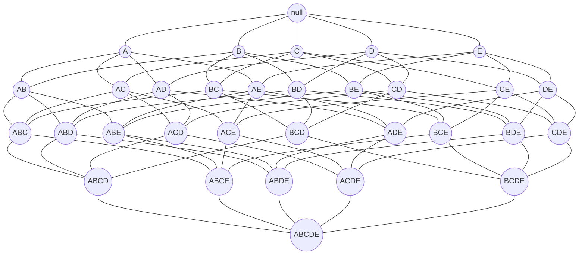
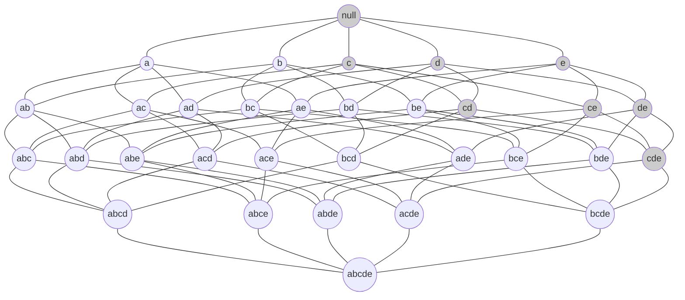
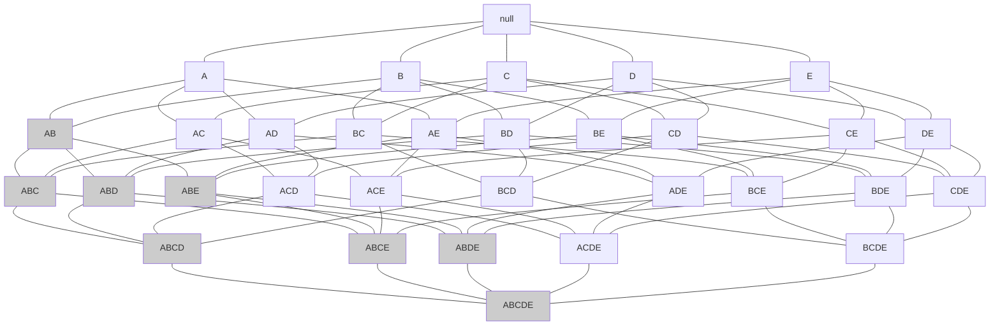
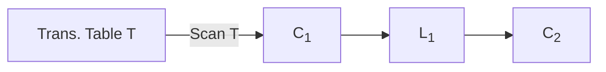
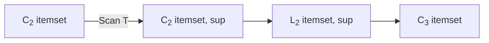
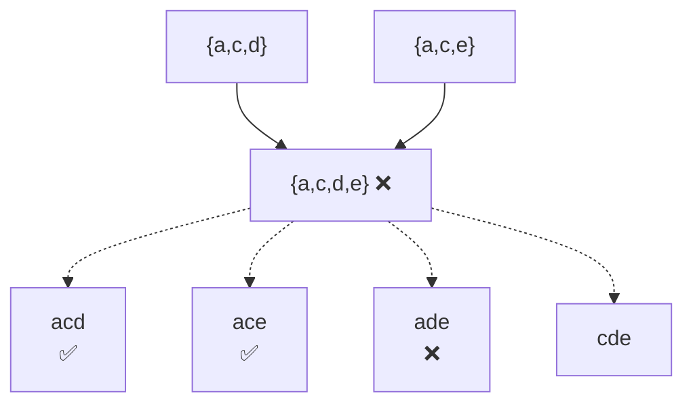

# Data Intensive Systems (DIS)
## KBH-SW7 E25

### 9. Association Rules

The background image shows the interior of a modern, multi-story building with an open atrium, likely a university campus. The architecture features large concrete columns, wooden-slatted wall panels, and expansive glass windows. Numerous white square panels are suspended from the ceiling at various heights throughout the open space. On the ground floor, there are several common areas with tables, chairs, and indoor plants where people are sitting and working.

AALBORG UNIVERSITY


---


# A Real Application of Association Rules

*   Amazon’s recommendation
    *   90% buyers who bought A also bought B.
    *   Since you’ve bought A, you may also want B.

> Make recommendations based on rules of high support, confidence and lift.

### Frequently Bought Together

[Add to Wish List]
Have one to sell? [Sell on Amazon]

*   [x] **This item:** Big Data: A Revolution That Will Transform How We Live, Work, and Think by Viktor Mayer-Schönberger Paperback $10.61
*   [x] Data Science for Business: What you need to know about data mining and data-analytic thinking by Foster Provost Paperback $37.99
*   [x] Predictive Analytics: The Power to Predict Who Will Click, Buy, Lie, or Die by Eric Siegel Hardcover $18.81

**Price for all three: $67.41**
[Add all three to Cart]
[Add all three to Wish List]
Show availability and shipping details

### Customers Who Bought This Item Also Bought

<table>
  <thead>
    <tr>
        <th></th>
        <th>Title</th>
        <th>Author</th>
        <th>Rating / Rank</th>
        <th>Format &amp; Price</th>
    </tr>
  </thead>
  <tbody>
    <tr>
        <td>Data Science for Business: What you need...</td>
<td>Foster Provost</td>
<td>103 reviews, #1 Best Seller in Database Storage &amp; Design</td>
<td>Paperback $37.99 Prime</td>
<td></td>
    </tr>
<tr>
        <td>Predictive Analytics: The Power to Predict Who...</td>
<td>Eric Siegel</td>
<td>235 reviews</td>
<td>Hardcover $18.81 Prime</td>
<td></td>
    </tr>
<tr>
        <td>Big Data: Understanding How Data Powers Big...</td>
<td>Bill Schmarzo</td>
<td>5 reviews</td>
<td>Paperback $28.94 Prime</td>
<td></td>
    </tr>
<tr>
        <td>Big Data For Dummies</td>
<td>Judith Hurwitz</td>
<td>31 reviews</td>
<td>Paperback $19.81 Prime</td>
<td></td>
    </tr>
<tr>
        <td>Digital Sociology</td>
<td>Deborah Lupton</td>
<td>N/A</td>
<td>Paperback $46.95 Prime</td>
<td></td>
    </tr>
<tr>
        <td>Big Data: Using SMART Big Data, Analytics...</td>
<td>Bernard Marr</td>
<td>9 reviews</td>
<td>Paperback $16.74 Prime</td>
<td></td>
    </tr>
  </tbody>
</table>

AALBORG UNIVERSITET
SIDE 2


---

# Agenda

* Problem definition
    - Support, confidence, lift, and association rule
    - Frequent itemsets
    - Steps for association rule mining
* Apriori principle, Apriori algorithm
* Deriving association rules from frequent itemsets
* Reflection on Apriori algorithm

AALBORG UNIVERSITET
SIDE 3


---

# Market Basket Data

* Large set of *items*, i.e., things sold in a supermarket
* Large set of *baskets*, each a small subset of items, i.e., things that one customer buys in one **transaction**
* Transaction table **T**: market-basket data
    - Each record is a transaction, containing a set of items
    - Many-to-many mapping (association) between items and baskets
* What can we do with this type of data?
    - E.g., counting whether the combination {Milk, Bread} is *frequent* or not

<table>
  <thead>
    <tr>
        <th>TID</th>
        <th>Items</th>
    </tr>
  </thead>
  <tbody>
    <tr>
        <td>1</td>
<td>{Milk, Bread, Beer, Diapers}</td>
    </tr>
<tr>
        <td>2</td>
<td>{Bread, Eggs}</td>
    </tr>
<tr>
        <td>3</td>
<td>{Bread, Diapers}</td>
    </tr>
<tr>
        <td>4</td>
<td>{Milk, Bread, Cola}</td>
    </tr>
<tr>
        <td>5</td>
<td>{Milk, Bread, Diapers}</td>
    </tr>
  </tbody>
</table>

Transaction table

AALBORG UNIVERSITET
SIDE 4


---


# What Is Association Rule Mining?

* Finding frequent patterns and associations (rules) among sets of items in a transaction table
* Motivation (market basket analysis):
    - How likely is that the customers buying *milk* are also buying *bread*?
    - Such rules help retailers making decisions
        - Plan the shelf space: placing milk close to bread, more convenient for the customers
        - Offer promotions/discounts for those products together

AALBORG UNIVERSITET
SIDE 5


---


# What Is an Association Rule?

* An **association rule** correlates (associates) the presence of one set of items with that of another set of items
* Examples
    * Rule form: Body $\Rightarrow$ Head [support, confidence]
    * milk $\Rightarrow$ bread [5%, 70%]
        - 5% of transactions buy both milk and bread
        - transactions that buy milk have 70% chance of buying also bread
* Applications: basket data analysis, catalog design
    * * $\Rightarrow$ *chocolate* (How to boost the sales of chocolate)
    * *Home Electronics* $\Rightarrow$ * (What other products should the store stock up?)

AALBORG UNIVERSITET
SIDE 6


---


# Rule Components

* An itemset means a set of items
    - E.g., {a, b, c}
* Let T be a collection of transactions
    - E.g., T = {TID 1, TID 2, TID 3, TID 4}

<table>
  <thead>
    <tr>
      <th>TID</th>
      <th>Items</th>
    </tr>
  </thead>
  <tbody>
    <tr>
      <td>1</td>
<td>a,b,c</td>
    </tr>
<tr>
      <td>2</td>
<td>a,c</td>
    </tr>
<tr>
      <td>3</td>
<td>a,g</td>
    </tr>
<tr>
      <td>4</td>
<td>b,e,f</td>
    </tr>
  </tbody>
</table>

* Let I be the set of items that appear in the database,
  e.g., I = {a, b, c, g, e, f}

* A rule is defined by $X \Rightarrow Y$, where $X \subset I$, $Y \subset I$, and $X \cap Y = \emptyset$
    - E.g., {b,c} $\Rightarrow$ {e} is a rule. We may simplify it as bc $\Rightarrow$ e if the context is clear.
    - E.g., {b,c} $\Rightarrow$ {c, e} is not a rule

AALBORG UNIVERSITET
SIDE 7


---

# Interesting Rules

* A rule is said to be **interesting** (or valid) when:
    * Its items appear frequently in the transaction table (**support**)
    * It holds with a high probability (**confidence**)

### Example: $$milk \Rightarrow bread$$

A Venn diagram illustrates the relationship between itemsets:
* A yellow circle represents transactions where the **Customer buys bread**.
* A blue circle represents transactions where the **Customer buys milk**.
* The intersection of the two circles represents transactions where the **Customer buys both**.

**NB: X and Y are itemsets.**

Find all the rules $$X \Rightarrow Y$$ with confidence and support above given thresholds

* **support s**, probability that a transaction contains $$X \cup Y$$
* **confidence c**, conditional probability that a transaction having X also contains Y

AALBORG UNIVERSITET
SIDE 8


---


# Example (1)

* Find the support and confidence of the rule: {B,D} $\Rightarrow$ {A}

<table>
  <thead>
    <tr>
        <th>TID</th>
        <th>items_bought</th>
    </tr>
  </thead>
  <tbody>
    <tr>
        <td>100</td>
<td>{F,A,D,B}</td>
    </tr>
<tr>
        <td>200</td>
<td>{D,A,C,E,B}</td>
    </tr>
<tr>
        <td>300</td>
<td>{C,A,B,E}</td>
    </tr>
<tr>
        <td>400</td>
<td>{B,A,D}</td>
    </tr>
  </tbody>
</table>

* Support value of $sup(ABD)$:
    - percentage of tuples with {A,B,D}
    - $= (3/4) * 100\% = 75\%$

* Confidence value of $conf(BD \Rightarrow A)$

$$\frac{\text{number of transactions that contain } \{A, B, D\}}{\text{number of transactions that contain } \{B, D\}} = \frac{3}{3} = 100\%$$

$$prob(Y | X) = \frac{prob(X \cup Y)}{prob(X)}$$

$$conf(X \Rightarrow Y) = \frac{sup(X \cup Y)}{sup(X)} = \frac{frequency(X \cup Y)}{frequency(X)}$$

AALBORG UNIVERSITET
SIDE 9


---

# Example (1)

* Find interesting rules

<table>
  <thead>
    <tr>
        <th>Transaction ID</th>
        <th>Items Bought</th>
    </tr>
  </thead>
  <tbody>
    <tr>
        <td>2000</td>
<td>A,B,C</td>
    </tr>
<tr>
        <td>1000</td>
<td>A,C</td>
    </tr>
<tr>
        <td>4000</td>
<td>A,D</td>
    </tr>
<tr>
        <td>5000</td>
<td>B,E,F</td>
    </tr>
  </tbody>
</table>

Thresholds:
* Min. support 50%
* Min. confidence 50%

<table>
  <thead>
    <tr>
        <th>Frequent Itemset</th>
        <th>Support</th>
    </tr>
  </thead>
  <tbody>
    <tr>
        <td>{A}</td>
<td>75%</td>
    </tr>
<tr>
        <td>{B}</td>
<td>50%</td>
    </tr>
<tr>
        <td>{C}</td>
<td>50%</td>
    </tr>
<tr>
        <td>{A,C}</td>
<td>50%</td>
    </tr>
  </tbody>
</table>

"$A \Rightarrow C$" is a valid rule because:
$$support = support(\{A \cup C\}) = 2/4 = 50\%$$
$$confidence = support(\{A \cup C\}) / support(\{A\}) = 50\% / 75\% = 66.6\%$$

10


---

# Lift of A Rule

*   $$Lift(X \Rightarrow Y) = \text{confidence}(X \Rightarrow Y) / \text{support}(Y)$$
    $$= \text{support}(X \cup Y) / (\text{support}(X) \cdot \text{support}(Y))$$
    $$= (\text{frequency}(X \cup Y) \cdot |T|) / (\text{frequency}(X) \cdot \text{frequency}(Y))$$

*   $Lift(X \Rightarrow Y)$ refers to the increase in the ratio of sale of Y when X is sold
    *   Lift = 1: No association between products X and Y.
    *   Lift > 1: Products X and Y are more likely to be bought together.
    *   Lift < 1: The two products are unlikely to be bought together.

AALBORG UNIVERSITET
SIDE 11


---

# Example of Lift

<table>
  <thead>
    <tr>
        <th>Transaction ID</th>
        <th>Items Bought</th>
    </tr>
  </thead>
  <tbody>
    <tr>
        <td>2000</td>
<td>A,B,C</td>
    </tr>
<tr>
        <td>1000</td>
<td>A,C</td>
    </tr>
<tr>
        <td>4000</td>
<td>A,D</td>
    </tr>
<tr>
        <td>5000</td>
<td>B,E,F</td>
    </tr>
  </tbody>
</table>

<table>
  <thead>
    <tr>
        <th>Frequent Itemset</th>
        <th>Support</th>
    </tr>
  </thead>
  <tbody>
    <tr>
        <td>{A}</td>
<td>75%</td>
    </tr>
<tr>
        <td>{B}</td>
<td>50%</td>
    </tr>
<tr>
        <td>{C}</td>
<td>50%</td>
    </tr>
<tr>
        <td>{A,C}</td>
<td>50%</td>
    </tr>
  </tbody>
</table>

Rule $A \Rightarrow C$:
$$\text{support} = \text{support}(\{A \cup C\}) = 2/4 = 50\%$$
$$\text{confidence} = \text{support}(\{A \cup C\}) / \text{support}(\{A\}) = 50\% / 75\% = 66.6\%$$
$$\text{lift} = \text{confidence}(A \Rightarrow C) / \text{support}(C) = 66.6\% / 50\% = 1.333$$

**Lift's meaning**: the likelihood of buying a A and C *together* is 1.33 times more than the likelihood of just buying the C.

12


---

# Recommendation in Amazon

* Two types of recommendation
    * 90% buyers who bought A also bought B.
    * Since you've bought A, you may also want B.

[Add to Wish List]

Have one to sell? [Sell on Amazon]

### Frequently Bought Together (Frequent itemset)

Price for all three: $67.41
[Add all three to Cart]
[Add all three to Wish List]
Show availability and shipping details

- [x] **This item:** Big Data: A Revolution That Will Transform How We Live, Work, and Think by Viktor Mayer-Schönberger Paperback $10.61
- [x] Data Science for Business: What you need to know about data mining and data-analytic thinking by Foster Provost Paperback $37.99
- [x] Predictive Analytics: The Power to Predict Who Will Click, Buy, Lie, or Die by Eric Siegel Hardcover $18.81

### Customers Who Bought This Item Also Bought (Association rules)

Page

<table>
  <thead>
    <tr>
        <th>Title</th>
        <th>Author</th>
        <th>Rating/Rank</th>
        <th>Price</th>
    </tr>
  </thead>
  <tbody>
    <tr>
        <td>Data Science for Business: What you need...</td>
<td>Foster Provost</td>
<td>103 reviews, #1 Best Seller in Database Storage &amp; Design</td>
<td>Paperback $37.99 Prime</td>
    </tr>
<tr>
        <td>Predictive Analytics: The Power to Predict Who..</td>
<td>Eric Siegel</td>
<td>235 reviews</td>
<td>Hardcover $18.81 Prime</td>
    </tr>
<tr>
        <td>Big Data: Understanding How Data Powers Big.</td>
<td>Bill Schmarzo</td>
<td>5 reviews</td>
<td>Paperback $28.94 Prime</td>
    </tr>
<tr>
        <td>Big Data For Dummies</td>
<td>Judith Hurwitz</td>
<td>31 reviews</td>
<td>Paperback $19.81 Prime</td>
    </tr>
<tr>
        <td>Digital Sociology</td>
<td>Deborah Lupton</td>
<td></td>
<td>Paperback $46.95 Prime</td>
    </tr>
<tr>
        <td>Big Data: Using SMART Big Data, Analytics...</td>
<td>Bernard Marr</td>
<td>9 reviews</td>
<td>Paperback $16.74 Prime</td>
    </tr>
  </tbody>
</table>

AALBORG UNIVERSITET
SIDE 13


---

# Causality vs. Correlation

* Causality
    - From the very first day, humans are curious about *why*.
    - With big data, it may be very hard to see the exact reasons.
* Correlation
    - Instead, we can find interesting patterns or associations of different things from big data.
    - Probability instead of certainty (not totally random).
        - Association rule mining.
* **NB:** Association rules are empiricism! What they tell may not be the true cause and effect.

AALBORG UNIVERSITET
SIDE 14


---

# Steps of Association Rule Mining

1. Find the ***frequent itemsets***
    * The sets of items that have minimum support
    * How to do this efficiently?
2. Use the ***frequent itemsets*** to generate association rules

AALBORG UNIVERSITET
SIDE 15


---

# Mining Frequent Itemsets

* **Input**: A set of transactions **T**, over a set of items **I**
* **Output**: All itemsets with items in **I** having
    - support $\ge$ minsup (support threshold)
* Problem parameters:
    - $N = |T|$: number of transactions
    - $d = |I|$: number of (distinct) items
    - $w$: max width of a transaction
    - Number of possible itemsets: $M = 2^d$
* Scale of the problem:
    - WalMart sells 100,000 items and can store billions of baskets.
    - The Web has billions of words and many billions of pages.

AALBORG UNIVERSITET
SIDE 16


---


# The Itemset Lattice

> Representation of all possible itemsets and their relationships



Given **d** items, there are $$2^d$$ possible itemsets

AALBORG UNIVERSITET
SIDE 17


---


# Agenda

* Problem definition
* Apriori principle, Apriori algorithm
* Deriving association rules from frequent itemsets
* Reflection on Apriori algorithm

AALBORG UNIVERSITET
SIDE 18


---

# The Apriori Principle

* Main observations: $$\forall X, Y: X \subseteq Y \Rightarrow s(X) \geq s(Y)$$
    - If an itemset is frequent, so are its subsets
    - If an itemset is infrequent, so are its supersets
* The Apriori principle: A subset of a frequent itemset must also be a frequent itemset
    - E.g., if {AB} is a frequent itemset, both {A} and {B} must be a frequent itemset
    - Iteratively find frequent itemsets with cardinality from 1 to $m$ ($m$-itemset): Use frequent $k$-itemsets to explore $(k+1)$-itemsets

AALBORG UNIVERSITET
SIDE 19


---


# Illustration of Apriori Principle



**Diagram Annotations:**
- **Shaded Nodes:** The nodes `null`, `c`, `d`, `e`, `cd`, `ce`, `de`, and `cde` are shaded grey and enclosed within a dashed boundary.
- **Labels:**
    - **Frequent subsets**: Located at the top right of the shaded region.
    - **Found to be frequent**: Located at the bottom right, with a pointer to the node `cde`.
- **Visual Indicator:** A large green arrow points upwards from the "Found to be frequent" label towards the "Frequent subsets" label, indicating that if an itemset is frequent, all its subsets must also be frequent.

Figure 6.3. An illustration of the Apriori principle. If $\{c, d, e\}$ is frequent, then all subsets of this itemset are frequent.

AALBORG UNIVERSITET
SIDE 20


---


# Illustration of Apriori Principle (cont.)



- **Found to be infrequent** (points to node AB)
- **Infrequent supersets** (encloses shaded nodes AB, ABC, ABD, ABE, ABCD, ABCE, ABDE, ABCDE)
- **Pruned**

AALBORG UNIVERSITET
SIDE 21


---


# Level-wise Process of Apriori Principle

Level 4 (frequent quadruples): {....}

Level 3 (frequent triplets): {ABD}, {BDF}

Level 2 (frequent pairs): {AB}, {AD}, {BD}, {BF}, {DF}

Level 1 (frequent items): {A}, {B}, {D}, {F}

*(Note: In the original diagram, {ABD} in Level 3 is circled and connected by lines to its subsets {AB}, {AD}, and {BD} in Level 2.)*

> **Remember:**
>
> All subsets of a frequent itemset must be frequent as well

**Question: Can ADF be frequent?**

**NO: because AF is not frequent**

AALBORG UNIVERSITET
SIDE 22


---


# The Apriori Algorithm

* **Notations**
    * $$C_k$$: Candidate itemset of size k
    * $$L_k$$: Frequent itemset of size k
* **Important steps in candidate generation**
    * **Prune Step**: Any k-itemset that is not frequent cannot be a subset of a frequent (k+1)-itemset
    * **Join Step**: $$C_{k+1}$$ is generated by joining $$L_k$$ with itself

```
C₁ = {{item₁}, ..., {itemₙ}};
for (k = 1; Lₖ != ∅; k++)
    for each transaction t in transaction table T
        increment the count of all candidates in Cₖ that are contained in t
    Lₖ = candidates in Cₖ with min_support (frequent)
    Cₖ₊₁ = candidates generated from Lₖ;  // Special self-join!
return ∪ₖ Lₖ;
```

AALBORG UNIVERSITET
SIDE 23


---


# The Apriori Algorithm Example (1)

### Trans. Table T

<table>
  <thead>
    <tr>
        <th>TID</th>
        <th>Items</th>
    </tr>
  </thead>
  <tbody>
    <tr>
        <td>100</td>
<td>1 3 4</td>
    </tr>
<tr>
        <td>200</td>
<td>2 3 5</td>
    </tr>
<tr>
        <td>300</td>
<td>1 2 3 5</td>
    </tr>
<tr>
        <td>400</td>
<td>2 5</td>
    </tr>
  </tbody>
</table>

**min_sup=2 (or 50%)**



### C<sub>1</sub>

<table>
  <thead>
    <tr>
        <th>itemset</th>
        <th>sup.</th>
    </tr>
  </thead>
  <tbody>
    <tr>
        <td>{1}</td>
<td>2</td>
    </tr>
<tr>
        <td>{2}</td>
<td>3</td>
    </tr>
<tr>
        <td>{3}</td>
<td>3</td>
    </tr>
<tr>
        <td>{4}</td>
<td>1</td>
    </tr>
<tr>
        <td>{5}</td>
<td>3</td>
    </tr>
  </tbody>
</table>

### L<sub>1</sub>

<table>
  <thead>
    <tr>
        <th>itemset</th>
        <th>sup.</th>
    </tr>
  </thead>
  <tbody>
    <tr>
        <td>{1}</td>
<td>2</td>
    </tr>
<tr>
        <td>{2}</td>
<td>3</td>
    </tr>
<tr>
        <td>{3}</td>
<td>3</td>
    </tr>
<tr>
        <td>{5}</td>
<td>3</td>
    </tr>
  </tbody>
</table>

### C<sub>2</sub>
```tsv
[thead]itemset
{1 2}
{1 3}
{1 5}
{2 3}
{2 5}
{3 5}
```

AALBORG UNIVERSITET
SIDE 24


---


# The Apriori Algorithm Example (2)

**Trans. Table T**

<table>
  <thead>
    <tr>
        <th>TID</th>
        <th>Items</th>
    </tr>
  </thead>
  <tbody>
    <tr>
        <td>100</td>
<td>1 3 4</td>
    </tr>
<tr>
        <td>200</td>
<td>2 3 5</td>
    </tr>
<tr>
        <td>300</td>
<td>1 2 3 5</td>
    </tr>
<tr>
        <td>400</td>
<td>2 5</td>
    </tr>
  </tbody>
</table>

**min_sup=2 (or 50%)**



**C<sub>2</sub>**
```tsv
[thead]itemset
{1 2}
{1 3}
{1 5}
{2 3}
{2 5}
{3 5}
```

**C<sub>2</sub>**

<table>
  <thead>
    <tr>
        <th>itemset</th>
        <th>sup</th>
    </tr>
  </thead>
  <tbody>
    <tr>
        <td>{1 2}</td>
<td>1</td>
    </tr>
<tr>
        <td>{1 3}</td>
<td>2</td>
    </tr>
<tr>
        <td>{1 5}</td>
<td>1</td>
    </tr>
<tr>
        <td>{2 3}</td>
<td>2</td>
    </tr>
<tr>
        <td>{2 5}</td>
<td>3</td>
    </tr>
<tr>
        <td>{3 5}</td>
<td>2</td>
    </tr>
  </tbody>
</table>

**L<sub>2</sub>**

<table>
  <thead>
    <tr>
        <th>itemset</th>
        <th>sup</th>
    </tr>
  </thead>
  <tbody>
    <tr>
        <td>{1 3}</td>
<td>2</td>
    </tr>
<tr>
        <td>{2 3}</td>
<td>2</td>
    </tr>
<tr>
        <td>{2 5}</td>
<td>3</td>
    </tr>
<tr>
        <td>{3 5}</td>
<td>2</td>
    </tr>
  </tbody>
</table>

**C<sub>3</sub>**
```tsv
[thead]itemset
{2 3 5}
```

AALBORG UNIVERSITET
SIDE 25


---


# The Apriori Algorithm Example (3)

Trans. Table T

<table>
  <thead>
    <tr>
        <th>TID</th>
        <th>Items</th>
    </tr>
  </thead>
  <tbody>
    <tr>
        <td>100</td>
<td>1 3 4</td>
    </tr>
<tr>
        <td>200</td>
<td>2 3 5</td>
    </tr>
<tr>
        <td>300</td>
<td>1 2 3 5</td>
    </tr>
<tr>
        <td>400</td>
<td>2 5</td>
    </tr>
  </tbody>
</table>

**min_sup=2 (or 50%)**

$\curvearrowright$

C<sub>3</sub>
```tsv
[thead]itemset
{2 3 5}
```

--- Scan T --->

L<sub>3</sub>

<table>
  <thead>
    <tr>
      <th>itemset</th>
      <th>sup</th>
    </tr>
  </thead>
  <tbody>
    <tr>
      <td>{2 3 5}</td>
<td>2</td>
    </tr>
  </tbody>
</table>

<table>
  <thead>
    <tr>
        <th>itemset</th>
        <th>sup.</th>
    </tr>
  </thead>
  <tbody>
    <tr>
        <td>{2 3 5}</td>
<td>2</td>
    </tr>
  </tbody>
</table>

AALBORG UNIVERSITET SIDE 26


---


# The Apriori Algorithm Example (4)

### Trans. Table T

<table>
  <thead>
    <tr>
        <th>TID</th>
        <th>Items</th>
    </tr>
  </thead>
  <tbody>
    <tr>
        <td>100</td>
<td>1 3 4</td>
    </tr>
<tr>
        <td>200</td>
<td>2 3 5</td>
    </tr>
<tr>
        <td>300</td>
<td>1 2 3 5</td>
    </tr>
<tr>
        <td>400</td>
<td>2 5</td>
    </tr>
  </tbody>
</table>

**min_sup=2 (or 50%)**

### The result of frequent itemsets

<table>
  <thead>
    <tr>
        <th>itemset</th>
        <th>sup.</th>
    </tr>
  </thead>
  <tbody>
    <tr>
        <td>{1}</td>
<td>2</td>
    </tr>
<tr>
        <td>{2}</td>
<td>3</td>
    </tr>
<tr>
        <td>{3}</td>
<td>3</td>
    </tr>
<tr>
        <td>{5}</td>
<td>3</td>
    </tr>
  </tbody>
</table>

<table>
  <thead>
    <tr>
        <th>itemset</th>
        <th>sup</th>
    </tr>
  </thead>
  <tbody>
    <tr>
        <td>{1 3}</td>
<td>2</td>
    </tr>
<tr>
        <td>{2 3}</td>
<td>2</td>
    </tr>
<tr>
        <td>{2 5}</td>
<td>3</td>
    </tr>
<tr>
        <td>{3 5}</td>
<td>2</td>
    </tr>
  </tbody>
</table>

<table>
  <thead>
    <tr>
        <th>itemset</th>
        <th>sup</th>
    </tr>
  </thead>
  <tbody>
    <tr>
        <td>{2 3 5}</td>
<td>2</td>
    </tr>
  </tbody>
</table>

$$L_1 \cup L_2 \cup L_3$$

AALBORG UNIVERSITET
SIDE 27


---


# Candidates Generation

* Suppose the items in $$L_k$$ are listed in an order
* Step 1: self-joining $$L_k$$ to get $$C_{k+1}$$ (In SQL)

```sql
INSERT INTO C_{k+1}
SELECT p.item_1, p.item_2, ..., p.item_k, q.item_k
FROM L_k p, L_k q
WHERE p.item_1=q.item_1, ..., p.item_{k-1}=q.item_{k-1}, p.item_k < q.item_k
```

* Step 2: pruning frequent itemsets in $$C_{k+1}$$

```
forall itemsets c in C_{k+1} do
    forall k-subsets s of c do
        if (s is not in L_k) then delete c from C_{k+1}
```

AALBORG UNIVERSITET
SIDE 28


---


# The Previous Example

Trans. Table T

<table>
  <thead>
    <tr>
        <th>TID</th>
        <th>Items</th>
    </tr>
  </thead>
  <tbody>
    <tr>
        <td>100</td>
<td>1 3 4</td>
    </tr>
<tr>
        <td>200</td>
<td>2 3 5</td>
    </tr>
<tr>
        <td>300</td>
<td>1 2 3 5</td>
    </tr>
<tr>
        <td>400</td>
<td>2 5</td>
    </tr>
  </tbody>
</table>

**min_sup=2 (or 50%)**

L<sub>2</sub>

<table>
  <thead>
    <tr>
        <th>itemset</th>
        <th>sup</th>
    </tr>
  </thead>
  <tbody>
    <tr>
        <td>{1 3}</td>
<td>2</td>
    </tr>
<tr>
        <td>{2 3}</td>
<td>2</td>
    </tr>
<tr>
        <td>{2 5}</td>
<td>3</td>
    </tr>
<tr>
        <td>{3 5}</td>
<td>2</td>
    </tr>
  </tbody>
</table>

We only need to match {2 3} with {2 5}

C<sub>3</sub>
```tsv
[thead]itemset
{2 3 5}
```

AALBORG UNIVERSITET
SIDE 29


---


# Example of Candidates Generation

* $L_3 = \{abc, abd, acd, ace, bcd\}$
* **Self-joining**: $L_3 \bowtie L_3$
    * $abcd$ from $abc$ and $abd$
    * $acde$ from $acd$ and $ace$
    * No need to match other pairs
* **Pruning**:
    * $acde$ is removed because $ade$ is not in $L_3$



* $C_4 = \{abcd\}$
    * Scanning transaction table $T$ is still needed to get the frequencies for items in $C_4$ (*to decide the correct $L_4$*)

AALBORG UNIVERSITET
SIDE 30


---

# Agenda

* Problem definition
* Apriori principle, Apriori algorithm
* Deriving association rules from frequent itemsets
* Reflection on Apriori algorithm

AALBORG UNIVERSITET SIDE 31


---


# Generating Association Rules from Frequent Itemsets

* Assume that we have discovered the frequent itemsets and their support
* How do we generate association rules?
* Frequent itemsets:

<table>
  <tbody>
    <tr>
        <td>{1}</td>
<td>2</td>
    </tr>
<tr>
        <td>{2}</td>
<td>3</td>
    </tr>
<tr>
        <td>{3}</td>
<td>3</td>
    </tr>
<tr>
        <td>{5}</td>
<td>3</td>
    </tr>
<tr>
        <td>{1,3}</td>
<td>2</td>
    </tr>
<tr>
        <td>{2,3}</td>
<td>2</td>
    </tr>
<tr>
        <td>{2,5}</td>
<td>3</td>
    </tr>
<tr>
        <td>{3,5}</td>
<td>2</td>
    </tr>
<tr>
        <td>$l \rightarrow$ {2,3,5}</td>
<td>2</td>
    </tr>
  </tbody>
</table>

> Not a transaction table!

* For each frequent itemset $l$, find all nonempty subsets $s$.
* For each $s$, generate rule $s \Rightarrow l-s$, if $sup(l)/sup(s) \ge min\_conf$

Example: $l = \{2,3,5\}$, $min\_conf = 75\%$

* $\{2,3\} \Rightarrow \{5\}$ $2/2=100\% \surd$
* $\{2,5\} \Rightarrow \{3\}$ $2/3=66.6\% \text{ X}$
* $\{3,5\} \Rightarrow \{2\}$ $2/2=100\% \surd$

*do the rest as an exercise*

AALBORG UNIVERSITET
SIDE 32


---


# Association Rules in Jupyter Notebook

* Library **mlxtend**
    * To install the library: `pip install mlxtend` in Anaconda Prompt
    * `from mlxtend.frequent_patterns import apriori`: frequent itemsets
    * `from mlxtend.frequent_patterns import association_rules`: rules

* Exercises on real data
    * store_data.csv (in Moodle)
    * (7501, 20)
        - 7501 transactions, each having at most 20 items

AALBORG UNIVERSITET
SIDE 33


---

# Agenda

* Problem definition
* Apriori principle, Apriori algorithm
* Deriving association rules from frequent itemsets
* Reflection on Apriori algorithm

AALBORG UNIVERSITET
SIDE 34


---


# Performance Bottlenecks of Apriori

* Is Apriori fast enough?
* The core of the Apriori algorithm:
    * Use frequent $$k$$-itemsets to generate **candidate** frequent $$(k+1)$$-itemsets
    * Use full table scan and pattern matching to collect counts for the candidate itemsets
* The bottleneck of Apriori: **candidate generation**
    * Huge candidate sets:
        - A $$10^4$$-sized frequent 1-itemset will generate $$10^7$$ candidate 2-itemsets
        - To discover a frequent pattern of size 100, e.g., $$\{a_1, a_2, \dots, a_{100}\}$$, one needs to generate $$2^{100} \approx 10^{30}$$ candidates.
    * Multiple scans of database table:
        - Needs $$(n + 1)$$ scans, $$n$$ is the length of the longest pattern

AALBORG UNIVERSITET
SIDE 35


---

# Methods to Improve Apriori's Efficiency

* Transaction reduction
    - A transaction that does not contain any frequent k-itemset is useless in subsequent scans
* Partitioning
    - Any itemset that is potentially frequent in transaction table T must be frequent in at least one of the partitions of T.

AALBORG UNIVERSITET SIDE 36


---


# Partitioning

* Divide transaction table T into partitions T1, T2, ..., Tp such that each Ti fits in the main memory
* Apply Apriori to each partition
* Any frequent itemset must be frequent in at least one partition

1. Divide $$T$$ into partitions $$T^1, T^2, \dots, T^p$$;
2. For $$i = 1$$ to $$p$$ do
3. $$L^i = \text{Apriori}(T^i)$$;
4. $$C = L^1 \cup \dots \cup L^p$$;
5. Count $$C$$ on $$T$$ to generate $$L$$;

AALBORG UNIVERSITET
SIDE 37


---


# Partitioning Example (1)

<table>
  <thead>
    <tr>
        <th></th>
        <th>Transaction</th>
        <th>Items</th>
        <th></th>
    </tr>
  </thead>
  <tbody>
    <tr>
        <td rowspan="2">$T_1$</td>
<td>$t_1$</td>
<td>Bread, Jelly, PeanutButter</td>
<td></td>
    </tr>
<tr>
        <td></td>
<td>$t_2$</td>
<td>Bread, PeanutButter</td>
<td></td>
    </tr>
<tr>
        <td rowspan="3">$T_2$</td>
<td>$t_3$</td>
<td>Bread, Milk, PeanutButter</td>
<td></td>
    </tr>
<tr>
        <td></td>
<td>$t_4$</td>
<td>Beer, Bread</td>
    </tr>
<tr>
        <td></td>
<td>$t_5$</td>
<td>Beer, Milk</td>
<td></td>
    </tr>
  </tbody>
</table>

`min_support = 10%`

$$L(T_1) = \{ \{ \text{Bread} \}, \{ \text{Jelly} \}, \{ \text{PeanutButter} \}, \{ \text{Bread, Jelly} \}, \{ \text{Bread, PeanutButter} \}, \{ \text{Jelly, PeanutButter} \}, \{ \text{Bread, Jelly, PeanutButter} \} \}$$

$$L(T_2) = \{ \{ \text{Bread} \}, \{ \text{Milk} \}, \{ \text{PeanutButter} \}, \{ \text{Bread, Milk} \}, \{ \text{Bread, PeanutButter} \}, \{ \text{Milk, PeanutButter} \}, \{ \text{Bread, Milk, PeanutButter} \}, \{ \text{Beer} \}, \{ \text{Beer, Bread} \}, \{ \text{Beer, Milk} \} \}$$

AALBORG UNIVERSITET
SIDE 38


---

# Partitioning Example (2)

<table>
  <thead>
    <tr>
        <th>Transaction</th>
        <th>Items</th>
    </tr>
  </thead>
  <tbody>
    <tr>
        <td>t1</td>
<td>Bread, Jelly, PeanutButter</td>
    </tr>
<tr>
        <td>t2</td>
<td>Bread, PeanutButter</td>
    </tr>
<tr>
        <td>t3</td>
<td>Bread, Milk, PeanutButter</td>
    </tr>
<tr>
        <td>t4</td>
<td>Beer, Bread</td>
    </tr>
<tr>
        <td>t5</td>
<td>Beer, Milk</td>
    </tr>
  </tbody>
</table>

min_support = 10%

$$L(T_1) = \{ \{Bread\}, \{Jelly\}, \{PeanutButter\}, \{Bread, Jelly\}, \{Bread, PeanutButter\}, \{Jelly, PeanutButter\}, \{Bread, Jelly, PeanutButter\} \}$$

$$L(T_2) = \{ \{Bread\}, \{Milk\}, \{PeanutButter\}, \{Bread, Milk\}, \{Bread, PeanutButter\}, \{Milk, PeanutButter\}, \{Bread, Milk, PeanutButter\}, \{Beer\}, \{Beer, Bread\}, \{Beer, Milk\} \}$$

$$C = L(T_1) \cup L(T_2)$$

Count itemsets in $C$ with respect to $T$, and prune infrequent ones.

AALBORG UNIVERSITET
SIDE 39


---

# Partitioning’s Pros and Cons

* Advantages:
    * It adapts to available main memory
    * It can be easily parallelized
        - Maximum number of database table scans is two (why?)
            - One for partitioning the transaction table, and one for the final counting

* Disadvantages:
    * May have many candidates for the second scan
    * A countermeasure: associate the frequency to each itemset in each partition, and the final global counting can be a simple aggregation.

AALBORG UNIVERSITET
SIDE 40


---

# More Efficient Approach: FP-tree

* Using FP-tree for finding frequent items
* Compress a large database table into a compact, Frequent-Pattern tree (FP-tree) structure
    - highly condensed, but complete for frequent pattern mining
    - avoid costly database table scans
* Develop an efficient, FP-tree-based frequent pattern mining method
    - A divide-and-conquer methodology: decompose mining tasks into smaller ones
    - Avoid candidate generation: sub-database test only!
* FP-growth: mining frequent patterns without candidate generation

AALBORG UNIVERSITET
SIDE 41


---

# Summary

* Association rule definition
    - Support, confidence, lift and association rule
    - Frequent itemsets
    - Steps for association rule mining
* Apriori algorithm
* Deriving association rules from frequent itemsets
* Criticism on Apriori

AALBORG UNIVERSITET SIDE 42


---


# Exercises

1. Refer to the transaction table to the right. Say sup(ab)=100
    * Determine the possible values of sup(a)
        - Conclusion: sup(a) \_\_\_ 100
        - Hint: Is it possible that sup(a)=70? Why?
    * Determine the possible values of sup(abc)
        - Conclusion: sup(abc) \_\_\_ 100
        - Hint: Is it possible that sup(abc)=120? Why?

> Choose either "$\le$" or "$\ge$"

2. Slides 33 (Hands-on, optional)

Transaction table
(1000 rows)

<table>
  <thead>
    <tr>
        <th>TID</th>
        <th>Items</th>
    </tr>
  </thead>
  <tbody>
    <tr>
        <td>1</td>
<td>a,b,c</td>
    </tr>
<tr>
        <td>2</td>
<td>a,c</td>
    </tr>
<tr>
        <td>3</td>
<td>b,e,f</td>
    </tr>
<tr>
        <td>...</td>
<td>......</td>
    </tr>
  </tbody>
</table>

AALBORG UNIVERSITET
SIDE 43


---

# Readings

* Mandatory reading
    - Jiawei Han, Micheline Kamber and Jian Pei. Data Mining: Concepts and Techniques (3rd edition), Elsevier Science Ltd, 2011.
        - Chapter 6
* Further readings
    - Rakesh Agrawal, Ramakrishnan Srikant: Fast Algorithms for Mining Association Rules in Large Databases. VLDB 1994: 487-499
    - Jiawei Han, Jian Pei, Yiwen Yin: Mining Frequent Patterns without Candidate Generation. SIGMOD 2000: 1-12
* Acknowledgment: Slides are from
    - Margaret H. Dunham (Data Mining: Introductory and Advanced Topics, Prentice Hall, 2002)
    - The HKP textbook
    - Man Lung Yiu and Panagiotis Karras

AALBORG UNIVERSITET SIDE 44


---

# Readings for Coding

* Mandatory readings
    * Association Rule: https://www.geeksforgeeks.org/association-rule/?ref=lbp
    * Frequent Itemsets: https://www.geeksforgeeks.org/frequent-item-set-in-data-set-association-rule-mining/?ref=lbp
    * Apriori Algorithm: https://www.geeksforgeeks.org/apriori-algorithm/?ref=lbp
* Further readings
    * Documentation of mlxtend’s frequent
        - http://rasbt.github.io/mlxtend/user_guide/frequent_patterns/apriori/
        - http://rasbt.github.io/mlxtend/user_guide/frequent_patterns/association_rules/
    * Tutorials
        - https://www.geeksforgeeks.org/implementing-apriori-algorithm-in-python/
        - https://www.kaggle.com/code/annettecatherinepaul/apriori-algorithm-association-rule-mining
        - https://towardsdatascience.com/understand-and-build-fp-growth-algorithm-in-python-d8b989bab342 (FP-Growth, advanced)

AALBORG UNIVERSITET
SIDE 45
