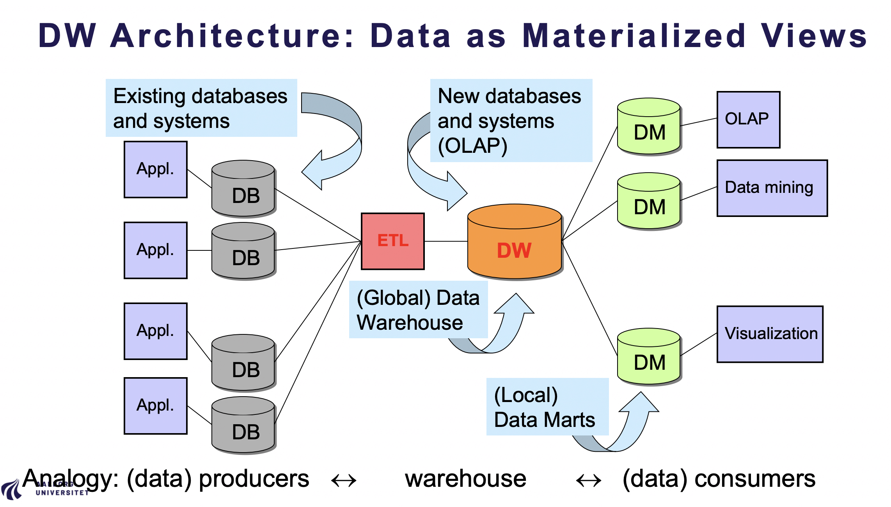

# Introduction

## Introduction

- Motivation: fragmented operational data
- Business Intelligence (BI)
- Data Warehouse (DW)
- ETL (Extract, Transform, Load)
- Data warehouse architecture
- Subject-oriented vs function-oriented data
- Properties and benefits of DW

# Introduction — Data Warehouse

## Key Terms

| Term | Definition |
| --- | --- |
| Business Intelligence (BI) | A collection of tools and methods that transform data into information to support decision-making. |
| Data Warehouse (DW) | A system for reporting and data analysis that integrates data from many sources to support management decisions. |
| ETL | The process of Extracting, Transforming, and Loading data from operational systems into the data warehouse. |
| Operational system | Systems used for daily business operations (sales, inventory, transactions, etc.). |
| Subject-oriented data | Data organized around business subjects such as Sales, Customers, and Products. |
| Function-oriented data | Data organized by operational functions such as accounting, HR, or inventory. |

---

## Motivation: Fragmented Operational Data

Modern organizations generate huge volumes of data in many places:

- Sales systems
- Inventory systems
- Customer membership systems
- Accounting systems

These systems are **distributed and independent**, which creates major problems:

- **Data fragmentation**
    
    Data is stored in local systems instead of one integrated view
    
- **Complex queries**
    
    Running cross-system queries is slow and inefficient
    
- **Inconsistent reporting**
    
    Different systems may compute the same numbers differently
    
- **Limited history**
    
    Operational systems usually store only recent data (e.g., 6 months) 
    10. Data Warehouse
    

This makes it very hard for management to get a **global and historical view of the business**.

---

## Business Intelligence (BI)

The slides define BI as:

> “A set of tools and techniques that transform business data into timely and accurate information for decision making.” 10. Data Warehouse
> 

Important distinction:

- **AI** makes decisions for users
- **BI** helps users make the right decisions

BI is built by combining:

- Data Warehousing
- Online Analytical Processing (OLAP)
- Data Mining 10. Data Warehouse

---

## Data Warehouse (DW)

A **data warehouse** is the core of BI.

The slides define it as:

> A system used for reporting and data analysis that supports management decisions. 10. Data Warehouse
> 

A DW is characterized by:

- **Subject-oriented** – organized around business subjects (sales, customers, products)
- **Integrated** – data from many systems is combined logically and physically
- **Time-variant** – all data is related to time (historical analysis)
- **Stable** – data is not deleted; multiple versions are stored

The purpose is to support **decision-making across the organization**.

---

## ETL (Extract, Transform, Load)

Operational data is not suitable for analysis directly. It must go through **ETL**:

1. **Extract**
    
    Data is taken from source systems
    
2. **Cleanse**
    
    Errors and inconsistencies are removed
    
3. **Transform**
    
    Data is converted into a common format
    
4. **Aggregate**
    
    Data is summarized if needed
    
5. **Load**
    
    Data is stored in the data warehouse 
    10. Data Warehouse
    

This makes the data:

- Consistent
- Integrated
- Ready for analysis

---

## Data Warehouse Architecture

The slides show DW as a **materialized integration layer** between data producers and data consumers:

Operational databases → ETL → Data Warehouse → Data Marts → OLAP, Data Mining, Visualization 
10. Data Warehouse

This architecture:

- Separates daily operations from analytics
- Allows heavy analytical queries without disturbing business systems

---

## Subject-Oriented vs Function-Oriented Data

Operational systems are **function-oriented**:

- Sales system
- Inventory system
- Accounting system

Each stores only its own data.

A data warehouse is **subject-oriented**:

- Sales
- Costs
- Profit
- Customers

This allows:

- Cross-department analysis
- Integrated business views 10. Data Warehouse

---

## Properties and Benefits of a Data Warehouse

From the slides, a DW provides: 
10. Data Warehouse

- Centralized data repository
- Consistent data
- Historical analysis
- Support for complex queries
- Performance optimization
- BI and reporting
- Better decision-making
- Separation of operational and analytical workloads
- Scalability

---

## Summary

A data warehouse solves the problem of **fragmented, inconsistent, and short-term operational data** by:

- Integrating all data into one subject-oriented repository
- Storing historical versions
- Supporting BI, OLAP, and data mining
- Enabling fast, reliable, organization-wide decision-making