# Distributed Databases

> Core Insight: A distributed database is essentially a database that lives across multiple computers. The fundamental challenge is making this collection of machines appear as a single, coherent system—while dealing with the reality that networks are slow, unreliable, and machines fail independently.
> 

# **📖 Key Definitions**

| Term | Definition |
| --- | --- |
| **Distributed Database System (DDBS)** | A collection of logically related databases spread across a network. Sites are *loosely coupled*—they share no physical components but cooperate to serve queries. |
| **Homogeneous DDBS** | All sites run identical DBMS software and share the same schema. Simplest to manage—looks like one big database. |
| **Heterogeneous DDBS** | Sites run different DBMS software and/or have different schemas. Think: integrating Oracle, MySQL, and PostgreSQL. Requires translation layers. |
| **Replication** | Storing copies of the same data at multiple sites. Improves availability and read performance, but complicates writes. |
| **Fragmentation** | Splitting a table into pieces stored at different sites. Each piece is called a *fragment*. |
| **Transparency** | Hiding complexity from users. They shouldn't need to know *where* data lives, *how* it's split, or *whether* copies exist. |
| **Semijoin** | A join optimization: $r_1 \ltimes r_2 = \Pi_{R_1}(r_1 \bowtie r_2)$. Ships only join keys first, then fetches only matching rows. |
| **Transaction Coordinator (TC)** | The site that initiates a distributed transaction and orchestrates the commit/abort decision across all participants. |
| **Transaction Manager (TM)** | Local role at each site—maintains log, handles recovery, manages local locks, processes subtransactions. |
| **Two-Phase Commit (2PC)** | A protocol ensuring atomicity across sites: first get everyone to *promise* they can commit (Phase 1), then tell everyone the final decision (Phase 2). |
| **Fail-Stop Model** | Assumption that failed sites simply stop working and don't cause harm (no incorrect messages sent). |

[**Distributed Database Fundamentals - Parallel, Distributed, Heterogeneous and Homogeneous** ](Distributed%20Databases/Distributed%20Database%20Fundamentals%20-%20Parallel,%20Dist%202e67c6b7cc2f80fab254f28766a02079.md)

[Distributed Data Storage](Distributed%20Databases/Distributed%20Data%20Storage%202e67c6b7cc2f804ab010cfa8ab92179d.md)

[Distributed Query Processing and Optimization](Distributed%20Databases/Distributed%20Query%20Processing%20and%20Optimization%202e67c6b7cc2f80558f5fe67a3e4ae6e8.md)

[Distributed Transactions](Distributed%20Databases/Distributed%20Transactions%202e67c6b7cc2f80f4a40bd8e4c848c89b.md)

```mermaid
graph TD
    Join["⋈<sub>Eno</sub>"]
    UnionE["∪"]
    UnionG["∪"]
    E1["E<sub>1</sub><br/>σ<sub>Eno≤e3</sub>(E)"]
    E2["E<sub>2</sub>"]
    E3["E<sub>3</sub>"]
    G1["G<sub>1</sub>"]
    G2["G<sub>2</sub><br/>σ<sub>Eno>e3</sub>(G)"]
    Empty["∅"]

Join --- UnionE
    Join --- UnionG
    UnionE --- E1
    UnionE --- E2
    UnionE --- E3
    UnionG --- G1
    UnionG --- G2
    
    E1 -.-> Empty
    G2 -.-> Empty
```

