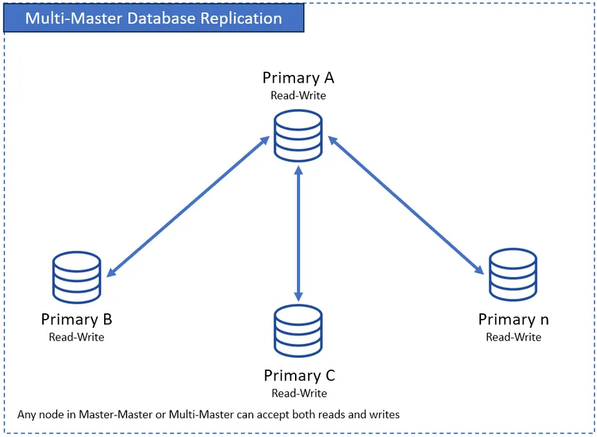

# Replication

## Definition

Replication means that the same data is stored in multiple sites (nodes) in a distributed database system.

Instead of keeping only one copy of a table or record, the system keeps several identical copies on different machines or locations. These copies are kept synchronized so that they represent the same data.

Replication is used in distributed databases to improve performance, availability, and reliability. It is often combined with data fragmentation, where data is also split into pieces.

### **Replication Spectrum**

| Level | Description |
| --- | --- |
| **No replication** | Each data item exists at exactly one site |
| **Partial replication** | Some data is replicated, some isn't (most common) |
| **Full replication** | A relation is stored at *all* sites |
| **Fully redundant database** | Every site contains a copy of the *entire* database |

---

## Advantages of Replication

### High Availability

If one site fails, another site still has a copy of the data. This allows the system to continue working even when hardware crashes or network problems occur. Users can still access the data from other locations.

This makes the system fault tolerant.

---

### Faster Data Access

Users can read data from the nearest copy instead of always accessing a distant server. This reduces network delay and improves response time, especially in systems where users are geographically distributed.

---

### Load Balancing

Because there are multiple copies of the same data, read requests can be distributed across many servers. This prevents one server from becoming overloaded and allows the system to handle many users at the same time.

---

### Better Scalability

As the number of users increases, more replicas can be added. This allows the system to handle more read requests without slowing down.

---

## Disadvantages of Replication

### Update Overhead

Whenever data is changed, all copies must be updated. This requires extra communication between sites and more processing. Writing data becomes slower and more expensive than in a system with only one copy.

---

### Consistency Problems

If updates do not reach all replicas at the same time, different sites may temporarily store different values for the same data. This can cause users to see different results depending on which copy they access.

Keeping all replicas perfectly synchronized is difficult in distributed systems.

---

### Increased System Complexity

Replication requires mechanisms for synchronization, conflict handling, and failure recovery. This makes the system harder to design, implement, and maintain.

---

## Primary Copy

### What is a Primary Copy?

In a replicated database, one site is chosen as the primary copy (also called the master). This site is responsible for handling all updates.

Other sites keep replicas (secondary copies) that receive updates from the primary.

---

### How the Primary Copy Works

All write operations (insert, update, delete) go to the primary copy.

The primary applies the changes and then sends the updates to all replica sites.

The replicas update their local copies to match the primary.

Read operations may be handled either by the primary or by replicas.

---

### Advantages of the Primary Copy Approach

Because only one site is allowed to perform updates, there are no conflicts between replicas. This makes it easier to maintain consistency.

Transaction control, locking, and logging only need to be managed at the primary site, which simplifies system design.

---

### Disadvantages of the Primary Copy Approach

The primary copy becomes a single point of failure. If it goes down, the system cannot accept updates until a new primary is chosen.

All write requests must go through the primary, which can become a performance bottleneck in systems with many updates.