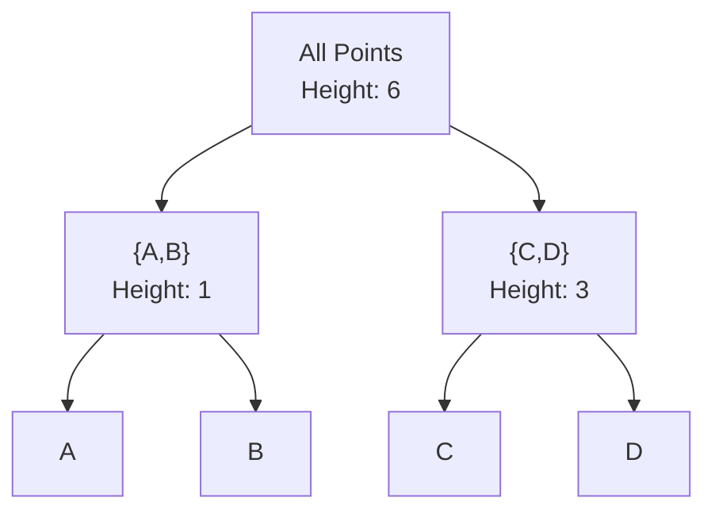

# Clustering

# Exercise: DBSCAN Clustering

> *Use Euclidean distance based DBSCAN to decide the clustering result for the following data set:*
> 
> 
> *A1=(2,10), A2=(2,5), A3=(8,4), A4=(5,8), A5=(7,5), A6=(6,4), A7=(1,2), A8=(4,9)*
> 
> *MinPts = 2 and Eps = 2*
> 

## Pseudocode

```python
FUNCTION dbscan(points, eps, minPts):
    labels = [UNDEFINED for each point]
    cluster_id = 0
    
    FOR each point P in points:
        IF labels[P] != UNDEFINED:
            CONTINUE
        
        neighbors = find_neighbors(P, eps)
        
        IF |neighbors| < minPts:
            labels[P] = NOISE
        ELSE:
            cluster_id += 1
            expand_cluster(P, neighbors, cluster_id, eps, minPts)
    
    RETURN labels

FUNCTION find_neighbors(P, eps):
    RETURN all points Q where distance(P, Q) <= eps
```

## Step-by-Step Solution

### Step 1: Compute Distance Matrix

|  | A1 | A2 | A3 | A4 | A5 | A6 | A7 | A8 |
| --- | --- | --- | --- | --- | --- | --- | --- | --- |
| A1(2,10) | 0 | 5 | 8.5 | 3.6 | 7.1 | 7.2 | 8.1 | 2.2 |
| A2(2,5) | 5 | 0 | 6.1 | 4.2 | 5 | 4.1 | 3.2 | 4.5 |
| A3(8,4) | 8.5 | 6.1 | 0 | 5 | 1.4 | 2 | 7.3 | 6.4 |
| A4(5,8) | 3.6 | 4.2 | 5 | 0 | 3.6 | 4.1 | 7.2 | 1.4 |
| A5(7,5) | 7.1 | 5 | 1.4 | 3.6 | 0 | 1.4 | 6.7 | 5 |
| A6(6,4) | 7.2 | 4.1 | 2 | 4.1 | 1.4 | 0 | 5.4 | 5.4 |
| A7(1,2) | 8.1 | 3.2 | 7.3 | 7.2 | 6.7 | 5.4 | 0 | 7.6 |
| A8(4,9) | 2.2 | 4.5 | 6.4 | 1.4 | 5 | 5.4 | 7.6 | 0 |

### Step 2: Find Neighbors (Eps = 2)

| Point | Neighbors (dist ≤ 2) | Count | Type |
| --- | --- | --- | --- |
| A1 | A8 | 1 | Border/Noise |
| A2 | - | 0 | Noise |
| A3 | A5, A6 | 2 | Core |
| A4 | A8 | 1 | Border |
| A5 | A3, A6 | 2 | Core |
| A6 | A3, A5 | 2 | Core |
| A7 | - | 0 | Noise |
| A8 | A1, A4 | 2 | Core |

### Step 3: Form Clusters

```python
Cluster 1: {A3, A5, A6} - connected core points
Cluster 2: {A1, A4, A8} - connected through A8 (core)
Noise: {A2, A7}
```

## Python Implementation

```python
import numpy as np
from sklearn.cluster import DBSCAN

# Data points
points = {
    'A1': (2, 10), 'A2': (2, 5), 'A3': (8, 4), 'A4': (5, 8),
    'A5': (7, 5), 'A6': (6, 4), 'A7': (1, 2), 'A8': (4, 9)
}

X = np.array(list(points.values()))
labels_list = list(points.keys())

# DBSCAN
dbscan = DBSCAN(eps=2, min_samples=2)
clusters = dbscan.fit_predict(X)

# Results
print("DBSCAN Results (eps=2, minPts=2):")
for label, cluster in zip(labels_list, clusters):
    status = "Noise" if cluster == -1 else f"Cluster {cluster}"
    print(f"  {label}: {status}")
```

# Exercise: Agglomerative Clustering (Complete Linkage)

> *Draw the dendrogram using the complete linkage agglomerative clustering for the given distance matrix. Use the smallest distance as the merge criterion.*
> 

**Given Distance Matrix**

|  | A | B | C | D |
| --- | --- | --- | --- | --- |
| A | 0 | 1 | 4 | 6 |
| B |  | 0 | 2 | 5 |
| C |  |  | 0 | 3 |
| D |  |  |  | 0 |

## Pseudocode

```python
FUNCTION agglomerative_complete(distance_matrix):
    clusters = [{A}, {B}, {C}, {D}]  // Each point is a cluster
    
    WHILE |clusters| > 1:
        // Find pair with smallest distance
        min_dist = INFINITY
        FOR each pair (Ci, Cj):
            // Complete linkage: max distance between any two points
            dist = MAX(distance(p, q) for p in Ci, q in Cj)
            IF dist < min_dist:
                min_dist = dist
                merge_pair = (Ci, Cj)
        
        // Merge clusters
        new_cluster = merge_pair[0] UNION merge_pair[1]
        REMOVE merge_pair from clusters
        ADD new_cluster to clusters
        
        RECORD merge at height = min_dist
    
    RETURN dendrogram
```

## Step-by-Step Solution

### Step 1: Find minimum distance $\rarr d(A,B)=1$

```python
Merge {A} and {B} → {A,B} at height 1
```

### Step 2: Update distance matrix (complete linkage = max)

```python
d({A,B}, C) = max(d(A,C), d(B,C)) = max(4, 2) = 4
d({A,B}, D) = max(d(A,D), d(B,D)) = max(6, 5) = 6
```

|  | {A,B} | C | D |
| --- | --- | --- | --- |
| {A,B} | 0 | 4 | 6 |
| C |  | 0 | 3 |
| D |  |  | 0 |

### Step 3: Find minimum $\rarr d(C,D)=3$

```python
Merge {C} and {D} → {C,D} at height 3
```

### Step 4: Update distance matrix

```python
d({A,B}, {C,D}) = max(d(A,C), d(A,D), d(B,C), d(B,D)) = max(4, 6, 2, 5) = 6
```

|  | {A,B} | {C,D} |
| --- | --- | --- |
| {A,B} | 0 | 6 |
| {C,D} |  | 0 |

### Step 5: Merge $\{A,B\}$ and $\{C,D\}$ at height 6



## Python Implementation

```python
import numpy as np
from scipy.cluster.hierarchy import dendrogram, linkage
import matplotlib.pyplot as plt

# Distance matrix (condensed form for scipy)
# Order: d(A,B), d(A,C), d(A,D), d(B,C), d(B,D), d(C,D)
condensed_dist = [1, 4, 6, 2, 5, 3]

# Complete linkage
Z = linkage(condensed_dist, method='complete')

# Plot dendrogram
plt.figure(figsize=(8, 5))
dendrogram(Z, labels=['A', 'B', 'C', 'D'])
plt.title('Dendrogram (Complete Linkage)')
plt.ylabel('Distance')
plt.show()

print("Merge sequence:")
print("  Step 1: Merge A, B at distance 1")
print("  Step 2: Merge C, D at distance 3")
print("  Step 3: Merge {A,B}, {C,D} at distance 6")
```

# Exercise 2: Clustering on Bikes Dataset

> Work with the bikes dataset in Jupyter Notebook:
1. Apply K-means clustering with Elbow method
2. Apply agglomerative clustering with dendrogram
3. Apply DBSCAN clustering with Silhouette scores
> 

## Pseudocode

```python
FUNCTION clustering_pipeline(data):
    // 1. K-Means with Elbow
    inertias = []
    FOR k in [2, 3, 4, 5, ...]:
        kmeans = KMeans(k)
        kmeans.FIT(data)
        inertias.APPEND(kmeans.inertia)
    PLOT elbow curve
    best_k = find_elbow(inertias)
    
    // 2. Agglomerative
    linkage_matrix = hierarchical_clustering(data, method='ward')
    PLOT dendrogram
    best_n = cut_dendrogram(linkage_matrix)
    
    // 3. DBSCAN
    FOR eps in [0.5, 1, 1.5, ...]:
        FOR min_samples in [3, 5, 7, ...]:
            dbscan = DBSCAN(eps, min_samples)
            labels = dbscan.FIT(data)
            score = silhouette_score(data, labels)
    PLOT results with best parameters
```

## Python Implementation

```python
import pandas as pd
import numpy as np
import matplotlib.pyplot as plt
from sklearn.cluster import KMeans, AgglomerativeClustering, DBSCAN
from sklearn.preprocessing import StandardScaler
from sklearn.metrics import silhouette_score
from scipy.cluster.hierarchy import dendrogram, linkage

# =============================================================================
# Load and Prepare Data
# =============================================================================

df = pd.read_csv('bikes.csv')
X = df.select_dtypes(include=[np.number])
scaler = StandardScaler()
X_scaled = scaler.fit_transform(X)

# =============================================================================
# 1. K-Means with Elbow Method
# =============================================================================

inertias = []
K_range = range(2, 11)

for k in K_range:
    kmeans = KMeans(n_clusters=k, random_state=42)
    kmeans.fit(X_scaled)
    inertias.append(kmeans.inertia_)

# Plot Elbow
plt.figure(figsize=(8, 5))
plt.plot(K_range, inertias, 'bo-')
plt.xlabel('Number of Clusters (k)')
plt.ylabel('Inertia')
plt.title('Elbow Method for Optimal k')
plt.show()

# Apply best k (e.g., k=3)
best_k = 3
kmeans = KMeans(n_clusters=best_k, random_state=42)
labels_kmeans = kmeans.fit_predict(X_scaled)

print(f"K-Means (k={best_k}) Silhouette: {silhouette_score(X_scaled, labels_kmeans):.4f}")

# =============================================================================
# 2. Agglomerative Clustering
# =============================================================================

# Compute linkage matrix
Z = linkage(X_scaled[:100], method='ward')  # Sample for visualization

# Plot dendrogram
plt.figure(figsize=(12, 6))
dendrogram(Z, truncate_mode='lastp', p=10)
plt.title('Dendrogram (Ward Linkage)')
plt.xlabel('Cluster Size')
plt.ylabel('Distance')
plt.show()

# Apply agglomerative with chosen n_clusters
agg = AgglomerativeClustering(n_clusters=3, linkage='ward')
labels_agg = agg.fit_predict(X_scaled)

print(f"Agglomerative Silhouette: {silhouette_score(X_scaled, labels_agg):.4f}")

# =============================================================================
# 3. DBSCAN with Parameter Tuning
# =============================================================================

print("\nDBSCAN Parameter Search:")
results = []

for eps in [0.5, 1.0, 1.5, 2.0]:
    for min_samples in [3, 5, 7]:
        dbscan = DBSCAN(eps=eps, min_samples=min_samples)
        labels = dbscan.fit_predict(X_scaled)
        
        n_clusters = len(set(labels)) - (1 if -1 in labels else 0)
        n_noise = list(labels).count(-1)
        
        if n_clusters > 1:
            score = silhouette_score(X_scaled, labels)
            results.append((eps, min_samples, n_clusters, n_noise, score))
            print(f"  eps={eps}, min_samples={min_samples}: "
                  f"{n_clusters} clusters, {n_noise} noise, silhouette={score:.4f}")

# Best DBSCAN result
if results:
    best = max(results, key=lambda x: x[4])
    print(f"\nBest DBSCAN: eps={best[0]}, min_samples={best[1]}, silhouette={best[4]:.4f}")
```

| Method | Key Parameters | Selection Criterion |
| --- | --- | --- |
| K-Means | k (clusters) | Elbow method |
| Agglomerative | n_clusters, linkage | Dendrogram cut |
| DBSCAN | eps, min_samples | Silhouette score |