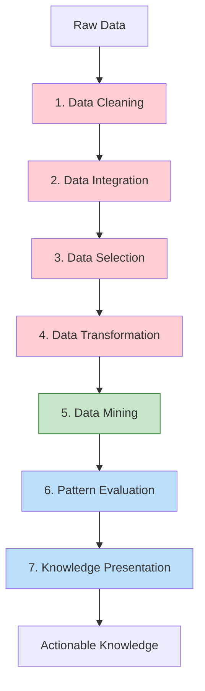
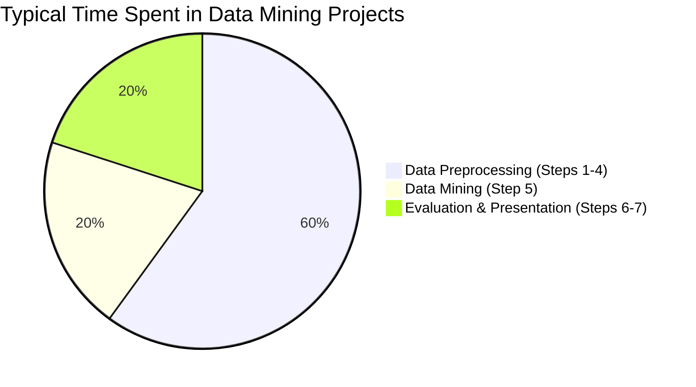

# Data Mining Process

- Data Cleaning
- Data Integration
- Data Selection
- Data Transformation
- Data Mining
- Pattern Evaluation
- Knowledge Presentation

---

# The Seven Steps

| Step | Description |
| --- | --- |
| **Data Cleaning** | Remove noise and inconsistent data
- Handle missing values
- Smooth noisy data
- Resolve inconsistencies |
| **Data Integration** | Combine multiple data sources
- Merge data from different databases/files
- Resolve schema conflicts
- Handle entity identification problems |
| **Data Selection** | Retrieve relevant data for analysis
- Select subset of data for mining
- Focus on attributes relevant to the task
- Reduce scope to manageable size |
| **Data Transformation** | Transform data into forms appropriate for mining
- Aggregation (summarization)
- Normalization (scaling)
- Discretization (binning) |
| **Data Mining** | Apply intelligent methods to extract patterns
**Classification** → Class membership rules
**Clustering** → Natural groupings
**Association** → Itemset relationships
**Regression** → Numeric predictions
**Anomaly Detection** → Outliers |
| **Pattern Evaluation** | Identify truly interesting patterns
- Apply **interestingness measures**
- Filter out trivial or redundant patterns
- Validate patterns against domain knowledge |
| **Knowledge Presentation** | Present mined knowledge to users
- Visualization techniques
- Knowledge representation
- Reports and dashboards |

| Phase | Steps | Focus |
| --- | --- | --- |
| **Preprocessing** (Red) | 1-4 | Prepare data for mining |
| **Mining** (Green) | 5 | Extract patterns |
| **Postprocessing** (Blue) | 6-7 | Evaluate and present results |

## Key Insight: Time Distribution

<aside>
⚠️

**Preprocessing is the most time-consuming part** — often 60-80% of total project time!

</aside>

---

# Common Exam Questions

## Conceptual Questions

1. **List and briefly describe the seven steps of the data mining process.**
    - See table above — memorize the step names and one-line purposes
2. **Which step is considered the "essential" step in data mining?**
    - Step 5: Data Mining — where intelligent methods extract patterns
3. **Why does preprocessing take the most time in data mining projects?**
    - Real-world data is messy (missing values, noise, inconsistencies)
    - Data comes from multiple sources needing integration
    - Format/type transformations required for algorithms
4. **What is the purpose of pattern evaluation?**
    - Filter out uninteresting/trivial patterns
    - Ensure discovered patterns are novel, useful, and understandable