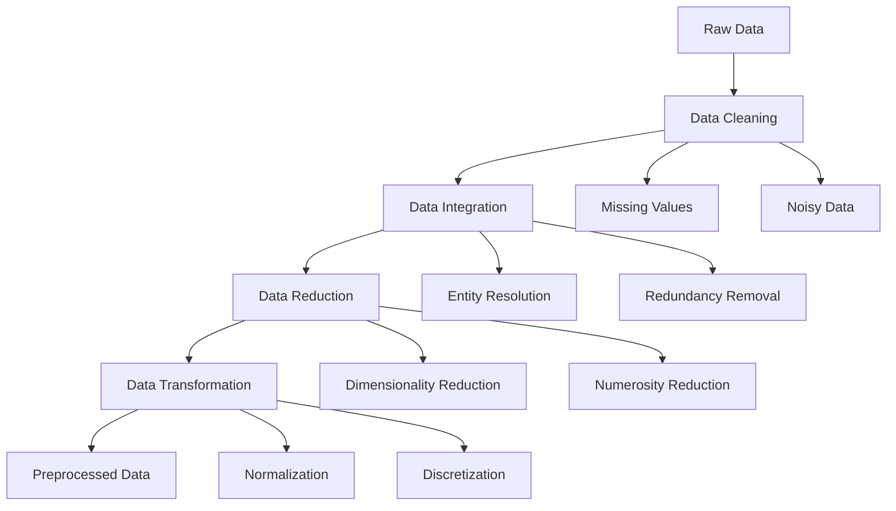
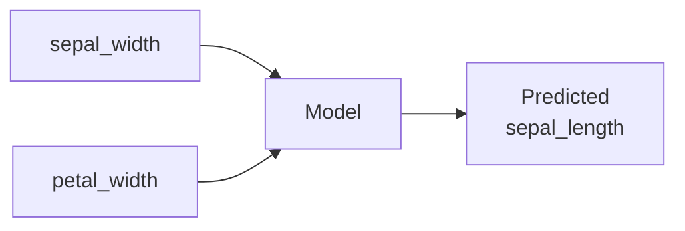
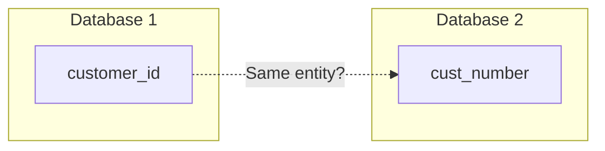
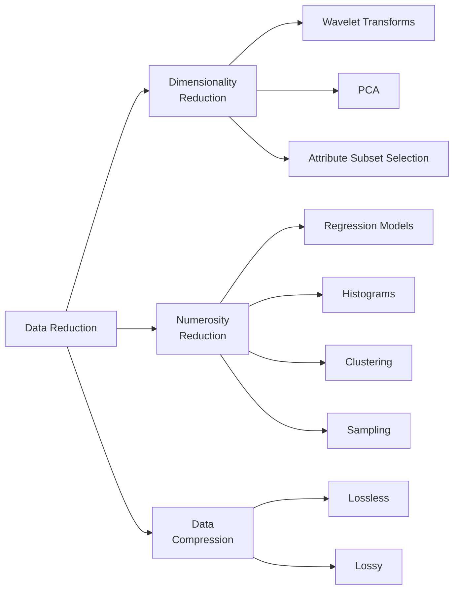

# Data Preprocessing

# Definition

**Data preprocessing** is the process of preparing raw data for data mining. It is the **most time-consuming part** of the data mining process, often taking 60-80% of project time.

> Real-world data is messy — it requires cleaning, integration, reduction, and transformation before mining algorithms can be applied effectively.
> 

---

# Why Data Preprocessing is Needed

### The Problem

📌 **From Slides**: Real-world databases are highly susceptible to:

- **Noisy** data (random errors)
- **Missing** data (incomplete records)
- **Inconsistent** data (conflicting values)

> Low-quality data → Low-quality mining results
> 

---

# Data Quality Issues

| Issue | Description | Example |
| --- | --- | --- |
| **Incomplete** | Lacking attribute values or containing only aggregate data | Missing age field |
| **Inaccurate** | Containing errors or unexpected values | Age = -5 |
| **Inconsistent** | Discrepancies in codes or formats | "M"/"Male"/"1" for gender |

---

# Prior Knowledge Requirements

Before preprocessing, you need to understand:

| Aspect | What to Know |
| --- | --- |
| **Objective** | The analysis question or business goal |
| **Subject Area** | Domain context and business process |
| **Data** | Quality, quantity, availability, gaps, labels |

**Example from Slides (Tables 2.1 & 2.2)**:

---

# Data Preprocessing Tasks Overview

---

# 1. Data Cleaning

## Definition

**Data cleaning** removes noise and inconsistencies from the data.

---

## Missing Values

### What Are Missing Values?

Empty values due to errors in recording devices or end-users.

### Why Are They a Problem?

Most data mining methods **cannot handle missing values**.

### Methods to Handle Missing Values

### Method 1: Ignore the Tuples

Simply remove rows with missing values.

**Risk**: Lose valuable data, especially if many rows have missing values.

---

### Method 2: Fill Manually

Human expert fills in the missing values based on domain knowledge.

**Risk**: Time-consuming, not scalable for large datasets.

---

### Method 3: Use a Global Constant

Replace all missing values with a constant (e.g., 0, "Unknown").

**Risk**: May introduce bias or be misinterpreted as actual data.

---

### Method 4: Use Central Tendency (Mean/Median/Mode)

Fill with the **mean** (or median/mode) of the attribute.

$$
\bar{x}=\frac{1}{N}\sum^N_{i=1}x_i
$$

**Example from Slides**:

$sepal_{length}=\frac{5.1+4.6}{2}=4.85$

$petal_{length}=\frac{1.4+1.4}{2}=1.4$

---

### Method 5: Use Most Probable Value

Use regression or inference to predict the missing value from other attributes.

$$
x=α⋅y+β⋅z
$$

Where $y$ and $z$ are other attributes that can predict $x$

---

## Missing Values: Method Comparison

| Method | Pros | Cons | When to Use |
| --- | --- | --- | --- |
| **Ignore tuples** | Simple | Loses data | Few missing, random |
| **Fill manually** | Accurate | Not scalable | Small datasets, critical data |
| **Global constant** | Simple | May bias | Clearly "unknown" is meaningful |
| **Central tendency** | Preserves distribution | Ignores relationships | Numeric, roughly normal |
| **Most probable** | Uses data relationships | Complex | Correlated attributes |

---

## Noisy Data

### **What is Noise?**

**Noise** is a random error or variance in a measured variable. Sometimes considered an outliers

Values 10.7 and 5.3 are clearly outliers/noise

---

### Smoothing by Binning

**Binning** smooths data by grouping values into bins.

**Process**:

1. Sort data
2. Partition into bins
3. Smooth by bin mean, median or boundaries

---

### Data Cleaning Rules

Use metadata and rules to validate data:

| Rule Type | Description | Example |
| --- | --- | --- |
| **Data Type** | Values match expected type | Age should be integer |
| **Unique Rule** | Primary keys are unique | No duplicate customer IDs |
| **Null Rule** | Required fields are not null | Name cannot be empty |
| **Consecutive Rule** | Sequential values are valid | Invoice numbers in order |

---

# 2. Data Integration

## Definition

**Data integration** merges data from multiple data stores into a coherent dataset.

> Careful integration reduces redundancies and inconsistencies, improving accuracy and speed of mining.
> 

---

## Problems in Data Integration

### 1. Entity Identification Problem

How do we know `customer_id` in one database and `cust_number` in another refer to the same attribute?

**Solution:** Schema matching, metadata analysis, domain knowledge

---

### 2. Redundancy Problem

An attribute may be **redundant** if it can be derived from other attributes.

**Example**: `annual_revenue` is redundant if `monthly_revenue × 12` exists.

**Detection**: Correlation analysis, functional dependencies.

---

### 3. Tuple Duplication

Same entity appears multiple times (possibly with slight variations).

| ID | Name | Address |
| --- | --- | --- |
| 1 | John Smith | 123 Main St |
| 2 | J. Smith | 123 Main Street |

*Same person, different representations.*

---

### 4. Data Value Conflicts

Same attribute, different values across sources due to:

- Different **representations** ("M" vs "Male")
- Different **scales** (metric vs imperial)
- Different **encodings** (currencies, date formats)

**Examples from Slides**:

- Weight in **metric** vs **British imperial** units
- Hotel prices in **different currencies** with **different services** (free breakfast) and **taxes**

---

# 3. Data Reduction

## Definition

**Data reduction** obtains a smaller representation of the data that maintains integrity of the original.

> Mining on reduced data should produce the same (or nearly same) results more efficiently.
> 

---

## Reduction Techniques

---

## Dimensionality Reduction

**Goal**: Reduce the number of attributes/variables.

| Method | Description |
| --- | --- |
| **Wavelet Transforms** | Transform data to frequency domain, keep significant coefficients |
| **PCA** | Project data onto principal components (directions of max variance) |
| **Attribute Subset Selection** | Remove irrelevant, weakly relevant, or redundant attributes |

## Numerosity Reduction

**Goal**: Reduce the number of data points/rows.

| Method | Type | Description |
| --- | --- | --- |
| **Regression** | Parametric | Store model parameters instead of data |
| **Log-linear models** | Parametric | Store model parameters |
| **Histograms** | Non-parametric | Store bin counts |
| **Clustering** | Non-parametric | Store cluster representatives |
| **Sampling** | Non-parametric | Store subset of data |
| **Data Cubes** | Non-parametric | Store aggregated data |

## Data Compression

| Type | Description | Reconstruction |
| --- | --- | --- |
| **Lossless** | Original data can be fully reconstructed | Exact |
| **Lossy** | Only approximation can be reconstructed | Approximate |

---

# 4. Data Transformation

## Definition

**Data transformation** converts data into forms appropriate for mining, making the process more efficient and patterns easier to understand.

---

## Aggregation

Summarize data using aggregate functions.

## Normalization

### Why Normalize?

Attributes with different scales can bias distance-based algorithms.

---

### Method 1: Min-Max Normalization

Maps values to a new range $[new_{min},new_{max}][new_{min},new_{max}]$.

$$
v'_i=\frac{v_i-min_A}{max_A-min_A}(new\_max_A-new\_min_A)+new\_min_A
$$

**Example from Slides (Mini-quiz 1)**:

- Income range: $12,000 to $98,000
- Target range: [0.0, 1.0]
- Value to normalize: $73,600

$$
v'=\frac{73600-12000}{98000-12000}(1-0)+0=\frac{61600}{86000}=0,716
$$

---

### Method 2: Z-Score Normalization

Normalizes based on mean and standard deviation.

$$
v'_i=\frac{v_i-\bar{A}}{\sigma_A}
$$

Where:

- $\bar{A}=$ mean of attribute $A$
- $\sigma_A=$ standard deviation of attribute $A$

**Example from Slides (Mini-quiz 2)**:

- Mean income: $54,000
- Standard deviation: $16,000
- Value to normalize: $73,600

$$
v'=\frac{73600-54000}{16000}=\frac{19600}{16000}=1,225
$$

---

### Method 3: Decimal Scaling

Normalizes by moving the decimal point.

$$
v'_i=\frac{v_i}{10^j}
$$

Where $j$ is the smallest integer such that $max(|v'|)<1$

**No examples from slides :(**

---

### Normalization Methods Comparison

| Method | Formula | Output Range | When to Use |
| --- | --- | --- | --- |
| **Min-Max** | $\frac{v-min}{max−min}$ | [0, 1] or custom | Bounded range needed |
| **Z-Score** | $\frac{v−μ}{σ}$ | Typically [-3, 3] | Unknown bounds, need standardization |
| **Decimal Scaling** | $\frac{v}{10^j}$ | [-1, 1] | Quick scaling |

---

## Discretization

**Goal**: Convert continuous attributes to discrete/categorical values.

---

### Method 1: Binning

Top-down splitting based on specified number of bins.

---

### Method 2: Clustering

Partition values into clusters where objects within a cluster are "similar."

---

### Method 3: Decision Trees

**Supervised** discretization using class labels to determine split points.

---

## Discretization Methods Comparison

| Method | Type | Uses Labels? | Description |
| --- | --- | --- | --- |
| **Binning** | Top-down | No | Equal-width or equal-frequency bins |
| **Clustering** | Bottom-up | No | Group by similarity |
| **Decision Tree** | Top-down | Yes | Split by information gain |

---

# Common Exam Questions

## Calculation Questions

1. **Min-Max Normalization**: Given $min=10$, $max=100$, normalize value $55$ to range $[0,1]$
    
    $$
    v'=\frac{55-10}{100-10}(1-0)+0=\frac{45}{90}=0,5
    $$
    
2. **Z-Score Normalization**: Given $mean=50$, $std=10$, normalize value $70$
    
    $$
    v'=\frac{70-50}{10}=2
    $$
    

## Conceptual Questions

1. **List five methods to handle missing values.**
    - Ignore tuples, fill manually, global constant, central tendency, most probable value
2. **What problems arise during data integration?**
    - Entity identification, redundancy, tuple duplication, data value conflicts
3. **Compare lossless vs lossy compression.**
    - Lossless: exact reconstruction; Lossy: approximate reconstruction
4. **When would you use Z-score vs Min-Max normalization?**
    - Z-score: unknown bounds, outliers present
    - Min-Max: need bounded range, no significant outliers