# Different Types of Data Mining

# Definition

**Data mining tasks** are categorized by the type of pattern or knowledge they extract from data. Each task type has specific algorithms suited to its goal and produces different types of outputs.

<aside>
💡

The choice of task depends on: **what you want to predict/discover** and **whether you have labeled data**.

</aside>


---

# 1. Classification

## Definition

Predict if a data point belongs to one of **predefined classes** based on learning from a known dataset

| Aspect | Details |
| --- | --- |
| Output | Discrete class label |
| Learning Type | Supervised |
| Input | Labeled training data |

## Algorithms from Slides

- Decision Trees
- Neural Networks
- Bayesian Models
- Induction Rules
- K-Nearest Neighbors (KNN)

## Examples from Slides

- Assigning voters into known buckets by political parties (e.g., "soccer moms")
- Bucketing new customers into one of the known customer groups


---

# 2. Regression

## Definition

Predict the **numeric target label** of a data point based on learning from a known dataset.

| Aspect | Details |
| --- | --- |
| Output | Continuous numeric value |
| Learning Type | Supervised |
| Input | Labeled training data with numeric targets |

## Algorithms from Slides

- Linear Regression
- Logistic Regression

## Examples from Slides

- Predicting the unemployment rate for the next year
- Estimating insurance premium

## Key Difference from Classification

| Classification | Regression |
| --- | --- |
| "Which category?" | "What number?" |
| Discrete output | Continuous output |
| Spam / Not Spam | Price = $245,000 |

---

# 3. Anomaly Detection

## Definition

Predict if a data point is an **outlier** compared to other data points in the dataset.

| Aspect | Details |
| --- | --- |
| **Output** | Normal / Anomaly (+ anomaly score) |
| **Learning Type** | Often Unsupervised |
| **Goal** | Find unusual patterns |

### Algorithms from Slides

- Distance-based methods
- Density-based methods
- LOF (Local Outlier Factor)

### Examples from Slides

- Detecting fraudulent credit card transactions
- Network intrusion detection

```mermaid
flowchart LR
    subgraph Normal["Normal Data Points"]
        N1((●))
        N2((●))
        N3((●))
        N4((●))
    end
    
    O((🔴)) --> |"Outlier"| AD[Anomaly<br/>Detector]
```



---

# 4. Time Series Forecasting

## Definition

Predict the value of a target variable for a **future timeframe** based on historical values

| Aspect | Details |
| --- | --- |
| **Output** | Future numeric value(s) |
| **Learning Type** | Supervised (temporal) |
| **Input** | Historical time-ordered data |

## Algorithms from Slides

- Exponential Smoothing
- ARIMA Regression

## Examples from Slides

- Sales forecasting
- Production forecasting
- Virtually any growth phenomenon that needs to be extrapolated

## Key Characteristic

Data must be **ordered by time** — sequence matters!


---

# 5. Clustering

## Definition

Identify **natural clusters** within the dataset based on inherent properties - no predefined labels.

| Aspect | Details |
| --- | --- |
| **Output** | Cluster assignments |
| **Learning Type** | Unsupervised |
| **Input** | Unlabeled data |

## Algorithms from Slides

- K-Means
- Density-based clustering (e.g., DBSCAN)

## Examples from Slides

- Finding customer segments in a company based on transaction, web, and customer call data

```mermaid
flowchart TB
    subgraph Input["Unlabeled Data"]
        D1((●))
        D2((●))
        D3((●))
        D4((●))
        D5((●))
        D6((●))
    end
    
    Input --> CL[Clustering<br/>Algorithm]
    
    CL --> C1[🔵 Cluster 1]
    CL --> C2[🟢 Cluster 2]
    CL --> C3[🔴 Cluster 3]
```



## Key Difference: Classification vs. Clustering

| Classification | Clustering |
| --- | --- |
| Labels are **predefined** | Labels are **discovered** |
| Supervised | Unsupervised |
| "Put this in Category A, B, or C" | "Find natural groups" |

---

# Association Analysis

## Definition

Identify **relationships within an item set** based on transaction data

| Aspect | Details |
| --- | --- |
| **Output** | Association rules (If X then Y) |
| **Learning Type** | Unsupervised |
| **Input** | Transaction/basket data |

## Algorithms from Slides

- FP-Growth Algorithm
- Apriori Algorithm

## Examples from Slides

- Finding cross-selling opportunities for a retailer based on transaction purchase history

## Example: Market Basket Analysis

```jsx
{Bread, Milk} → {Eggs}
"Customers who buy bread and milk often also buy eggs"
```

## Key Metrics

| Metric | Formula | Meaning |
| --- | --- | --- |
| **Support** | $\frac{\text{Transactions with itemset}}{\text{Total transactions}}$ | How frequent? |
| **Confidence** | $\frac{\text{Support}(A\cup B)}{\text{Support}(A)}$ | How reliable? |
| **Lift** | $\frac{\text{Confidence}}{\text{Support}(B)}$ | How significant? |

---

# 7. Recommendation Engines

## Definition

Predict the **preference of an item** for a user

| Aspect | Details |
| --- | --- |
| **Output** | Ranked list of recommended items |
| **Learning Type** | Can be Supervised or Unsupervised |
| **Input** | User-item interaction data |

## Algorithms from Slides

- Collaborative Filtering
- Content-based Filtering
- Hybrid Recommenders

## Examples from Slides

- Finding the top recommended movies for a user

## Types of Filtering

| Type | How It Works | Example |
| --- | --- | --- |
| **Collaborative** | "Users like you liked X" | Netflix: similar users' ratings |
| **Content-based** | "You liked items like X" | Spotify: similar song features |
| **Hybrid** | Combines both approaches | Amazon: both user similarity + item features |


---

# Common Exam Questions

## Multiple Choice Style

1. **Which task predicts a continuous numeric value?**
    - Answer: Regression
2. **Which task finds natural groupings without predefined labels?**
    - Answer: Clustering
3. **What is the difference between classification and clustering?**
    - Classification: predefined labels (supervised)
    - Clustering: discovers labels (unsupervised)
4. **Which algorithms are used for association analysis?**
    - Answer: Apriori, FP-Growth

## Application Questions

1. **Match the business problem to the appropriate task:**
    
    
    | Problem | Task |
    | --- | --- |
    | "Predict if a customer will churn" | Classification |
    | "Estimate house prices" | Regression |
    | "Detect fraudulent transactions" | Anomaly Detection |
    | "Forecast next quarter's sales" | Time Series |
    | "Segment customers by behavior" | Clustering |
    | "Find products bought together" | Association |
    | "Suggest movies to users" | Recommendation |