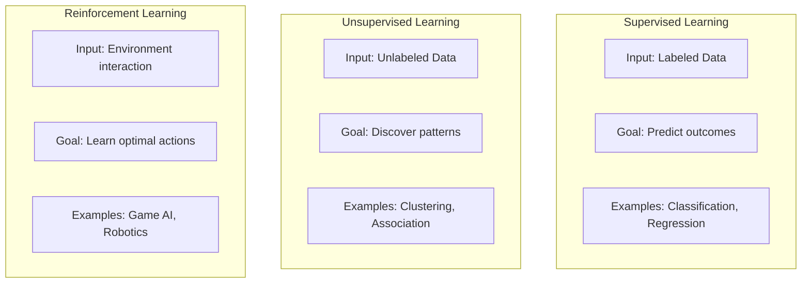
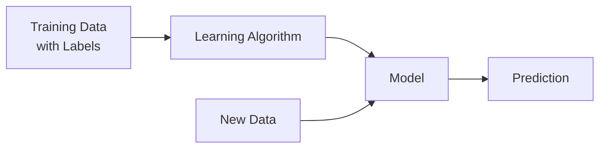
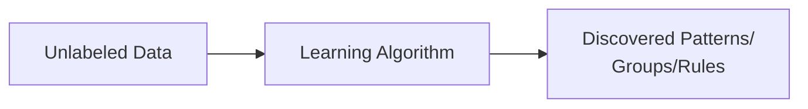
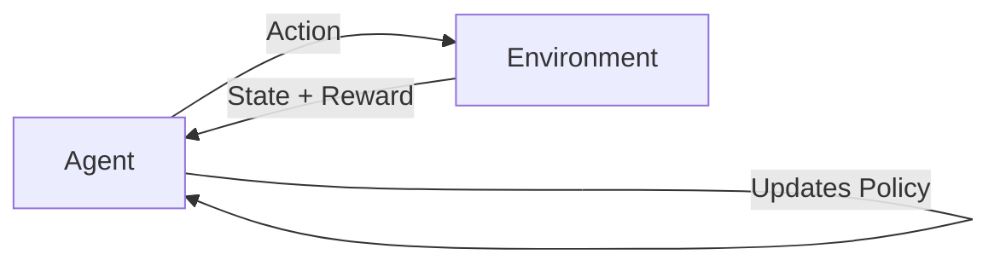

# Data Mining Settings

# Definition

**Data mining settings** refer to the three fundamental learning paradigms used to extract knowledge from data. The choice of setting depends on the **type of data available** (labeled vs. unlabelled) and the **goal of the analysis** (prediction, pattern discovery or decision-making)

<aside>
💡

The key differentiator is **supervision**: whether the algorithm learns from labeled examples, discovers structure on its own, or learns through interaction with an environment.

</aside>

---

# Supervised Learning

## Definition

Learning from **labeled data** where each training example has a known output (target). The algorithm learns a mapping from inputs to outputs

### Problem Types

| Type | Output | Goal | Example |
| --- | --- | --- | --- |
| **Classification** | Discrete class/category | Predict which class | Email → Spam/Not Spam |
| **Regression** | Continuous numeric value | Predict a number | House features → Price |

### Algorithms from Slides

- Linear Regression
- Logistic Regression
- Support Vector Machines (SVM)
- K-Nearest Neighbors (KNN)
- Decision Trees
- Neural Networks

### Applications from Slides

- **Risk Evaluation** - Predict loan default risk
- **Forecast Sales** - Predict future revenue

### Key Characteristics

- ✅ Requires labeled training data
- ✅ Has a clear target variable to predict
- ✅ Performance can be measured against known labels
- ❌ Labeling data is expensive and time-consuming

---

# Unsupervised Learning

## Definition

Learning from **unlabeled data** without any guidance. The algorithm discovers hidden structure, patterns, or groupings in the data

### Problem Types

| Type | Goal | Output | Example |
| --- | --- | --- | --- |
| **Clustering** | Group similar items | Cluster assignments | Customer segmentation |
| **Association** | Find item relationships | Association rules | Market basket analysis |

### Algorithms from Slides

- **Clustering**: K-Means, C-Means, DBSCAN
- **Association**: Apriori algorithm

### Applications from Slides

- **Recommendation Systems** — Suggest products/content
- **Anomaly Detection** — Identify unusual patterns

### Key Characteristics

- ✅ No labels required
- ✅ Discovers hidden structure
- ✅ Useful for exploratory analysis
- ❌ No "correct answer" to validate against
- ❌ Results may require human interpretation

---

# Reinforcement Learning

## Definition

Learning through **interaction with an environment**. The agent takes actions, receives rewards or penalties, and learns to maximize cumulative reward over time

### Key Concepts

| Concept | Description |
| --- | --- |
| **Agent** | The learner/decision-maker |
| **Environment** | The world the agent interacts with |
| **State** | Current situation |
| **Action** | What the agent can do |
| **Reward** | Feedback signal (positive or negative) |
| **Policy** | Strategy for choosing actions |

### Problem Types

| Type | Description |
| --- | --- |
| **Exploitation** | Use known good actions to maximize reward |
| **Exploration** | Try new actions to discover better strategies |

### Algorithms from Slides

- Q-Learning
- SARSA (State-Action-Reward-State-Action)

### Applications from Slides

- **Self-Driving Cars** — Learn driving policies
- **Gaming** — Game-playing AI (e.g., AlphaGo)
- **Healthcare** — Treatment optimization

### Key Characteristics

- ✅ Learns from trial and error
- ✅ No predefined training data needed
- ✅ Can handle sequential decision problems
- ❌ Requires well-defined reward function
- ❌ Can be slow to converge

---

# Comparison Table

| Criteria | Supervised | Unsupervised | Reinforcement |
| --- | --- | --- | --- |
| **Definition** | Use labeled data | Use unlabeled data without guidance | Work on interacting with environment |
| **Type of Data** | Labeled data | Unlabeled data | No predefined data |
| **Type of Problems** | Regression and Classification | Association and Clustering | Exploitation or Exploration |
| **Supervision** | Extra supervision | No supervision | No supervision |
| **Algorithms** | Linear Regression, Logistic Regression, SVM, KNN | K-Means, C-Means, Apriori | Q-Learning, SARSA |
| **Aim** | Calculate outcomes | Discover underlying patterns | Learn a series of actions |
| **Application** | Risk Evaluation, Forecast Sales | Recommendation System, Anomaly Detection | Self-Driving Cars, Gaming, Healthcare |

---

# Common Exam Questions

## Multiple Choice Style (from Mock Exam)

1. **Which of the following is a supervised learning task?**
    - Answer: Classification (or Regression)
2. **K-Means clustering is an example of which learning paradigm?**
    - Answer: Unsupervised learning
3. **Which learning setting requires interaction with an environment?**
    - Answer: Reinforcement learning

## Written Questions

1. **Compare and contrast supervised and unsupervised learning. Give one example algorithm and application for each.**
    - Supervised: Uses labeled data, predicts outcomes
        - Algorithm: KNN, Application: Risk evaluation
    - Unsupervised: Uses unlabeled data, discovers patterns
        - Algorithm: K-Means, Application: Customer segmentation
2. **Explain the exploration vs. exploitation trade-off in reinforcement learning.**
    - Exploration: Try new actions to discover potentially better strategies
    - Exploitation: Use current best-known actions to maximize reward
    - Trade-off: Too much exploration wastes time; too much exploitation may miss better options
3. **Given a business scenario, identify the appropriate learning paradigm:**
    - "Predict customer churn" → Supervised (Classification)
    - "Group customers by purchasing behavior" → Unsupervised (Clustering)
    - "Train a robot to navigate a maze" → Reinforcement Learning