# Limitations of First-Order Logic

# Definition

**First-order logic (FOL)** is a formal logical system used to represent facts and relationships using predicates, quantifiers and logical connectives. While powerful for deductive reasoning, FOL has fundamental limitations that make it insufficient for data mining and machine learning tasks

<aside>
💡

First-order logic can only represent facts as **true or false** — it cannot handle uncertainty, probability, or learn patterns from data.

</aside>

---

# What First-Order Logic CAN do

FOL excels at **deductive reasoning** - deriving conclusions from know premises

**Example from Slides**

> "All men are mortal. Socrates is a man. Therefore, Socrates is mortal.”
> 

In formal notation:

$$
(\forall x\cdot man(x)\rarr mortal(x)\land man(Socrates)\rarr mortal(Socrates)
$$

This works because:

- We have an explicit rule (all men are mortal)
- We have a known fact (Socrates is a man)
- We can deduce a conclusion (Socrates is mortal)

---

# What First-Order Logic CANNOT Do

**The Generalization Problem**

Suppose we have learned one rule:

$$
\forall x\cdot car(x)\land black(x)\rarr brake(self)
$$

*“If something is a car AND it’s black, then brake.”*

**But what about these cases?**

$$
\forall x\cdot truck(x)\land red(x)\rarr brake(self)?
$$

$$
\forall x\cdot car(x)\land blue(x)\rarr brake(self)?
$$

FOL **cannot answer** these questions because:

- No explicit rule exists for trucks or blue cars
- FOL cannot generalize from the black car rule
- FOL cannot learn that "vehicle approaching = brake" regardless of color

```mermaid
flowchart TD
    subgraph Known["What FOL Knows"]
        A["black car → brake"]
    end
    
    subgraph Unknown["What FOL Cannot Infer"]
        B["red truck → brake?"]
        C["blue car → brake?"]
        D["white van → brake?"]
    end
    
    Known -.->|"Cannot generalize"| Unknown
```

---

# Core Limitations Summary

| Limitation | Description | Why It Matters for Data Mining |
| --- | --- | --- |
| **Binary Truth Values** | Facts are only TRUE or FALSE | Cannot express "70% likely to be fraud" |
| **No Uncertainty** | Cannot represent probability or confidence | Real-world data is inherently uncertain |
| **No Learning** | Cannot discover patterns from examples | Must have all rules pre-defined |
| **No Generalization** | Cannot extend rules to similar cases | Each case needs explicit rule |
| **Closed World** | What's not stated is assumed false | Cannot handle incomplete information |

---

# Why Data Mining is Needed

| Aspect | First-Order Logic | Data Mining |
| --- | --- | --- |
| **Input** | Predefined rules & facts | Raw data |
| **Process** | Deduction | Induction (learning) |
| **Output** | Logical conclusions | Patterns, predictions, probabilities |
| **Handles uncertainty** | ❌ No | ✅ Yes |
| **Generalizes** | ❌ No | ✅ Yes |
| **Learns from data** | ❌ No | ✅ Yes |

---

# Practical Implications

### Autonomous Driving Example

Using FOL, you would need to write rules for every possible scenario:

$$
∀x . car(x) ∧ black(x) ∧ distance(x) < 10m → brake(self)
$$

$$
∀x . car(x) ∧ white(x) ∧ distance(x) < 10m → brake(self)
$$

$$
∀x . truck(x) ∧ red(x) ∧ distance(x) < 10m → brake(self)
$$

$$
∀x . bicycle(x) ∧ distance(x) < 5m → brake(self)
$$

… (infinite rules needed)

**With Data Mining/ML**: Learn from driving data that "obstacle ahead + close distance → brake" regardless of object type or color.

# Common Exam Questions

## Conceptual Questions

1. **What are the main limitations of first-order logic for data mining applications?**
    - Binary truth values (no uncertainty)
    - Cannot learn patterns from data
    - Cannot generalize to unseen cases
    - Requires all rules to be explicitly defined
2. **Explain with an example why FOL cannot generalize.**
    - Use the car/truck braking example from slides
    - Show that knowing "black car → brake" doesn't help with "red truck → brake?"
3. **Why is data mining necessary given the limitations of FOL?**
    - Real-world data contains uncertainty
    - Impossible to predefine all rules
    - Need to discover patterns automatically
    - Need to make predictions on unseen data

## Application Questions

1. **Given a scenario (e.g., spam detection), explain why FOL would be impractical.**
    - Would need rules for every spam pattern
    - Spammers constantly change tactics
    - Need to learn and adapt from examples