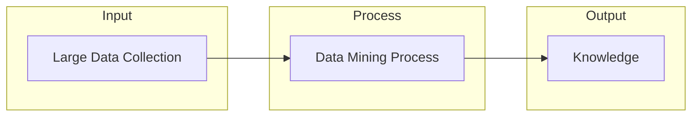
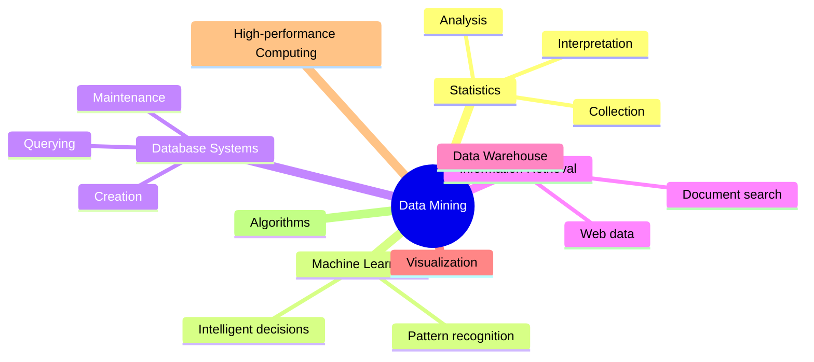

# What is Data Mining

# Definition

**Data mining** is the process of turning a large collection of data into knowledge. It involves discovering patterns, correlations, anomalies and insight from large dataset using statistical, mathematical and computational techniques

<aside>
💡

Data mining extracts valuable information from raw data that would otherwise remain hidden.

</aside>

---

# Types of Data Mining Tasks

| Task | Description | Algorithms | Examples |
| --- | --- | --- | --- |
| **Classification** | Predict class membership from predefined classes | Decision trees, Neural networks, Bayesian models, KNN | Voter political party assignment, Customer segmentation |
| **Regression** | Predict numeric target value | Linear regression, Logistic regression | Unemployment rate prediction, Insurance premium estimation |
| **Anomaly Detection** | Identify outliers | Distance-based, Density-based, LOF | Fraud detection, Network intrusion |
| **Time Series Forecasting** | Predict future values based on historical data | Exponential smoothing, ARIMA | Sales forecasting, Production forecasting |
| **Clustering** | Group similar data points without predefined labels | K-Means, DBSCAN | Customer segmentation |
| **Association Analysis** | Find relationships in transaction data | Apriori, FP-growth | Market basket analysis (cross-selling) |
| **Recommendation Engines** | Predict user preferences | Collaborative filtering, Content-based filtering | Movie recommendations |

---

# Technologies Used in Data Mining

| Technology | Role in Data Mining |
| --- | --- |
| **Statistics** | Collection, analysis, interpretation of data |
| **Machine Learning** | Automatic pattern recognition and decision making |
| **Database Systems** | Data storage, maintenance, and retrieval |
| **Information Retrieval** | Searching documents and web content |

---

# Common Exam Questions

## Conceptual Questions

1. **Define data mining and explain its purpose.**
    - Answer should include: transformation of large data into knowledge, pattern discovery, use of statistical/ML techniques.
2. **List and briefly describe the seven steps of the data mining process.**
3. **What technologies contribute to data mining? Name at least four.**

## Application Questions

1. **Given a business scenario (e.g., "predict customer churn"), identify the appropriate data mining task and suitable algorithms.**
2. **Which data mining task would you use for:**
    - Finding products frequently bought together? → **Association Analysis**
    - Predicting house prices? → **Regression**
    - Grouping customers by behavior? → **Clustering**
    - Detecting credit card fraud? → **Anomaly Detection**

| If you need to... | Use... |
| --- | --- |
| Predict a **category** | Classification |
| Predict a **number** | Regression |
| Find **groups** | Clustering |
| Find **rules/relationships** | Association |
| Find **unusual points** | Anomaly Detection |
| Predict **future values** | Time Series |