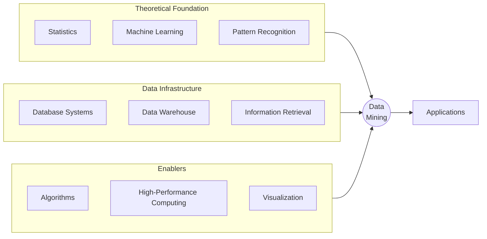

# Technologies Used in Data Mining

Notes

		

# Definition

**Data mining** is an interdisciplinary field that draws from multiple technologies. No single discipline owns data mining - it sits at the intersection of statistics, machine learning, databases and several other fields

<aside>
💡

Data mining combines techniques from many areas to extract knowledge from large datasets.

</aside>

---

# Technology Ecosystem

---

# Core Technologies

## Statistics

**Role**: Collection, analysis, interpretation, and presentation of data.

> Data mining has an inherent connection with statistics.
> 

| Contribution | Examples |
| --- | --- |
| Descriptive stats | Mean, variance, distributions |
| Inferential stats | Hypothesis testing, confidence intervals |
| Probability | Bayesian methods, probabilistic models |

## Machine Learning

**Role**: Investigates how computers can automatically learn to recognize complex patterns and make intelligent decisions based on data.

| Contribution | Examples |
| --- | --- |
| Supervised learning | Classification, regression algorithms |
| Unsupervised learning | Clustering, dimensionality reduction |
| Model optimization | Gradient descent, cross-validation |

## Database Systems

**Role**: Creation, maintenance, and use of databases for organizations and end-users.

| Contribution | Examples |
| --- | --- |
| Data storage | Efficient retrieval of large datasets |
| Query processing | SQL, indexing, optimization |
| Transaction management | ACID properties, concurrency |

## Information Retrieval

**Role**: The science of searching for documents or information in documents.

> Documents can be text or multimedia, and may reside on the Web.
> 

| Contribution | Examples |
| --- | --- |
| Text mining | Document classification, sentiment analysis |
| Search engines | Ranking, relevance scoring |
| Web mining | Crawling, link analysis |

---

# Supporting Technologies

| Technology | Role in Data Mining |
| --- | --- |
| **Pattern Recognition** | Identifying regularities in data (image, speech, signals) |
| **Data Warehouse** | Integrated repository for historical data analysis |
| **Visualization** | Graphical representation of patterns and results |
| **Algorithms** | Computational methods for mining tasks |
| **High-Performance Computing** | Parallel/distributed processing for large-scale data |
| **Applications** | Domain-specific implementations (finance, healthcare, retail) |

---

# Technology Contributions Summary

| Category | Technologies | What They Provide |
| --- | --- | --- |
| **Theory** | Statistics, ML, Pattern Recognition | Mathematical foundations, learning algorithms |
| **Data** | Databases, Data Warehouse, IR | Storage, retrieval, integration |
| **Compute** | Algorithms, HPC | Efficiency, scalability |
| **Output** | Visualization, Applications | Interpretation, deployment |

---

# Common Exam Questions

## Conceptual Questions

1. **Name four technologies that contribute to data mining.**
    - Statistics, Machine Learning, Database Systems, Information Retrieval
    - (or any four from the list)
2. **What is the role of statistics in data mining?**
    - Collection, analysis, interpretation, and presentation of data
    - Provides probability and inference foundations
3. **How do database systems support data mining?**
    - Store and manage large datasets
    - Efficient query processing and retrieval
    - Handle data integration and transactions
4. **Why is high-performance computing important for data mining?**
    - Large-scale datasets require parallel processing
    - Reduces computation time for complex algorithms