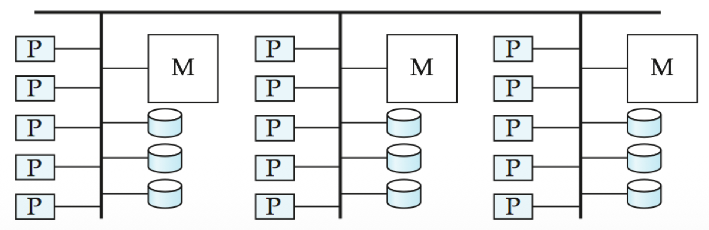

# Hierarchical

A **hybrid** architecture that attempts to combine the scalability of *Shared Nothing* with the efficiency of *Shared Memory*

This looks like a combination of the others. You see clusters of “Shared Memory” systems (multiple Ps sharing one M) connected together via a “Shared Nothing” style network

# Structure

- **Top Level:** Organised as **Shared Nothing** (nodes connected by a network)
- **Node Level:** Each individual node is essentially a **Shared Memory** or **Shared Disk** system containing multiple processors