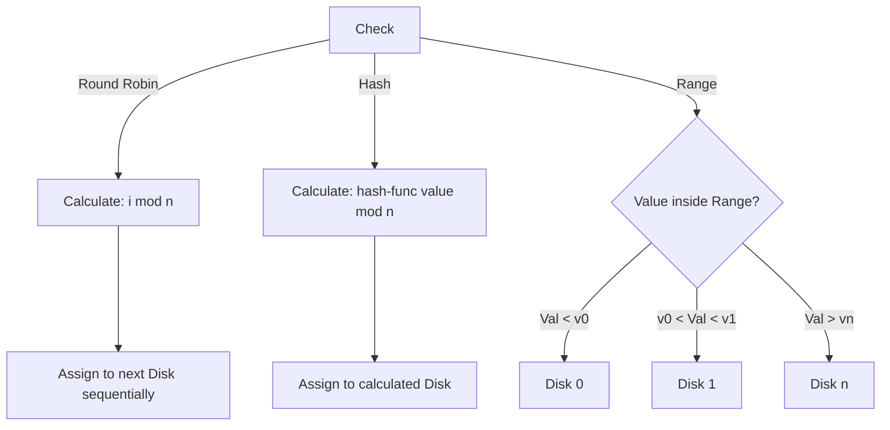

# I/O Parallelism

# Definition

**I/O Parallelism** aims to reduce the time required to retrieve relations from disk by partitioning the relations across multiple disk. The primary technique used is **Horizontal Partitioning,** where the tuples (rows) of a relation are divided among many disks such that each tuple resides on exactly one disk

---

# Core Idea

By splitting data, the system can read from multiple disks simultaneously, increasing aggregate throughput. The efficiency of specific query types (Point vs. Range) depends entirely on *how* the data is partitioned.

---

# Horizontal Partitioning Techniques

[Round-Robin Partitioning](I%20O%20Parallelism/Round-Robin%20Partitioning%202e47c6b7cc2f8098b6baf60a8868c5d7.md)

[Hash Partitioning](I%20O%20Parallelism/Hash%20Partitioning%202e57c6b7cc2f80e0ad25ff9bb5e17f24.md)

[Range Partitioning](I%20O%20Parallelism/Range%20Partitioning%202e57c6b7cc2f80588ec7e1db912e710b.md)

---

# Summary

| Feature | Round-Robin | Hash Partitioning | Range Partitioning |
| --- | --- | --- | --- |
| **Load balancing** | Perfectly Even | Good (if key) | Depends on data |
| **Point Query** | $n$  disk | 1 disk | 1 disk |
| **Range Query** | $n$  disk | $n$ disk | 1-few disks |
| **Sequential scan** | Balanced | Balanced | May be skewed |