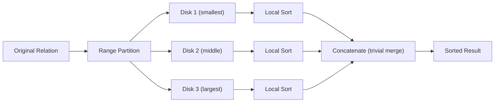

# Range Partitioning

# Definition

**Range Partitioning** is a data partitioning technique where tuples are assigned to disk/nodes based on **value ranges** of a partitioning attribute

A **partitioning vector** defines the boundaries, and tuples are assigned to the partition whose range contains their attribute value

---

# Motivation

- Preserves **data ordering/clustering** by attribute value
- Enables **efficient range queries** on the partitioning attribute
- Supports **parallel sorting** with minimal final merge cost
- Good for **sequential scans** when ranges are balanced

---

# How Range Partitioning Works

1. Choose an attribute as the **partitioning attribute**
2. Define a **partitioning vector $[v_0,v_1,...,v_{n-2}]$** with $n-1$ values
3. This creates $n$ ranges for $n$ disks:
    1. Disk 0: $\text{values}<v_0$
    2. Disk 1: $v_0\le \text{values} <v_1$
    3. …
    4. Disk $n-1$: $\text{values}\ge v_{n-2}$

---

# Range Partitioning Formula

For partitioning vector $[v_0,v_1,...,v_{n-2}]$:

$$
Disk_i

\begin{cases}
0&\text{if }v<v_0\\
i+1&\text{if }v_i\le v<v_{i+1}\\
n-1&\text{if }v\ge v_{n-2}
\end{cases}
$$

---

# Example (from the slides)

Given 3 disks, partitioning vector **$[5,10]$** on attribute $x$

| Range | Disk |
| --- | --- |
| $x\le 5$ | Disk 0 |
| $5<x\le10$ | Disk 1 |
| $x>10$ | Disk 2 |

| Tuple | $x$ value | Assigned Disk |
| --- | --- | --- |
| $t_1$ | 1 | Disk 0 |
| $t_2$ | 2 | Disk 0 |
| $t_3$ | 15 | Disk 2 |
| $t_4$ | 6 | Disk 1 |
| $t_5$ | 7 | Disk 1 |
| $t_6$ | 9 | Disk 1 |
| $t_7$ | 12 | Disk 2 |
| $t_8$ | 5 | Disk 0 |
| $t_9$ | 8 | Disk 1 |

**Result:**

- Disk 0: $t_1,t_2,t_8$ (values 1, 2, 5)
- Disk 1: $t_4, t_5, t_6, t_9$ (values 6, 7, 8, 9)
- Disk 2: $t_3, t_7$ (values 12, 15)

# Query Performance with Range Partitioning

## Point Query on Partitioning Attribute (e.g., “Find $x=8$”)

| Scenario | Disks Searched | Response Time |
| --- | --- | --- |
| Without local index | 1 | $m$ (all buckets) |
| With local index | 1  | 1 |

**Key insight:** Only **disk 1** searched (8 falls in range $5<x\le10\rarr$ Disk 1)

## Range Query on Partitioning Attribute (e.g., “Find $5<x\le8$”)

| Scenario | Disk Searched | Response Time | Total Time |
| --- | --- | --- | --- |
| Without local index | 1 | 4 | 4 |
| With local index | 1 | 3 | 3 |

**Key advantage:** Only disks whose ranges overlap the query range are accessed!

## Query NOT on Partitioning Attribute

- Must search **all $n$ disks**
- No advantage from range partitioning

---

# Advantages of Range Partitioning

1. **Excellent for range queries** on partitioning attribute (access only relevant disks)
2. **Preserves clustering** - data with similar values stored together
3. **Ideal for parallel sorting -** final merge is just concatenation
4. **Good for point queries** on partitioning attribute (1 disk)

---

# Disadvantages of Range Partitioning

1. **Execution skew** - uneven data distribution if ranges not chosen carefully
2. **Skewed load** - some disks may have much more data than others
3. **Requires knowledge of data distribution** to set good partition vector
4. **Poor for non-partitioning attribute queries**

---

# Range Partitioning for Parallel Sort

**Range-Partitioning Sort Algorithm:**

**Steps:**

1. Create range-partition vector on sorting attribute
2. Redistribute tuples to appropriate disks
3. Each processor sorts its partition **locally** (in parallel)
4. **Concatenate** results (no complex merge needed!)

**Why concatenation works:** Range partitioning guarantees all values in Disk $i<$ all values in Disk $i+1$

---

# Range Partitioning for Parallel Joins

For **partitioned parallel join** using range partitioning:

1. Both relations partitioned on **join attributes**
2. Must use **same partitioning vector**
3. Each processor computes local join: $r_i\bowtie s_i$

---

# Choosing a Good Partitioning Vector

**Goal:** Equal-sized partitioning for load balancing

**Methods:**

1. **Histogram-based:** Analyze data distribution, choose quantile boundaries
2. **Sampling:** Sample data, sort sample, pick evenly-spaced values
3. **Domain knowledge:** Use known data characteristics

**Bad vector example:** If 90% of values are $<5$, vector $[5,10]$ creates huge skew on Disk 0

---

# Common Exam Questions

1. “**Which disk does value $X$ go to given vector $[a, b]$?**” $\rarr$ Compare $X$ to boundaries
2. **“Why is range partitioning best for range queries?” $\rarr$** Data clustering, only relevant disks accessed
3. **“What is execution skew?” $\rarr$** Uneven work distribution when range query hits only some disks
4. **“Why is final merge trivial in range-partition sort?” $\rarr$** Values in partition $i$ are all less than partition $i+1$
5. **“How to choose a good partitioning vector?” $\rarr$** Based on data distribution to balance load