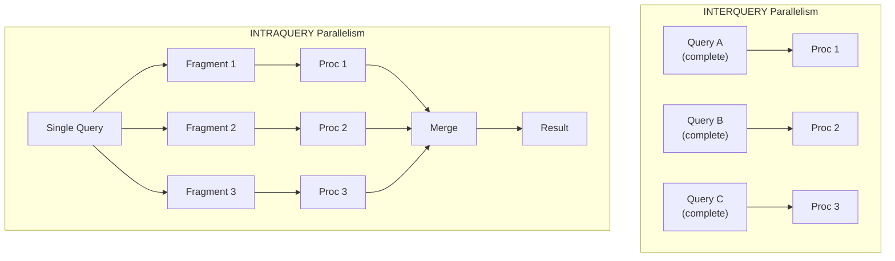
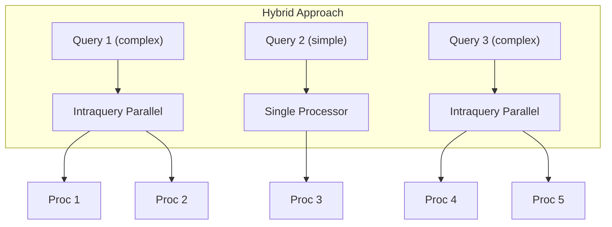

# Types of Parallelism

# Definition

**Parallelism** in database systems refers to the execution of operations simultaneously across multiple processors or disks. The specific type of parallelism chosen depends on whether the goal is to increase the volume of work done (throughput) or to decrease the time it takes to finish a single job (response time)

---

# Core Idea

Parallelism is categorised into two main levels:

[Interquery Parallelism](Types%20of%20Parallelism/Interquery%20Parallelism%202e57c6b7cc2f80068c0efea92fa989d3.md)

[Intraquery Parallelism](Types%20of%20Parallelism/Intraquery%20Parallelism%202e57c6b7cc2f80a3a47bfc86cffa6fa3.md)

<aside>
💡

**Inter = Between** (between different queries)
**Intra = Within** (within a single query)

</aside>

---

# Intraquery Parallelism for Relational Operations

[Parallel Selection](Types%20of%20Parallelism/Parallel%20Selection%202e57c6b7cc2f8041b9dfdf5768f6df7e.md)

[Parallel Sort](Types%20of%20Parallelism/Parallel%20Sort%202e57c6b7cc2f80afb742f3f8860673a5.md)

[Parallel Join](Types%20of%20Parallelism/Parallel%20Join%202e57c6b7cc2f801ebb55fe836216c5f5.md)

# Interquery vs Intraquery Parallelism

| Aspect | Interquery | Intraquery |
| --- | --- | --- |
| Unit of parallelism | Whole query | Parts of single query |
| Goal | $\uparrow$ Throughput | $\downarrow$ Response time |
| Speedup per query | None | Yes |
| Use case | OLTP (many small queries) | OLAP (few complex queries) |
| Complexity | Lower | Higher |

---

# Combining Inter and Intra Query Parallelism

Modern systems use **both:**

- Simple queries: single processor (interquery only)
- Complex queries: multiple processors (intraquery)
- All queries run concurrently (interquery)