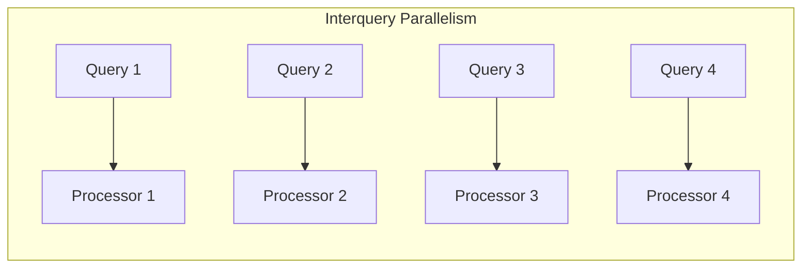
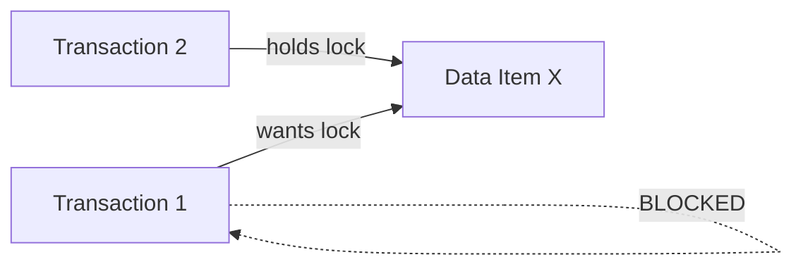

# Interquery Parallelism

# Definition

**Interquery parallelism** is a form of parallelism where **different queries/transactions execute in parallel** with each other on separate processors

Each query runs on a single processor, but **mult**i**ple queries run simultaneously** across the system

---

# Key Concept

- **One query = One processor**
- **Multiple queries = Multiple processors working in parallel**
- Increase **transaction throughput** (queries per second)
- Does **NOT** speed up individual queries

---

# Primary Purpose

**Increase system throughput =** number of transactions completed per unit time

$$
\text{Throughput}=\frac{\text{Number of Tranactions}}{\text{Time}}
$$

With $n$ processors running queries in parallel:

- **Ideal throughput increase: $n\times \text{more queries per second}$**
- **Individual query time:** unchanged

---

# When to Use Interquery Parallelism

| Scenario | Best Parallelism Type |
| --- | --- |
| Many short OTLP transactions | **Interquery** |
| Few long analytical queries | Intraquery |
| Mixed workload | Both |
| High user concurrency | **Interquery** |

**OLTP workloads** (banking, retail, reservations) benefit most from interquery parallelism

---

# Challenges of Interquery Parallelism

1. **Concurrency Control**

Multiple transactions accessing shared data simultaneously creates conflicts

**Problem:**

- Lost updates
- Dirty reads
- Inconsistent analysis

**Solutions:**

- Locking protocols (2PL)
- Timestamp ordering
- Optimistic concurrency control
1. **Lock Contention**

High contention reduces effective parallelism

1. **Distributed Deadlocks**

In shared-nothing systems, deadlocks can span multiple nodes

**Example:**

- $T_1$ holds lock on Node $A$, wants lock on Node $B$
- $T_2$ holds lock on Node $B$, wants lock on Node $A$
- **Deadlock!**

---

# Interquery Parallelism in Different Architectures

| Architecture | Interquery Support | Notes |
| --- | --- | --- |
| Shared Memory | Easy | All processors see same data |
| Shared Disk | Good | Need distributed lock manager |
| Shared Nothing | Good | Need distributed concurrency control |

---

# Scalability

**Interquery parallelism** scales **well** for independent queries:

| Processors | Throughput (ideal) |
| --- | --- |
| 1 | $T$ |
| 2 | $2T$ |
| 4 | $4T$ |
| $n$ | $nT$ |

**Limiting factors:**

- Lock contention on hot data
- Shared resource bottlenecks (disk I/O, network)
- Coordination overhead

---

# Transaction Processing with Interquery Parallelism

**ACID Properties Must Be Maintained**

Even with parallel execution, each transaction must be:

- **Atomic** - all or nothing
- **Consistent** - database remains valid
- **Isolated** - transactions don’t interfere
- **Durable** - committed changes persist

**Serializability**

Parallel execution must produce results equivalent to **some serial order**

---

# Key Metrics

| Metric | Definition | Interquery Impact |
| --- | --- | --- |
| **Throughput** | Queries completed per second | **Increased** |
| **Response Time** | Time for single query | No change |
| **Latency** | Time until query starts | May increase (queueing) |
| **Scalability** | Performance vs processors added | Good for independent queries |

---

# Advantages of Interquery Parallelism

1. **Increases throughput** - more transactions per second
2. **Simple implementation** - no query decomposition needed
3. **Good for OLTP** - handles many concurrent users
4. **Scales naturally** - add processors, handle more queries
5. **No synchronization within query** - each query runs independently

---

# Disadvantages of Interquery Parallelism

1. **No speedup for individual queries** - single query still uses one processor
2. **Lock contention** - hot data creates bottleneck
3. **Deadlock potential** - multiple transactions competing for resources
4. **Concurrency control overhead** - must ensure serializability 
5. **Not suitable for complex analytical queries** - need intraquery for those

---

# Common Exam Questions

1. **“What is interquery parallelism?” $\rarr$** Different queries running in parallel on different processors
2. **“What does interquery parallelism improve?”** $\rarr$ **Throughput** (NOT response time of individual queries)
3. **“Interquery vs Intraquery - when to use which?” $\rarr$** Interquery for many short queries (OLTP), Intraquery for few long queries (OLAP)
4. **“What are the challenges?” $\rarr$** Concurrency control, lock contention, distributed deadlocks
5. **“Can you combine both types?” $\rarr$** Yes, modern systems use both simultaneously