# Intraquery Parallelism

# Definition

**Intraquery parallelism** is a form of parallelism where a **single query is executed in parallel** across multiple processors by breaking it into smaller tasks

The goal is to **reduce response time** for individual queries, especially complex ones

---

# Key Concept

- **One query = Multiple Processors**
- Reduces **response time** for complex queries
- Essential for **decision support / OLAP** workloads

---

# Two Types of Intraquery Parallelism

1. **Intraoperation Parallelism**

Parallelism **within a single operation** (e.g., a single `SELECT`, `JOIN` or `SORT`).

**Example:** Parallel table scan

- Relation partitioned across $n$ disks
- Each processor scans its partition simultaneously
- Results merged

1. **Interoperation Parallelism**

Parallelism **between different operations** in a query plan

**Two sub-types:**

- **Pipelined parallelism:** Output of one operation feeds directly into next
- **Independent parallelism:** Unrelated operations run simultaneously

```mermaid
flowchart LR
    subgraph "Independent Parallelism"
        S1["Scan R"] --> J["Join R ⋈ S"]
        S2["Scan S"] --> J
    end
```

---

# Intraoperation vs Interoperation

| Aspect | Intraoperation | Interoperation |
| --- | --- | --- |
| Parallelism within | Single operation | Multiple operations |
| Scalabilty | High (scales with data) | Limited by query structure |
| Example | Parallel scan, parallel join | Pipeline, independent scans |
| Speedup potential | High | Moderate |

# Parallel Scan

Given: Relation $R$ partitioned across 4 disks

**Sequential scan:** Read all 4 partitions one by one $\rarr$ Time = 4 units

**Parallel scan:** Each processor reads it partition simultaneously $\rarr$ Time = 1 unit

$$
\text{Speedup}=\frac{\text{Sequential Time}}{\text{Parallel Time}}=\frac{4}{1}=4
$$

---

# Speedup and Scaleup

## Speedup

**Definition:** How much fast a query runs with more processors

$$
\text{Speedup}=\frac{\text{Time with 1 processor}}{\text{Time with }n\text{ processors}}
$$

**Ideal (linear) speedup: $\text{Speedup} =n\text{ with }n \text{ processors}$**

## Scaleup

**Definition:** Ability to handle larger problems with more resources

$$
\text{Scaleup}=\frac{\text{Problem size with }n \text{ processors}}{\text{Problem size with 1 processor}}
$$

**Ideal scaleup:** Handle $n\times$more data with $n$ processors in same time

---

# Factors Limiting Speedup

1. **Startup Cost**
    
    Time to initiate parallel operations:
    
    - Process creation
    - Communication setup
    - Task distribution
2. **Interference**
    
    Contention for shared resources:
    
    - Memory bus
    - Disk I/O bandwidth
    - Network
3. **Skew**
    
    **Uneven distribution of work** among processors
    
    **Types of skew:**
    
    - **Attribute-value skew:** Some values much more common
    - **Partition skew:** Unequal partition sizes
    - **Execution skew:** Some tasks take longer

**Result:** System waits for slowest processor $\rarr$ poor speedup

---

# Effect of Skew

**Without skew (balanced):**

- 4 processors, 1000 tuples each
- Each finishes in 10 sec
- Total time: 10 sec
- Speedup: 4

**With skew (unbalanced):**

- 3 processors, 100 tuples each (finish in 1 sec)
- 1 processors: 3700 tuples (finishes in 37 sec)
- Total time: 37 sec (waiting for slowest)
- Speedup $\frac{40}{37}\approx1.08$ (terrible!)

---

## Parallel Selection $(\sigma)$

### Point query on partitioning attribute

- Hash/Range: Only 1 processor works
- Round-robin: All processors work

### Range query on partitioning attribute

- Range: Few processors (those with relevant ranges)
- Hash/Round-robin: All processors

## Parallel Sort

[Parallel ](Intraquery%20Parallelism/Parallel%202e57c6b7cc2f8047929cf776ae850c3f.md)

Two main approaches:

### Range-Partitioning Sort

1. **Redistribute by range on sort attribute**

1. **Each processors sort locally**

1. **Concatenate results (trivial merge!)**

---

### Parallel External Sort-Merge

1. **Each processors sorts local data**

1. **Merge sorted runs across processors**

