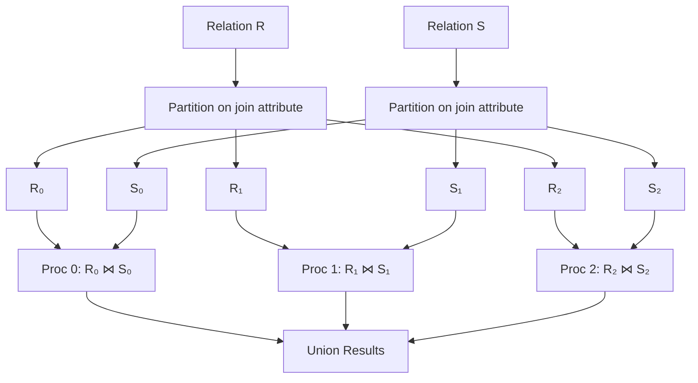
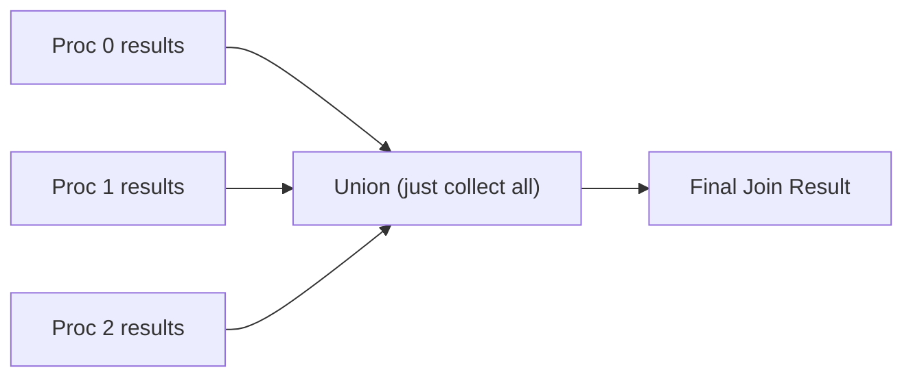
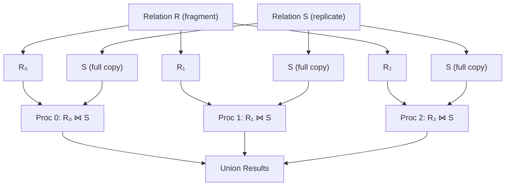

# Parallel Join

**Parallel join** computes the join of two relation $(R\bowtie S)$ by distributing the work across multiple processors, enabling faster execution of this expensive operation

Join is often the **most expensive operation** in query processing - parallelisation is crucial

---

# Two Main Approaches

| Approach | Use Case | Key Requirement |
| --- | --- | --- |
| Partitioned Parallel Join | Equi-joins | Same partitioning on join attribute |
| Fragment-and-Replicate Join | Non-equi joins, any condition | One relation replicated |

---

# Partitioned Parallel Join

## Concept

Both relations are partitioned on the **join attribute** using the **same partitioning function**

## Why It Works

**Key insight:** If $R$ and $S$ are partitioned with the same function on the join attribute:

- Matching tuples are **guaranteed to be in the same partition**
- $R_0$ tuples can only join with $S_0$ tuples
- No cross-partition comparisons needed!

## Algorithm Steps

1. **Partition $R$** on join attribute using hash/range
2. **Partition $S$** on join attribute using **same function**
3. **Each processor compute local join: $R_i\bowtie S_i$**
4. **Union all results**

---

## Slide Example: Partitioned Parallel Join with Hash

**Given:**

- $R(A,B)$ and $S(B,C)$ - join on attribute B
- 3 processors
- Hash function: $h(B)=B\mod3$

### Step 1: Partition both relations

| R tuples | B value | h(B) mod 3 | Partition |
| --- | --- | --- | --- |
| (1, 4) | 4 | 1 | R₁ |
| (2, 6) | 6 | 0 | R₀ |
| (3, 9) | 9 | 0 | R₀ |

| S tuples | B value | h(B) mod 3 | Partition |
| --- | --- | --- | --- |
| (4, 10) | 4 | 1 | S₁ |
| (6, 20) | 6 | 0 | S₀ |
| (9, 30) | 9 | 0 | S₀ |

### Step 2: Local joins (parallel)

- Proc 0: $R_0\bowtie S_0=\{(2,6)\bowtie(6,20),(3,9)\bowtie(9,30)\}$
- Proc 1: $R_1\bowtie S_1=\{(1,4)\bowtie(4,10)\}$
- Proc 2: $R_2\bowtie S_2=\{\} \text{ (empty)}$

### Step 3: Union results

| A | B | C |
| --- | --- | --- |
| 2 | 6 | 20 |
| 3 | 9 | 30 |
| 1 | 4 | 10 |

---

## Partitioning Strategies for Join

### Hash Partitioning (most common)

$$
⁍
$$

**Pros:** Good load balancing for uniform data 

**Cons:** Sensitive to skew in join attribute values

### Range Partitioning

Both relations partitioned using **same range vector** on join attribute.

**Pros:** Works well if data already range-partitioned

**Cons:** Requires coordinated partition vectors

---

# 2. Fragment-and-Replicate Join

**When to Use**

- **Non-equi joins** (e.g., $R.A>S.B$)
- **Joins without equality** on partitioning attribute
- When partitioned join is not possible

**Concept**

**Algorithm**

1. **Fragment** one relation $(R)$ across processors
2. **Replicate** the other relation $(S)$ to all processors
3. Each processor computes: $R_i\bowtie S$ (full copy)
4. Union results

**Which Relation to Replicate?**

**Replicate the smaller relation** to minimize communication cost

$$
\text{Communication cost}=|S|\times (n-1)
$$

Where $|S|=$ size of replicated relation, $n=$ number of processors

---

## Slide Example: Fragment-and-Replicate

**Given: $R\bowtie S$** where join condition is $R.A>S.B$ (non-equi join)

- $R$ has 1000000 tuples
- $S$ has 1000 tuples
- 4 processors

**Strategy:** Fragment $R$, replicate $S$ (smaller)

| Processor | $R$ fragment | $S$ copy | Computes |
| --- | --- | --- | --- |
| Proc 0 | $R_0$ (250K) | $S$ (1K) | $R_0\bowtie S$ |
| Proc 1 | $R_1$ (250K) | $S$ (1K) | $R_1\bowtie S$ |
| Proc 2 | $R_2$ (250K) | $S$ (1K) | $R_2\bowtie S$ |
| Proc 3 | $R_3$ (250K) | $S$ (1K) | $R_3\bowtie S$ |

**Communication: $S$** replicated ****3 times (to 3 other processors)

---

# Cost Analysis

## Partitioned Parallel Join

**Redistribution cost:**

$T_{redistribute}=\frac{∣R∣+∣S∣}{n} \text{ (communication)}$

**Local join cost (per processor):**

$T_{local}=\text{Cost of joining } \frac{∣R∣}{n} \text{ with } \frac{∣S∣}{n}$

**Total (ideal):**

$T_{total}=T_{redistribute}+T_{local}$

## Fragment-and-Replicate

**Replication cost:**

$T_{replicate}=∣S∣\times(n−1) \text{ (send S to all processors)}$

---

## Common Exam Questions

1. **"What must be true for partitioned parallel join?"** → Both relations partitioned on join attribute with **same partitioning function**
2. **"When is fragment-and-replicate used?"** → Non-equi joins or when partitioned join not possible
3. **"Which relation should be replicated?"** → The **smaller** relation (minimize communication)
4. **"Why can't partitioned join work for R.A > S.B?"** → No way to partition such that matching tuples co-locate
5. **"What is the advantage of partitioned join?"** → No cross-partition comparisons, scales well
6. **"What causes skew in parallel join?"** → Uneven distribution of join attribute values