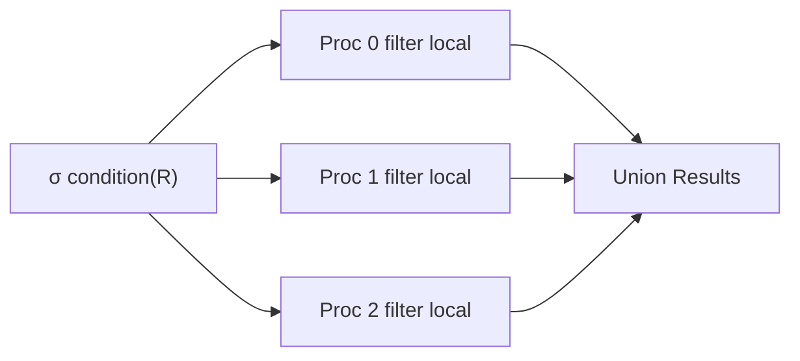

# Parallel Selection

# Definition

**Parallel selection** executes a `SELECT` query (σ condition) across multiple processors simultaneously, with each processor filtering its local partition.

---

# How It Works

Each processor applies the selection condition to its partition → results combined.

---

# Performance by Partitioning Strategy

| Query Type | Hash | Range | Round-Robin |
| --- | --- | --- | --- |
| **Point query on attribute** | 1 disk | 1 disk | $n$ disks |
| **Range query on attribute** | $n$ disks | 1-few disks | $n$ disks |
| **Query on non-partition attribute** | $n$ disks | $n$ disks | $n$ disks |

---

## Cost Formula

**Best case (point query, hash/range on partition attr):**

$$
T=\frac{m}{1}=m \text{ (single processor)}
$$

**Worst case (all processors):**

$$
T=\frac{n}{m} \text{ (parallel scan)}
$$

Where m = tuples to scan, n = number of processors

---

# Common Exam Questions

1. **"How many disks are accessed for point query with hash partitioning?"** → 1
2. **"Why is range partitioning best for range queries?"** → Only relevant range partitions accessed
3. **"When must all processors be used?"** → Non-partition attribute queries, or round-robin