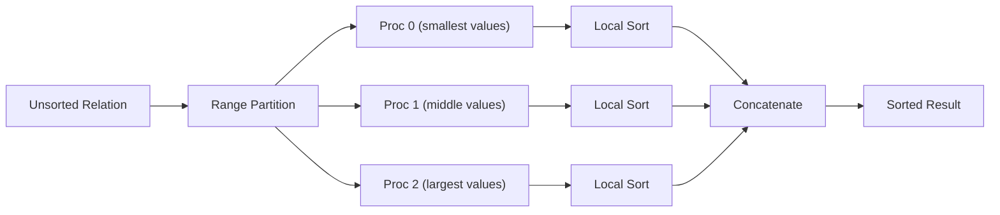
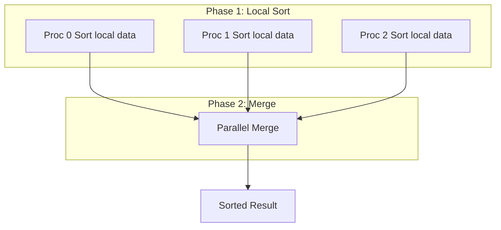

# Parallel Sort

# Definition

**Parallel sort** is the process of sorting a large relation by distributing the sorting work across multiple processors, with the goal of reducing the total sorting time

Sorting is fundamental to many database operations: `ORDER BY`, merge-join, duplicate elimination and aggregation

 

---

# Why Parallel Sort Matters

- Sorting is **expensive: $O(n\log n)$** complexity
- Large relation may not fit in memory $\rarr$ external sort needed
- Parallel sort can achieve **near-linear speedup** with proper partitioning
- Essential for **parallel merge-join** and `ORDER BY` on large tables

---

# Two Main Approaches

| Approach | Key Idea | Final Merge |
| --- | --- | --- |
| Range-Partitioning Sort | Partition by value ranges, sort locally | Concatenation (trivial) |
| Parallel External Sort-Merge | Sort locally first, then merge across processors | Complex merge required |

# Range-Partitioning Sort

## Algorithm

**Steps**

1. **Choose partitioning attribute** (the sort key)
2. **Create range-partition vector $[v_0,v_1,...,v_{n-2}]$** for $n$ processors
3. **Redistribute tuples** to appropriate processors based on ranges
4. **Each processor sorts locally** (in parallel)
5. **Concatenate results** - no complex merge needed!

## Slide Example: Range-Partitioning Sort

Given:

- Unsorted relation with values: $\{15,3,8,22,1,17,6,12,9,25,4,19\}$
- 3 processors
- Partitioning vector: $[10,20]$

### Step 1: Range Partition

| Range | Processor | Values Received |
| --- | --- | --- |
| $x\le10$ | Proc 0 | $3,8,1,6,9,4$ |
| $10<x\le20$ | Proc 1 | $15,17,12,19$ |
| $x>20$ | Proc 2 | $22,25$ |

### Step 2: Local sort (parallel)

| **Processor** | After Local Sort |
| --- | --- |
| Proc 0 | $1,3,4,6,8,9$ |
| Proc 1 | $12,15,17,19$ |
| Proc 2 | $22,25$ |

### Step 3: Concatenate

Final sorted result: $1,3,4,6,8,9,12,15,17,19,22,25$

---

# Parallel External Sort-Merge

### Algorithm

**Steps**

1. **Each processor sorts its local partition** independently
2. **Merge sorted runs** from all processors

### Merge Strategies

**Option A: Sequential merge at one node**

- One processor collects all sorted runs
- Performs k-way merge
- Bottleneck: single processor does all merge work

**Option B: Parallel merge**

- Redistribute sorted data by ranges
- Each processor merges its range
- Better parallelism

## Comparison: Range-Partition Sort vs External Sort-Merge

| Aspect | Range-Partition Sort | External Sort-Merge |
| --- | --- | --- |
| Redistribution | Before sorting | After sorting (or during merge) |
| Local sort | On range-partitioned data | On original partitions |
| Final merge | **Trivial (concatenation)** | Complex k-way merge |
| Communication | Initial redistribution | Redistribution for merge |
| Skew sensitivity | High (depends on vector) | Lower |
| Best when | Good partitioning vector known | Data already partitioned |

## Cost Analysis

### Range-Partitioning Sort

**Phase 1: Redistribution**

$$
⁍
$$

**Phase 2: Local Sort**

$$
⁍
$$

**Phase 3: Concatenation**

$$
⁍ (trivial)
$$

**Total (ideal):**

$$
⁍
$$

### Speedup

**Ideal speedup:**

$$
⁍
$$

(Near-linear speedup with p processors)

## Common Exam Questions

1. **"Describe range-partitioning sort algorithm"** → Partition by ranges, local sort, concatenate (no merge needed)
2. **"Why is final merge trivial in range-partition sort?"** → All values in partition i < all values in partition i+1
3. **"How do you choose a good partitioning vector?"** → Sampling or histogram-based to ensure equal distribution
4. **"What is the main advantage of range-partition sort?"** → Trivial final merge (just concatenation)
5. **"What causes skew in parallel sort?"** → Uneven value distribution, poor partition vector choice
6. **"Compare range-partition sort vs external sort-merge"** → Range: redistribute first, trivial merge; External: sort first, complex merge