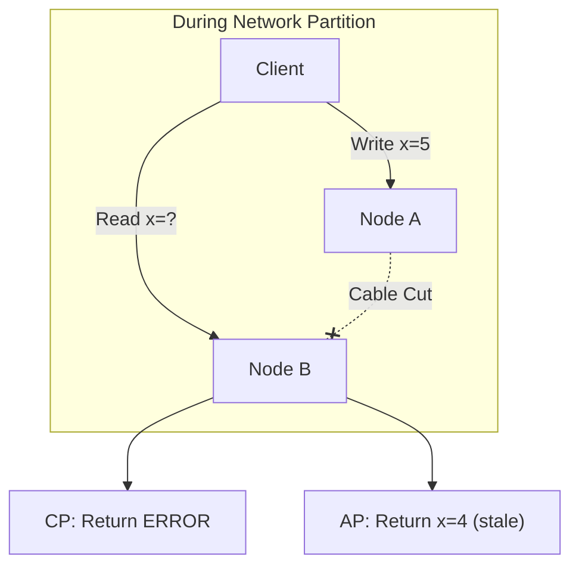

# CAP Theorem

> **Core insight:** In a distributed system, you can only guarantee two of three properties: Consistency, Availability, Partition Tolerance.

---

## Definitions

| Term | Meaning |
|------|---------|
| **Consistency (C)** | All nodes see the same data at the same time |
| **Availability (A)** | Every request gets a response (not an error) |
| **Partition Tolerance (P)** | System works despite network failures between nodes |

---

## The Three Options

### CA — Consistency + Availability (No Partition Tolerance)

```
Single database server, or all nodes on same reliable network
```

- ✅ Always consistent
- ✅ Always available
- ❌ If network fails, system fails completely
- **Use when:** You can guarantee network never partitions (single machine, same rack)

> **Example:** Traditional single-server relational database. No network partition possible because there's only one node.

**Reality:** In distributed systems, network partitions *will* happen eventually. CA only works for non-distributed setups.

---

### CP — Consistency + Partition Tolerance (Sacrifice Availability)

```
During partition: refuse to answer rather than give stale data
```

- ✅ Data is always correct
- ✅ Survives network failures
- ❌ Returns errors during partitions
- **Use when:** Wrong data is worse than no data

> **Example:** Bank account balances. If Node B can't verify the current balance, it's better to return an error than risk approving a transaction that overdraws.

**Systems:** ZooKeeper, etcd, traditional RDBMS with synchronous replication

---

### AP — Availability + Partition Tolerance (Sacrifice Consistency)

```
During partition: serve stale data rather than fail
```

- ✅ Always responds
- ✅ Survives network failures
- ❌ Data might be outdated
- **Use when:** Stale data is acceptable, downtime is not

> **Example:** Twitter timeline. Showing tweets from 30 seconds ago is fine; showing an error page is not.

**Systems:** Cassandra, DynamoDB, CouchDB

---

## 🧠 Reasoning Chain: "What happens during a partition?"

### Normal Operation (No Partition)

```
Client writes x=5 to Node A
Node A syncs to Node B
Client reads from Node B → gets x=5
✅ Both consistent AND available
```

### During a Partition (Network Split)

```
Client writes x=5 to Node A
Node A cannot reach Node B (cable cut)
Client reads from Node B → ???
```

Node B has two choices:

| Choice | Response | Trade-off |
|--------|----------|-----------|
| **CP** | "ERROR: Cannot verify data" | Consistent but unavailable |
| **AP** | "x=4 (last known)" | Available but stale |

---

## Visual



---

## Key Insights

> ⚠️ **CAP only matters during partitions.** In normal operation, you can have all three.

> ⚠️ **Partition tolerance is non-negotiable in distributed systems.** Networks fail. The real choice is between C and A.

> ⚠️ **CA is only possible on a single machine.** Once you distribute across a network, you must plan for partitions.

---

## Summary Table

| Choice | Consistency | Availability | Partition Tolerance | Best For |
|--------|-------------|--------------|---------------------|----------|
| **CA** | ✅ | ✅ | ❌ | Single-node databases |
| **CP** | ✅ | ❌ | ✅ | Banking, inventory, coordination |
| **AP** | ❌ | ✅ | ✅ | Social media, caching, CDNs |

---

## Real-World Examples

| System | Choice | Why |
|--------|--------|-----|
| Bank transfers | CP | Wrong balance = legal liability |
| Shopping cart | AP | Stale cart < checkout failing |
| Stock trading | CP | Wrong price = real losses |
| Twitter feed | AP | Old tweets < app crashing |
| Medical records | CP | Wrong data = patient safety |
| DNS | AP | Slow resolution < no resolution |
| ZooKeeper | CP | Coordination requires consistency |
| Cassandra | AP | High availability for writes |

---

## Exam Template: CP or AP?

```
1. Cost of wrong data?
   → High (money/safety/legal) → CP
   → Low (inconvenience) → AP

2. Cost of downtime?
   → High (revenue/minute) → AP
   → Low (users can retry) → CP

3. Is it truly distributed?
   → No (single node) → CA is possible
   → Yes → Choose between CP and AP
```
