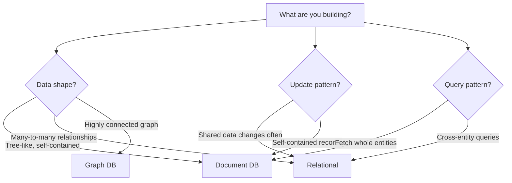
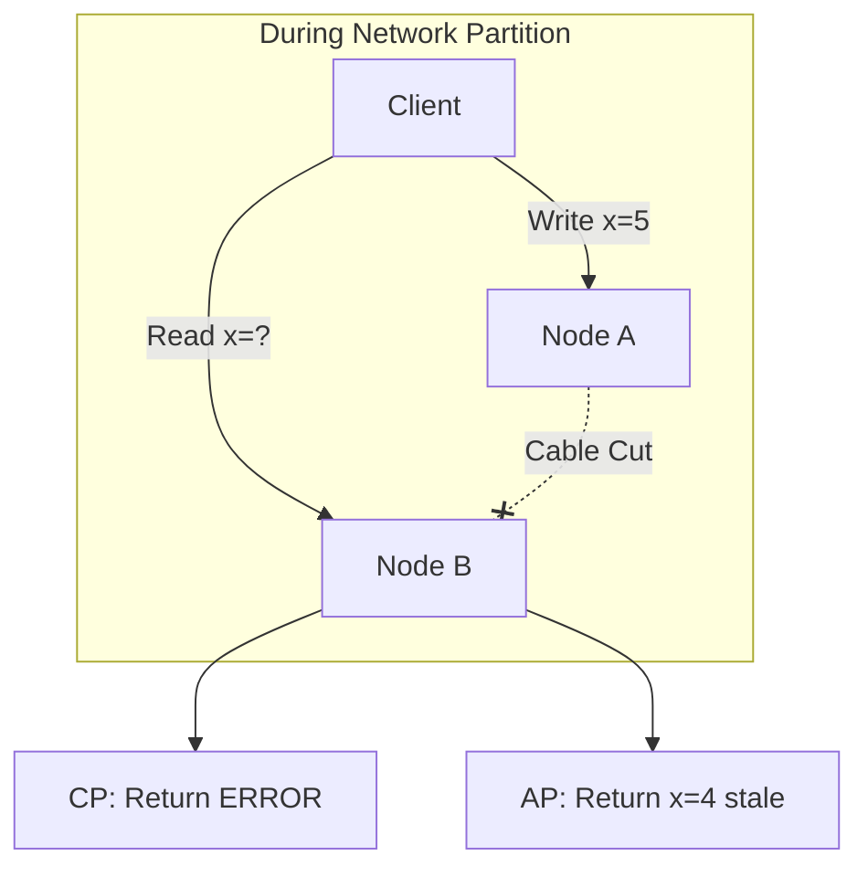
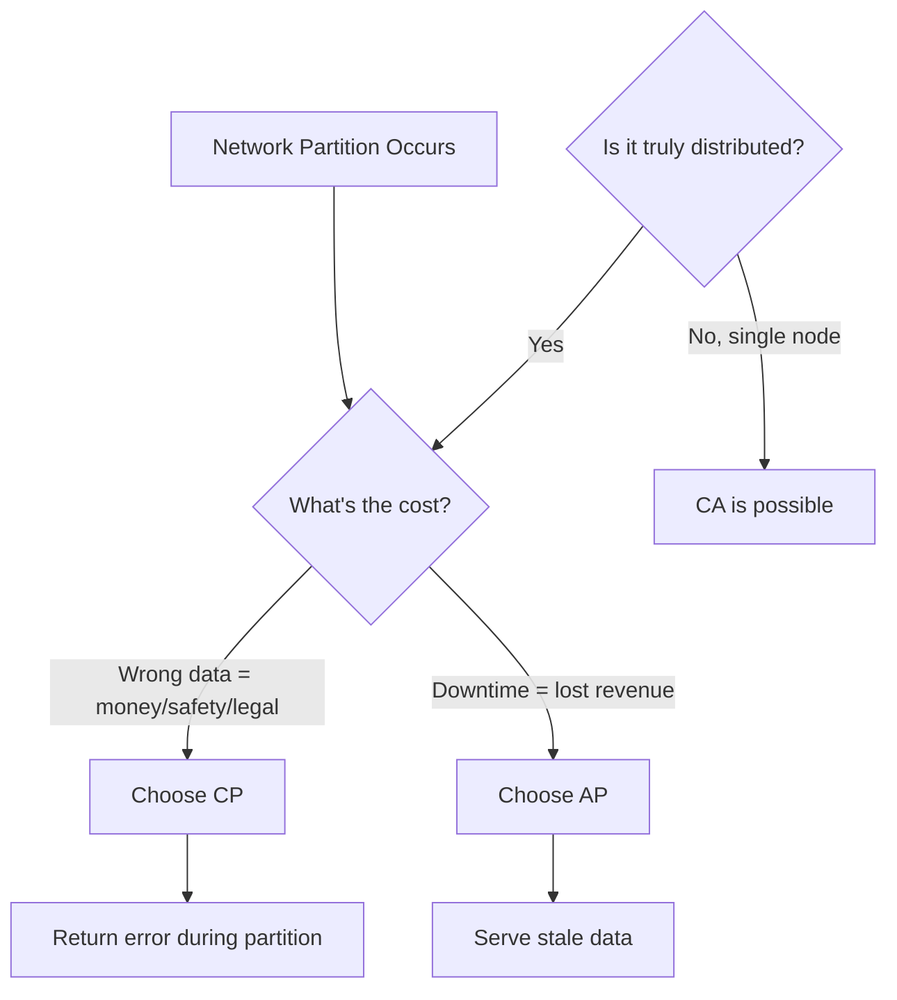

# Foundations of Data Systems

## Definitions

| Term | Definition |
|------|------------|
| **Data-Intensive Application** | Applications where the primary challenge is data (quantity, complexity, speed), not CPU cycles |
| **Reliability** | System works correctly even when facing faults |
| **Scalability** | Ability to cope with increased load |
| **Maintainability** | Ease of modification and operation |
| **Latency** | Time a request waits before processing begins |
| **Response Time** | Total time from request to response (latency + processing) |
| **Throughput** | Operations processed per second |
| **ACID** | Atomicity, Consistency, Isolation, Durability (relational DB guarantees) |
| **BASE** | Basically Available, Soft-state, Eventually consistent (NoSQL philosophy) |

## Goals

Data-intensive applications should be:
- **Reliable** — Continue working correctly despite hardware, software, or human faults
- **Scalable** — Handle growth in data volume, traffic, or complexity
- **Maintainable** — Remain easy to operate, understand, and evolve

These goals often conflict. Maximizing reliability (triple redundancy everywhere) hurts maintainability and cost. Good architecture means finding the right tradeoffs for your specific situation.

---

## 1. The Nature of Data Systems

### Data-Intensive vs Compute-Intensive

Traditional applications were **compute-intensive**—CPU cycles were the bottleneck. Modern applications are increasingly **data-intensive**—the data itself is the challenge.

This shift is characterized by the **5Vs of Big Data**:

- **Volume** — Sheer quantity. Companies now deal with petabytes of user activity logs.
- **Velocity** — Speed of change. Stock prices update milliseconds apart; IoT sensors stream continuously.
- **Variety** — Format complexity. Structured tables sit alongside unstructured text, images, and JSON.
- **Veracity** — Trustworthiness. Sensor data is noisy; user-generated content is unreliable.
- **Value** — Business utility. Raw data is worthless without the ability to extract actionable insights.

### Building Blocks

A data system is rarely one tool—it's a composition of components stitched together by application code:

- **Databases** store data persistently
- **Caches** speed up expensive operations (in-memory stores like Redis)
- **Indexes** enable efficient search (full-text search, B-trees)
- **Stream Processing** handles messages asynchronously (Kafka, RabbitMQ)
- **Batch Processing** crunches accumulated data periodically (Hadoop, Spark)

---

## 2. Reliability — Surviving Failure

A reliable system continues working correctly even when things go wrong. The key insight: **you cannot prevent all faults**. Instead, you design systems that tolerate them gracefully.

A *fault* is when a component deviates from spec. A *failure* is when the system as a whole stops working. The goal is fault-tolerance: **preventing faults from becoming failures**.

### Hardware Faults

These are the classic concerns—disks crash, memory corrupts, power fails.

> Hard disks have a Mean Time To Failure (MTTF) of 10-50 years. That sounds reliable, but with 10,000 disks in a data center, statistically **one will die every day**.

**The solution is redundancy.** RAID arrays mirror data across multiple disks so one can fail without data loss. Cloud providers replicate across Availability Zones—if an entire data center loses power, traffic automatically fails over to another region.

### Software Faults

Software faults are more insidious because they're **correlated**—the same bug affects every instance simultaneously.

> **2012 Leap Second Bug:** A bug in the Linux kernel caused servers to lock up when processing an extra leap second. Reddit, Mozilla, and Foursquare all went down—not because hardware failed, but because every server ran the same buggy code at the same moment.

**Mitigation strategies:** Process isolation (one crash doesn't kill the whole system), thorough testing at all levels, and gradual rollouts that catch problems before they hit everyone.

### Human Error

Studies consistently show that configuration mistakes cause more outages than hardware or software failures. **Humans are the weakest link.**

> **2017 AWS S3 Outage:** An Amazon engineer ran a debugging command with the wrong parameter, accidentally removing a large set of servers. This took down S3 for hours. Thousands of websites—including Slack, Trello, and the SEC—went offline because of one typo.

**Design for human fallibility:** Configuration interfaces that reject illegal values, staging environments to test changes before production, and easy rollback mechanisms when things go wrong.

---

## 3. Scalability — Handling Growth

Scalability isn't a binary property ("this system is scalable"). It's about answering a specific question: **"If our load increases in a particular way, what resources do we need to handle it?"**

### Describing Load

To discuss scalability, you first need **load parameters**—the numbers that describe your workload. These are domain-specific:

- For a web server: requests per second
- For a database: ratio of reads to writes
- For a chat application: number of simultaneously active users
- For Twitter: number of followers per user (this turns out to be critical)

### Case Study: Twitter's Home Timeline

This is the classic example of how load parameters drive architecture decisions.

Twitter has two main operations:
- **Post Tweet**: A user writes a tweet (~4,600/sec on average)
- **Home Timeline**: A user views their feed (~300,000/sec on average)

Reads outnumber writes 65:1. This asymmetry is the load parameter that matters most.

**The Naive Approach (Pull Model)**

The obvious solution: when someone posts a tweet, insert it into a global tweets table. When someone loads their timeline, query for all tweets from people they follow:

```sql
SELECT * FROM tweets 
WHERE author_id IN (SELECT followee_id FROM follows WHERE follower_id = ?)
ORDER BY created_at DESC LIMIT 100
```

This is simple and writing is cheap (one insert). But reading is expensive—you're joining potentially millions of tweets, filtering, and sorting. At 300,000 timeline loads per second, the database melts.

**The Optimized Approach (Push Model)**

Flip the cost from reads to writes. Maintain a cache of each user's home timeline. When someone tweets, fan out that tweet to every follower's cached timeline.

Now reading is instant—just fetch the pre-computed list. But writing became expensive. When Justin Bieber (100 million followers) tweets, that's 100 million cache insertions. The write queue explodes.

**The Production Solution (Hybrid)**

Twitter uses a hybrid approach:
- For regular users: push (fan-out on write). Most people have few followers, so this is cheap.
- For celebrities: pull. Their tweets are fetched at read time and merged with the cached timeline.

This handles both the common case efficiently and the edge case without breaking.

### Scaling Strategies

When load increases, you have two fundamental options:

**Scale Up (Vertical Scaling)**

A bigger machine—more CPU, more RAM, faster disk. This is simpler because you avoid distributed system complexity, but it has a ceiling (you can't buy a machine with 1000 cores) and gets expensive fast at the high end.

**Scale Out (Horizontal Scaling)**

More machines sharing the load. This is theoretically unlimited—just add more servers. But it requires distributed system logic: how do you split data across machines? How do you handle failures? How do you maintain consistency?

> **In practice:** Most systems use both. Scale up until it's too expensive, then start scaling out. A database might run on a single powerful server until that maxes out, then add read replicas to distribute load.

### Measuring Performance

When discussing scalability, you need metrics. For online systems, the key metric is **response time**—how long users wait.

> **Don't use averages.** A single 30-second timeout can skew the arithmetic mean dramatically, hiding what most users actually experience.

Use **percentiles** instead:

| Percentile | Meaning |
|------------|--------|
| **p50** (median) | Half of requests are faster than this |
| **p95** | 95% of requests are faster |
| **p99** | The "tail latency" |

> **Why p99 matters:** Tail latency often affects your most valuable users—they have the most data, the most activity, the most complexity. Amazon found that a **100ms increase in response time cost 1% of sales**.

---

## 4. Maintainability — Developer Experience

Systems typically spend far more time being maintained than being built. The majority of software cost isn't initial development—it's ongoing operation, bug fixes, keeping it running, adapting to new requirements, and paying down technical debt.

Good design minimizes this pain through three principles:

### Operability

Make it easy for operations teams to keep the system running smoothly.

This means good monitoring with dashboards that show what's happening in real-time. Alerts that fire when disk usage hits 80%, not when it's full and the database has crashed. Automation for routine tasks. Clear documentation of dependencies and failure modes.

> **Practical Example:** Netflix uses chaos engineering (Chaos Monkey) to randomly kill production instances. This forces teams to build systems that handle failures gracefully. If your service can't survive a random server death, you find out in a controlled way rather than during a real outage.

### Simplicity

Make it easy for new engineers to understand the system.

Complexity accumulates over time. Some is inherent to the problem domain (essential complexity), but much comes from poor abstractions, tangled dependencies, and special cases (accidental complexity).

A well-designed system uses **abstraction** to hide implementation details. ORMs let developers work with objects instead of raw SQL. Message queues hide the complexity of reliable delivery. Good abstractions reduce accidental complexity.

> **Practical Example:** Stripe's API is famously simple to use despite handling billions in payments. Instead of exposing the complexity of payment processing (fraud detection, bank connections, currency conversion), they provide a clean interface: `stripe.charges.create({amount: 1000, currency: 'usd', source: token})`.

### Evolvability

Make it easy to change the system as requirements evolve.

Requirements always change. New features get added. Regulations change. Better technologies emerge. A well-designed system anticipates change through modular architecture, clean interfaces, and practices like schema migrations that can modify database structure without downtime.

> **Practical Example:** Facebook evolved from a PHP monolith to a microservices architecture over years. They used feature flags to gradually roll out changes, schema versioning to evolve their data model, and backwards-compatible APIs to avoid breaking mobile clients.

---

## 5. Architecture Evolution

Data system architecture has evolved through distinct eras:

| Era | Architecture | Characteristics |
|-----|--------------|----------------|
| **Mainframe** | Centralized | One big machine, terminals connected to it |
| **PC** | Client/Server | Desktop applications talking to database servers |
| **Web** | Three-tier | Browser clients, application servers, databases over internet |
| **Cloud** | As-a-Service | VMs on demand, managed DBaaS—no hardware management |

### Parallel vs Distributed

As systems scale, they move from single machines to multiple processors:

**Shared Memory**

Multiple processors sharing the same RAM. This is vertical scaling—one powerful machine.

**Shared Disk**

Multiple processors with their own memory sharing storage. Common in SANs.

**Shared Nothing**

Independent nodes connected only by network. Each has its own CPU, memory, and disk. This is horizontal scaling—the basis for modern distributed data systems.

> **Tradeoff:** Shared-nothing architectures are harder to program but scale further. Most cloud-native databases use this model.

---

## 6. Data Models

One of the most important design decisions is how to model your data.

### Mental Model

| Type | Think of it as... |
|------|-------------------|
| **Relational (SQL)** | Excel spreadsheet with strict columns |
| **Document (NoSQL)** | Folder of Word docs (each can differ) |

### Quick Comparison

| Aspect | Relational (SQL) | Document (NoSQL) |
|--------|------------------|------------------|
| Structure | Normalized tables | Denormalized JSON trees |
| Reads | JOINs across tables | Single document fetch |
| Updates | Change once -> everywhere | Update every copy |
| Schema | Strict (schema-on-write) | Flexible (schema-on-read) |
| Consistency | Strong (ACID) | Eventually consistent |

### Relational Model (SQL)

Relational databases organize data into **tables** with strict **schemas**. Every row has the same columns, defined in advance. Data is **normalized**—split into separate tables to avoid duplication, linked by foreign keys.

To build a complete record (like a user profile), you JOIN tables together. If someone's job title changes, you update it in one place and all references automatically reflect the change.

The downside is **impedance mismatch**: application code uses objects (nested, with methods), while databases use flat tables. ORMs bridge this gap but add complexity and can introduce subtle bugs.

**Example: Resume Builder (Relational)**

```sql
-- Tables
Users:     id=1, name="Alice"
Positions: user_id=1, title="Developer"
Education: user_id=1, school="MIT"

-- Query to build full profile
SELECT * FROM users 
JOIN positions ON users.id = positions.user_id
JOIN education ON users.id = education.user_id
WHERE users.id = 1
```

Relational databases provide **ACID guarantees**:
- **Atomicity**: Transactions are all-or-nothing
- **Consistency**: Database moves from one valid state to another
- **Isolation**: Concurrent transactions don't interfere
- **Durability**: Committed data survives crashes

### Document Model (NoSQL)

Document databases store data as self-contained **documents** (usually JSON). Each document can have different structure. Data is **denormalized**—everything needed is stored together, even if it means duplication.

Reading is fast—fetch one document, no joins. But if shared data changes (like a job title used by many documents), you must update every copy.

**Example: User Profile (Document)**

```json
{
  "id": 1,
  "name": "Alice",
  "positions": [{"title": "Developer"}],
  "education": [{"school": "MIT"}]
}
```

One fetch, no joins. But renaming "Developer" requires updating every document that contains it.

Document databases often trade consistency for availability, following **BASE principles**:
- **Basically Available**: System always responds
- **Soft-state**: State may change over time
- **Eventually Consistent**: Given time, all replicas converge

### The Update Problem

**Scenario:** 1000 users have job title "Software Developer". Company renames it to "Software Engineer".

```
SQL:
  UPDATE positions SET title = 'Software Engineer' 
  WHERE title = 'Software Developer'
  -> One query, done

Document:
  Find every document with that title, update each
  -> 1000 updates, error-prone
```

**Rule:** Shared data changes often -> SQL.

### Other NoSQL Types

**Key-Value Stores** (Redis, DynamoDB): Simplest model—keys map to values. Extremely fast for lookups by key, but no complex queries. Good for caching, sessions, simple counters.

**Graph Databases** (Neo4j): Optimized for highly connected data where relationships are as important as the entities themselves. Social networks, recommendation engines, fraud detection. Fast traversal of relationships, but hard to scale horizontally.

### Decision Flowchart



### Decision Matrix

| Scenario | Model | Reason |
|----------|-------|--------|
| User profiles, blogs | Document | Self-contained, fetched as whole |
| Banking, inventory | Relational | ACID transactions, data integrity |
| Social networks | Relational/Graph | Many-to-many relationships |
| Rapid prototyping | Document | Schema flexibility |
| Shared data updates | Relational | Update once, reflected everywhere |
| Sessions, caching | Key-Value | Fast lookups by key |

---

## 7. CAP Theorem

> **Core insight:** In a distributed system, you can only guarantee two of three properties: Consistency, Availability, Partition Tolerance.

### Definitions

| Term | Meaning |
|------|---------|
| **Consistency (C)** | All nodes see the same data at the same time |
| **Availability (A)** | Every request gets a response (not an error) |
| **Partition Tolerance (P)** | System works despite network failures between nodes |

### The Scenario

You have two database nodes, A and B, normally synchronized. A client writes data to Node A. Before A can sync to B, the network cable is cut.

Now a client tries to read from Node B. What should B do?



### The Three Options

**CA — Consistency + Availability (No Partition Tolerance)**
- Works only on a single machine or perfectly reliable network
- Example: Traditional single-server relational database
- Reality: In distributed systems, network partitions *will* happen eventually

**CP — Consistency + Partition Tolerance (Sacrifice Availability)**
- During partition: refuse to answer rather than give stale data
- Data is always correct, survives network failures
- Returns errors during partitions
- Use when: Wrong data is worse than no data
- Systems: ZooKeeper, etcd, traditional RDBMS with synchronous replication

> **Example:** Bank account balances. If Node B can't verify the current balance, it's better to return an error than risk approving a transaction that overdraws.

**AP — Availability + Partition Tolerance (Sacrifice Consistency)**
- During partition: serve stale data rather than fail
- Always responds, survives network failures
- Data might be outdated
- Use when: Stale data is acceptable, downtime is not
- Systems: Cassandra, DynamoDB, CouchDB

> **Example:** Twitter timeline. Showing tweets from 30 seconds ago is fine; showing an error page is not.

### Key Insights

- **CAP only matters during partitions.** In normal operation, you can have all three.
- **Partition tolerance is non-negotiable in distributed systems.** Networks fail. The real choice is between C and A.
- **CA is only possible on a single machine.** Once you distribute across a network, you must plan for partitions.

### Decision Framework



### Summary Table

| Choice | Consistency | Availability | Partition Tolerance | Best For |
|--------|-------------|--------------|---------------------|----------|
| **CA** | Yes | Yes | No | Single-node databases |
| **CP** | Yes | No | Yes | Banking, inventory, coordination |
| **AP** | No | Yes | Yes | Social media, caching, CDNs |

### Real-World Examples

| System | Choice | Why |
|--------|--------|-----|
| Bank transfers | CP | Wrong balance = legal liability |
| Shopping cart | AP | Stale cart < checkout failing |
| Stock trading | CP | Wrong price = real losses |
| Twitter feed | AP | Old tweets < app crashing |
| Medical records | CP | Wrong data = patient safety |
| DNS | AP | Slow resolution < no resolution |
| ZooKeeper | CP | Coordination requires consistency |
| Cassandra | AP | High availability for writes |

Most systems aren't purely CP or AP—they make different tradeoffs for different operations. A shopping site might be AP for product browsing but CP for checkout.