# Data Intensive Systems (DIS)
## KBH-SW7 E25
### 1. Foundation of Data Systems

The background image shows a large, modern, multi-story indoor atrium of a building, likely a university campus. There are several levels with balconies overlooking a central open area. The ground floor has various seating arrangements, including tables and chairs where people are sitting and working. Large windows at the far end let in natural light.

AALBORG UNIVERSITY

---

# Agenda

* Design of data systems
    - Design principles
    - Architecture
* Data model, storage and retrieval
* NoSQL

AALBORG UNIVERSITET
SIDE 2


---


# Data is Everywhere, Data is Massive

* Internet companies
    - Google, Facebook, LinkedIn, Twitter, ...
* Online businesses
    - Amazon, Ebay, Taobao, JD.com, Boozt, ...
* IoT systems and applications
    - Weather monitoring, smart transportation, personal healthcare, ...
* Traditional businesses in digital era
    - Danske Bank, McDonald, SAS, ...
* As the society is increasingly digitalized, more and more software applications are becoming data-intensive.

AALBORG UNIVERSITET
SIDE 3


---

# Data-intensive Applications

* Unlike compute-intensive applications having CPU cycles as the bottleneck, data-intensive applications have data as its primary challenge:
    * Quantity of data (Volume)
    * Complexity of data (Variety and Veracity)
    * Speed of data change (Velocity)
    * Data for good (Value)
> **5Vs of Big Data**

* Data-intensive applications should be
    * Scalable to support massive data and/or millions of users
    * Available (minimizing downtime) and operationally robust
    * Easy to maintain as requirements and technologies change

AALBORG UNIVERSITET
SIDE 4


---


# Data Systems

* Data systems are computer (hardware and software) systems that store, manage and process massive, often dynamic, data accessed by data-intensive applications.
* Building blocks (unnecessary to be all available in a single system)
    - Persistent storage (databases)
    - Specification of user requests (queries)
    - Efficient data search (indexes)
    - Reuse of the results of an expensive operation (caching)
    - Sending a message to be handled asynchronously (stream processing)
    - Periodically handle a big amount of accumulated data (batch processing)

AALBORG UNIVERSITET
SIDE 5


---


AALBORG UNIVERSITET
Figure from Martin Kleppmann
SIDE 6

# A Possible Data System Architecture

* The whole system may be built with different tools or available libraries
* They are stitched together via APIs called in application code
* To build such data systems, you need first to know the overall design principles
    * Reliability
    * Scalability
    * Maintainability

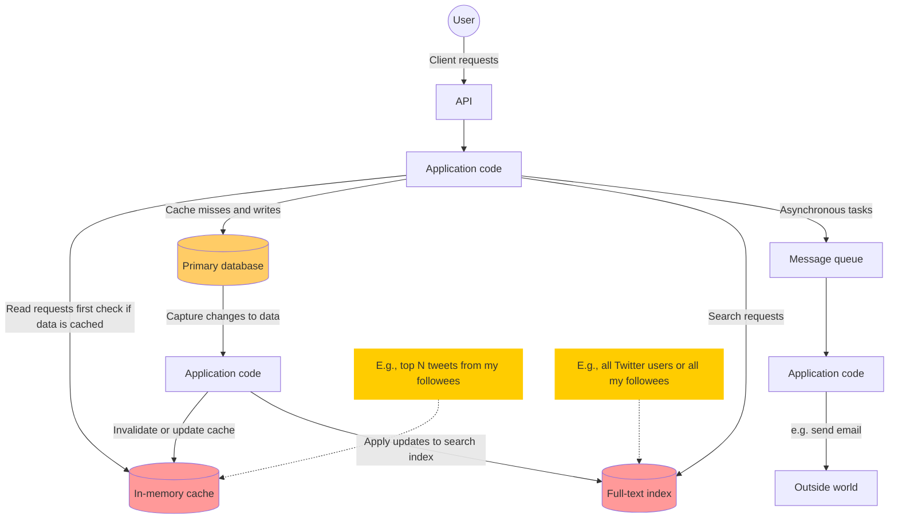

**Diagram Components and Flow Description:**

* **User Interaction:** A user sends client requests via an **API** to the main **Application code**.
* **Caching:** The application code first checks the **In-memory cache** (e.g., for top N tweets from followees) for read requests.
* **Primary Storage:** If there is a cache miss, the application code writes to and reads from the **Primary database**.
* **Data Synchronization:** Changes captured from the primary database are processed by background **Application code** to:
    * Invalidate or update the **In-memory cache**.
    * Apply updates to the **Full-text index**.
* **Search:** The main application code sends search requests to the **Full-text index** (e.g., to search all Twitter users or followees).
* **Asynchronous Processing:** The main application code offloads asynchronous tasks to a **Message queue**.
* **External Systems:** A separate **Application code** consumer processes messages from the queue to interact with the **"Outside world"** (e.g., sending an email).

---


# Reliability

* The system should continue to work correctly even in the face of adversity
    - Fault-tolerant or resilient
    - To prevent faults or to cure faults?
* Faults to be cured
    - Hardware faults: mostly are random and independent
    - Software errors: dependency and cascading failures are possible
    - Human errors: e.g., configuration error of a database
        - Good design that minimizes chance of errors
        - Decoupling and sandboxing
        - Thorough tests at all levels and automated testing
        - Quick and easy recovery
        - Clear and detailed monitoring
        - Good management practices and training

AALBORG UNIVERSITET
SIDE 7


---

# Scalability

* Scalability is the term to describe a system’s ability to cope with increased load.
    - We need a growth mindset: A system scalable today may not scale tomorrow due to more data to be collected.
* Describing the current load with load parameters
    - Different systems may have different sets of such parameters.
    - Consider Twitter and Danske Bank’s online banking.
* Describing performance
    - A load parameter increases with the same system resources, how is the performance affected?
    - When you increase a load parameter, how much do you need to increase the resources in order to keep the performance unchanged?

AALBORG UNIVERSITET
SIDE 8


---

# Load and Performance

* Load parameters
    - Web server: #requests per second
    - Database: ratio of reads to writes
    - Chatroom: #concurrent users
    - Cache: hit rate
    - Social network: more complicated

* Find out your
    - Average case -> overall performance
    - Extreme case -> bottleneck

* Performance metrics
    - **Throughput**
        - #operations per second
        - Mainly for batch processing
    - **Response time** (*client angle*)
        - The time elapse between a request and its response
        - Mainly for online processing
    - **Latency** (*service angle*)
        - Simplified: latency = response time
        - Strictly: the duration a request waits to be handled (network & queuing delay); response time = latency + processing time

AALBORG UNIVERSITET
SIDE 9


---

# Coping with Load

* Choose the appropriate system architecture
    - A generic, one-size-fits-all architecture does not exist
    - Your choice depends on your data and workloads
        - E.g., 10,000 1KB-sized requests per second vs. 3 2GB-sized requests per minute
        - Differentiate common and rare operations
* When the current system is too burdened, choose between scaling up and scaling out
* Manual scaling vs elastic scaling
    - An elastic system can automatically add or remove resources according to workload changes.

AALBORG UNIVERSITET
SIDE 10


---


# Scale-up vs Scale-out

* Demand for efficiency is the drive

<table>
  <thead>
    <tr>
        <th>Category</th>
        <th>Stage 1</th>
        <th>Transition</th>
        <th>Stage 2</th>
        <th>Transition</th>
        <th>Stage 3</th>
    </tr>
  </thead>
  <tbody>
    <tr>
        <td>Scale-Up</td>
<td>Small server icon</td>
<td>→</td>
<td>Medium server icon</td>
<td>→</td>
<td>Large server icon</td>
    </tr>
<tr>
        <td>Scale-Out</td>
<td>One server icon</td>
<td>→</td>
<td>Two server icons</td>
<td>→</td>
<td>Three server icons</td>
    </tr>
  </tbody>
</table>

AALBORG UNIVERSITET
SIDE 11


---

# Maintainability

* Maintaining a legacy system is painful.
    - Fixing bugs, investigating failures, adapting it to new platforms, modifying it for new use cases, adding new features, ...
* To hopefully minimize pain during maintenance, we should emphasize the following three principles:
    - Operability
        - Make it easy for operations teams to keep the system running smoothly.
    - Simplicity
        - Make it easy for new engineers to understand the system.
    - Evolvability
        - Make it easy for engineers to make changes to the system in the future.

AALBORG UNIVERSITET
SIDE 12


---

# Operability

* Data system designers can do a lot to make life easy for operations
    * Good monitoring: Providing visibility into the runtime behavior and internals of the system
    * Providing good support for automation and integration with standard tools
    * Avoiding dependency on individual machines (OK to take them down)
    * Providing good documentation and an easy-to-understand operational model (“If I do X, Y will happen”)
    * Providing good default behavior, but also giving administrators the freedom to override defaults when needed
    * Self-healing where appropriate, but also giving administrators manual control over the system state when needed
    * Exhibiting predictable behavior, minimizing surprises

AALBORG UNIVERSITET
SIDE 13


---


# Simplicity

* Symptoms of (over)complexity
    - Explosion of the state space
    - Tight coupling of modules
    - Tangled dependencies
    - Inconsistent naming and terminology
    - Many more...
* Reducing complexity greatly improves the maintainability
* Making a system simpler $\neq$ reducing its functionality
* Accidental complexity: not inherent in the problem that a system solves
* Abstraction: a great tool for removing accidental complexity
    - Computers and Software are full of abstractions at different levels
        - High-level programming languages hides the hardware details
        - SQL hides the physical design of databases

AALBORG UNIVERSITET
SIDE 14


---


# Evolvability

* "The only constant in life is change."---Heraclitus
* Data systems face many changes too
    - Changing requirements
    - Changing data and workloads
    - Changing hardware and platform
* The ease, with which we can modify a data system, is closely linked to its simplicity and abstractions
* Agile development in data systems -> evolvability
    - E.g., refactoring architecture according to changing requirements/workloads

AALBORG UNIVERSITET
SIDE 15


---

# Client/Server Databases

* C/S in different eras

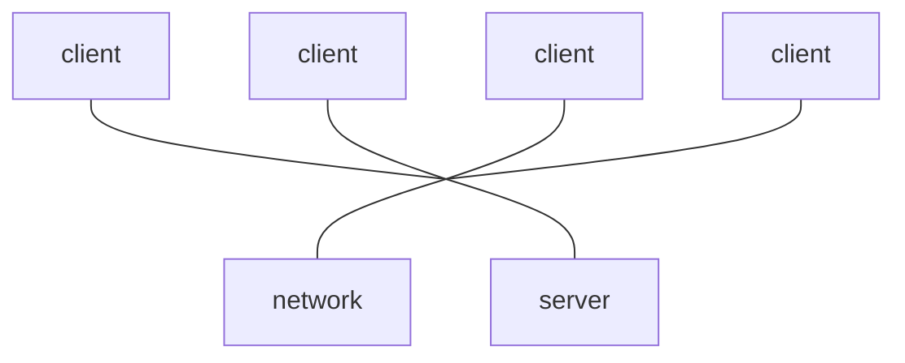

### (a) Mainframe Era
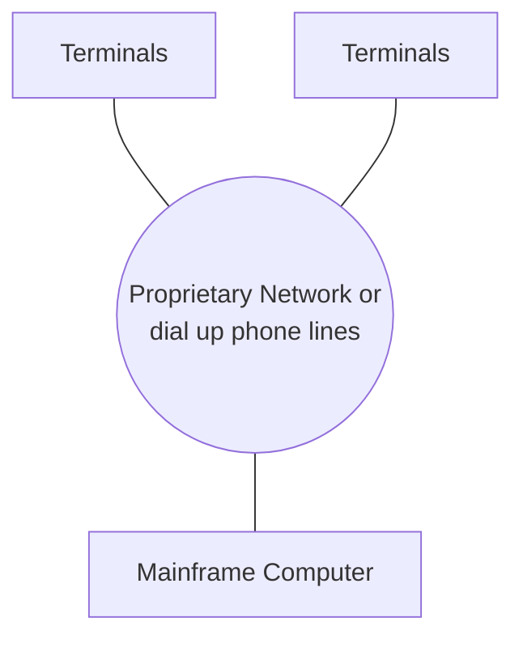

### (b) Personal Computer Era
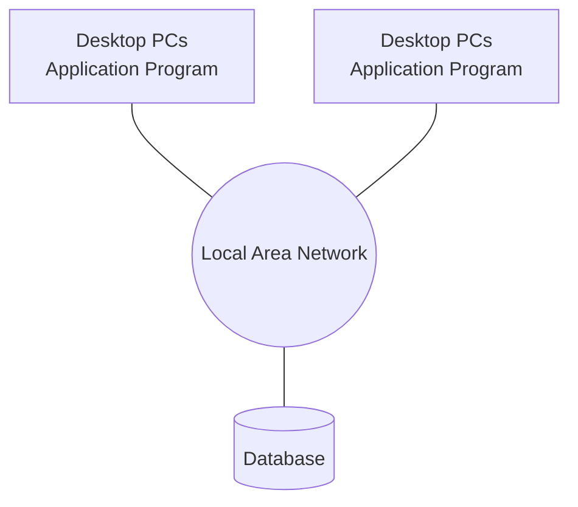

### (c) Web era
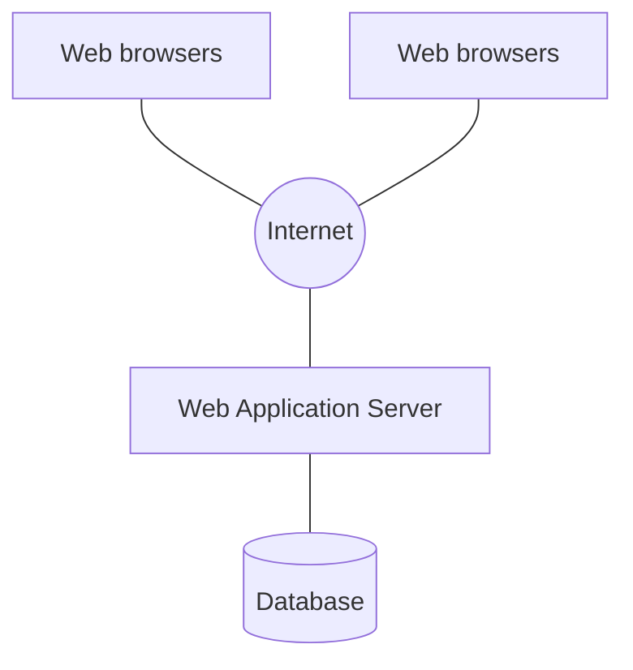

AALBORG UNIVERSITET
Silberschatz, Korth, Sudarshan: Database System Concepts (6ed)
SIDE 16


---


# Parallel Data Systems

* Shared X among nodes
    * Processors are connected with high-speed bus

### (a) shared memory
```mermaid
graph LR
    subgraph Processors
        direction TB
        P1[P]
        P2[P]
        P3[P]
        P4[P]
        P5[P]
    end
    Bus[ ]
    subgraph Storage
        direction TB
        M[M]
        D1((Disk))
        D2((Disk))
        D3((Disk))
    end
    P1 --- Bus
    P2 --- Bus
    P3 --- Bus
    P4 --- Bus
    P5 --- Bus
    Bus --- M
    Bus --- D1
    Bus --- D2
    Bus --- D3
    style Bus width:2px,fill:#000
```

### (b) shared disk
```mermaid
graph LR
    subgraph Nodes
        direction TB
        N1[M P]
        N2[M P]
        N3[M P]
        N4[M P]
        N5[M P]
    end
    Bus[ ]
    subgraph Shared_Disks
        direction TB
        D1((Disk))
        D2((Disk))
        D3((Disk))
    end
    N1 --- Bus
    N2 --- Bus
    N3 --- Bus
    N4 --- Bus
    N5 --- Bus
    Bus --- D1
    Bus --- D2
    Bus --- D3
    style Bus width:2px,fill:#000
```

### (c) shared nothing
```mermaid
graph LR
    subgraph Left_Nodes
        direction TB
        L1[M P<br/>Disk]
        L2[M P<br/>Disk]
        L3[M P<br/>Disk]
    end
    Bus[ ]
    subgraph Right_Nodes
        direction TB
        R1[P M<br/>Disk]
        R2[P M<br/>Disk]
    end
    L1 --- Bus
    L2 --- Bus
    L3 --- Bus
    Bus --- R1
    Bus --- R2
    style Bus width:2px,fill:#000
```

### (d) hierarchical
```mermaid
graph TD
    MainBus[ ]
    MainBus --- C1Bus[ ]
    MainBus --- C2Bus[ ]
    MainBus --- C3Bus[ ]
    
    subgraph Cluster_1
        direction LR
        C1P[5 x P] --- C1Bus
        C1Bus --- C1M[M]
        C1Bus --- C1D[3 x Disk]
    end
    
    subgraph Cluster_2
        direction LR
        C2P[5 x P] --- C2Bus
        C2Bus --- C2M[M]
        C2Bus --- C2D[3 x Disk]
    end
    
    subgraph Cluster_3
        direction LR
        C3P[5 x P] --- C3Bus
        C3Bus --- C3M[M]
        C3Bus --- C3D[3 x Disk]
    end
    
    style MainBus width:4px,fill:#000
    style C1Bus width:2px,fill:#000
    style C2Bus width:2px,fill:#000
    style C3Bus width:2px,fill:#000
```

AALBORG UNIVERSITET
Silberschatz, Korth, Sudarshan: Database System Concepts (7ed)
SIDE 17


---

# Distributed Data Systems

* Independent sites connected via network
    * The network varies from LAN to Internet

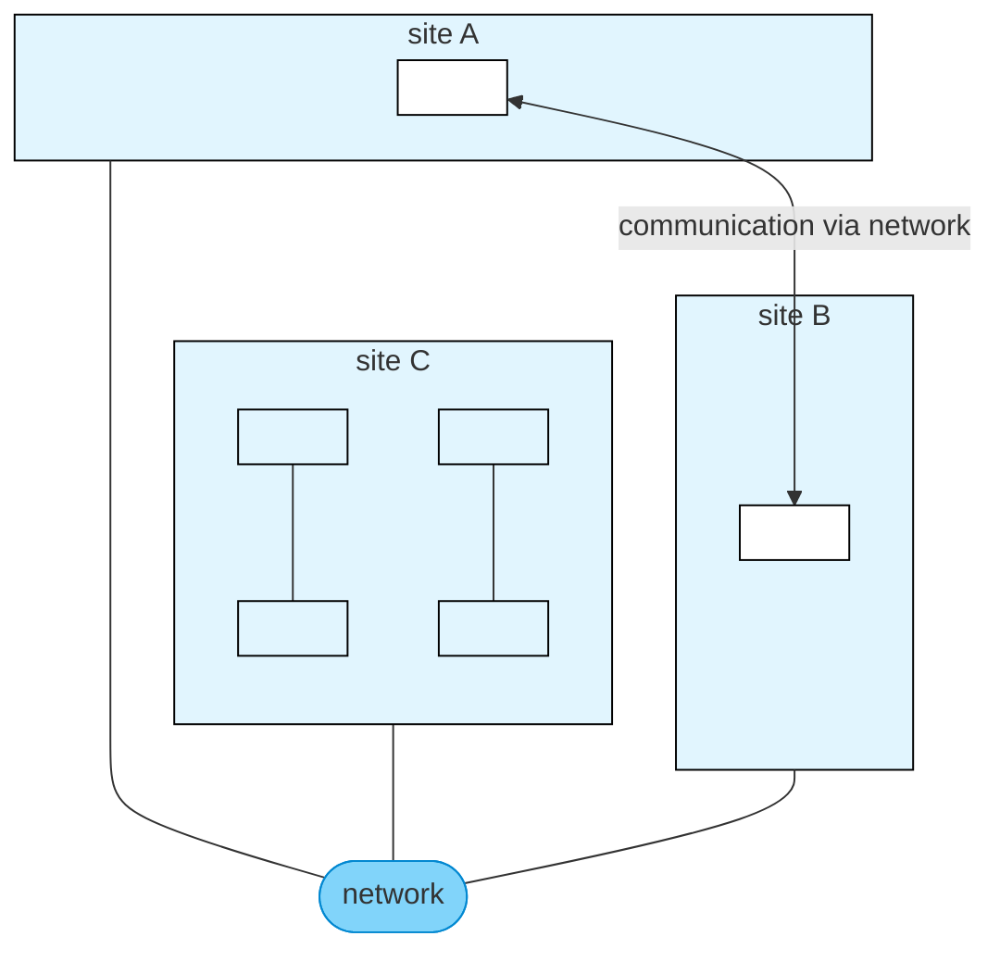

AALBORG UNIVERSITET
Silberschatz, Korth, Sudarshan: Database System Concepts (7ed)
SIDE 18


---

# Cloud Databases

* With a cloud database, there is no need for dedicated hardware to host a database.
* You don't need to install, configure, and maintain a database system. The cloud provider can deploy, manage, and scale the underlying database for you.
* Any type of database can be deployed in the cloud: Relational or NoSQL
* Two deployment modes
    * VM
    * DBaaS

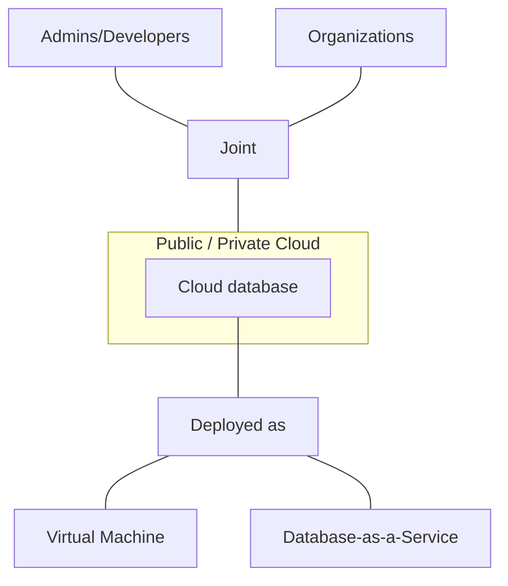

AALBORG UNIVERSITET
SIDE 19


---


AALBORG UNIVERSITET
SIDE 20

# Agenda

* Design of data systems
* Data model, storage and retrieval
    - Relational databases
    - NoSQL
    - CAP
* More on NoSQL

---

# Data Models

* Conceptual data model
    - Description of the semantics of the data from an organization without reference to technology
    - E.g., ER diagrams, Class diagrams
* Logical data model
    - Representation of an organization's data, independently of a particular product or storage technology but in terms of data structures
    - E.g., Relational model, Document model, Graph model
* Physical data model
    - How data is actually organized and stored in a system like database.
    - E.g., Row storage, Column storage

AALBORG UNIVERSITET
SIDE 21


---

# Relational Databases

* Based on relational data model
    - Schema: ordered of columns, data type of each column
        - Definition/template of your data
    - Relation/table: a set of rows/records/tuples
        - Each row is an instance of the schema
* Structured data
    - If your data doesn't follow a schema, you can't store the data in its relation
* Different relations may be associated via keys (primary and foreign)
    - You may retrieve data from multiple relations using joins
* Database design
    - Decoupling of conceptual design (ER modeling), logical design (relations) and physical design

AALBORG UNIVERSITET
SIDE 22


---


# Data, Users and SQL

* Based on relational data model

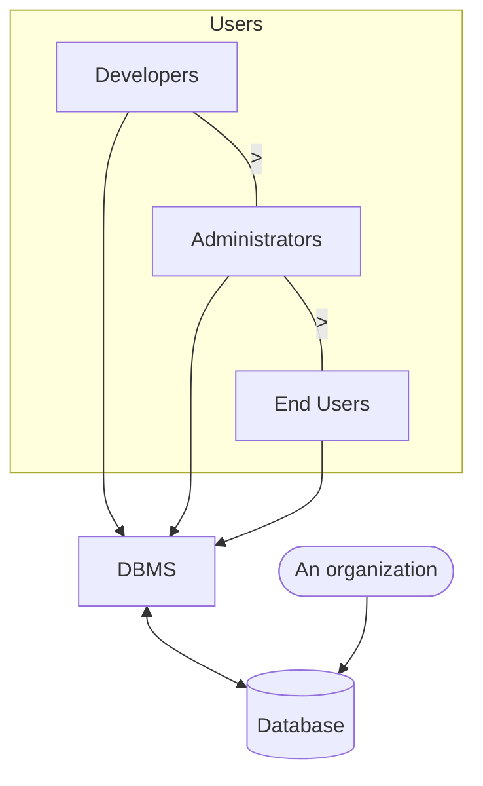

<table>
  <thead>
    <tr>
        <th>Diagram Element</th>
        <th>Description</th>
    </tr>
  </thead>
  <tbody>
    <tr>
        <td>Developers &gt; Administrators &gt; End Users</td>
<td>Common fundamental: **SQL** (a language you speak when 'talking' to DBMS)</td>
    </tr>
<tr>
        <td>DBMS</td>
<td>E.g., MySQL, Oracle, SQL Server</td>
    </tr>
<tr>
        <td>Database</td>
<td>Correlated data is organized in standardized manners, e.g., tables with specific designs (schemas).</td>
    </tr>
<tr>
        <td>An organization</td>
<td>E.g., a university or a department</td>
    </tr>
  </tbody>
</table>

AALBORG UNIVERSITET
SIDE 23


---

# Two Storages for Relational Databases

## Row-oriented storage

The diagram illustrates row-oriented storage where all fields of a record are stored together in a single block.

<table>
  <thead>
    <tr>
        <th>ID</th>
        <th>Name</th>
        <th>Birth_date</th>
        <th>Email</th>
    </tr>
  </thead>
</table>

* Easy operations (CRUD) on a record
* Might read in unnecessary data
* Could be mitigated by query optimization
* Efficient for SELECT *

## Column-oriented storage

The diagram illustrates column-oriented storage where each field is stored separately in its own column block.

```tsv
[thead] ID
```

```tsv
[thead] Name
```

```tsv
[thead] Birth_date
```

```tsv
[thead] Email
```

* Only need to read relevant data
* Operations on a record need more IOs
* Could be mitigated by parallelism
* Efficient if columns are not correlated

AALBORG UNIVERSITET
SIDE 24


---

# Benefits of Relational Databases

<table>
  <thead>
    <tr>
      <th>Reliability</th>
      <th>☺</th>
    </tr>
  </thead>
  <tbody>
    <tr>
      <td>Scalability</td>
<td>☺</td>
    </tr>
<tr>
      <td>Maintenance</td>
<td>☹</td>
    </tr>
  </tbody>
</table>

* Data model and data storage are decoupled
* Data definition and data manipulation are separate
* Data type and integrity constraints
* Reliable failure/crash handling
    - Transactions
    - Commit and rollback
    - Recovery
* Security
    - Access control
    - Views

> * However, relational DBs and SQL are too heavyweight sometimes.
> * They could be hard to maintain.

AALBORG UNIVERSITET
SIDE 25


---

# Difficulties of Relational Databases

* Big data and data from Web 2.0 are often unstructured or semi-structured.
* Relational DB design is not easy.
* Relational DBs don’t naturally scale out (e.g., to a cluster of machines).
* Object–relational impedance mismatch:
  Mismatch between OOP and relational DBs
  * A set of conceptual and technical difficulties between OOP and RDBs
  * A translation layer is needed between the objects in the application code and the data (rows and columns) in the tables.
  * Object-relational mapping (ORM)

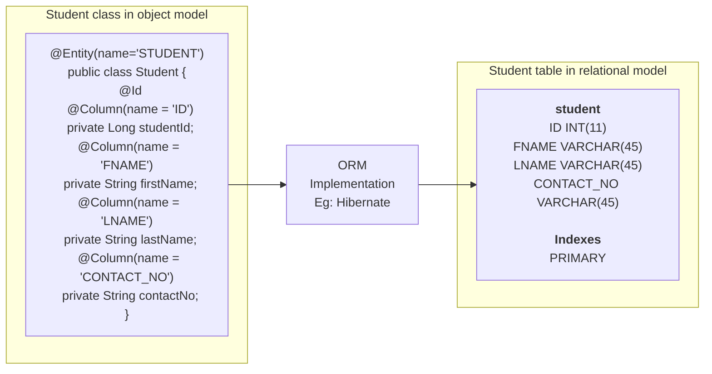

ORM implements responsibility of mapping the Object to Relational Model.

JavaByDeveloper
https://broadgeek.com/2020/05/25/3cd2/

AALBORG UNIVERSITET
SIDE 26


---

# Characteristics of NoSQL Databases

* Not using the relational model
* Running on clusters
* Open source
* Built for the 21st century web estates
* Schema-less
    - Documents
    - Graphs
    - Key-value pairs
    - Wide column databases (Flexible schema, varied for rows!)
    - E.g., Google BigTable and HBase. Can be regarded as 2D key-value pairs

AALBORG UNIVERSITET
SIDE 27


---

# CAP Theorem

* Any distributed data system can simultaneously provide only two of the following three guarantees:
    * Consistency
        - Every read receives the most recent write or an error.
    * Availability
        - Every request receives a (non-error) response, without guaranteeing that it contains the most recent write.
    * Partition tolerance
        - The system continues to operate despite an arbitrary number of messages being dropped (or delayed) by the network between nodes.

The relationship between these guarantees is illustrated in the following diagram:

<table>
  <thead>
    <tr>
        <th>Guarantees</th>
        <th>System Type</th>
    </tr>
  </thead>
  <tbody>
    <tr>
        <td>Consistency + Availability</td>
<td>CA</td>
    </tr>
<tr>
        <td>Consistency + Partition Tolerance</td>
<td>CP</td>
    </tr>
<tr>
        <td>Availability + Partition Tolerance</td>
<td>AP</td>
    </tr>
  </tbody>
</table>

https://en.wikipedia.org/wiki/CAP_theorem

AALBORG UNIVERSITET SIDE 28


---


# Relational DBs, NoSQL and CAP

* Relational DBs offers ACID: (consistency over availability)
    * Atomicity
    * Consistency
    * Isolation
    * Durability

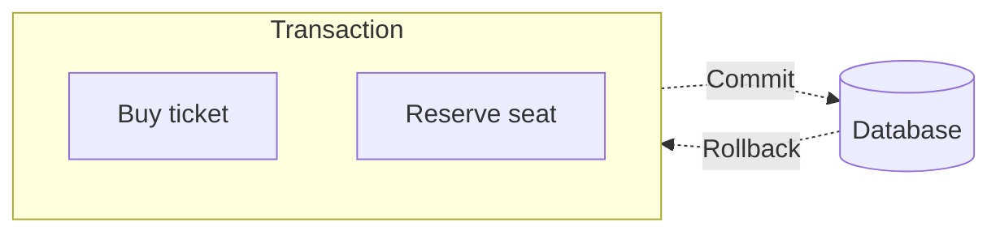
Figure from Sameh Muhammed

* NoSQL systems offers BASE: (availability over consistency)
    * Basically Available: reads/writes as much as possible but writes may not persistent
    * Soft-state: without consistency guarantees, only some probability of knowing the state
    * Eventually consistent: long enough after writes, further reads will return the same value

AALBORG UNIVERSITET
SIDE 29


---

# Consideration

* Factors to consider
    - Application requirements
        - Is consistent a must?
    - Your budget
        - Is open source a way to keep your cost low?
    - Data
        - Size
        - Structured or not

The image includes a Venn diagram illustrating the CAP theorem, showing the trade-offs between Consistency, Availability, and Partition Tolerance. The intersections (CA, CP, and AP) are mapped to different database types as follows:

<table>
  <thead>
    <tr>
        <th>CAP Intersection</th>
        <th>Database Type</th>
    </tr>
  </thead>
  <tbody>
    <tr>
        <td>CA (Consistency + Availability)</td>
<td>Centralized Relational DBs</td>
    </tr>
<tr>
        <td>CP (Consistency + Partition Tolerance)</td>
<td>Distributed Relational DBs</td>
    </tr>
<tr>
        <td>AP (Availability + Partition Tolerance)</td>
<td>NoSQL</td>
    </tr>
  </tbody>
</table>

AALBORG UNIVERSITET
SIDE 30


---


# Agenda

* Design of data systems
* Data model, storage and retrieval
* More on NoSQL
    * Key-value stores
    * Document stores
    * Graph databases

AALBORG UNIVERSITET
SIDE 31


---

# Key-Value Stores: Data Models

* Key-value stores use an *associative array* (a.k.a. map or dictionary)
    - The key is represented by an arbitrary string
    - The value can be any kind of data like an image, file, text or document
* Data is represented as a collection of key-value pairs
    - Each pair forms a 'row'
    - Keys are unique but values are not.
    - Values across keys may be heterogeneous.
    - Given a key, the value could be composite.

<table>
  <thead>
    <tr>
        <th>Keys</th>
        <th>Values</th>
    </tr>
  </thead>
  <tbody>
    <tr>
        <td>2398239</td>
<td>{name: Michal, Age: 31}</td>
    </tr>
<tr>
        <td>2398240</td>
<td>Lorem ipsum dolor sit amet</td>
    </tr>
<tr>
        <td>2398241</td>
<td>{name: Marlon Brando, Profession: Actor}</td>
    </tr>
<tr>
        <td>2398242</td>
<td>42</td>
    </tr>
  </tbody>
</table>

AALBORG UNIVERSITET
SIDE 32


---

# Key-Value Stores: Pros and Cons

* Advantages
    - Simple concept yet fast retrieval
    - No relationship to be considered between rows; no optimization is needed.
    - Easy to be stored in a distributed system
* Disadvantages
    - No complex query filters
    - All joins must be done in code (the same for all complex operations)
    - No foreign key constraints
    - No trigger

AALBORG UNIVERSITET
SIDE 33


---

# Key-Value Stores: When to use?

* Key-value stores handle size well and are good at processing a constant stream of read/write operations with low latency.
* They are very good at
    - Session management at high scale
    - User preference and profile stores
    - Working as an effective *cache* for heavily accessed but rarely updated data

<table>
  <thead>
    <tr>
        <th>Amazon DynamoDB</th>
        <th>Redis</th>
        <th>ScyllaDB</th>
        <th>Apache Cassandra</th>
        <th>LevelDB</th>
        <th>Aerospike</th>
        <th>ArangoDB</th>
    </tr>
  </thead>
  <tbody>
    <tr>
        <td>Proprietary so...</td>
<td>BSD licenses</td>
<td>GNU Affero G...</td>
<td>Apache License</td>
<td>BSD licenses</td>
<td>GNU Affero G...</td>
<td>Apache License</td>
    </tr>
  </tbody>
</table>

AALBORG UNIVERSITET
SIDE 34


---

# Redis

redis

* Online tutorial and tryout interface
  [https://try.redis.io/](https://try.redis.io/)
* Online compiler
  [https://onecompiler.com/redis/3zk2u7sqe](https://onecompiler.com/redis/3zk2u7sqe)
* Documentation
  [https://redis.io/docs/about/](https://redis.io/docs/about/)
* In addition to Key-Value store, Redis also supports strings, hashes, lists, sets and sorted sets.
    - Redis provide **atomic operations** on such data structures to avoid write conflicts.
* To achieve top performance, Redis works with an **in-memory dataset**.

AALBORG UNIVERSITET
SIDE 35


---


# Document Stores

* Data model
    * A document encapsulates and encodes data (or information) in some standard formats or encodings.
        - E.g., XML, YAML, JSON and BSON
    * Documents are addressed in the database via a unique key that represents that document.
    * A document-oriented database (e.g., MongoDB) provides an API or query language for content-based document retrieval.
* Different implementation ways of organizing and/or grouping documents
    * Collections, Tags, Non-visible metadata, Directory hierarchies, and Key-value stores
    * Compared to relational DBs, collections are akin to tables and documents akin to records.
    * However, DB records are homogeneous while documents are not.

AALBORG UNIVERSITET
SIDE 36


---

# MongoDB

mongoDB®

* MongoDB is one of the most popular NoSQL database.
* It stores data in JSON-like documents, which makes the database very flexible and scalable.
* To install MongoDB on your own computer
    - https://www.mongodb.com/try/download/community
* Or, to get the cloud based service
    - https://www.mongodb.com/atlas/database
* A first tutorial
    - https://www.w3schools.com/python/python_mongodb_getstarted.asp

AALBORG UNIVERSITET
SIDE 37


---


# Comparative Terminologies

<table>
  <thead>
    <tr>
        <th>Relational DB</th>
        <th>Document DB</th>
    </tr>
  </thead>
  <tbody>
    <tr>
        <td>Database</td>
<td>Database</td>
    </tr>
<tr>
        <td>Relation (or table)</td>
<td>Collection</td>
    </tr>
<tr>
        <td>schema</td>
<td>Schema-less</td>
    </tr>
<tr>
        <td>Row (or record)</td>
<td>Document</td>
    </tr>
<tr>
        <td>Column</td>
<td>Field</td>
    </tr>
  </tbody>
</table>

AALBORG UNIVERSITET
SIDE 38


---

# Graph

* A graph is formally defined as $$G = (V, E)$$
  - $$V$$: Vertex/node set. Each node may have a number of properties.
  - $$E$$: Edge set. A edge captures the relationship between two nodes. It may be directed or not, and/or have a weight.
* Examples:
  - Social networks: Facebook, Twitter, Instagram
  - Web: Hyperlinks
  - Transportation: Road networks or railway networks
* Graph data can be stored in Relational Databases, but (native) Graph Databases are more efficient at managing graph data.

AALBORG UNIVERSITET
SIDE 39


---


# Graph Database

* A graph database uses graph structures for semantic queries with nodes, edges, and properties to represent and store data.
* It is designed to treat the *relationships* between data as equally important to the *data* itself.
    * Accessing nodes and relationships in a native graph database is equally efficient.
* Graph data models
    * Property Graph Model
    * Triple-Store Model

AALBORG UNIVERSITET
SIDE 40


---


# Property Graph Model Example

*   **Nodes** represent entities or instances such as people, businesses, accounts, or others. Each node is roughly the equivalent of a record in a relational database, or a document in a document-store database.
    *   E.g., Alice, Bob and Chess Group
*   **Properties** are information associated to nodes.
    *   E.g., Name, Age, ...
*   **Edges** represent the (directed or undirected) relationship between nodes.
    *   The key concept in graph databases
    *   An abstraction that is not directly implemented in a relational model or a document-store model.
    *   Different types of relationships in the example.

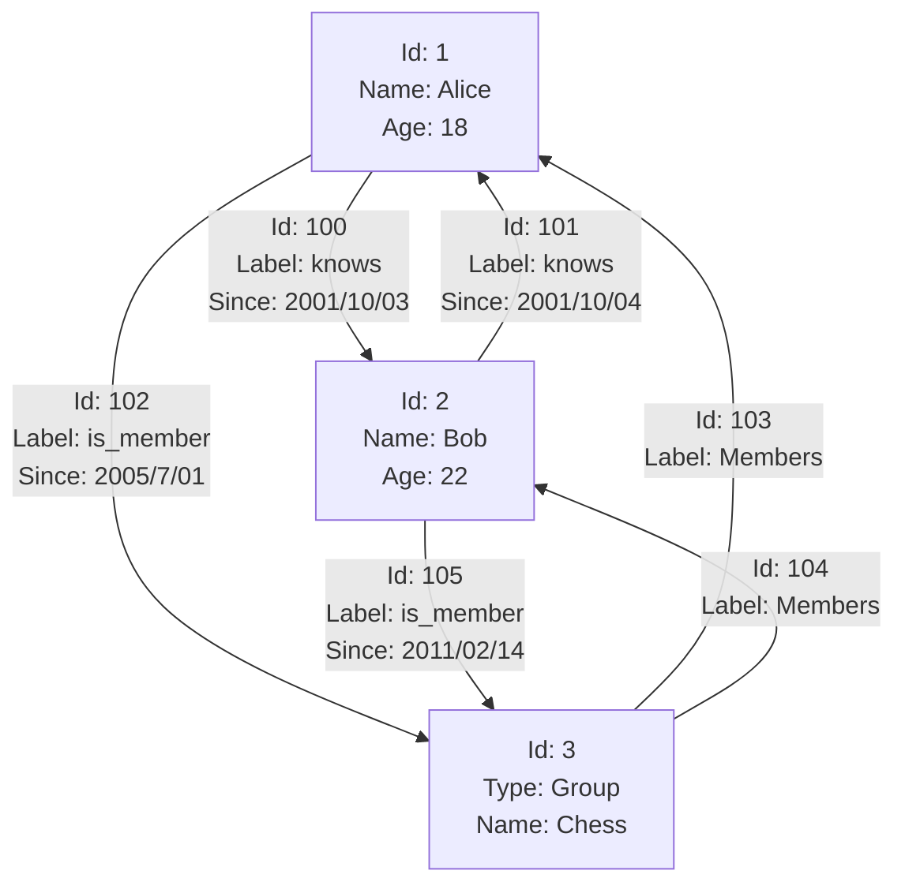

AALBORG UNIVERSITET
SIDE 41


---


# Neo4j

Neo4j logo

* A graph database management system
    - ACID-compliant transactional database
    - Native graph storage and processing
    - Using the Cypher query language
        - Declarative graph query language
* In Neo4j
    - Everything is stored in the form of an edge, node, or attribute (properties).
    - Each node and edge can have any number of attributes.
    - Both nodes and edges can be labelled.
    - Labels can be used to narrow searches.

AALBORG UNIVERSITET
SIDE 42


---

# Triple-Store Model

* Triple-store: Each piece of information is stored in the form of three-part statement: (subject, predicate, object), e.g., (Jim, likes, bananas).
* The subject of a triple is equivalent to a node in graph.
* The object is one of two things:
    * A value in a primitive datatype, e.g., a string or a number. In that case, the predicate and object are the key and value of a property on the subject node.
        - E.g., (lucy, age, 33) is like a node lucy with properties {"age":33}
    * Another node in the graph. In that case, the predicate is an edge in the graph, the subject is the tail node, and the object is the head node.
        - E.g., (dan, loves, lucy)

AALBORG UNIVERSITET
SIDE 43


---


# Resource Description Framework (RDF)

* RDF (Resource Description Framework): a mechanism for different websites to publish data in a consistent format, allowing data from different websites to be automatically combined into a web of data.
    - `<http://example.com/books/book1>` rdf:type Book
    - `<http://example.com/books/book1>` dc:title “Data Intensive Systems”
    - `<http://example.com/books/book1>` dc:creator
    - `<http://example.com/authors/johnsmith>` rdf:type Person
* RDF also uses triples to represent these relationships in a subject-predicate-object format.

AALBORG UNIVERSITET
SIDE 44


---

# RDF, Triple-Store and SPARQL

* Triple-stores are the database systems specifically designed to store and manage RDF data.
    - Triple-stores provide a storage environment where RDF triples can be efficiently stored, indexed, and queried.
    - Triple-stores are optimized for working with RDF data, allowing users to store, retrieve, and manipulate graph-based information using RDF triples.
* SPARQL: A query language for triple-stores using the RDF data model.
    - Expresses patterns and graph traversals, focusing on relationships between nodes in a graph.
    - SPARQL tutorial: https://jena.apache.org/tutorials/sparql.html
    - Online SPARQL Query Editor: https://dbpedia.org/sparql

AALBORG UNIVERSITET
SIDE 45


---

# Graph Databases: Pros and Cons

* Advantages
    - More descriptive queries
    - Greater flexibility in adapting your model
    - Greater performance when traversing data relationships
* Disadvantages
    - Difficult to scale, e.g., partitioning the data
    - No standard language
* It’s possible to accommodate graph data in a relational database, but it would be very complicated.
    - Multiple tables plus multi-way joins

AALBORG UNIVERSITET
SIDE 46


---


# Summary

* Design data systems
    - Principles of Reliability, Scalability, Maintainability
    - Four typical architectures
* Relational DB, NoSQL and CAP
    - ACID vs. BASE
    - Which one to choose?
* NoSQL systems
    - Key-value stores
    - Document stores
    - Graph databases

AALBORG UNIVERSITET
SIDE 47


---


# References

* Mandatory reading
    - Martin Kleppmann: Designing Data-Intensive Applications, O’Reilly, 2017
        - Chapters 1, 2 and 3
* Further readings
    - Hridyesh Bisht: Intro to 4 types of NoSQL databases.
    - https://dev.to/aws-builders/intro-to-4-types-of-nosql-databases-45nh

AALBORG UNIVERSITET
SIDE 48


---


# Exercises

We have a raw ID-Hashtag file, where each line is composed of a tweet ID and a number of hashtags, e.g., `1020253525161283584 #Hartberg #Finance #Job #Jobs #Hiring`. Find the right data models and tools/libraries to implement the following functionalities.

1. We may want to know the frequency of an arbitrary hashtag. How do you implement this if our requests are sparse? Will you implement in the same way if our requests are frequent?
2. How do you implement if we want to return the top-10 frequent hashtags?
3. If new lines are appended to the original raw file continuously, what would you change for your implementations in 1 and 2?

When you decide your design and implementation, think about the different paradigms such as relational databases, key-value stores, document databases and graph databases, and choose the most suitable one(s) to use.

AALBORG UNIVERSITET
SIDE 49
