The image shows a large, modern, multi-story atrium of a building, likely a university campus. The interior features multiple levels with wooden-slatted balconies overlooking a central open space. Large floor-to-ceiling windows in the background provide a view of a waterfront. Numerous white rectangular panels are suspended at various heights from the ceiling. On the ground floor, there are several seating areas with tables and chairs where people are gathered.

# Data Intensive Systems (DIS)
## KBH-SW7 E25
### 10. Data Warehouse

AALBORG UNIVERSITY
AALBORG UNIVERSITET


---


# Agenda

* Introduction
* Fundamental Multidimensional Modelling
* Relational Representations
* Querying
* Changing Dimensions

AALBORG UNIVERSITET SIDE 2


---

# Motivation Example

* Say you manage a retail chain. Each day, it generates massive data.
    - Sales transactions, inventory levels, customer memberships, etc.
    - The data may reside in *different* stores or *different* IT systems.
* As the business continuously expands, it is increasingly challenging to make use of the data for decision making inside your organization.
    - **Data fragmentation**: Local data stores vs. comprehensive view of the business
    - **Complex queries**: Inefficient to run across multiple systems.
    - **Inconsistent reporting**: Different shops may generate reports differently.
    - **Limited historical analysis**: Purchase records are maintained in the operational system only for a limited time, e.g., 6 months.

AALBORG UNIVERSITET
SIDE 3


---


# Business Intelligence (BI)

* "[BI] refers to a set of **tools and techniques** that enable a company to **transform its business data** into **timely and accurate information** for the decisional process, to be made available to the right persons **in the most suitable form.**" --- Encyclopedia of Database Systems
* BI is different from Artificial Intelligence (AI)
    - *AI makes* decisions for the users.
    - *BI helps* the users make the right decisions based on available data.
* BI combines technologies
    - Data Warehousing
    - Online Analytical Processing (OLAP)
    - Data Mining (DM)
    - ......

AALBORG UNIVERSITET
SIDE 4


---

# Data Warehouse (DW)

* DW is a system used for **reporting** and **data analysis**. It is considered as a core component of BI. Inside DW, the data is
    - **Subject oriented** (versus function oriented)
    - **Integrated** (logically and physically)
    - **Time variant** (data can always be related to time)
    - **Stable** (data not deleted, several versions)
    - **Supporting management decisions** (in or across different organizations)

* Data from the operational systems is
    - **E**xtracted
    - **C**leansed
    - **T**ransformed
    - **A**ggregated (?)
    - **L**oaded into the DW

> **ETL**

AALBORG UNIVERSITET
SIDE 5


---


# DW Architecture: Data as Materialized Views

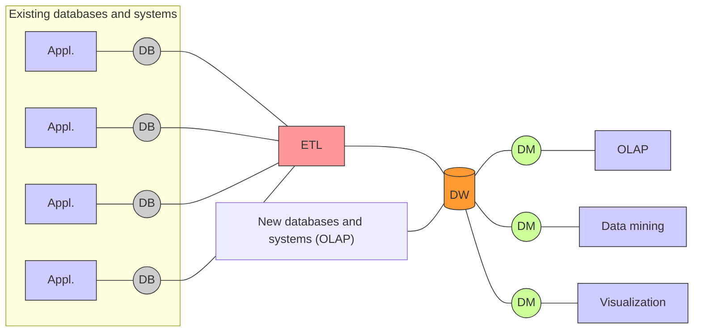

The diagram above illustrates the Data Warehouse (DW) architecture where data is treated as materialized views.

*   **Existing databases and systems**: Multiple applications (Appl.) and their respective databases (DB) feed into the ETL process.
*   **ETL**: Extract, Transform, and Load process that consolidates data.
*   **(Global) Data Warehouse**: The central repository (DW) receiving data from the ETL process and potentially from **New databases and systems (OLAP)**.
*   **(Local) Data Marts**: Subsets of the data warehouse (DM) that serve specific functional areas.
*   **Consumers**: Data from the data marts is used for **OLAP**, **Data mining**, and **Visualization**.

Analogy: (data) producers $\leftrightarrow$ warehouse $\leftrightarrow$ (data) consumers

AALBORG UNIVERSITET
SIDE 6


---

# Function vs. Subject Orientation

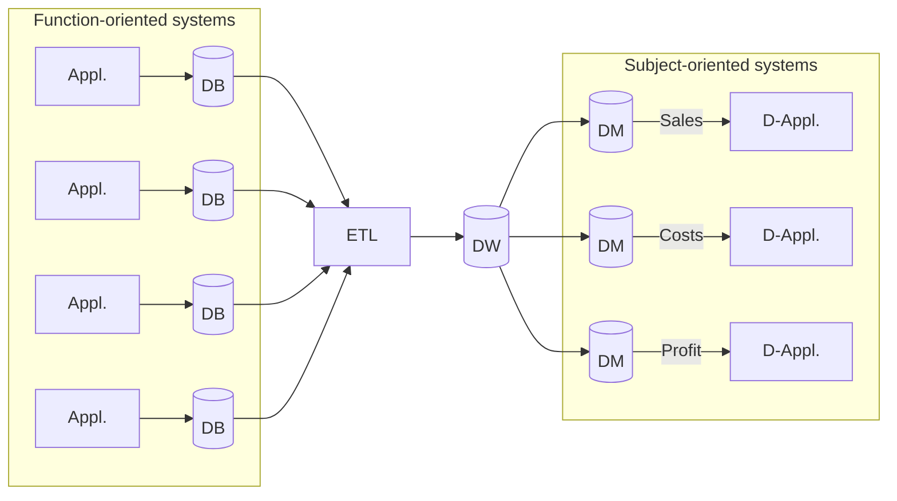

*   **Function-oriented systems**: A group of four application (Appl.) and database (DB) pairs.
*   **ETL**: A central red box representing the Extract, Transform, Load process.
*   **DW**: An orange cylinder representing the Data Warehouse, labeled as "**All subjects, integrated**".
*   **Subject-oriented systems**: A group of three Data Marts (DM) and their corresponding Data Applications (D-Appl.), labeled as "**Selected subjects**".
    *   The top Data Mart is associated with **Sales**.
    *   The middle Data Mart is associated with **Costs**.
    *   The bottom Data Mart is associated with **Profit**.
*   A grid icon at the bottom center represents the multidimensional data structure.

AALBORG UNIVERSITET
SIDE 7


---


# Properties and Benefits of DW

* Centralized Data Repository
* Consistent Data
* Historical Analysis
* Support for Complex Queries
* Performance Optimization
* Business Intelligence (BI) and Reporting
* Support for Decision-making
* Separation of Operational and Analytical Workloads
* Scalability

AALBORG UNIVERSITET
SIDE 8


---

# Agenda

* Introduction
* Fundamental Multidimensional Modelling
* Relational Representations
* Querying
* Changing Dimensions

AALBORG UNIVERSITET
SIDE 9


---


# Multidimensional Modeling: Basic Concepts

* Example: sales from supermarkets
* Facts and measures
    * Each sales record is a **fact**, and its sales value is a **measure**
* Dimensions
    * Group correlated attributes into the same **dimension** ➔ easier for analysis tasks
    * Each sales record is associated with its values of *Product*, *Store*, *Time*

<table>
  <thead>
    <tr>
        <th></th>
        <th>Product</th>
        <th>Type</th>
        <th>Category</th>
        <th>Store</th>
        <th>City</th>
        <th>Region</th>
        <th>Date</th>
        <th>Sales price</th>
        <th></th>
    </tr>
  </thead>
  <tbody>
    <tr>
        <td>fact</td>
<td>Top</td>
<td>Beer</td>
<td>Beverage</td>
<td>Vejgård</td>
<td>Aalborg</td>
<td>Nord</td>
<td>25 May, 2015</td>
<td>7.75</td>
<td>measure</td>
    </tr>
<tr>
        <td>dimensions</td>
        <td colspan="3">Product</td>
        <td colspan="3">Store</td>
<td>Time</td>
        <td colspan="2"></td>
    </tr>
  </tbody>
</table>

AALBORG UNIVERSITET
SIDE 10


---

# Multidimensional Modeling: Hierarchy

* How do we model the *Time* dimension?
    - **Hierarchy** with multiple levels
    - Attributes, e.g., holiday, event

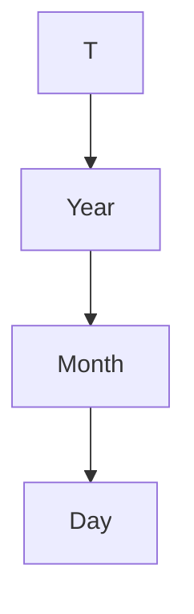

<table>
  <thead>
    <tr>
        <th>tid</th>
        <th>day</th>
        <th>day #</th>
        <th>month #</th>
        <th>year</th>
        <th>week day</th>
        <th>work day</th>
        <th>...</th>
    </tr>
  </thead>
  <tbody>
    <tr>
        <td>1</td>
<td>January 1st 2009</td>
<td>1</td>
<td>1</td>
<td>2009</td>
<td>Thurs day</td>
<td>No</td>
<td>...</td>
    </tr>
<tr>
        <td>2</td>
<td>January 2nd 2009</td>
<td>2</td>
<td>1</td>
<td>2009</td>
<td>Fri day</td>
<td>Yes</td>
<td>...</td>
    </tr>
<tr>
        <td>...</td>
<td>...</td>
<td>...</td>
<td>...</td>
<td>...</td>
<td>...</td>
<td>...</td>
<td>...</td>
    </tr>
  </tbody>
</table>

* Advantage of this model?
    - Easy for querying (more about this later)
* Disadvantage?
    - Data redundancy (but controlled redundancy is acceptable)

AALBORG UNIVERSITET
SIDE 11


---


# Multidimensional Modeling: Cube

* Data is divided into:
    * **Facts**
    * **Dimensions**
* Facts are the *important* entity: a sale
* Facts have **measures** that can be aggregated: sales
* Dimensions *describe* facts
    * A sale has the dimensions Product, Store and Time
* Facts "live" in a multidimensional **cube**

<table>
  <thead>
    <tr>
        <th>Product</th>
        <th>City</th>
        <th>2000</th>
        <th>2001</th>
    </tr>
  </thead>
  <tbody>
    <tr>
        <td>Bread</td>
<td>Aalborg</td>
<td>57</td>
<td>45</td>
    </tr>
<tr>
        <td>Bread</td>
<td>Copenhagen</td>
<td>123</td>
<td>127</td>
    </tr>
<tr>
        <td>Milk</td>
<td>Aalborg</td>
<td>56</td>
<td>67</td>
    </tr>
<tr>
        <td>Milk</td>
<td>Copenhagen</td>
<td></td>
<td>211</td>
    </tr>
  </tbody>
</table>

* Goal for dimensional modeling:
    * Surround facts with as much context (dimensions) as possible
    * Hint: redundancy may be okay (in well-chosen places)
    * You do not have to model *all* relationships in the data (unlike ER and OO modeling)

AALBORG UNIVERSITET
SIDE 12


---

# Cubes

* A "cube" may have *many* dimensions!
    - It can have more than 3---the term "hypercube" is sometimes used.
    - Theoretically, no limit for the number of dimensions
    - Typical cubes have 4-12 dimensions.
* But only 2-4 dimensions can be viewed at a time
    - Dimensionality reduced by queries via projection/aggregation
* A cube consists of cells
    - A given combination of dimension values
    - A cell can be empty (i.e., there is no data for this combination)
    - A *sparse* cube has many empty cells
    - A *dense* cube has few empty cells
    - Cubes become sparser for many/large dimensions

AALBORG UNIVERSITET
SIDE 13


---


# Dimensions

* Dimensions are the core of multidimensional databases
* Dimensions are used for
    - **Selection** of data
    - **Grouping** of data at the right level of detail
* Dimensions consist of **dimension values**
    - The Product dimension has the values "milk", "cream", ...
    - The Time dimension has the values "1/1/2001", "2/1/2001",...
* Dimension values *can* have an **ordering**
    - Used for comparing cube data across values
    - E.g., "percent sales increase compared with last month"
    - Especially used for the Time dimension

AALBORG UNIVERSITET SIDE 14


---

# Hierarchies and Levels

* Dimensions have **hierarchies** with **levels**
    - Typically 3-5 levels
    - **Product**: Product $\rightarrow$ Type $\rightarrow$ Category $\rightarrow$ T
    - **Store**: Store $\rightarrow$ Area $\rightarrow$ City $\rightarrow$ County $\rightarrow$ T
    - **Time**: Day $\rightarrow$ Month $\rightarrow$ Quarter $\rightarrow$ Year $\rightarrow$ T
    - Dimensions have a **bottom level** and a **top level** ("T" or "ALL")
    - Dimension values are organized in a **tree structure**
* Levels *may* have **attributes**
    - Simple, non-hierarchical information
    - E.g., Day has Workday as attribute
* Dimensions should contain much information
    - Time dimensions may contain holiday, season, events,...
    - Good dimensions have 50-100 or more attributes/levels

AALBORG UNIVERSITET
SIDE 15


---

# Dimension Example

* Dimension of *Location*

## *Location*

### Schema
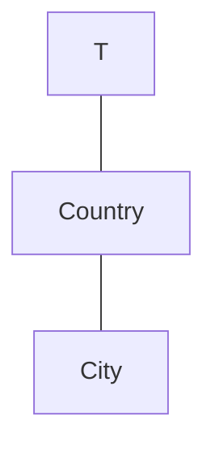

### Instance
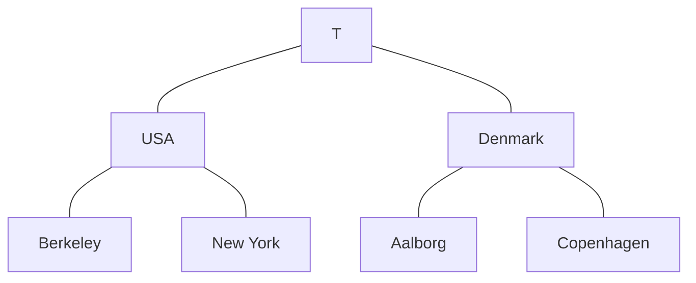

AALBORG UNIVERSITET
SIDE 16


---

# Facts

* Facts represent the **subject** of the desired analysis
    * What is important to the business
* A fact is identified via its dimension values
    * A fact is a *non-empty* cell

AALBORG UNIVERSITET
SIDE 17


---


# Granularity

* **Granularity** of facts is important.
    - **Level of detail**
    - Given by combination of bottom levels
* Often the granularity is a single business transaction
    - Example: sale
    - Sometimes the data is aggregated (*total* sales per store per day per product)
    - Might be necessary due to scalability
* Generally, transaction detail can be handled.

AALBORG UNIVERSITET
SIDE 18


---


AALBORG UNIVERSITET
SIDE 19

# Measures

* Measures represent the fact property that the users want to **study and optimize**
    - E.g., sales price
* A measure has two components
    - **Numerical value** (e.g., sales price)
    - **Aggregation formula** (e.g., SUM): used for aggregating/combining a number of measure values into one
    - Measure value is determined by dimension value combination
        - E.g., the sales volume of “milk” and “cream”
    - Measure value is meaningful for *all* aggregation levels (incl. the top level T)

---

# Agenda

* Introduction
* Fundamental Multidimensional Modelling
* Relational Representations
* Querying
* Changing Dimensions

AALBORG UNIVERSITET
SIDE 20


---

# Relational Representation

* Goal for dimensional modeling: surround the facts with as much context (dimensions) as we can
* **Granularity** of the fact table is important
    - What does one fact table row represent?
* Many-to-one relationships
    - Facts vs. dimension values
    - Lower vs. higher levels in the hierarchies

AALBORG UNIVERSITET
SIDE 21


---

# Relational Design

## 

<table>
  <thead>
    <tr>
      <th>Product</th>
      <th>Type</th>
      <th>Category</th>
      <th>Store</th>
      <th>City</th>
      <th>County</th>
      <th>Date</th>
      <th>Sales price</th>
    </tr>
  </thead>
  <tbody>
    <tr>
      <td>Top</td>
<td>Beer</td>
<td>Beverage</td>
<td>Trøjborg</td>
<td>Århus</td>
<td>Århus</td>
<td>25 May 2009</td>
<td>5.75</td>
    </tr>
  </tbody>
</table>

Product

## Column 2

Store

## Column 3

Time

* Naïve solution: One completely de-normalized table
    * This is bad due to inflexibility, storage use, bad performance, slow updates
* Instead, we use **star schemas** or **snowflake schemas** with fact tables and dimension tables

AALBORG UNIVERSITET
SIDE 22


---


# Relational Implementation

<table>
  <thead>
    <tr>
        <th>ProductID</th>
        <th>Product</th>
        <th>Type</th>
        <th>Category</th>
    </tr>
  </thead>
  <tbody>
    <tr>
        <td>1</td>
<td>Top</td>
<td>Beer</td>
<td>Beverage</td>
    </tr>
  </tbody>
</table>

<table>
  <thead>
    <tr>
        <th>TimeID</th>
        <th>Day</th>
        <th>Month</th>
        <th>Year</th>
    </tr>
  </thead>
  <tbody>
    <tr>
        <td>1</td>
<td>25.</td>
<td>Maj</td>
<td>1997</td>
    </tr>
  </tbody>
</table>

* The **fact table** stores facts
    * One row for each fact
    * One column for each <u>measure</u>
    * One column for each <u>dimension</u> (foreign key to dimension table)
    * The dimension keys make up a <u>composite primary key</u>

<table>
  <thead>
    <tr>
        <th>ProductId</th>
        <th>StoreId</th>
        <th>TimeId</th>
        <th>Sale</th>
    </tr>
  </thead>
  <tbody>
    <tr>
        <td>1</td>
<td>1</td>
<td>1</td>
<td>5.75</td>
    </tr>
  </tbody>
</table>

* A **dimension table** stores dimension data

<table>
  <thead>
    <tr>
        <th>StoreID</th>
        <th>Store</th>
        <th>City</th>
        <th>County</th>
    </tr>
  </thead>
  <tbody>
    <tr>
        <td>1</td>
<td>Trøjborg</td>
<td>Århus</td>
<td>Århus</td>
    </tr>
  </tbody>
</table>

* For the key, we don't use information-bearing keys from the source systems.
    * E.g., product dimension, production code: AABC1234
    * E.g., customer dimension, CPR number: 020208-1357
* Use a **surrogate key** ("meaningless" integer key), which only allows the linking between its dimension table and the fact table

AALBORG UNIVERSITET
SIDE 23


---


AALBORG UNIVERSITET
SIDE 24

# Star Schema

* **Star schema** tables
    * One **fact table** (for each business process)
    * One *de-normalized* **dimension table** for each dimension with one column for each level and attribute (except T)

The following diagram illustrates a star schema with a central fact table connected to multiple dimension tables.

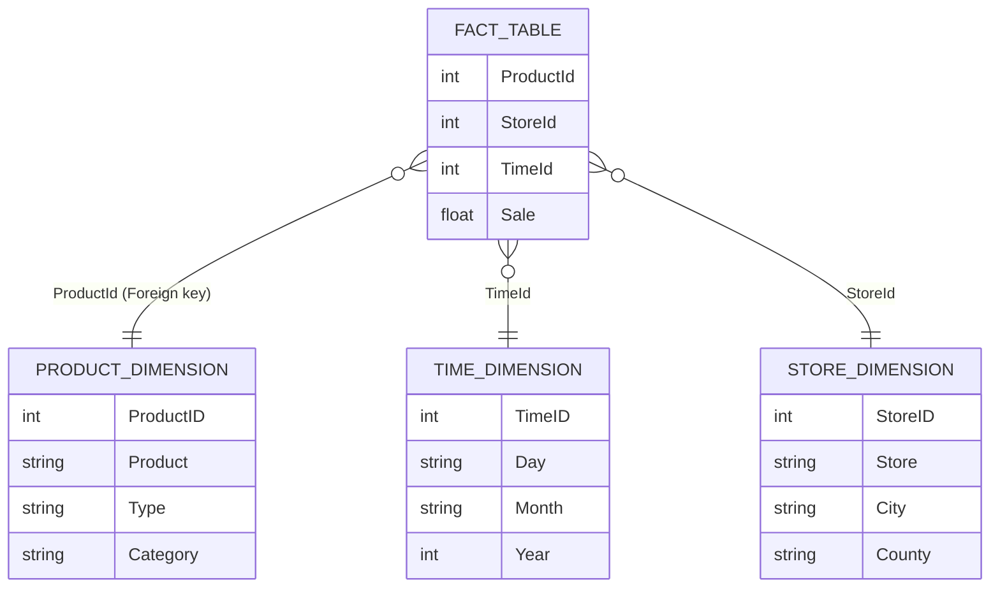

### Dimension table (Product)

<table>
  <thead>
    <tr>
        <th>ProductID</th>
        <th>Product</th>
        <th>Type</th>
        <th>Category</th>
    </tr>
  </thead>
  <tbody>
    <tr>
        <td>1</td>
<td>Top</td>
<td>Beer</td>
<td>Beverage</td>
    </tr>
  </tbody>
</table>

### Dimension table (Time)

<table>
  <thead>
    <tr>
        <th>TimeID</th>
        <th>Day</th>
        <th>Month</th>
        <th>Year</th>
    </tr>
  </thead>
  <tbody>
    <tr>
        <td>1</td>
<td>25.</td>
<td>Maj</td>
<td>1997</td>
    </tr>
  </tbody>
</table>

### Fact table

<table>
  <thead>
    <tr>
        <th>ProductId</th>
        <th>StoreId</th>
        <th>TimeId</th>
        <th>Sale</th>
    </tr>
  </thead>
  <tbody>
    <tr>
        <td>1</td>
<td>1</td>
<td>1</td>
<td>5.75</td>
    </tr>
  </tbody>
</table>

*Note: ProductId in the Fact table is a Foreign key.*

### Dimension table (Store)

<table>
  <thead>
    <tr>
        <th>StoreID</th>
        <th>Store</th>
        <th>City</th>
        <th>County</th>
    </tr>
  </thead>
  <tbody>
    <tr>
        <td>1</td>
<td>Trøjborg</td>
<td>Århus</td>
<td>Århus</td>
    </tr>
  </tbody>
</table>


---

# Snowflake Schema

* Snowflake schema tables
    * Dimensions are *normalized*
    * One dimension table per level
    * Each dimension table has
        - an integer key
        - a level name
        - one column per attribute
        - a foreign key to the next level

A stylized snowflake character is shown in the top right corner of the page.

The following tables represent a snowflake schema:

**Type Table**

<table>
  <thead>
    <tr>
        <th>TypeID</th>
        <th>Type</th>
        <th>CategoryID</th>
    </tr>
  </thead>
  <tbody>
    <tr>
        <td>1</td>
<td>Beer</td>
<td>1</td>
    </tr>
  </tbody>
</table>

**Product Table**

<table>
  <thead>
    <tr>
        <th>ProductID</th>
        <th>Product</th>
        <th>TypeID</th>
    </tr>
  </thead>
  <tbody>
    <tr>
        <td>1</td>
<td>Top</td>
<td>1</td>
    </tr>
  </tbody>
</table>

**Month Table**

<table>
  <thead>
    <tr>
        <th>MonthID</th>
        <th>Month</th>
        <th>YearID</th>
    </tr>
  </thead>
  <tbody>
    <tr>
        <td>1</td>
<td>May</td>
<td>1</td>
    </tr>
  </tbody>
</table>

**Time Table**

<table>
  <thead>
    <tr>
        <th>TimeID</th>
        <th>Day</th>
        <th>MonthID</th>
    </tr>
  </thead>
  <tbody>
    <tr>
        <td>1</td>
<td>25.</td>
<td>1</td>
    </tr>
  </tbody>
</table>

**Fact Table (Sales)**

<table>
  <thead>
    <tr>
        <th>ProductID</th>
        <th>StoreID</th>
        <th>TimeId</th>
        <th>Sale</th>
    </tr>
  </thead>
  <tbody>
    <tr>
        <td>1</td>
<td>1</td>
<td>1</td>
<td>5.75</td>
    </tr>
  </tbody>
</table>

**Store Table**

<table>
  <thead>
    <tr>
        <th>StoreID</th>
        <th>Store</th>
        <th>CityID</th>
    </tr>
  </thead>
  <tbody>
    <tr>
        <td>1</td>
<td>Trøjborg</td>
<td>1</td>
    </tr>
  </tbody>
</table>

*(Note: A label "Foreign key" points to the CityID column in this table)*

**City Table**

<table>
  <thead>
    <tr>
        <th>CityID</th>
        <th>City</th>
        <th>CountyId</th>
    </tr>
  </thead>
  <tbody>
    <tr>
        <td>1</td>
<td>Århus</td>
<td>1</td>
    </tr>
  </tbody>
</table>

### Schema Diagram

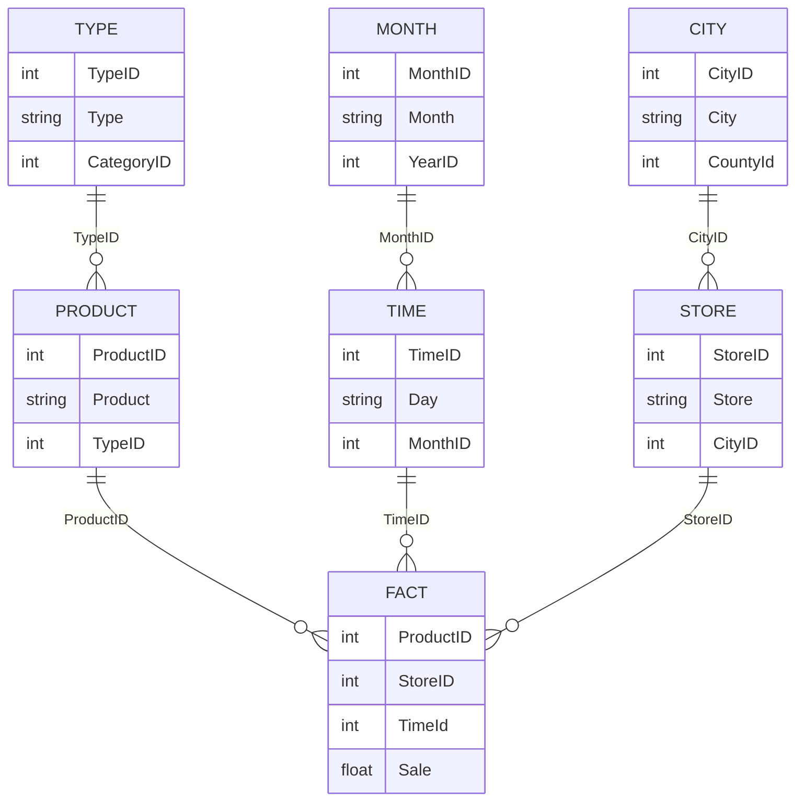

AALBORG UNIVERSITET
SIDE 25


---


# Star vs. Snowflake

* Star Schemas
    + Simple and easy overview → ease-of-use
    + Dimension tables often relatively small
    + "Recognized" by many RDBMSes → good performance
    - Hierarchies are "hidden" in the columns
    - Dimension tables are de-normalized

A yellow five-pointed star icon is displayed to the right of the Star Schemas section.

* Snowflake schemas
    + Hierarchies are made explicit/visible
    + Dimension tables use less space
    - Harder to use due to many joins
    - Worse performance

A blue square icon featuring a stylized white snowflake with a face is displayed to the right of the Snowflake schemas section.

AALBORG UNIVERSITET
SIDE 26


---

# Redundancy in DW

* Only very little or no redundancy in fact tables
* Redundancy is mostly in dimension tables.
    - Star dimension tables have redundant entries for the higher levels.
* Redundancy problems?
    - Inconsistent data: The central load process helps with this.
    - Update time: The DW is optimized for querying, not updates.
    - Space use: Dimension tables typically take up less than 5% of DW.

* So, **controlled** redundancy is acceptable.

AALBORG UNIVERSITET
SIDE 27


---

# Agenda

* Introduction
* Fundamental Multidimensional Modelling
* Relational Representations
* Querying
* Changing Dimensions

AALBORG UNIVERSITET
SIDE 28


---

# Case Study: Grocery Store

* Products sold from a POS system in Stores with Promotions
    - Point Of Sale
* Task: Analyze how promotions affect sales

AALBORG UNIVERSITET
SIDE 29


---


# DW Design Steps

* Choose the **business process(es)** to model
    * Sales
* Choose the **granularity** of the business process
    * Sales by Product by Store by Promotion by Day
    * Low granularity is needed
* Choose the **dimensions**
    * Time, Store, Promotion, Product
* Choose the **measures**
    * Dollar_sales, unit_sales, dollar_cost, customer_count

AALBORG UNIVERSITET
SIDE 30


---


# The Grocery Store Dimensions

* Time dimension
    - Explicit time dimension is needed (events, holidays,..)
* Product dimension
    - Many-level hierarchy allows drill-down/roll-up
    - **Many** descriptive attributes (often more than 50)
* Store dimension
    - Many descriptive attributes
* Promotion dimension
    - Used to see if promotions work/are profitable
    - Ads, price reductions, end-of-aisle displays, coupons

AALBORG UNIVERSITET
SIDE 31


---

# The Grocery Store Measures

* All **additive measures** across all dimensions
    * Dollar_sales
    * Unit_sales
    * Dollar_cost
* Gross profit (derived)
    * Computed from sales and cost: sales – cost
    * Additive
* Gross margin (derived)
    * Computed from gross profit and sales: (sales – cost)/cost
* Customer_count
    * Additive **measure** across time, promotion, and store

AALBORG UNIVERSITET
SIDE 32


---


# OLAP Queries

* Two kinds of queries
    * **Navigation queries** examine one dimension
        - `SELECT DISTINCT l FROM d [WHERE p]`
    * **Aggregation queries** summarize fact data
        - `SELECT d1.l1, d2.l2, SUM(f.m) FROM d1, d2, f`
        - `WHERE f.dk1 = d1.dk1 AND f.dk2 = d2.dk2 [AND p]`
        - `GROUP BY d1.l1,d2.l2`
* Fast, interactive analysis of large amounts of data

The following table represents the data values shown in the OLAP cube diagram, which dimensions include Product (Milk, Bread), City (Aalborg, Copenhagen), and Year (2000, 2001):

<table>
  <thead>
    <tr>
        <th>Product</th>
        <th>City</th>
        <th>2000</th>
        <th>2001</th>
        <th>Side Value</th>
    </tr>
  </thead>
  <tbody>
    <tr>
        <td>Milk</td>
<td>Aalborg</td>
<td>56</td>
<td>67</td>
<td></td>
    </tr>
<tr>
        <td>Bread</td>
<td>Aalborg</td>
<td>57</td>
<td>45</td>
<td></td>
    </tr>
<tr>
        <td>Bread</td>
<td>Copenhagen</td>
<td>123</td>
<td>127</td>
<td>211</td>
    </tr>
  </tbody>
</table>

AALBORG UNIVERSITET
SIDE 33


---


# OLAP Queries

## Starting level (City, Year, Product)

<table>
  <thead>
    <tr>
        <th>Product</th>
        <th>City</th>
        <th>2000</th>
        <th>2001</th>
    </tr>
  </thead>
  <tbody>
    <tr>
        <td rowspan="2">Milk</td>
<td>Aalborg</td>
<td>56</td>
<td>67</td>
    </tr>
<tr>
        <td>Copenhagen</td>
<td>[empty]</td>
<td>[empty]</td>
<td></td>
    </tr>
<tr>
        <td rowspan="2">Bread</td>
<td>Aalborg</td>
<td>57</td>
<td>45</td>
    </tr>
<tr>
        <td>Copenhagen</td>
<td>123</td>
<td>127</td>
<td></td>
    </tr>
  </tbody>
</table>

*Note: The value **211** is displayed on the side of the cube, corresponding to the Copenhagen/Milk data.*

## Slice/Dice:

<table>
  <thead>
    <tr>
        <th>Year: 2000</th>
        <th>Milk</th>
        <th>Bread</th>
    </tr>
  </thead>
  <tbody>
    <tr>
        <td>Aalborg</td>
<td>[empty]</td>
<td>[empty]</td>
    </tr>
<tr>
        <td>Copenhagen</td>
<td>[empty]</td>
<td>[empty]</td>
    </tr>
  </tbody>
</table>

## Roll-up: get overview

<table>
  <thead>
    <tr>
        <th>ALL Time</th>
        <th>Milk</th>
        <th>Bread</th>
    </tr>
  </thead>
  <tbody>
    <tr>
        <td>Aalborg</td>
<td>[empty]</td>
<td>[empty]</td>
    </tr>
<tr>
        <td>Copenhagen</td>
<td>[empty]</td>
<td>[empty]</td>
    </tr>
  </tbody>
</table>

> **What is this value?**
> (An arrow points to the cell for Copenhagen, Bread, aggregated over ALL Time)

## Drill-down: more detail

<table>
  <thead>
    <tr>
        <th>City / Product</th>
        <th>01-06 /2000</th>
        <th>07-12 /2000</th>
        <th>01-06 /2001</th>
        <th>07-12 /2001</th>
        <th></th>
    </tr>
  </thead>
  <tbody>
    <tr>
        <td rowspan="2">Milk</td>
<td>[empty]</td>
<td>[empty]</td>
<td>[empty]</td>
<td>[empty]</td>
<td></td>
    </tr>
<tr>
        <td rowspan="2">Bread</td>
<td>[empty]</td>
<td>[empty]</td>
<td>[empty]</td>
<td>[empty]</td>
<td></td>
    </tr>
<tr>
        <td>Aalborg</td>
<td>[empty]</td>
<td>[empty]</td>
<td>[empty]</td>
<td>[empty]</td>
<td></td>
    </tr>
<tr>
        <td>Copenhagen</td>
<td>[empty]</td>
<td>[empty]</td>
<td>[empty]</td>
<td>[empty]</td>
<td></td>
    </tr>
  </tbody>
</table>

AALBORG UNIVERSITET
SIDE 34


---

# "Drill-down" vs. "Drill-out"

* We "**drill-down**" when we go downwards from one (non-T) level in a hierarchy to another level in the same hierarchy
* We "**drill-out**" when we include a level from another hierarchy in the analysis
* Consider the following hierarchies:

#### Store Dimension
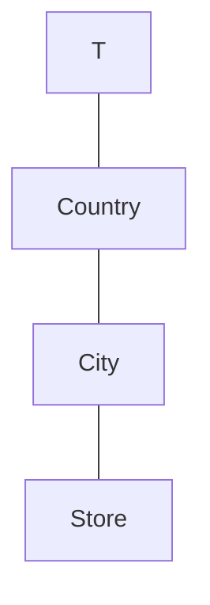

#### Product Dimension
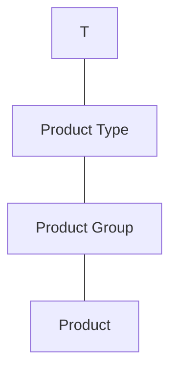

AALBORG UNIVERSITET
SIDE 35


---

# Drill-down Example

<table>
  <thead>
    <tr>
        <th>Country</th>
        <th>Sales</th>
    </tr>
  </thead>
  <tbody>
    <tr>
        <td>Denmark</td>
<td>4200</td>
    </tr>
<tr>
        <td>Sweden</td>
<td>5500</td>
    </tr>
  </tbody>
</table>

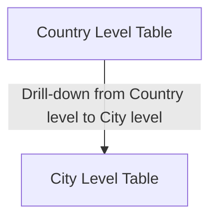

<table>
  <thead>
    <tr>
        <th>City</th>
        <th>Sales</th>
    </tr>
  </thead>
  <tbody>
    <tr>
        <td>Aalborg</td>
<td>2000</td>
    </tr>
<tr>
        <td>Copenhagen</td>
<td>2200</td>
    </tr>
<tr>
        <td>Lund</td>
<td>2500</td>
    </tr>
<tr>
        <td>Stockholm</td>
<td>3000</td>
    </tr>
  </tbody>
</table>

AALBORG UNIVERSITET
SIDE 36


---


# Drill-out Example

<table>
  <thead>
    <tr>
        <th>Country</th>
        <th>Sales</th>
    </tr>
  </thead>
  <tbody>
    <tr>
        <td>Denmark</td>
<td>4200</td>
    </tr>
<tr>
        <td>Sweden</td>
<td>5500</td>
    </tr>
  </tbody>
</table>

↓ Drill-out to include the Product Type level

<table>
  <thead>
    <tr>
        <th>Country</th>
        <th>Product Type</th>
        <th>Sales</th>
    </tr>
  </thead>
  <tbody>
    <tr>
        <td>Denmark</td>
<td>Food</td>
<td>3000</td>
    </tr>
<tr>
        <td>Denmark</td>
<td>Non-food</td>
<td>1200</td>
    </tr>
<tr>
        <td>Sweden</td>
<td>Food</td>
<td>4000</td>
    </tr>
<tr>
        <td>Sweden</td>
<td>Non-food</td>
<td>1500</td>
    </tr>
  </tbody>
</table>

AALBORG UNIVERSITET
SIDE 37


---

# Drill-across

* To **drill-across** means to combine two cubes by means of one or more *shared dimensions*.
    - In relational terms this corresponds to a join
* The resulting cube holds measures from both cubes.
    - For non-shared dimensions, it is like that we roll up to their top level.

AALBORG UNIVERSITET
SIDE 38


---


# Drill-across Example

* A book retailer with two cubes
    * **ShopSales** with dimensions Book, Date, and Shop
    * **InternetSales** with dimensions Book, Date, and Customer
* To find the total sales, the book retailer drills-across and considers the (calculated) measure
  `shop_sales + internet_sales`

### SHOP SALES
Dimensions: Shop (Miami, Boston, Arlington), Date (2009, 2008), Book (Book A, Book B, Book C, Book D, Book E)

<table>
  <thead>
    <tr>
        <th>Date</th>
        <th>Book A</th>
        <th>Book B</th>
        <th>Book C</th>
        <th>Book D</th>
        <th>Book E</th>
    </tr>
  </thead>
  <tbody>
    <tr>
        <td>2009</td>
<td></td>
<td></td>
<td></td>
<td></td>
<td></td>
    </tr>
<tr>
        <td>2008</td>
        <td colspan="5"></td>
    </tr>
  </tbody>
</table>

### INTERNET SALES
Dimensions: Customer (Cust 4, Cust 3, Cust 2, Cust 1), Date (2009, 2008), Book (Book A, Book B, Book C, Book D, Book E)

<table>
  <thead>
    <tr>
        <th>Date</th>
        <th>Book A</th>
        <th>Book B</th>
        <th>Book C</th>
        <th>Book D</th>
        <th>Book E</th>
    </tr>
  </thead>
  <tbody>
    <tr>
        <td>2009</td>
<td></td>
<td></td>
<td></td>
<td></td>
<td></td>
    </tr>
<tr>
        <td>2008</td>
        <td colspan="5"></td>
    </tr>
  </tbody>
</table>

↓

### DRILL-ACROSS RESULT
Dimensions: Date (2009, 2008), Book (Book A, Book B, Book C, Book D, Book E)

<table>
  <thead>
    <tr>
        <th>Date</th>
        <th>Book A</th>
        <th>Book B</th>
        <th>Book C</th>
        <th>Book D</th>
        <th>Book E</th>
    </tr>
  </thead>
  <tbody>
    <tr>
        <td>2009</td>
<td></td>
<td></td>
<td></td>
<td></td>
<td></td>
    </tr>
<tr>
        <td>2008</td>
        <td colspan="5"></td>
    </tr>
  </tbody>
</table>

AALBORG UNIVERSITET
SIDE 39


---

# Data Warehouse Software and Tools

* Many out there. How to choose?
    - Open source or not?
    - Local vs. cloud?
    - Performance and scalability
    - Integration
    - 10 Best Data Warehouse Tools to Explore in 2023: https://hevodata.com/learn/data-warehouse-tools/
* Apache Kylin
    - https://kylin.apache.org/
* MS Excel Power Pivot
    - https://www.youtube.com/watch?v=rB_IiYbOo7w

AALBORG UNIVERSITET
SIDE 40


---

# Agenda

* Introduction
* Fundamental Multidimensional Modelling
* Relational Representations
* Querying
* Changing Dimensions
    - NB: Mainly for self-study

AALBORG UNIVERSITET
SIDE 41


---

# Slowly Changing Dimensions

* So far, we've assumed that dimensions are stable over time:
    - New rows in dimension tables can be inserted
    - Existing rows do not change
* We now study techniques for handling changes in dimensions.
* "Slowly changing dimensions" phenomenon
    - Dimension information can change, but changes are not frequent.
    - We (still) assume that the schema is fixed.

AALBORG UNIVERSITET
SIDE 42


---


# Example

## Time dim.

<table>
  <thead>
    <tr>
        <th>TimeID</th>
    </tr>
  </thead>
  <tbody>
    <tr>
        <td>Weekday</td>
    </tr>
<tr>
        <td>Week</td>
    </tr>
<tr>
        <td>Month</td>
    </tr>
<tr>
        <td>Quarter</td>
    </tr>
<tr>
        <td>Year</td>
    </tr>
<tr>
        <td>DayNo</td>
    </tr>
<tr>
        <td>Holiday</td>
    </tr>
  </tbody>
</table>

## Sales fact

<table>
  <thead>
    <tr>
        <th>TimeID</th>
        <th>StoreID</th>
        <th>ProductID</th>
        <th>...</th>
        <th>ItemsSold</th>
        <th>Amount</th>
    </tr>
  </thead>
</table>

## Store dim.

<table>
  <thead>
    <tr>
        <th>StoreID</th>
        <th>Address</th>
        <th>City</th>
        <th>District</th>
        <th>Size</th>
        <th>SCategory</th>
    </tr>
  </thead>
</table>

## Product dim.

<table>
  <thead>
    <tr>
        <th>ProductID</th>
        <th>Description</th>
        <th>Brand</th>
        <th>PCategory</th>
    </tr>
  </thead>
</table>

> Attribute values in dimensions vary over time
> - A store changes Size
> - A product changes Description
> - Districts are changed

> **Problems**
> - Dimensions not updated
>   → DW is not up-to-date
> - Dimensions updated in a straightforward way
>   → incorrect information in historical data,
>   - E.g., wrong analysis on sales/m²

? <ins>change</ins> ?
timeline

```tsv
[thead]Time dim.
TimeID
Weekday
Week
Month
Quarter
Year
DayNo
Holiday
```

<table>
  <thead>
    <tr>
        <th>Sales fact</th>
        <th colspan="5"></th>
    </tr>
  </thead>
  <tbody>
    <tr>
        <td>TimeID</td>
<td>StoreID</td>
<td>ProductID</td>
<td>...</td>
<td>ItemsSold</td>
<td>Amount</td>
    </tr>
  </tbody>
</table>

<table>
  <thead>
    <tr>
        <th>Store dim.</th>
        <th colspan="5"></th>
    </tr>
  </thead>
  <tbody>
    <tr>
        <td>StoreID</td>
<td>Address</td>
<td>City</td>
<td>District</td>
<td>Size</td>
<td>SCategory</td>
    </tr>
  </tbody>
</table>

<table>
  <thead>
    <tr>
        <th>Product dim.</th>
        <th colspan="3"></th>
    </tr>
  </thead>
  <tbody>
    <tr>
        <td>ProductID</td>
<td>Description</td>
<td>Brand</td>
<td>PCategory</td>
    </tr>
  </tbody>
</table>


---

# Example, cont.

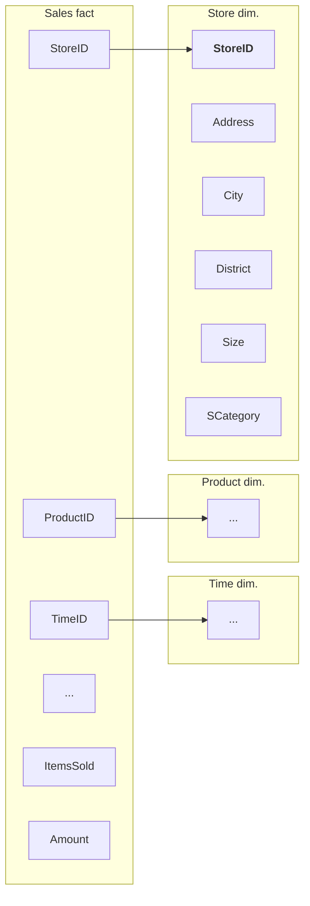

* The store in Aalborg has the size of 250 m<sup>2</sup>.
* On a certain day, customers bought 2000 apples from that store.

### Sales fact table

<table>
  <thead>
    <tr>
        <th>StoreID</th>
        <th>...</th>
        <th>ItemsSold</th>
        <th>...</th>
    </tr>
  </thead>
  <tbody>
    <tr>
        <td>001</td>
<td></td>
<td>2000</td>
<td></td>
    </tr>
  </tbody>
</table>

### Store dimension table

<table>
  <thead>
    <tr>
        <th>StoreID</th>
        <th>...</th>
        <th>Size</th>
        <th>...</th>
    </tr>
  </thead>
  <tbody>
    <tr>
        <td>001</td>
<td></td>
<td>250</td>
<td></td>
    </tr>
  </tbody>
</table>

AALBORG UNIVERSITET
SIDE 44


---

# Handling Slowly Changing Dimensions

1. No special handling
2. Versioning of dimension values
    * + Use of Timestamping
3. Capturing the previous and the current value
4. Split into changing and constant attributes

AALBORG UNIVERSITET
SIDE 45


---


# Solution 1: No Special Handling

**Sales fact table**

<table>
  <thead>
    <tr>
        <th>StoreID</th>
        <th>...</th>
        <th>ItemsSold</th>
        <th>...</th>
    </tr>
  </thead>
  <tbody>
    <tr>
        <td>001</td>
<td></td>
<td>2000</td>
<td></td>
    </tr>
  </tbody>
</table>

**Store dimension table**

<table>
  <thead>
    <tr>
        <th>StoreID</th>
        <th>...</th>
        <th>Size</th>
        <th>...</th>
    </tr>
  </thead>
  <tbody>
    <tr>
        <td>001</td>
<td></td>
<td>250</td>
<td></td>
    </tr>
  </tbody>
</table>

**The size of a store expands**

**Sales fact table**

<table>
  <thead>
    <tr>
        <th>StoreID</th>
        <th>...</th>
        <th>ItemsSold</th>
        <th>...</th>
    </tr>
  </thead>
  <tbody>
    <tr>
        <td>001</td>
<td></td>
<td>2000</td>
<td></td>
    </tr>
  </tbody>
</table>

**Store dimension table**

<table>
  <thead>
    <tr>
        <th>StoreID</th>
        <th>...</th>
        <th>Size</th>
        <th>...</th>
    </tr>
  </thead>
  <tbody>
    <tr>
        <td>001</td>
<td></td>
<td>450</td>
<td></td>
    </tr>
  </tbody>
</table>

**A new fact arrives**

**Sales fact table**

<table>
  <thead>
    <tr>
        <th>StoreID</th>
        <th>...</th>
        <th>ItemsSold</th>
        <th>...</th>
    </tr>
  </thead>
  <tbody>
    <tr>
        <td>001</td>
<td></td>
<td>2000</td>
<td></td>
    </tr>
<tr>
        <td>001</td>
<td></td>
<td>3500</td>
<td></td>
    </tr>
  </tbody>
</table>

**Store dimension table**

<table>
  <thead>
    <tr>
        <th>StoreID</th>
        <th>...</th>
        <th>Size</th>
        <th>...</th>
    </tr>
  </thead>
  <tbody>
    <tr>
        <td>001</td>
<td></td>
<td>450</td>
<td></td>
    </tr>
  </tbody>
</table>

What's the problem here?

*(Note: In the final state, red arrows point from both StoreID entries in the Sales fact table to the single StoreID entry in the Store dimension table, indicating that historical data is now linked to the updated dimension attribute.)*

AALBORG UNIVERSITET SIDE 46


---

# Solution 1

* **Solution 1**: Overwrite the old values in the dimension tables
* **Consequences**
    * Old facts point to rows in the dimension tables with incorrect information!
    * New facts point to rows with correct information
* **Pros**
    * Easy to implement
    * Useful if the updated attribute is not significant, or the old value should be updated for error correction
* **Cons**
    * Old facts may point to "incorrect" rows in dimensions

AALBORG UNIVERSITET
SIDE 47


---

# Solution 2: Versioning of Rows

<table>
  <thead>
    <tr>
        <th>StoreID</th>
        <th>...</th>
        <th>ItemsSold</th>
        <th>...</th>
    </tr>
  </thead>
  <tbody>
    <tr>
        <td>001</td>
<td></td>
<td>2000</td>
<td></td>
    </tr>
  </tbody>
</table>

<table>
  <thead>
    <tr>
        <th>StoreID</th>
        <th>...</th>
        <th>Size</th>
        <th>...</th>
    </tr>
  </thead>
  <tbody>
    <tr>
        <td>001</td>
<td></td>
<td>250</td>
<td></td>
    </tr>
  </tbody>
</table>

different versions of a store

<table>
  <thead>
    <tr>
        <th>StoreID</th>
        <th>...</th>
        <th>ItemsSold</th>
        <th>...</th>
    </tr>
  </thead>
  <tbody>
    <tr>
        <td>001</td>
<td></td>
<td>2000</td>
<td></td>
    </tr>
  </tbody>
</table>

<table>
  <thead>
    <tr>
        <th>StoreID</th>
        <th>...</th>
        <th>Size</th>
        <th>...</th>
    </tr>
  </thead>
  <tbody>
    <tr>
        <td>001</td>
<td></td>
<td>250</td>
<td></td>
    </tr>
<tr>
        <td>002</td>
<td></td>
<td>450</td>
<td></td>
    </tr>
  </tbody>
</table>

A new fact arrives

<table>
  <thead>
    <tr>
        <th>StoreID</th>
        <th>...</th>
        <th>ItemsSold</th>
        <th>...</th>
    </tr>
  </thead>
  <tbody>
    <tr>
        <td>001</td>
<td></td>
<td>2000</td>
<td></td>
    </tr>
<tr>
        <td>002</td>
<td></td>
<td>3500</td>
<td></td>
    </tr>
  </tbody>
</table>

<table>
  <thead>
    <tr>
        <th>StoreID</th>
        <th>...</th>
        <th>Size</th>
        <th>...</th>
    </tr>
  </thead>
  <tbody>
    <tr>
        <td>001</td>
<td></td>
<td>250</td>
<td></td>
    </tr>
<tr>
        <td>002</td>
<td></td>
<td>450</td>
<td></td>
    </tr>
  </tbody>
</table>

Which store does the new fact refer to?

AALBORG UNIVERSITET
SIDE 48


---


# Solution 2

* **Solution 2: Versioning of rows with changing attributes**
    - The *key* that links the dimension table and the fact table, identifies a *version* of a dimension member, not just a dimension member
    - Surrogate keys make this easier to implement
        - – what if we had used, e.g., the shop’s zip code as key?
        - Always use surrogate keys!!!
* **Consequences**
    - Larger dimension tables
* **Pros**
    - Correct information captured in DW
    - No problems when formulating queries
* **Cons**
    - Cannot capture the development over time of the subjects the dimensions describe in the simplest form (but we can fix that)

AALBORG UNIVERSITET
SIDE 49


---


# Solution 2 with Timestamping

<table>
  <thead>
    <tr>
        <th>StoreID</th>
        <th>TimeID</th>
        <th>...</th>
        <th>ItemsSold</th>
        <th>...</th>
    </tr>
  </thead>
  <tbody>
    <tr>
        <td>001</td>
<td>234</td>
<td></td>
<td>2000</td>
<td></td>
    </tr>
  </tbody>
</table>

<table>
  <thead>
    <tr>
        <th>StoreID</th>
        <th>Size</th>
        <th>From</th>
        <th>To</th>
    </tr>
  </thead>
  <tbody>
    <tr>
        <td>001</td>
<td>250</td>
<td>1998</td>
<td>-</td>
    </tr>
  </tbody>
</table>

↓

attributes: "From", "To"

<table>
  <thead>
    <tr>
        <th>StoreID</th>
        <th>TimeID</th>
        <th>...</th>
        <th>ItemsSold</th>
        <th>...</th>
    </tr>
  </thead>
  <tbody>
    <tr>
        <td>001</td>
<td>234</td>
<td></td>
<td>2000</td>
<td></td>
    </tr>
  </tbody>
</table>

<table>
  <thead>
    <tr>
        <th>StoreID</th>
        <th>Size</th>
        <th>From</th>
        <th>To</th>
    </tr>
  </thead>
  <tbody>
    <tr>
        <td>001</td>
<td>250</td>
<td>1998</td>
<td>1999</td>
    </tr>
<tr>
        <td>002</td>
<td>450</td>
<td>2000</td>
<td>-</td>
    </tr>
  </tbody>
</table>

↓

<table>
  <thead>
    <tr>
        <th>StoreID</th>
        <th>TimeID</th>
        <th>...</th>
        <th>ItemsSold</th>
        <th>...</th>
    </tr>
  </thead>
  <tbody>
    <tr>
        <td>001</td>
<td>234</td>
<td></td>
<td>2000</td>
<td></td>
    </tr>
<tr>
        <td>002</td>
<td>456</td>
<td></td>
<td>3500</td>
<td></td>
    </tr>
  </tbody>
</table>

<table>
  <thead>
    <tr>
        <th>StoreID</th>
        <th>Size</th>
        <th>From</th>
        <th>To</th>
    </tr>
  </thead>
  <tbody>
    <tr>
        <td>001</td>
<td>250</td>
<td>1998</td>
<td>1999</td>
    </tr>
<tr>
        <td>002</td>
<td>450</td>
<td>2000</td>
<td>-</td>
    </tr>
  </tbody>
</table>

AALBORG UNIVERSITET
SIDE 50


---


AALBORG UNIVERSITET
SIDE 51

# Solution 2 with Timestamping

* Versioning of rows with changing attributes. Use timestamping of row versions in the SCD with From and To attributes

* Pros
    - Correct information captured in DW
* Cons
    - Larger dimension tables
        - (not really a problem)

---

# Example

* Product descriptions are versioned, when products are changed, e.g., new package sizes
    - Old versions are still in the stores, new facts can refer to both the newest and older versions of products
    - Time value for a fact not necessarily between “From” and “To” values in the fact’s Product dimension row

* Unlike changes in Size for a store, where all facts from a certain point in time will refer to the newest Size value

AALBORG UNIVERSITET
SIDE 52


---


# Solution 3: Two Versions of Changing Attribute

<table>
  <thead>
    <tr>
        <th>StoreID</th>
        <th>...</th>
        <th>ItemsSold</th>
        <th>...</th>
    </tr>
  </thead>
  <tbody>
    <tr>
        <td>001</td>
<td></td>
<td>2000</td>
<td></td>
    </tr>
  </tbody>
</table>

<table>
  <thead>
    <tr>
        <th>StoreID</th>
        <th>...</th>
        <th>DistrictOld</th>
        <th>DistrictNew</th>
        <th>...</th>
    </tr>
  </thead>
  <tbody>
    <tr>
        <td>001</td>
<td></td>
<td>37</td>
<td>37</td>
<td></td>
    </tr>
  </tbody>
</table>

↓

versions of an attribute

<table>
  <thead>
    <tr>
        <th>StoreID</th>
        <th>...</th>
        <th>ItemsSold</th>
        <th>...</th>
    </tr>
  </thead>
  <tbody>
    <tr>
        <td>001</td>
<td></td>
<td>2000</td>
<td></td>
    </tr>
  </tbody>
</table>

<table>
  <thead>
    <tr>
        <th>StoreID</th>
        <th>...</th>
        <th>DistrictOld</th>
        <th>DistrictNew</th>
        <th>...</th>
    </tr>
  </thead>
  <tbody>
    <tr>
        <td>001</td>
<td></td>
<td>37</td>
<td>73</td>
<td></td>
    </tr>
  </tbody>
</table>

↓

<table>
  <thead>
    <tr>
        <th>StoreID</th>
        <th>...</th>
        <th>ItemsSold</th>
        <th>...</th>
    </tr>
  </thead>
  <tbody>
    <tr>
        <td>001</td>
<td></td>
<td>2000</td>
<td></td>
    </tr>
<tr>
        <td>001</td>
<td></td>
<td>2100</td>
<td></td>
    </tr>
  </tbody>
</table>

<table>
  <thead>
    <tr>
        <th>StoreID</th>
        <th>...</th>
        <th>DistrictOld</th>
        <th>DistrictNew</th>
        <th>...</th>
    </tr>
  </thead>
  <tbody>
    <tr>
        <td>001</td>
<td></td>
<td>37</td>
<td>73</td>
<td></td>
    </tr>
  </tbody>
</table>

We cannot find out **when** the district changed.

AALBORG UNIVERSITET
SIDE 53


---


# Solution 3

* **Solution 3**: Create two versions of each changing attribute
    * One attribute contains the current value
    * The other attribute contains the previous value
* **Consequences**
    * Two values are attached to each dimension row
* **Pros**
    * Possible to compare across the change in dimension value (which is a problem with Solution 2)
        - Such comparisons are interesting when we need to work simultaneously with two alternative values
        - Example: Categorization of stores and products
* **Cons**
    * Not possible to see when the old value changed to the new
    * Only possible to capture the two latest values

AALBORG UNIVERSITET
SIDE 54


---

# Rapidly Changing Dimensions

* Difference between “slowly” and “rapidly” is subjective
    - Solution 2 is often still feasible
    - The problem is the size of the dimension
* Example
    - Assume an Employee dimension with 100,000 employees, each using 2K bytes and many changes every year
    - Solution 2 is recommended
* Examples of (large) dimensions with many changes: Product and Customer
* The more attributes in a dimension table, the more changes per row are expected
* Example
    - A Customer dimension with 100M customers and many attributes
    - Solution 2 yields a dimension that is too large

AALBORG UNIVERSITET
SIDE 55


---


# Solution 4: Dimension Splitting

The image illustrates the concept of "Dimension Splitting," where an original dimension is divided into two separate dimensions to better handle attributes with different change frequencies.

### Customer dimension (original)

<table>
  <thead>
    <tr>
        <th></th>
        <th>Customer dimension (original)</th>
    </tr>
  </thead>
  <tbody>
    <tr>
        <td></td>
<td>CustomerID</td>
    </tr>
<tr>
        <td></td>
<td>Name</td>
    </tr>
<tr>
        <td></td>
<td>PostalAddress</td>
    </tr>
<tr>
        <td></td>
<td>DateOfBirth</td>
    </tr>
<tr>
        <td></td>
<td>...</td>
    </tr>
<tr>
        <td></td>
<td>Gender</td>
    </tr>
<tr>
        <td></td>
<td>NumberOfKids</td>
    </tr>
<tr>
        <td></td>
<td>MaritalStatus</td>
    </tr>
<tr>
        <td></td>
<td>CreditScore</td>
    </tr>
<tr>
        <td></td>
<td>BuyingStatus</td>
    </tr>
<tr>
        <td></td>
<td>Income</td>
    </tr>
<tr>
        <td></td>
<td>Age</td>
    </tr>
<tr>
        <td></td>
<td>...</td>
    </tr>
  </tbody>
</table>

The original dimension is split (indicated by a scissors icon and red arrows) into two new dimensions:

### (New) Customer dimension (SCD)
**Description:** relatively static attributes

<table>
  <thead>
    <tr>
        <th></th>
        <th>(New) Customer dimension (SCD)</th>
    </tr>
  </thead>
  <tbody>
    <tr>
        <td></td>
<td>CustomerID</td>
    </tr>
<tr>
        <td></td>
<td>Name</td>
    </tr>
<tr>
        <td></td>
<td>PostalAddress</td>
    </tr>
<tr>
        <td></td>
<td>DateOfBirth</td>
    </tr>
<tr>
        <td></td>
<td>...</td>
    </tr>
  </tbody>
</table>

### Profile dimension (not an SCD)
**Description:** often-changing attributes; describing different profiles;

<table>
  <thead>
    <tr>
        <th></th>
        <th>Profile dimension (not an SCD)</th>
    </tr>
  </thead>
  <tbody>
    <tr>
        <td></td>
<td>ProfileID</td>
    </tr>
<tr>
        <td></td>
<td>Gender</td>
    </tr>
<tr>
        <td></td>
<td>NumberOfKids</td>
    </tr>
<tr>
        <td></td>
<td>MaritalStatus</td>
    </tr>
<tr>
        <td></td>
<td>CreditScoreBand</td>
    </tr>
<tr>
        <td></td>
<td>BuyingStatusBand</td>
    </tr>
<tr>
        <td></td>
<td>IncomeBand</td>
    </tr>
<tr>
        <td></td>
<td>AgeBand</td>
    </tr>
<tr>
        <td></td>
<td>...</td>
    </tr>
  </tbody>
</table>

*Note: In the Profile dimension, the attributes CreditScoreBand, BuyingStatusBand, IncomeBand, and AgeBand are highlighted with a red circle, indicating they have been transformed from raw values into banded categories.*

AALBORG UNIVERSITET
SIDE 56


---

# Solution 4: What we do

* Make a “minidimension” with the often-changing attributes
* Convert (numeric) attributes with many possible values into attributes with few discrete or banded values
    * E.g., Income group: [0,10K), [10,20K), [20,30K), [30,40K)
    * Why? Any Information Loss?
* Insert rows for all combinations of values from these new domains
    * What do we do, if there are too many (theoretical) combinations?
* If the minidimension is too large, it can be further split into more minidimensions
    * Synchronous/correlated attributes should be in the same minidimension.

AALBORG UNIVERSITET
SIDE 57


---


# Solution 4: Pros and Cons

* Pros
    - DW size (dimension tables) is kept down
    - Changes in a customer's profile values do not result in changes in dimensions
* Cons
    - More dimensions and more keys in the star schema
    - Navigation of customer attributes is more cumbersome as these are in more than one dimension
    - Using value groups gives less detail
    - The construction of groups is irreversible

AALBORG UNIVERSITET
SIDE 58


---

# Summary

* Multidimensional data modelling
    - Cubes, Dimensions, Facts, Measures
* Relational Implementation
    - Star schema
    - Snowflake schema
* OLAP Queries
    - Slice/Dice, Roll-up
    - Drill-down, Drill-out, Drill-across
* Changing Dimensions
    - Why are there changes in dimensions?
    - Star schemas support change over time to a large extent
    - Different techniques to handle changes over time at the instance level exist
        - Solution 2 is the most useful

AALBORG UNIVERSITET
SIDE 59


---

# Readings

* Mandatory readings
    * Christian S. Jensen, Torben Bach Pedersen, and Christian Thomsen: Multidimensional Databases and Data Warehousing, Morgan & Claypool 2010.
        - Chapters 1, 2 and 3 (only 3.1 and 3.2.1)

* Acknowledgements
    * A large portion of the slides are (adapted) from Torben Bach Pedersen

AALBORG UNIVERSITET
SIDE 60


---

# Exercises

* JPT book Section 2.10
    * 2, 3, 4, 5, 7, 8, 9
* JPT book Section 3.5
    * 4, 5

AALBORG UNIVERSITET
SIDE 61
