# Data Intensive Systems (DIS)
## KBH-SW7 E25
## 2. Parallel Databases

The background of the slide is a photograph of a large, modern, multi-story indoor atrium, likely at a university. The space features several levels of balconies with wooden slat railings overlooking a central ground floor area filled with tables, chairs, and people. Large windows at the back of the hall let in natural light and show an outdoor view.

AALBORG UNIVERSITY


---

# Agenda

* Introduction
* Parallel Database Architectures
* IO Parallelism and Partitioning
* Other Types of Parallelism

AALBORG UNIVERSITET
SIDE 2


---


# Parallel Databases

* A parallel DBMS runs across multiple processors and is designed to execute operations in parallel, whenever possible.
* A parallel DBMS links a number of smaller machines to achieve the same throughput as expected from a single large machine.
* Parallel databases improve processing and IO speeds by using multiple CPUs and disks in parallel.
    - Processors are *tightly coupled* and constitutes a single database system in *a single location*.
    - Data is often partitioned among different disks to enable parallel retrieval and increase the throughput.

AALBORG UNIVERSITET
SIDE 3


---

# Distributed Databases

* A Distributed database is defined as a *logically related* collection of shared data that is *physically distributed* over a computer network on *different sites*.
    - The data is split and replicated across different sites.
* Homogeneous distributed databases
    - Same software/schema on all sites, data may be partitioned among sites
    - Goal: provide a view of a single database, hiding details of distribution
* Heterogeneous distributed databases
    - Different software/schema on different sites
    - Goal: integrate existing databases to provide useful functionality

AALBORG UNIVERSITET
SIDE 4


---


# Agenda

* Introduction
* Parallel Database Architectures
    - Shared Nothing
    - Shared Memory
    - Shared Disk
    - Hierarchical
* IO Parallelism and Partitioning
* Other Types of Parallelism

AALBORG UNIVERSITET SIDE 5


---

# Parallel Database Architectures

* **Shared memory** -- processors share a common memory
* **Shared disk** -- processors share a common disk
* **Shared nothing** -- processors share neither a common memory nor common disk
* **Hierarchical** -- hybrid of the above architectures

AALBORG UNIVERSITET
SIDE 6


---

# Shared Memory

* Processors (and disks) have access to a common memory, typically via a bus or a high-speed LAN.
* Extremely efficient communication between processors — data in shared memory can be accessed by any processor without having to move it using software.
* Downside – architecture is not scalable beyond 32 or 64 processors since the bus or the LAN becomes a bottleneck.
* Widely used for lower degrees of parallelism (4 to 8).

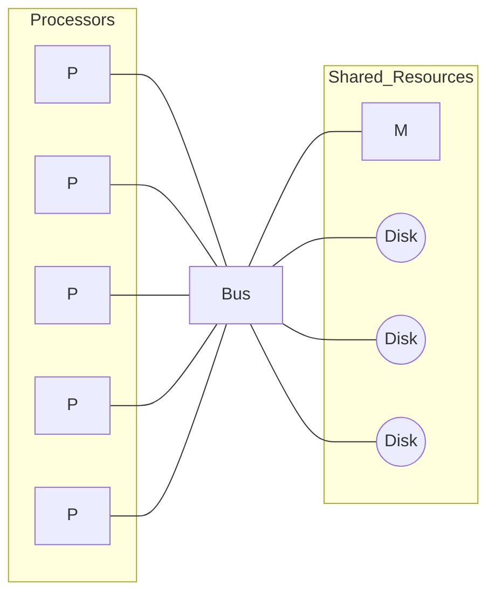

AALBORG UNIVERSITET
SIDE 7


---


# Shared Disk

* All processors can directly access all disks via an interconnection network, but the processors have private memories.
    * The memory bus is not a bottleneck
    * A degree of **fault-tolerance**: if a processor fails, the other processors can take over its tasks since the database is resident on disks that are accessible from all processors.
* Downside: bottleneck now occurs at interconnection to the disk subsystem.
* Shared-disk systems can scale to a somewhat larger number of processors, but communication between processors is slower.

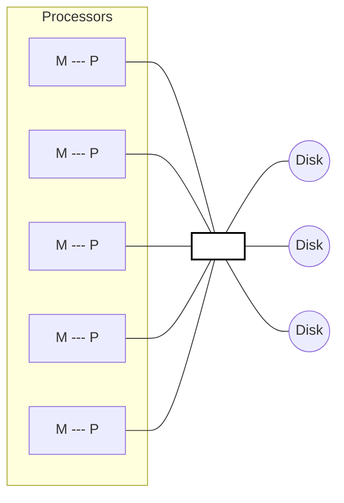

AALBORG UNIVERSITET
SIDE 8


---

# Shared Nothing

* Each node has a processor, memory, and one or more disks. Processor at a node communicates with processors at other nodes using an interconnection network.
* A node = a server for the data on its own disks.
* Data accessed from local disks (or memory) do not pass through the network, minimizing the interference of resource sharing.
* Shared-nothing multiprocessors can be scaled up to thousands of processors without interference.
* Main drawbacks:
    - cost of communication and non-local disk access
    - sending data involves software interaction at both ends.

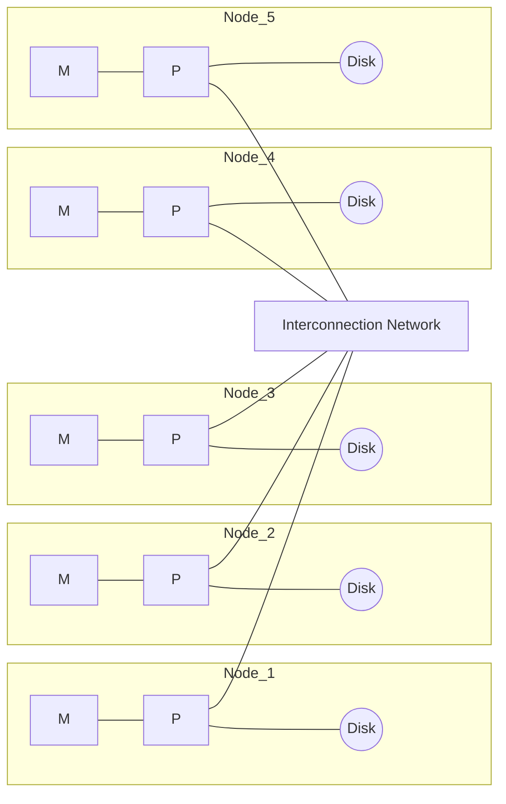

AALBORG UNIVERSITET
SIDE 9


---


# Hierarchical

* Combines characteristics of shared-memory, shared-disk, and shared-nothing architectures.
* Top level is a shared-nothing architecture – nodes connected by an interconnection network, and do not share disks or memory with each other.
* Each node can be a shared-memory system with a few processors.
    - Alternatively, each node could be a shared-disk system, and each of the systems sharing a set of disks could be a shared-memory system.

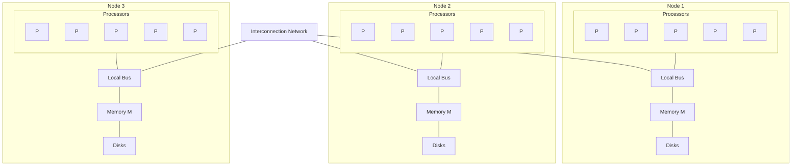

AALBORG UNIVERSITET
SIDE 10


---

# Agenda

* Introduction
* Parallel Database Architectures
* IO Parallelism and Partitioning
    - Round-robin
    - Hash
    - Range
* Other Types of Parallelism

AALBORG UNIVERSITET
SIDE 11


---

# Parallelism in Databases

* Data can be partitioned across multiple disks for parallel I/O.
* Individual relational operations (e.g., sort, join, aggregation) can be executed in parallel.
    - Data can be partitioned and each processor can work independently on its own partition.
* Queries are expressed in high level language (SQL, translated to relational algebra)
    - makes parallelization easier.
* Different queries can be run in parallel with each other.
    - *Concurrency control* takes care of conflicts.

AALBORG UNIVERSITET
SIDE 12


---


# I/O Parallelism

* Reduce the time required to retrieve relations from disk by partitioning the relations on *multiple disks*.
* **Horizontal partitioning**
    * Tuples of a relation are divided among many disks such that *each tuple* resides on one disk.
    * Mostly used in parallel databases
* Horizontal partitioning techniques
    * Round-robin
    * Hashing partitioning
    * Range partitioning

<table>
  <thead>
    <tr>
        <th>id</th>
        <th>Name</th>
        <th>Age</th>
        <th>email</th>
    </tr>
  </thead>
  <tbody>
    <tr>
        <td colspan="4">--------------------------------------------------</td>
    </tr>
  </tbody>
</table>

AALBORG UNIVERSITET
SIDE 13


---

# Data Partitioning w.r.t $$n$$ Disks

* **Round-robin**
    * Send the $$i^{th}$$ tuple in the relation to disk $$i \text{ mod } n$$.
* **Hash partitioning**
    * Choose one or more attributes as the partitioning attributes.
    * Choose hash function $$h$$ with range $$0 \dots n - 1$$
    * Let $$i$$ denote the result of hash function $$h$$ applied to the partitioning attribute value of a tuple. Send tuple to disk $$i$$.
* **Range partitioning**
    * Choose an attribute as the partitioning attribute.
    * A partitioning vector $$[v_0, v_1, \dots, v_{n-2}]$$ is chosen.
    * Let $$v$$ be the partitioning attribute value of a tuple. Tuples such that $$v_i \le v < v_{i+1}$$ go to disk $$i + 1$$. Tuples with $$v < v_0$$ go to disk 0 and tuples with $$v \ge v_{n-2}$$ go to disk $$n-1$$.
    * E.g., with a partitioning vector $$[5,11]$$, a tuple with partitioning attribute value of 2 will go to disk 0, a tuple with value 8 will go to disk 1, while a tuple with value 20 will go to disk 2.

AALBORG UNIVERSITET SIDE 14


---

# Example of Data Partitioning

<table>
  <thead>
    <tr>
        <th>R</th>
        <th>x</th>
        <th>y</th>
        <th>z</th>
    </tr>
  </thead>
  <tbody>
    <tr>
        <td>$t_1$</td>
<td>1</td>
<td>1</td>
<td>...</td>
    </tr>
<tr>
        <td>$t_2$</td>
<td>2</td>
<td>4</td>
<td>...</td>
    </tr>
<tr>
        <td>$t_3$</td>
<td>15</td>
<td>6</td>
<td></td>
    </tr>
<tr>
        <td>$t_4$</td>
<td>6</td>
<td>6</td>
<td></td>
    </tr>
<tr>
        <td>$t_5$</td>
<td>7</td>
<td>2</td>
<td>...</td>
    </tr>
<tr>
        <td>$t_6$</td>
<td>9</td>
<td>3</td>
<td>...</td>
    </tr>
<tr>
        <td>$t_7$</td>
<td>12</td>
<td>4</td>
<td></td>
    </tr>
<tr>
        <td>$t_8$</td>
<td>5</td>
<td>1</td>
<td></td>
    </tr>
<tr>
        <td>$t_9$</td>
<td>8</td>
<td>3</td>
<td>...</td>
    </tr>
  </tbody>
</table>

AALBORG UNIVERSITET
SIDE 15


---


# By Round-Robin

<table>
  <thead>
    <tr>
        <th>Disk 0</th>
        <th>Disk 1</th>
        <th>Disk 2</th>
    </tr>
  </thead>
  <tbody>
    <tr>
        <td>t&lt;sub&gt;1&lt;/sub&gt;</td>
<td>t&lt;sub&gt;2&lt;/sub&gt;</td>
<td>t&lt;sub&gt;3&lt;/sub&gt;</td>
    </tr>
<tr>
        <td>t&lt;sub&gt;4&lt;/sub&gt;</td>
<td>t&lt;sub&gt;5&lt;/sub&gt;</td>
<td>t&lt;sub&gt;6&lt;/sub&gt;</td>
    </tr>
<tr>
        <td>t&lt;sub&gt;7&lt;/sub&gt;</td>
<td>t&lt;sub&gt;8&lt;/sub&gt;</td>
<td>t&lt;sub&gt;9&lt;/sub&gt;</td>
    </tr>
  </tbody>
</table>

<table>
  <thead>
    <tr>
        <th>R</th>
        <th>x</th>
        <th>y</th>
        <th>z</th>
    </tr>
  </thead>
  <tbody>
    <tr>
        <td>t&lt;sub&gt;1&lt;/sub&gt;</td>
<td>1</td>
<td>1</td>
<td>...</td>
    </tr>
<tr>
        <td>t&lt;sub&gt;2&lt;/sub&gt;</td>
<td>2</td>
<td>4</td>
<td>...</td>
    </tr>
<tr>
        <td>t&lt;sub&gt;3&lt;/sub&gt;</td>
<td>15</td>
<td>6</td>
<td></td>
    </tr>
<tr>
        <td>t&lt;sub&gt;4&lt;/sub&gt;</td>
<td>6</td>
<td>6</td>
<td></td>
    </tr>
<tr>
        <td>t&lt;sub&gt;5&lt;/sub&gt;</td>
<td>7</td>
<td>2</td>
<td>...</td>
    </tr>
<tr>
        <td>t&lt;sub&gt;6&lt;/sub&gt;</td>
<td>9</td>
<td>3</td>
<td>...</td>
    </tr>
<tr>
        <td>t&lt;sub&gt;7&lt;/sub&gt;</td>
<td>12</td>
<td>4</td>
<td></td>
    </tr>
<tr>
        <td>t&lt;sub&gt;8&lt;/sub&gt;</td>
<td>5</td>
<td>1</td>
<td></td>
    </tr>
<tr>
        <td>t&lt;sub&gt;9&lt;/sub&gt;</td>
<td>8</td>
<td>3</td>
<td>...</td>
    </tr>
  </tbody>
</table>

AALBORG UNIVERSITET
SIDE 16


---


# By Hash

<table>
  <tbody>
    <tr>
        <td>Disk 0</td>
<td>Disk 1</td>
<td>Disk 2</td>
    </tr>
<tr>
        <td>t&lt;sub&gt;3&lt;/sub&gt;</td>
<td>t&lt;sub&gt;1&lt;/sub&gt;</td>
<td>t&lt;sub&gt;2&lt;/sub&gt;</td>
    </tr>
<tr>
        <td>t&lt;sub&gt;4&lt;/sub&gt;</td>
<td>t&lt;sub&gt;5&lt;/sub&gt;</td>
<td>t&lt;sub&gt;8&lt;/sub&gt;</td>
    </tr>
<tr>
        <td>t&lt;sub&gt;6&lt;/sub&gt;</td>
<td></td>
<td>t&lt;sub&gt;9&lt;/sub&gt;</td>
    </tr>
<tr>
        <td>t&lt;sub&gt;7&lt;/sub&gt;</td>
        <td colspan="2"></td>
    </tr>
  </tbody>
</table>

* Hash function: $h(x) = x \pmod 3$

<table>
  <thead>
    <tr>
        <th>R</th>
        <th>x</th>
        <th>y</th>
        <th>z</th>
    </tr>
  </thead>
  <tbody>
    <tr>
        <td>t&lt;sub&gt;1&lt;/sub&gt;</td>
<td>1</td>
<td>1</td>
<td>...</td>
    </tr>
<tr>
        <td>t&lt;sub&gt;2&lt;/sub&gt;</td>
<td>2</td>
<td>4</td>
<td>...</td>
    </tr>
<tr>
        <td>t&lt;sub&gt;3&lt;/sub&gt;</td>
<td>15</td>
<td>6</td>
<td></td>
    </tr>
<tr>
        <td>t&lt;sub&gt;4&lt;/sub&gt;</td>
<td>6</td>
<td>6</td>
<td></td>
    </tr>
<tr>
        <td>t&lt;sub&gt;5&lt;/sub&gt;</td>
<td>7</td>
<td>2</td>
<td>...</td>
    </tr>
<tr>
        <td>t&lt;sub&gt;6&lt;/sub&gt;</td>
<td>9</td>
<td>3</td>
<td>...</td>
    </tr>
<tr>
        <td>t&lt;sub&gt;7&lt;/sub&gt;</td>
<td>12</td>
<td>4</td>
<td></td>
    </tr>
<tr>
        <td>t&lt;sub&gt;8&lt;/sub&gt;</td>
<td>5</td>
<td>1</td>
<td></td>
    </tr>
<tr>
        <td>t&lt;sub&gt;9&lt;/sub&gt;</td>
<td>8</td>
<td>3</td>
<td>...</td>
    </tr>
  </tbody>
</table>

AALBORG UNIVERSITET
SIDE 17


---


# By Range

<table>
  <thead>
    <tr>
        <th>Disk 0</th>
        <th>Disk 1</th>
        <th>Disk 2</th>
    </tr>
  </thead>
  <tbody>
    <tr>
        <td>t&lt;sub&gt;1&lt;/sub&gt;</td>
<td>t&lt;sub&gt;4&lt;/sub&gt;</td>
<td>t&lt;sub&gt;3&lt;/sub&gt;</td>
    </tr>
<tr>
        <td>t&lt;sub&gt;2&lt;/sub&gt;</td>
<td>t&lt;sub&gt;5&lt;/sub&gt;</td>
<td>t&lt;sub&gt;7&lt;/sub&gt;</td>
    </tr>
<tr>
        <td>t&lt;sub&gt;8&lt;/sub&gt;</td>
<td>t&lt;sub&gt;6&lt;/sub&gt;</td>
<td></td>
    </tr>
<tr>
        <td></td>
<td>t&lt;sub&gt;9&lt;/sub&gt;</td>
<td></td>
    </tr>
  </tbody>
</table>

The diagram illustrates a range partitioning strategy across three disks based on the value of attribute $x$:
- **Disk 0** handles range **0**: $x \le 5$
- **Disk 1** handles range **1**: $5 < x \le 10$
- **Disk 2** handles range **2**: $x > 10$

The following table provides the attribute values for each tuple:

<table>
  <thead>
    <tr>
        <th>R</th>
        <th>x</th>
        <th>y</th>
        <th>z</th>
    </tr>
  </thead>
  <tbody>
    <tr>
        <td>t&lt;sub&gt;1&lt;/sub&gt;</td>
<td>1</td>
<td>1</td>
<td>...</td>
    </tr>
<tr>
        <td>t&lt;sub&gt;2&lt;/sub&gt;</td>
<td>2</td>
<td>4</td>
<td>...</td>
    </tr>
<tr>
        <td>t&lt;sub&gt;3&lt;/sub&gt;</td>
<td>15</td>
<td>6</td>
<td></td>
    </tr>
<tr>
        <td>t&lt;sub&gt;4&lt;/sub&gt;</td>
<td>6</td>
<td>6</td>
<td></td>
    </tr>
<tr>
        <td>t&lt;sub&gt;5&lt;/sub&gt;</td>
<td>7</td>
<td>2</td>
<td>...</td>
    </tr>
<tr>
        <td>t&lt;sub&gt;6&lt;/sub&gt;</td>
<td>9</td>
<td>3</td>
<td>...</td>
    </tr>
<tr>
        <td>t&lt;sub&gt;7&lt;/sub&gt;</td>
<td>12</td>
<td>4</td>
<td></td>
    </tr>
<tr>
        <td>t&lt;sub&gt;8&lt;/sub&gt;</td>
<td>5</td>
<td>1</td>
<td></td>
    </tr>
<tr>
        <td>t&lt;sub&gt;9&lt;/sub&gt;</td>
<td>8</td>
<td>3</td>
<td>...</td>
    </tr>
  </tbody>
</table>

AALBORG UNIVERSITET
SIDE 18


---


# Queries

* How to process queries against a partitioned relation?
* Three types of queries
    - Query-1: Find all tuples that have $x = 8$.
        - A *point query* issued on the partitioning attribute.
    - Query-2: Find all tuples that have $a < x \le b$.
        - A *range query* on the partitioning attribute.
    - Query-3: Find all tuples that have $a < y \le b$.
        - A *range query* **<u>NOT</u>** on the partitioning attribute.

<table>
  <thead>
    <tr>
        <th>R</th>
        <th>x</th>
        <th>y</th>
        <th>z</th>
    </tr>
  </thead>
  <tbody>
    <tr>
        <td>t&lt;sub&gt;1&lt;/sub&gt;</td>
<td>1</td>
<td>1</td>
<td>...</td>
    </tr>
<tr>
        <td>t&lt;sub&gt;2&lt;/sub&gt;</td>
<td>2</td>
<td>4</td>
<td>...</td>
    </tr>
<tr>
        <td>t&lt;sub&gt;3&lt;/sub&gt;</td>
<td>15</td>
<td>6</td>
<td></td>
    </tr>
<tr>
        <td>t&lt;sub&gt;4&lt;/sub&gt;</td>
<td>6</td>
<td>6</td>
<td></td>
    </tr>
<tr>
        <td>t&lt;sub&gt;5&lt;/sub&gt;</td>
<td>7</td>
<td>2</td>
<td>...</td>
    </tr>
<tr>
        <td>t&lt;sub&gt;6&lt;/sub&gt;</td>
<td>9</td>
<td>3</td>
<td>...</td>
    </tr>
<tr>
        <td>t&lt;sub&gt;7&lt;/sub&gt;</td>
<td>12</td>
<td>4</td>
<td></td>
    </tr>
<tr>
        <td>t&lt;sub&gt;8&lt;/sub&gt;</td>
<td>5</td>
<td>1</td>
<td></td>
    </tr>
<tr>
        <td>t&lt;sub&gt;9&lt;/sub&gt;</td>
<td>8</td>
<td>3</td>
<td>...</td>
    </tr>
  </tbody>
</table>

AALBORG UNIVERSITET
SIDE 19


---


# Query-1: Find all tuples that have $x = 8$

* Under Round-Robin:
    * All disks need to be searched.
    * In each disk, if there is no index, then all buckets need to be searched.
* In the example,

<table>
  <thead>
    <tr>
        <th>Disk 0</th>
        <th>Disk 1</th>
        <th>Disk 2</th>
    </tr>
  </thead>
  <tbody>
    <tr>
        <td>$t_1$</td>
<td>$t_2$</td>
<td>$t_3$</td>
    </tr>
<tr>
        <td>$t_4$</td>
<td>$t_5$</td>
<td>$t_6$</td>
    </tr>
<tr>
        <td>$t_7$</td>
<td>$t_8$</td>
<td>$t_9$</td>
    </tr>
  </tbody>
</table>

> **Worst case:**
> Each tuple in a different local bucket.

<table>
  <thead>
    <tr>
        <th></th>
        <th>Without Local Index</th>
        <th>With Local Index</th>
    </tr>
  </thead>
  <tbody>
    <tr>
        <td>Disks searched</td>
<td>3</td>
<td>3</td>
    </tr>
<tr>
        <td>*Response time*</td>
<td>3</td>
<td>1</td>
    </tr>
<tr>
        <td>Total time</td>
<td>9</td>
<td>3</td>
    </tr>
  </tbody>
</table>

AALBORG UNIVERSITET
SIDE 20


---


# Query-1: Find all tuples that have $x = 8$

* Under Round-Robin
    - All $n$ disks need to be searched. In each disk, if there is no index, then all $m$ buckets need to be searched.
* In general,

<table>
  <thead>
    <tr>
        <th></th>
        <th>Without Local Index</th>
        <th>With Local Index</th>
    </tr>
  </thead>
  <tbody>
    <tr>
        <td>Disks searched</td>
<td>$n$</td>
<td>$n$</td>
    </tr>
<tr>
        <td>Response time</td>
<td>$m$</td>
<td>$1$</td>
    </tr>
<tr>
        <td>Total time</td>
<td>$n \times m$</td>
<td>$n$</td>
    </tr>
  </tbody>
</table>

AALBORG UNIVERSITET
SIDE 21


---


# Query-1: Find all tuples that have $x = 8$

* Under Hash
    - Only 1 disk needs to be searched. In each disk, if there is no index, then all buckets need to be searched.

<table>
  <tbody>
    <tr>
        <td>Disk 0</td>
<td>Disk 1</td>
<td>Disk 2</td>
    </tr>
<tr>
        <td>t&lt;sub&gt;3&lt;/sub&gt;</td>
<td>t&lt;sub&gt;1&lt;/sub&gt;</td>
<td>t&lt;sub&gt;2&lt;/sub&gt;</td>
    </tr>
<tr>
        <td>t&lt;sub&gt;4&lt;/sub&gt;</td>
<td>t&lt;sub&gt;5&lt;/sub&gt;</td>
<td>t&lt;sub&gt;8&lt;/sub&gt;</td>
    </tr>
<tr>
        <td>t&lt;sub&gt;6&lt;/sub&gt;</td>
<td></td>
<td>t&lt;sub&gt;9&lt;/sub&gt;</td>
    </tr>
<tr>
        <td>t&lt;sub&gt;7&lt;/sub&gt;</td>
        <td colspan="2"></td>
    </tr>
  </tbody>
</table>

* In the example,

<table>
  <thead>
    <tr>
        <th></th>
        <th>Without Local Index</th>
        <th>With Local Index</th>
    </tr>
  </thead>
  <tbody>
    <tr>
        <td>Disks searched</td>
<td>1</td>
<td>1</td>
    </tr>
<tr>
        <td>Response time</td>
<td>3</td>
<td>1</td>
    </tr>
<tr>
        <td>Total time</td>
<td>3</td>
<td>1</td>
    </tr>
  </tbody>
</table>

AALBORG UNIVERSITET
SIDE 22


---


# Query-1: Find all tuples that have $x = 8$

* Under Hash
    * **Only 1 disk** needs to be searched. In each disk, if there is no index, then **all $m$ buckets** need to be searched.

* In general,

<table>
  <thead>
    <tr>
        <th></th>
        <th>Without Local Index</th>
        <th>With Local Index</th>
    </tr>
  </thead>
  <tbody>
    <tr>
        <td>Disks searched</td>
<td>1</td>
<td>1</td>
    </tr>
<tr>
        <td>*Response time*</td>
<td>$m$</td>
<td>1</td>
    </tr>
<tr>
        <td>Total time</td>
<td>$m$</td>
<td>1</td>
    </tr>
  </tbody>
</table>

AALBORG UNIVERSITET
SIDE 23


---


# Query-1: Find all tuples that have $x = 8$

* **Under Range**
    * Only 1 disk needs to be searched.
    In each disk, if there is no index, then all buckets need to be searched.
* **In the example,**

<table>
  <tbody>
    <tr>
        <td>Disk 0</td>
<td>Disk 1</td>
<td>Disk 2</td>
    </tr>
<tr>
        <td>$t_1$</td>
<td>$t_4$</td>
<td>$t_3$</td>
    </tr>
<tr>
        <td>$t_2$</td>
<td>$t_5$</td>
<td>$t_7$</td>
    </tr>
<tr>
        <td>$t_8$</td>
<td>$t_6$</td>
<td></td>
    </tr>
<tr>
        <td></td>
<td>$t_9$</td>
<td></td>
    </tr>
  </tbody>
</table>

<table>
  <thead>
    <tr>
        <th></th>
        <th>Without Local Index</th>
        <th>With Local Index</th>
    </tr>
  </thead>
  <tbody>
    <tr>
        <td>Disks searched</td>
<td>1</td>
<td>1</td>
    </tr>
<tr>
        <td>Response time</td>
<td>4</td>
<td>1</td>
    </tr>
<tr>
        <td>Total time</td>
<td>4</td>
<td>1</td>
    </tr>
  </tbody>
</table>

AALBORG UNIVERSITET
SIDE 24


---


# Query-1: Find all tuples that have $$x = 8$$

* **Under Range**
    - **Only 1 disk** needs to be searched. In each disk, if there is no index, then **all $$m$$ buckets** need to be searched.

* In general,

<table>
  <thead>
    <tr>
        <th></th>
        <th>Without Local Index</th>
        <th>With Local Index</th>
    </tr>
  </thead>
  <tbody>
    <tr>
        <td>Disks searched</td>
<td>1</td>
<td>1</td>
    </tr>
<tr>
        <td>Response time</td>
<td>m</td>
<td>1</td>
    </tr>
<tr>
        <td>Total time</td>
<td>m</td>
<td>1</td>
    </tr>
  </tbody>
</table>

AALBORG UNIVERSITET
SIDE 25


---

# Query-2: Find all tuples with $5 < x \le 8$

* Without local index
* In the example,

### Hash Partitioning Distribution

<table>
  <tbody>
    <tr>
        <td>Disk 0</td>
<td>Disk 1</td>
<td>Disk 2</td>
    </tr>
<tr>
        <td>(4)</td>
<td>(2)</td>
<td>(3)</td>
    </tr>
  </tbody>
</table>

### Comparison Table

<table>
  <thead>
    <tr>
        <th></th>
        <th>range</th>
        <th>hash</th>
        <th>Round robin</th>
    </tr>
  </thead>
  <tbody>
    <tr>
        <td>Disks searched</td>
<td>1</td>
<td>3</td>
<td>3</td>
    </tr>
<tr>
        <td>Response time</td>
<td>4</td>
<td>4</td>
<td>3</td>
    </tr>
<tr>
        <td>Total time</td>
<td>4</td>
<td>9</td>
<td>9</td>
    </tr>
  </tbody>
</table>

### Range Partitioning Distribution

<table>
  <thead>
    <tr>
        <th></th>
        <th>Disk 0</th>
        <th>Disk 1</th>
        <th>Disk 2</th>
    </tr>
  </thead>
  <tbody>
    <tr>
        <td>Range</td>
<td>$x \le 5$</td>
<td>$5 &lt; x \le 10$</td>
<td>$x &gt; 10$</td>
    </tr>
<tr>
        <td>Tuples</td>
<td>(3)</td>
<td>(4)</td>
<td>(2)</td>
    </tr>
  </tbody>
</table>

### Round Robin Partitioning Distribution

<table>
  <tbody>
    <tr>
        <td>Disk 0</td>
<td>Disk 1</td>
<td>Disk 2</td>
    </tr>
<tr>
        <td>(3)</td>
<td>(3)</td>
<td>(3)</td>
    </tr>
  </tbody>
</table>

AALBORG UNIVERSITET
SIDE 26


---


# Query-2: Find all tuples with $5 < x \leq 8$

* With local index
* In the example,

<table>
  <thead>
    <tr>
        <th></th>
        <th>range</th>
        <th>hash</th>
        <th>Round robin</th>
    </tr>
  </thead>
  <tbody>
    <tr>
        <td>Disks searched</td>
<td>1</td>
<td>3</td>
<td>3</td>
    </tr>
<tr>
        <td>Response time</td>
<td>3</td>
<td>1</td>
<td>1</td>
    </tr>
<tr>
        <td>Total time</td>
<td>3</td>
<td>3</td>
<td>3</td>
    </tr>
  </tbody>
</table>

**Hash Partitioning Distribution:**
(Indicated by a green arrow from the Hash Response time cell)
D0{6, 9, 12, 15} D1{1, 7} D2{2, 5, 8}

**Range Partitioning Distribution:**
(Indicated by a blue arrow from the Range Response time cell)
A diagram shows the data distribution across three disks:
* **Disk 0**
* **Disk 1**: Covers the range from 5 to 10 and contains the values {6, 7, 8, 9}.
* **Disk 2**

**Round Robin Partitioning Distribution:**
(Indicated by a yellow arrow from the Round robin Response time cell)
* D0{1, 6, 12}
* D1{2, 5, 7}
* D2{8, 9, 15}

AALBORG UNIVERSITET
SIDE 27


---

# Query-2: Find all tuples with $2 < y \le 5$

* Without local index
* In the example,

<table>
  <thead>
    <tr>
        <th></th>
        <th>range</th>
        <th>hash</th>
        <th>Round robin</th>
    </tr>
  </thead>
  <tbody>
    <tr>
        <td>Disks searched</td>
<td>3</td>
<td>3</td>
<td>3</td>
    </tr>
<tr>
        <td>Response time</td>
<td>4</td>
<td>4</td>
<td>3</td>
    </tr>
<tr>
        <td>Total time</td>
<td>9</td>
<td>9</td>
<td>9</td>
    </tr>
  </tbody>
</table>

AALBORG UNIVERSITET
SIDE 28


---

# Query-2: Find all tuples with $2 < y \le 5$

* With local index on y
* In the example,

**hash** data (indicated by green arrow):
D0{**3**, **4**, 6, 6} D1{1, 2} D2{1, **3**, **4**}

<table>
  <thead>
    <tr>
        <th></th>
        <th>range</th>
        <th>hash</th>
        <th>Round robin</th>
    </tr>
  </thead>
  <tbody>
    <tr>
        <td>Disks searched</td>
<td>3</td>
<td>3</td>
<td>3</td>
    </tr>
<tr>
        <td>Response time</td>
<td>2</td>
<td>2</td>
<td>2</td>
    </tr>
<tr>
        <td>Total time</td>
<td>4</td>
<td>4</td>
<td>4</td>
    </tr>
  </tbody>
</table>

**range** data (indicated by blue arrow):
D0{1, 1, **4**}
D1{2, **3**, **3**, 6}
D2{**4**, 6}

**Round robin** data (indicated by yellow arrow):
D0{1, **4**, 6}
D1{1, 2, **4**}
D2{**3**, **3**, 6}

AALBORG UNIVERSITET
SIDE 29


---

# Pros and Cons of Round Robin Partitioning

* Advantages
    - Best suited for **sequential scan** of an entire relation on each query.
    - All disks have almost an equal number of tuples; retrieval work is thus well balanced between disks.
* Range queries are difficult to process
    - No clustering, tuples are scattered across all disks
    - Thus, difficult to answer range queries

AALBORG UNIVERSITET
SIDE 30


---

# Pros and Cons of Hash Partitioning

* Good for sequential access
    * Assuming hash function is good, and partitioning attributes form a key, tuples will be equally distributed between disks
    * Retrieval work is then well balanced between disks.
* Good for point queries on partitioning attribute
    * Can lookup single disk, leaving others available for answering other queries.
    * Index on partitioning attribute can be local to disk, making lookup and update more efficient
* No clustering, so difficult to answer range queries

AALBORG UNIVERSITET
SIDE 31


---

# Pros and Cons of Range Partitioning

* Provides data clustering by partitioning attribute value.
* Good for sequential access if ranges are balanced
* Good for point queries on partitioning attribute: only one disk needs to be accessed.
* For range queries on partitioning attribute, one to a few disks may need to be accessed
    - Remaining disks are available for other queries.
    - Good if result tuples are from one to a few blocks.
    - If many blocks are to be fetched, they are still fetched from one to a few disks, and potential parallelism in disk access is wasted.
        - Example of execution skew.

AALBORG UNIVERSITET
SIDE 32


---

# Agenda

* Introduction
* Parallel Database Architectures
* IO Parallelism and Partitioning
* Other Types of Parallelism
    * Interquery Parallelism
    * Intraquery Parallelism
        - Intraoperation Parallelism
        - Interoperation Parallelism

AALBORG UNIVERSITET
SIDE 33


---


# Interquery Parallelism

* Queries/transactions execute **in parallel** with one another.
* Increases transaction throughput; used primarily to scale up a system to support a larger number of transactions per second.
* Easiest form of parallelism to support
    - particularly in a shared-memory parallel database, because even sequential database systems support concurrent processing.
* More complicated on shared-disk or shared-nothing architectures
    - *Locking* and *logging* must be coordinated by passing messages between processors.
    - Data in a local buffer may have been updated at another processor.
    - **Cache-coherency** must be maintained — reads and writes of data in buffer must find the latest version of data.

AALBORG UNIVERSITET
SIDE 34


---

# Intraquery Parallelism

* Execution of a **single query** in parallel on multiple processors/disks; important for speeding up long-running queries.
* Two complementary forms of intraquery parallelism:
    - **Intraoperation Parallelism** – parallelize the execution of each individual operation in the query. Different subsets of a relation is processed in parallel.
    - **Interoperation Parallelism** – parallelize the execution of different operations. Each operation processes the whole relation without parallelism.
* **Intraoperation Parallelism** scales better with increasing parallelism because *the number of tuples* processed by each operation is typically more than *the number of operations* in a query.

AALBORG UNIVERSITET
SIDE 35


---


# Parallel Algorithms for Relational Operations

* We assume:
    - *read-only* queries
    - *shared-nothing* architecture
    - *n* processors, *P*<sub>0</sub>, ..., *P*<sub>*n*-1</sub>, and *n* disks *D*<sub>0</sub>, ..., *D*<sub>*n*-1</sub>, where disk *D*<sub>*i*</sub> is associated with processor *P*<sub>*i*</sub>.
* If a processor has multiple disks, they can simply simulate a single disk *D*<sub>*i*</sub>.
* Shared-nothing architectures can be efficiently simulated on shared-memory and shared-disk systems.
    - Algorithms for shared-nothing systems can thus be run on shared-memory and shared-disk systems.
    - However, some optimizations may be possible.

AALBORG UNIVERSITET
SIDE 36


---


# Parallel Algorithms

* Parallel Sort
    - Range-Partitioning Sort
    - Parallel External Sort-Merge
* Parallel Join
    - Partitioned Parallel Join
    - Fragment-and-Replicate Join (Asymmetric and Symmetric)
    - Partitioned Parallel Hash-Join
    - Parallel Nested-Loop Join

AALBORG UNIVERSITET
SIDE 37


---


# Range-Partitioning Sort

Choose processors $$P_0, \dots, P_m$$, where $$m \le n - 1$$ to do sorting.

1. Create **range-partition vector** with $$m$$ entries, on the sorting attributes
2. Redistribute the relation using range partitioning
    - All tuples that lie in the $$i$$<sup>th</sup> range are sent to processor $$P_i$$
    - $$P_i$$ stores the tuples it received temporarily on disk $$D_i$$.
    - This step requires I/O and communication overhead.
3. Each processor $$P_i$$ sorts **its own partition** of the relation locally.
    - Each processors executes same operation (sort) in parallel with other processors, without any interaction with the others (**data parallelism**).
4. Final **merge operation** is trivial: range-partitioning ensures that, for $$1 \le i < j \le m$$, the key values in processor $$P_i$$ are all less than the key values in $$P_j$$.

AALBORG UNIVERSITET
SIDE 38


---


# Range-Partitioning Sort

## Employee

<table>
  <thead>
    <tr>
        <th>Employee_ID</th>
        <th>Employee_Name</th>
        <th>Salary</th>
    </tr>
  </thead>
  <tbody>
    <tr>
        <td>E101</td>
<td>Andy</td>
<td>1000</td>
    </tr>
<tr>
        <td>E102</td>
<td>Bob</td>
<td>750</td>
    </tr>
<tr>
        <td>E103</td>
<td>Christian</td>
<td>400</td>
    </tr>
<tr>
        <td>E104</td>
<td>Adam</td>
<td>600</td>
    </tr>
<tr>
        <td>E105</td>
<td>Bill</td>
<td>1500</td>
    </tr>
<tr>
        <td>E106</td>
<td>John</td>
<td>300</td>
    </tr>
<tr>
        <td>E107</td>
<td>Helle</td>
<td>1200</td>
    </tr>
<tr>
        <td>E108</td>
<td>Jimmy</td>
<td>350</td>
    </tr>
<tr>
        <td>E109</td>
<td>Will</td>
<td>800</td>
    </tr>
<tr>
        <td>E110</td>
<td>Tommy</td>
<td>1150</td>
    </tr>
  </tbody>
</table>

The `Employee` table is partitioned into three separate tables (D1, D2, and D3) based on the `Salary` column using the range partition criteria `[500, 900]`.

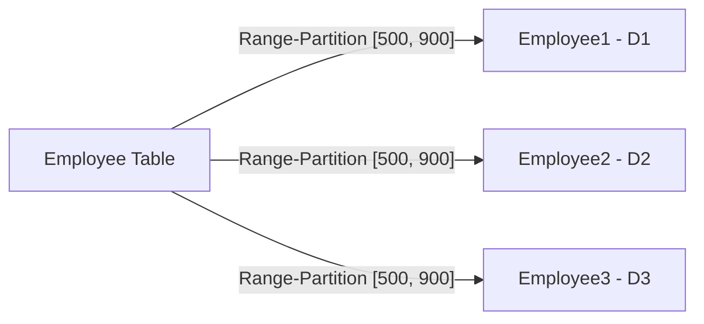

### Employee1 (D1)

<table>
  <thead>
    <tr>
        <th>Employee_ID</th>
        <th>Employee_Name</th>
        <th>Salary</th>
    </tr>
  </thead>
  <tbody>
    <tr>
        <td>E103</td>
<td>Christian</td>
<td>400</td>
    </tr>
<tr>
        <td>E106</td>
<td>John</td>
<td>300</td>
    </tr>
<tr>
        <td>E108</td>
<td>Jimmy</td>
<td>350</td>
    </tr>
  </tbody>
</table>

### Employee2 (D2)

<table>
  <thead>
    <tr>
        <th>Employee_ID</th>
        <th>Employee_Name</th>
        <th>Salary</th>
    </tr>
  </thead>
  <tbody>
    <tr>
        <td>E102</td>
<td>Bob</td>
<td>750</td>
    </tr>
<tr>
        <td>E104</td>
<td>Adam</td>
<td>600</td>
    </tr>
<tr>
        <td>E109</td>
<td>Will</td>
<td>800</td>
    </tr>
  </tbody>
</table>

### Employee3 (D3)

<table>
  <thead>
    <tr>
        <th>Employee_ID</th>
        <th>Employee_Name</th>
        <th>Salary</th>
    </tr>
  </thead>
  <tbody>
    <tr>
        <td>E101</td>
<td>Andy</td>
<td>1000</td>
    </tr>
<tr>
        <td>E105</td>
<td>Bill</td>
<td>1500</td>
    </tr>
<tr>
        <td>E107</td>
<td>Helle</td>
<td>1200</td>
    </tr>
<tr>
        <td>E110</td>
<td>Tommy</td>
<td>1150</td>
    </tr>
  </tbody>
</table>

```sql
SELECT * FROM Employee ORDER BY Salary
```

AALBORG UNIVERSITET
SIDE 39


---


# Range-Partitioning Sort

## Partition D1

### Employee1 (Unsorted)

<table>
  <thead>
    <tr>
        <th>Employee_ID</th>
        <th>Employee_Name</th>
        <th>Salary</th>
    </tr>
  </thead>
  <tbody>
    <tr>
        <td>E103</td>
<td>Christian</td>
<td>400</td>
    </tr>
<tr>
        <td>E106</td>
<td>John</td>
<td>300</td>
    </tr>
<tr>
        <td>E108</td>
<td>Jimmy</td>
<td>350</td>
    </tr>
  </tbody>
</table>

**Process P1**

### Employee1 (Sorted)

<table>
  <thead>
    <tr>
        <th>Employee_ID</th>
        <th>Employee_Name</th>
        <th>Salary</th>
    </tr>
  </thead>
  <tbody>
    <tr>
        <td>E106</td>
<td>John</td>
<td>300</td>
    </tr>
<tr>
        <td>E108</td>
<td>Jimmy</td>
<td>350</td>
    </tr>
<tr>
        <td>E103</td>
<td>Christian</td>
<td>400</td>
    </tr>
  </tbody>
</table>

----

## Partition D2

### Employee2 (Unsorted)

<table>
  <thead>
    <tr>
        <th>Employee_ID</th>
        <th>Employee_Name</th>
        <th>Salary</th>
    </tr>
  </thead>
  <tbody>
    <tr>
        <td>E102</td>
<td>Bob</td>
<td>750</td>
    </tr>
<tr>
        <td>E104</td>
<td>Adam</td>
<td>600</td>
    </tr>
<tr>
        <td>E109</td>
<td>Will</td>
<td>800</td>
    </tr>
  </tbody>
</table>

**Process P2**

### Employee2 (Sorted)

<table>
  <thead>
    <tr>
        <th>Employee_ID</th>
        <th>Employee_Name</th>
        <th>Salary</th>
    </tr>
  </thead>
  <tbody>
    <tr>
        <td>E104</td>
<td>Adam</td>
<td>600</td>
    </tr>
<tr>
        <td>E102</td>
<td>Bob</td>
<td>750</td>
    </tr>
<tr>
        <td>E109</td>
<td>Will</td>
<td>800</td>
    </tr>
  </tbody>
</table>

----

## Partition D3

### Employee3 (Unsorted)

<table>
  <thead>
    <tr>
        <th>Employee_ID</th>
        <th>Employee_Name</th>
        <th>Salary</th>
    </tr>
  </thead>
  <tbody>
    <tr>
        <td>E101</td>
<td>Andy</td>
<td>1000</td>
    </tr>
<tr>
        <td>E105</td>
<td>Bill</td>
<td>1500</td>
    </tr>
<tr>
        <td>E107</td>
<td>Helle</td>
<td>1200</td>
    </tr>
<tr>
        <td>E110</td>
<td>Tommy</td>
<td>1150</td>
    </tr>
  </tbody>
</table>

**Process P3**

### Employee3 (Sorted)

<table>
  <thead>
    <tr>
        <th>Employee_ID</th>
        <th>Employee_Name</th>
        <th>Salary</th>
    </tr>
  </thead>
  <tbody>
    <tr>
        <td>E101</td>
<td>Andy</td>
<td>1000</td>
    </tr>
<tr>
        <td>E110</td>
<td>Tommy</td>
<td>1150</td>
    </tr>
<tr>
        <td>E107</td>
<td>Helle</td>
<td>1200</td>
    </tr>
<tr>
        <td>E105</td>
<td>Bill</td>
<td>1500</td>
    </tr>
  </tbody>
</table>

AALBORG UNIVERSITET
SIDE 40


---


# Range-Partitioning Sort

### Employee1
D1

<table>
  <thead>
    <tr>
        <th>Employee_ID</th>
        <th>Employee_Name</th>
        <th>Salary</th>
    </tr>
  </thead>
  <tbody>
    <tr>
        <td>E106</td>
<td>John</td>
<td>300</td>
    </tr>
<tr>
        <td>E108</td>
<td>Jimmy</td>
<td>350</td>
    </tr>
<tr>
        <td>E103</td>
<td>Christian</td>
<td>400</td>
    </tr>
  </tbody>
</table>

### Employee2
D2

<table>
  <thead>
    <tr>
        <th>Employee_ID</th>
        <th>Employee_Name</th>
        <th>Salary</th>
    </tr>
  </thead>
  <tbody>
    <tr>
        <td>E104</td>
<td>Adam</td>
<td>600</td>
    </tr>
<tr>
        <td>E102</td>
<td>Bob</td>
<td>750</td>
    </tr>
<tr>
        <td>E109</td>
<td>Will</td>
<td>800</td>
    </tr>
  </tbody>
</table>

### Employee3
D3

<table>
  <thead>
    <tr>
        <th>Employee_ID</th>
        <th>Employee_Name</th>
        <th>Salary</th>
    </tr>
  </thead>
  <tbody>
    <tr>
        <td>E101</td>
<td>Andy</td>
<td>1000</td>
    </tr>
<tr>
        <td>E110</td>
<td>Tommy</td>
<td>1150</td>
    </tr>
<tr>
        <td>E107</td>
<td>Helle</td>
<td>1200</td>
    </tr>
<tr>
        <td>E105</td>
<td>Bill</td>
<td>1500</td>
    </tr>
  </tbody>
</table>

The partitions D1, D2, and D3 are combined into a single table:

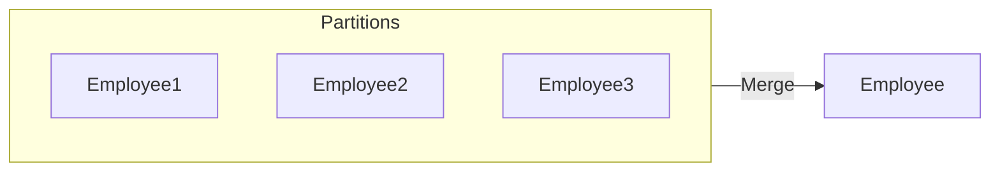

### Employee

<table>
  <thead>
    <tr>
        <th>Employee_ID</th>
        <th>Employee_Name</th>
        <th>Salary</th>
    </tr>
  </thead>
  <tbody>
    <tr>
        <td>E106</td>
<td>John</td>
<td>300</td>
    </tr>
<tr>
        <td>E108</td>
<td>Jimmy</td>
<td>350</td>
    </tr>
<tr>
        <td>E103</td>
<td>Christian</td>
<td>400</td>
    </tr>
<tr>
        <td>E104</td>
<td>Adam</td>
<td>600</td>
    </tr>
<tr>
        <td>E102</td>
<td>Bob</td>
<td>750</td>
    </tr>
<tr>
        <td>E109</td>
<td>Will</td>
<td>800</td>
    </tr>
<tr>
        <td>E101</td>
<td>Andy</td>
<td>1000</td>
    </tr>
<tr>
        <td>E110</td>
<td>Tommy</td>
<td>1150</td>
    </tr>
<tr>
        <td>E107</td>
<td>Helle</td>
<td>1200</td>
    </tr>
<tr>
        <td>E105</td>
<td>Bill</td>
<td>1500</td>
    </tr>
  </tbody>
</table>

AALBORG UNIVERSITET
SIDE 41


---

# Illustration of Range-Partitioning Sort

* Suppose the relation R to sort is on $P_0$, and we need the sorted result on $P_n$.

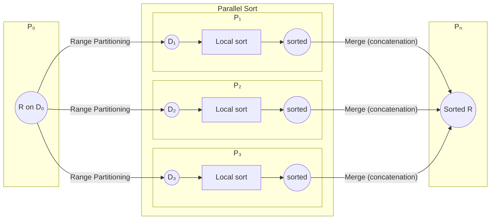

AALBORG UNIVERSITET | Range Partitioning | Parallel Sort | Merge (concatenation) | SIDE 42


---


# Parallel External Sort-Merge

* Assume the relation has already been partitioned among disks D<sub>0</sub>, ..., D<sub>n-1</sub> (in *whatever* manner).

1. Each processor P<sub>i</sub> locally sorts the data on disk D<sub>i</sub> to run R<sub>i</sub>.
2. Use a range-partitioning vector to partition each sorted run R<sub>i</sub> into processors P<sub>0</sub>, ..., P<sub>n-1</sub>.
    * Each P<sub>i</sub> transfers the data *in order*; but all processors do so *in parallel*.
    * Each processor sends the first partition to P<sub>0</sub>, then the second partition to P<sub>1</sub>, and so on so forth.
3. Each processor P<sub>i</sub> performs a merge on the incoming range-partitioned data from every other processor.
    * The merges to get all sorted runs are parallelized.
4. The sorted data on processors P<sub>0</sub>, ..., P<sub>n-1</sub> are concatenated to get the final result.

AALBORG UNIVERSITET
SIDE 43


---


AALBORG UNIVERSITET
SIDE 44

# Parallel External Sort-Merge

## Employee

<table>
  <thead>
    <tr>
        <th>Employee_ID</th>
        <th>Employee_Name</th>
        <th>Salary</th>
    </tr>
  </thead>
  <tbody>
    <tr>
        <td>E101</td>
<td>Andy</td>
<td>1000</td>
    </tr>
<tr>
        <td>E102</td>
<td>Bob</td>
<td>750</td>
    </tr>
<tr>
        <td>E103</td>
<td>Christian</td>
<td>400</td>
    </tr>
<tr>
        <td>E104</td>
<td>Adam</td>
<td>600</td>
    </tr>
<tr>
        <td>E105</td>
<td>Bill</td>
<td>1500</td>
    </tr>
<tr>
        <td>E106</td>
<td>John</td>
<td>300</td>
    </tr>
<tr>
        <td>E107</td>
<td>Helle</td>
<td>1200</td>
    </tr>
<tr>
        <td>E108</td>
<td>Jimmy</td>
<td>350</td>
    </tr>
<tr>
        <td>E109</td>
<td>Will</td>
<td>800</td>
    </tr>
<tr>
        <td>E110</td>
<td>Tommy</td>
<td>1150</td>
    </tr>
  </tbody>
</table>

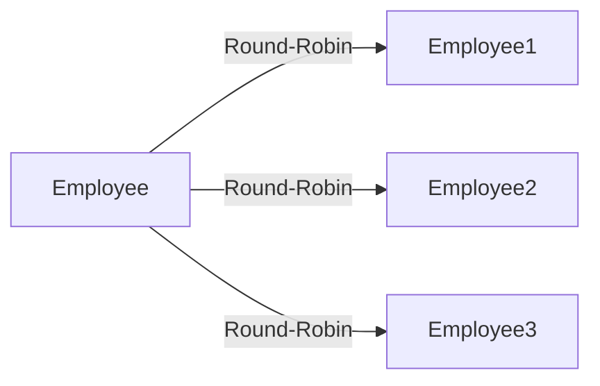

## Employee1 (D1)

<table>
  <thead>
    <tr>
        <th>Employee_ID</th>
        <th>Employee_Name</th>
        <th>Salary</th>
    </tr>
  </thead>
  <tbody>
    <tr>
        <td>E101</td>
<td>Andy</td>
<td>1000</td>
    </tr>
<tr>
        <td>E104</td>
<td>Adam</td>
<td>600</td>
    </tr>
<tr>
        <td>E107</td>
<td>Helle</td>
<td>1200</td>
    </tr>
<tr>
        <td>E110</td>
<td>Tommy</td>
<td>1150</td>
    </tr>
  </tbody>
</table>

## Employee2 (D2)

<table>
  <thead>
    <tr>
        <th>Employee_ID</th>
        <th>Employee_Name</th>
        <th>Salary</th>
    </tr>
  </thead>
  <tbody>
    <tr>
        <td>E102</td>
<td>Bob</td>
<td>750</td>
    </tr>
<tr>
        <td>E105</td>
<td>Bill</td>
<td>1500</td>
    </tr>
<tr>
        <td>E108</td>
<td>Jimmy</td>
<td>350</td>
    </tr>
  </tbody>
</table>

## Employee3 (D3)

<table>
  <thead>
    <tr>
        <th>Employee_ID</th>
        <th>Employee_Name</th>
        <th>Salary</th>
    </tr>
  </thead>
  <tbody>
    <tr>
        <td>E103</td>
<td>Christian</td>
<td>400</td>
    </tr>
<tr>
        <td>E106</td>
<td>John</td>
<td>300</td>
    </tr>
<tr>
        <td>E109</td>
<td>Will</td>
<td>800</td>
    </tr>
  </tbody>
</table>


---

# Parallel External Sort-Merge

## Node D1
### Employee1 (Initial)

<table>
  <thead>
    <tr>
        <th>Employee_ID</th>
        <th>Employee_Name</th>
        <th>Salary</th>
    </tr>
  </thead>
  <tbody>
    <tr>
        <td>E101</td>
<td>Andy</td>
<td>1000</td>
    </tr>
<tr>
        <td>E104</td>
<td>Adam</td>
<td>600</td>
    </tr>
<tr>
        <td>E107</td>
<td>Helle</td>
<td>1200</td>
    </tr>
<tr>
        <td>E110</td>
<td>Tommy</td>
<td>1150</td>
    </tr>
  </tbody>
</table>

**Process P1**

### Employee1 (Sorted)

<table>
  <thead>
    <tr>
        <th>Employee_ID</th>
        <th>Employee_Name</th>
        <th>Salary</th>
    </tr>
  </thead>
  <tbody>
    <tr>
        <td>E104</td>
<td>Adam</td>
<td>600</td>
    </tr>
<tr>
        <td>E101</td>
<td>Andy</td>
<td>1000</td>
    </tr>
<tr>
        <td>E110</td>
<td>Tommy</td>
<td>1150</td>
    </tr>
<tr>
        <td>E107</td>
<td>Helle</td>
<td>1200</td>
    </tr>
  </tbody>
</table>

## Node D2
### Employee2 (Initial)

<table>
  <thead>
    <tr>
        <th>Employee_ID</th>
        <th>Employee_Name</th>
        <th>Salary</th>
    </tr>
  </thead>
  <tbody>
    <tr>
        <td>E102</td>
<td>Bob</td>
<td>750</td>
    </tr>
<tr>
        <td>E105</td>
<td>Bill</td>
<td>1500</td>
    </tr>
<tr>
        <td>E108</td>
<td>Jimmy</td>
<td>350</td>
    </tr>
  </tbody>
</table>

**Process P2**

### Employee2 (Sorted)

<table>
  <thead>
    <tr>
        <th>Employee_ID</th>
        <th>Employee_Name</th>
        <th>Salary</th>
    </tr>
  </thead>
  <tbody>
    <tr>
        <td>E108</td>
<td>Jimmy</td>
<td>350</td>
    </tr>
<tr>
        <td>E102</td>
<td>Bob</td>
<td>750</td>
    </tr>
<tr>
        <td>E105</td>
<td>Bill</td>
<td>1500</td>
    </tr>
  </tbody>
</table>

## Node D3
### Employee3 (Initial)

<table>
  <thead>
    <tr>
        <th>Employee_ID</th>
        <th>Employee_Name</th>
        <th>Salary</th>
    </tr>
  </thead>
  <tbody>
    <tr>
        <td>E103</td>
<td>Christian</td>
<td>400</td>
    </tr>
<tr>
        <td>E106</td>
<td>John</td>
<td>300</td>
    </tr>
<tr>
        <td>E109</td>
<td>Will</td>
<td>800</td>
    </tr>
  </tbody>
</table>

**Process P3**

### Employee3 (Sorted)

<table>
  <thead>
    <tr>
        <th>Employee_ID</th>
        <th>Employee_Name</th>
        <th>Salary</th>
    </tr>
  </thead>
  <tbody>
    <tr>
        <td>E106</td>
<td>John</td>
<td>300</td>
    </tr>
<tr>
        <td>E103</td>
<td>Christian</td>
<td>400</td>
    </tr>
<tr>
        <td>E109</td>
<td>Will</td>
<td>800</td>
    </tr>
  </tbody>
</table>

AALBORG UNIVERSITET
SIDE 45


---

# Parallel External Sort-Merge

## Initial Data Distribution

### Employee1 (D1)

<table>
  <thead>
    <tr>
        <th>Employee_ID</th>
        <th>Employee_Name</th>
        <th>Salary</th>
    </tr>
  </thead>
  <tbody>
    <tr>
        <td>E104</td>
<td>Adam</td>
<td>600</td>
    </tr>
<tr>
        <td>E101</td>
<td>Andy</td>
<td>1000</td>
    </tr>
<tr>
        <td>E110</td>
<td>Tommy</td>
<td>1150</td>
    </tr>
<tr>
        <td>E107</td>
<td>Helle</td>
<td>1200</td>
    </tr>
  </tbody>
</table>

### Employee2 (D2)

<table>
  <thead>
    <tr>
        <th>Employee_ID</th>
        <th>Employee_Name</th>
        <th>Salary</th>
    </tr>
  </thead>
  <tbody>
    <tr>
        <td>E108</td>
<td>Jimmy</td>
<td>350</td>
    </tr>
<tr>
        <td>E102</td>
<td>Bob</td>
<td>750</td>
    </tr>
<tr>
        <td>E105</td>
<td>Bill</td>
<td>1500</td>
    </tr>
  </tbody>
</table>

### Employee3 (D3)

<table>
  <thead>
    <tr>
        <th>Employee_ID</th>
        <th>Employee_Name</th>
        <th>Salary</th>
    </tr>
  </thead>
  <tbody>
    <tr>
        <td>E106</td>
<td>John</td>
<td>300</td>
    </tr>
<tr>
        <td>E103</td>
<td>Christian</td>
<td>400</td>
    </tr>
<tr>
        <td>E109</td>
<td>Will</td>
<td>800</td>
    </tr>
  </tbody>
</table>

## Process: Range-Partitioning Employee1

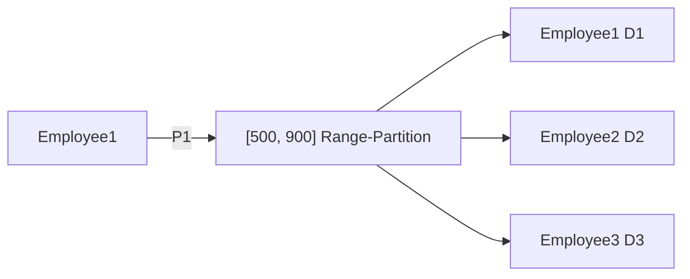

The diagram illustrates the redistribution of data from the initial **Employee1** table into three target partitions based on the salary ranges defined by the **[500, 900] Range-Partition** scheme:
- **Partition 1 (D1):** Salary < 500
- **Partition 2 (D2):** 500 ≤ Salary ≤ 900
- **Partition 3 (D3):** Salary > 900

## Redistributed Data (Example: Partitioning Employee1)

### Employee1 (D1)

<table>
  <thead>
    <tr>
        <th>Employee_ID</th>
        <th>Employee_Name</th>
        <th>Salary</th>
    </tr>
  </thead>
</table>

### Employee2 (D2)

<table>
  <thead>
    <tr>
        <th>Employee_ID</th>
        <th>Employee_Name</th>
        <th>Salary</th>
    </tr>
  </thead>
  <tbody>
    <tr>
        <td>E104</td>
<td>Adam</td>
<td>600</td>
    </tr>
  </tbody>
</table>

### Employee3 (D3)

<table>
  <thead>
    <tr>
        <th>Employee_ID</th>
        <th>Employee_Name</th>
        <th>Salary</th>
    </tr>
  </thead>
  <tbody>
    <tr>
        <td>E101</td>
<td>Andy</td>
<td>1000</td>
    </tr>
<tr>
        <td>E110</td>
<td>Tommy</td>
<td>1150</td>
    </tr>
<tr>
        <td>E107</td>
<td>Helle</td>
<td>1200</td>
    </tr>
  </tbody>
</table>

[Logo: Three curved lines in red, blue, and dark blue, representing Aalborg University]

SIDE 46


---


# Parallel External Sort-Merge

### Initial Data Distribution

**D1 Employee1**

<table>
  <thead>
    <tr>
        <th>Employee_ID</th>
        <th>Employee_Name</th>
        <th>Salary</th>
    </tr>
  </thead>
  <tbody>
    <tr>
        <td>E104</td>
<td>Adam</td>
<td>600</td>
    </tr>
<tr>
        <td>E101</td>
<td>Andy</td>
<td>1000</td>
    </tr>
<tr>
        <td>E110</td>
<td>Tommy</td>
<td>1150</td>
    </tr>
<tr>
        <td>E107</td>
<td>Helle</td>
<td>1200</td>
    </tr>
  </tbody>
</table>

**D2 Employee2**

<table>
  <thead>
    <tr>
        <th>Employee_ID</th>
        <th>Employee_Name</th>
        <th>Salary</th>
    </tr>
  </thead>
  <tbody>
    <tr>
        <td>E108</td>
<td>Jimmy</td>
<td>350</td>
    </tr>
<tr>
        <td>E102</td>
<td>Bob</td>
<td>750</td>
    </tr>
<tr>
        <td>E105</td>
<td>Bill</td>
<td>1500</td>
    </tr>
  </tbody>
</table>

**D3 Employee3**

<table>
  <thead>
    <tr>
        <th>Employee_ID</th>
        <th>Employee_Name</th>
        <th>Salary</th>
    </tr>
  </thead>
  <tbody>
    <tr>
        <td>E106</td>
<td>John</td>
<td>300</td>
    </tr>
<tr>
        <td>E103</td>
<td>Christian</td>
<td>400</td>
    </tr>
<tr>
        <td>E109</td>
<td>Will</td>
<td>800</td>
    </tr>
  </tbody>
</table>

### Range-Partitioning Process

The diagram illustrates the redistribution of data from the initial tables into new partitions based on a range-partitioning strategy.

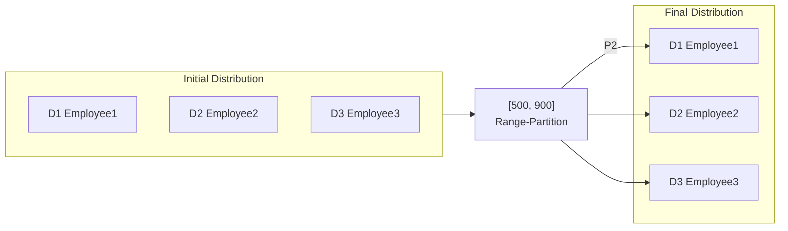

- **P2** is a label associated with the top partition redistribution.
- **[500, 900] Range-Partition** is the rule applied to redistribute the records.

### Final Data Distribution

**D1 Employee1**

<table>
  <thead>
    <tr>
        <th>Employee_ID</th>
        <th>Employee_Name</th>
        <th>Salary</th>
    </tr>
  </thead>
  <tbody>
    <tr>
        <td>E108</td>
<td>Jimmy</td>
<td>350</td>
    </tr>
  </tbody>
</table>

**D2 Employee2**

<table>
  <thead>
    <tr>
        <th>Employee_ID</th>
        <th>Employee_Name</th>
        <th>Salary</th>
    </tr>
  </thead>
  <tbody>
    <tr>
        <td>E104</td>
<td>Adam</td>
<td>600</td>
    </tr>
<tr>
        <td>E102</td>
<td>Bob</td>
<td>750</td>
    </tr>
  </tbody>
</table>

**D3 Employee3**

<table>
  <thead>
    <tr>
        <th>Employee_ID</th>
        <th>Employee_Name</th>
        <th>Salary</th>
    </tr>
  </thead>
  <tbody>
    <tr>
        <td>E101</td>
<td>Andy</td>
<td>1000</td>
    </tr>
<tr>
        <td>E110</td>
<td>Tommy</td>
<td>1150</td>
    </tr>
<tr>
        <td>E107</td>
<td>Helle</td>
<td>1200</td>
    </tr>
<tr>
        <td>E105</td>
<td>Bill</td>
<td>1500</td>
    </tr>
  </tbody>
</table>

[A stylized logo is present in the bottom left corner.]

SIDE 47


---

# Parallel External Sort-Merge

### Initial State (Disks D1, D2, D3)

**D1 Employee1**

<table>
  <thead>
    <tr>
        <th>Employee_ID</th>
        <th>Employee_Name</th>
        <th>Salary</th>
    </tr>
  </thead>
  <tbody>
    <tr>
        <td>E104</td>
<td>Adam</td>
<td>600</td>
    </tr>
<tr>
        <td>E101</td>
<td>Andy</td>
<td>1000</td>
    </tr>
<tr>
        <td>E110</td>
<td>Tommy</td>
<td>1150</td>
    </tr>
<tr>
        <td>E107</td>
<td>Helle</td>
<td>1200</td>
    </tr>
  </tbody>
</table>

**D2 Employee2**

<table>
  <thead>
    <tr>
        <th>Employee_ID</th>
        <th>Employee_Name</th>
        <th>Salary</th>
    </tr>
  </thead>
  <tbody>
    <tr>
        <td>E108</td>
<td>Jimmy</td>
<td>350</td>
    </tr>
<tr>
        <td>E102</td>
<td>Bob</td>
<td>750</td>
    </tr>
<tr>
        <td>E105</td>
<td>Bill</td>
<td>1500</td>
    </tr>
  </tbody>
</table>

**D3 Employee3**

<table>
  <thead>
    <tr>
        <th>Employee_ID</th>
        <th>Employee_Name</th>
        <th>Salary</th>
    </tr>
  </thead>
  <tbody>
    <tr>
        <td>E106</td>
<td>John</td>
<td>300</td>
    </tr>
<tr>
        <td>E103</td>
<td>Christian</td>
<td>400</td>
    </tr>
<tr>
        <td>E109</td>
<td>Will</td>
<td>800</td>
    </tr>
  </tbody>
</table>

### Range-Partition Process

The data from the initial disks is redistributed into new partitions based on the `Salary` field. The range used for partitioning is `[500, 900]`.

```mermaid
graph LR
    subgraph Initial_Disks [Initial Disks]
        D1[D1 Employee1]
        D2[D2 Employee2]
        D3[D3 Employee3]
    end

    RP["[500, 900]<br/>Range-Partition"]

    subgraph New_Partitions [New Partitions]
        E1[Employee1<br/>Salary < 500]
        E2[Employee2<br/>500 <= Salary <= 900]
        E3[Employee3 (P3)<br/>Salary > 900]
    end

    D1 & D2 & D3 --> RP
    RP --> E1
    RP --> E2
    RP --> E3
```

### Resulting Partitions

**Employee1**

<table>
  <thead>
    <tr>
        <th>Employee_ID</th>
        <th>Employee_Name</th>
        <th>Salary</th>
    </tr>
  </thead>
  <tbody>
    <tr>
        <td>E108</td>
<td>Jimmy</td>
<td>350</td>
    </tr>
<tr>
        <td>E106</td>
<td>John</td>
<td>300</td>
    </tr>
<tr>
        <td>E103</td>
<td>Christian</td>
<td>400</td>
    </tr>
  </tbody>
</table>

**Employee2**

<table>
  <thead>
    <tr>
        <th>Employee_ID</th>
        <th>Employee_Name</th>
        <th>Salary</th>
    </tr>
  </thead>
  <tbody>
    <tr>
        <td>E104</td>
<td>Adam</td>
<td>600</td>
    </tr>
<tr>
        <td>E102</td>
<td>Bob</td>
<td>750</td>
    </tr>
<tr>
        <td>E109</td>
<td>Will</td>
<td>800</td>
    </tr>
  </tbody>
</table>

**Employee3**

<table>
  <thead>
    <tr>
        <th>Employee_ID</th>
        <th>Employee_Name</th>
        <th>Salary</th>
    </tr>
  </thead>
  <tbody>
    <tr>
        <td>E101</td>
<td>Andy</td>
<td>1000</td>
    </tr>
<tr>
        <td>E110</td>
<td>Tommy</td>
<td>1150</td>
    </tr>
<tr>
        <td>E107</td>
<td>Helle</td>
<td>1200</td>
    </tr>
<tr>
        <td>E105</td>
<td>Bill</td>
<td>1500</td>
    </tr>
  </tbody>
</table>

[Aalborg University Logo] SIDE 48


---


# Parallel External Sort-Merge

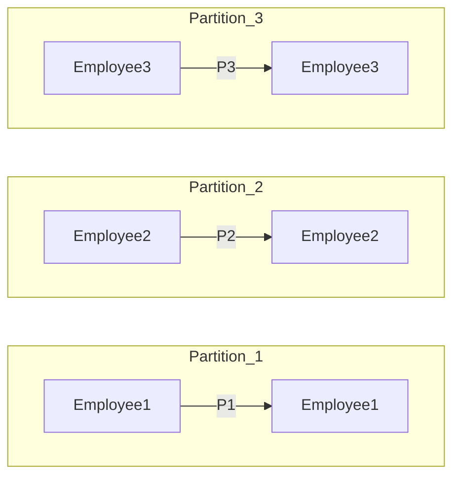

### Partition 1 (P1)

**Employee1 (Initial State)**

<table>
  <thead>
    <tr>
        <th>Employee_ID</th>
        <th>Employee_Name</th>
        <th>Salary</th>
    </tr>
  </thead>
  <tbody>
    <tr>
        <td>E108</td>
<td>Jimmy</td>
<td>350</td>
    </tr>
<tr>
        <td>E106</td>
<td>John</td>
<td>300</td>
    </tr>
<tr>
        <td>E103</td>
<td>Christian</td>
<td>400</td>
    </tr>
  </tbody>
</table>

**Employee1 (After P1 Sort)**

<table>
  <thead>
    <tr>
        <th>Employee_ID</th>
        <th>Employee_Name</th>
        <th>Salary</th>
    </tr>
  </thead>
  <tbody>
    <tr>
        <td>E106</td>
<td>John</td>
<td>300</td>
    </tr>
<tr>
        <td>E108</td>
<td>Jimmy</td>
<td>350</td>
    </tr>
<tr>
        <td>E103</td>
<td>Christian</td>
<td>400</td>
    </tr>
  </tbody>
</table>

### Partition 2 (P2)

**Employee2 (Initial State)**

<table>
  <thead>
    <tr>
        <th>Employee_ID</th>
        <th>Employee_Name</th>
        <th>Salary</th>
    </tr>
  </thead>
  <tbody>
    <tr>
        <td>E104</td>
<td>Adam</td>
<td>600</td>
    </tr>
<tr>
        <td>E102</td>
<td>Bob</td>
<td>750</td>
    </tr>
<tr>
        <td>E109</td>
<td>Will</td>
<td>800</td>
    </tr>
  </tbody>
</table>

**Employee2 (After P2 Sort)**

<table>
  <thead>
    <tr>
        <th>Employee_ID</th>
        <th>Employee_Name</th>
        <th>Salary</th>
    </tr>
  </thead>
  <tbody>
    <tr>
        <td>E104</td>
<td>Adam</td>
<td>600</td>
    </tr>
<tr>
        <td>E102</td>
<td>Bob</td>
<td>750</td>
    </tr>
<tr>
        <td>E109</td>
<td>Will</td>
<td>800</td>
    </tr>
  </tbody>
</table>

### Partition 3 (P3)

**Employee3 (Initial State)**

<table>
  <thead>
    <tr>
        <th>Employee_ID</th>
        <th>Employee_Name</th>
        <th>Salary</th>
    </tr>
  </thead>
  <tbody>
    <tr>
        <td>E101</td>
<td>Andy</td>
<td>1000</td>
    </tr>
<tr>
        <td>E110</td>
<td>Tommy</td>
<td>1150</td>
    </tr>
<tr>
        <td>E107</td>
<td>Helle</td>
<td>1200</td>
    </tr>
<tr>
        <td>E105</td>
<td>Bill</td>
<td>1500</td>
    </tr>
  </tbody>
</table>

**Employee3 (After P3 Sort)**

<table>
  <thead>
    <tr>
        <th>Employee_ID</th>
        <th>Employee_Name</th>
        <th>Salary</th>
    </tr>
  </thead>
  <tbody>
    <tr>
        <td>E101</td>
<td>Andy</td>
<td>1000</td>
    </tr>
<tr>
        <td>E110</td>
<td>Tommy</td>
<td>1150</td>
    </tr>
<tr>
        <td>E107</td>
<td>Helle</td>
<td>1200</td>
    </tr>
<tr>
        <td>E105</td>
<td>Bill</td>
<td>1500</td>
    </tr>
  </tbody>
</table>

SIDE 49


---


# Parallel External Sort-Merge

### Employee1

<table>
  <thead>
    <tr>
        <th>Employee_ID</th>
        <th>Employee_Name</th>
        <th>Salary</th>
    </tr>
  </thead>
  <tbody>
    <tr>
        <td>E106</td>
<td>John</td>
<td>300</td>
    </tr>
<tr>
        <td>E108</td>
<td>Jimmy</td>
<td>350</td>
    </tr>
<tr>
        <td>E103</td>
<td>Christian</td>
<td>400</td>
    </tr>
  </tbody>
</table>

### Employee2

<table>
  <thead>
    <tr>
        <th>Employee_ID</th>
        <th>Employee_Name</th>
        <th>Salary</th>
    </tr>
  </thead>
  <tbody>
    <tr>
        <td>E104</td>
<td>Adam</td>
<td>600</td>
    </tr>
<tr>
        <td>E102</td>
<td>Bob</td>
<td>750</td>
    </tr>
<tr>
        <td>E109</td>
<td>Will</td>
<td>800</td>
    </tr>
  </tbody>
</table>

### Employee3

<table>
  <thead>
    <tr>
        <th>Employee_ID</th>
        <th>Employee_Name</th>
        <th>Salary</th>
    </tr>
  </thead>
  <tbody>
    <tr>
        <td>E101</td>
<td>Andy</td>
<td>1000</td>
    </tr>
<tr>
        <td>E110</td>
<td>Tommy</td>
<td>1150</td>
    </tr>
<tr>
        <td>E107</td>
<td>Helle</td>
<td>1200</td>
    </tr>
<tr>
        <td>E105</td>
<td>Bill</td>
<td>1500</td>
    </tr>
  </tbody>
</table>

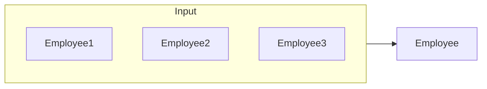

### Employee

<table>
  <thead>
    <tr>
        <th>Employee_ID</th>
        <th>Employee_Name</th>
        <th>Salary</th>
    </tr>
  </thead>
  <tbody>
    <tr>
        <td>E106</td>
<td>John</td>
<td>300</td>
    </tr>
<tr>
        <td>E108</td>
<td>Jimmy</td>
<td>350</td>
    </tr>
<tr>
        <td>E103</td>
<td>Christian</td>
<td>400</td>
    </tr>
<tr>
        <td>E104</td>
<td>Adam</td>
<td>600</td>
    </tr>
<tr>
        <td>E102</td>
<td>Bob</td>
<td>750</td>
    </tr>
<tr>
        <td>E109</td>
<td>Will</td>
<td>800</td>
    </tr>
<tr>
        <td>E101</td>
<td>Andy</td>
<td>1000</td>
    </tr>
<tr>
        <td>E110</td>
<td>Tommy</td>
<td>1150</td>
    </tr>
<tr>
        <td>E107</td>
<td>Helle</td>
<td>1200</td>
    </tr>
<tr>
        <td>E105</td>
<td>Bill</td>
<td>1500</td>
    </tr>
  </tbody>
</table>

AALBORG UNIVERSITET SIDE 50


---


AALBORG UNIVERSITET

# Illustration of Parallel External Sort-Merge

> * All processors send the 1<sup>st</sup> partition into $P_1$, then all send the 2<sup>nd</sup> partition to $P_2$, and so on so forth.
> * Each $P_i$ does a merge upon receiving the data from the others, making sure the local dataset is sorted.

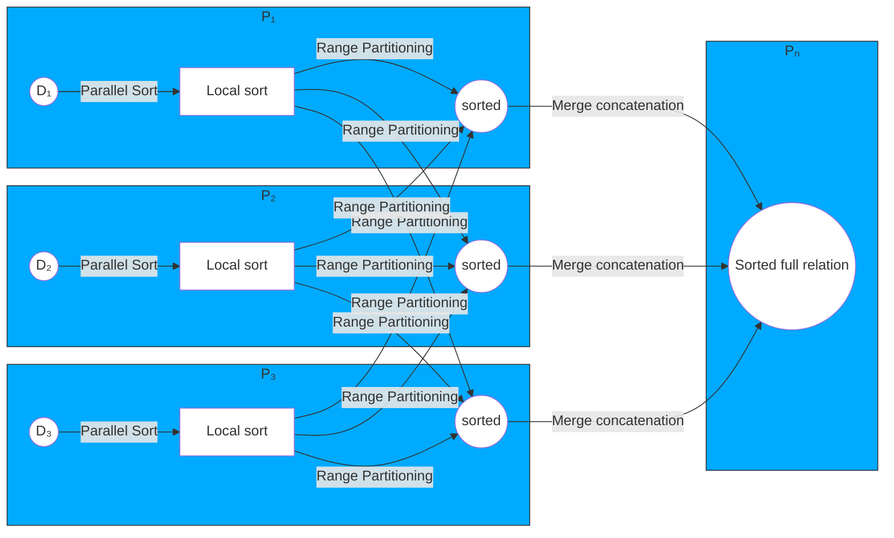

**Assume the relation has already been partitioned**

<table>
  <thead>
    <tr>
        <th>Parallel Sort</th>
        <th>Range Partitioning</th>
        <th>Merge (concatenation)</th>
    </tr>
  </thead>
</table>

SIDE 51


---


# Parallel Join

* The join operation requires pairs of tuples to be tested to see if they satisfy the join condition, and if they do, the pair is added to the join output.
* Parallel join algorithms attempt to split the pairs to be tested over several processors. Each processor then computes part of the join locally.
* In a final step, the results from each processor can be collected together to produce the final result.

AALBORG UNIVERSITET
SIDE 52


---

# Partitioned Parallel Join

* For **equi-joins** and **natural joins**, it is possible to *partition* the two input relations across the processors, and compute the join locally at each processor.
* Let *r* and *s* be the input relations, and we want to compute $$r \bowtie_{r.A=s.B} s$$.

1. Relations *r* and *s* each are partitioned into *n* partitions, denoted as *r*<sub>0</sub>, *r*<sub>1</sub>, ..., *r*<sub>n-1</sub> and *s*<sub>0</sub>, *s*<sub>1</sub>, ..., *s*<sub>n-1</sub>.
    - Can use either **range partitioning** or **hash partitioning**.
    - *r* and *s* must be partitioned on their join attributes *r.A* and *s.B*, using the **same range-partitioning vector** or **hash function**.
2. Partitions *r*<sub>i</sub> and *s*<sub>i</sub> are sent to processor *P*<sub>i</sub>.
3. Each processor *P*<sub>i</sub> locally computes $$r_i \bowtie_{r_i.A=s_i.B} s_i$$.
    - Any of the standard join methods can be used.
4. The final result is the union of all local results.

AALBORG UNIVERSITET
SIDE 53


---


# Partitioned Parallel Join

### Student

<table>
  <thead>
    <tr>
        <th>Semester</th>
        <th>Student_ID</th>
        <th>Student_Name</th>
        <th>Gender</th>
    </tr>
  </thead>
  <tbody>
    <tr>
        <td>1</td>
<td>S101</td>
<td>Adam</td>
<td>M</td>
    </tr>
<tr>
        <td>3</td>
<td>S105</td>
<td>Christian</td>
<td>M</td>
    </tr>
<tr>
        <td>4</td>
<td>S107</td>
<td>Helle</td>
<td>F</td>
    </tr>
<tr>
        <td>2</td>
<td>S110</td>
<td>Thomas</td>
<td>M</td>
    </tr>
<tr>
        <td>3</td>
<td>S103</td>
<td>Kim</td>
<td>F</td>
    </tr>
  </tbody>
</table>

### Course

<table>
  <thead>
    <tr>
        <th>Semester</th>
        <th>Course_ID</th>
        <th>Course_Name</th>
    </tr>
  </thead>
  <tbody>
    <tr>
        <td>4</td>
<td>C1</td>
<td>Data-intensive Systems</td>
    </tr>
<tr>
        <td>2</td>
<td>C2</td>
<td>Data Mining</td>
    </tr>
<tr>
        <td>3</td>
<td>C6</td>
<td>Advanced Algorithms</td>
    </tr>
<tr>
        <td>1</td>
<td>C11</td>
<td>Machine Intelligence</td>
    </tr>
  </tbody>
</table>

* Relation: **Student** and **Course**
* Joining on **Semester**
* No of disks = 2 ⇒ No of partitions = 2
* Partition: Hash partition on **Semester** by (Semester *mod* 2)
* Apply hash partition on both relations

AALBORG UNIVERSITET
SIDE 54


---

# Partitioned Parallel Join

## D0

### Student0

<table>
  <thead>
    <tr>
        <th>Semester</th>
        <th>Student_ID</th>
        <th>Student_Name</th>
        <th>Gender</th>
    </tr>
  </thead>
  <tbody>
    <tr>
        <td>4</td>
<td>S107</td>
<td>Helle</td>
<td>F</td>
    </tr>
<tr>
        <td>2</td>
<td>S110</td>
<td>Thomas</td>
<td>M</td>
    </tr>
  </tbody>
</table>

### Course0

<table>
  <thead>
    <tr>
        <th>Semester</th>
        <th>Course_ID</th>
        <th>Course_Name</th>
    </tr>
  </thead>
  <tbody>
    <tr>
        <td>4</td>
<td>C1</td>
<td>Data-intensive Systems</td>
    </tr>
<tr>
        <td>2</td>
<td>C2</td>
<td>Data Mining</td>
    </tr>
  </tbody>
</table>

## D1

### Student1

<table>
  <thead>
    <tr>
        <th>Semester</th>
        <th>Student_ID</th>
        <th>Student_Name</th>
        <th>Gender</th>
    </tr>
  </thead>
  <tbody>
    <tr>
        <td>1</td>
<td>S101</td>
<td>Adam</td>
<td>M</td>
    </tr>
<tr>
        <td>3</td>
<td>S105</td>
<td>Christian</td>
<td>M</td>
    </tr>
<tr>
        <td>3</td>
<td>S103</td>
<td>Kim</td>
<td>F</td>
    </tr>
  </tbody>
</table>

### Course1

<table>
  <thead>
    <tr>
        <th>Semester</th>
        <th>Course_ID</th>
        <th>Course_Name</th>
    </tr>
  </thead>
  <tbody>
    <tr>
        <td>3</td>
<td>C6</td>
<td>Advanced Algorithms</td>
    </tr>
<tr>
        <td>1</td>
<td>C11</td>
<td>Machine Intelligence</td>
    </tr>
  </tbody>
</table>

AALBORG UNIVERSITET
SIDE 55


---

# Partitioned Parallel Join

## D0

### Student0

<table>
  <thead>
    <tr>
        <th>Semester</th>
        <th>Student_ID</th>
        <th>Student_Name</th>
        <th>Gender</th>
    </tr>
  </thead>
  <tbody>
    <tr>
        <td>4</td>
<td>S107</td>
<td>Helle</td>
<td>F</td>
    </tr>
<tr>
        <td>2</td>
<td>S110</td>
<td>Thomas</td>
<td>M</td>
    </tr>
  </tbody>
</table>

### Course0

<table>
  <thead>
    <tr>
        <th>Semester</th>
        <th>Course_ID</th>
        <th>Course_Name</th>
    </tr>
  </thead>
  <tbody>
    <tr>
        <td>4</td>
<td>C1</td>
<td>Data-intensive Systems</td>
    </tr>
<tr>
        <td>2</td>
<td>C2</td>
<td>Data Mining</td>
    </tr>
  </tbody>
</table>

**Processor P0**
$$r0 \bowtie_{r.A=s.B} s0.$$

----

## D1

### Student1

<table>
  <thead>
    <tr>
        <th>Semester</th>
        <th>Student_ID</th>
        <th>Student_Name</th>
        <th>Gender</th>
    </tr>
  </thead>
  <tbody>
    <tr>
        <td>1</td>
<td>S101</td>
<td>Adam</td>
<td>M</td>
    </tr>
<tr>
        <td>3</td>
<td>S105</td>
<td>Christian</td>
<td>M</td>
    </tr>
<tr>
        <td>3</td>
<td>S103</td>
<td>Kim</td>
<td>F</td>
    </tr>
  </tbody>
</table>

### Course1

<table>
  <thead>
    <tr>
        <th>Semester</th>
        <th>Course_ID</th>
        <th>Course_Name</th>
    </tr>
  </thead>
  <tbody>
    <tr>
        <td>3</td>
<td>C6</td>
<td>Advanced Algorithms</td>
    </tr>
<tr>
        <td>1</td>
<td>C11</td>
<td>Machine Intelligence</td>
    </tr>
  </tbody>
</table>

**Processor P1**
$$r1 \bowtie_{r.A=s.B} s1.$$

AALBORG UNIVERSITET
SIDE 56


---

# Partitioned Parallel Join

D0

<table>
  <thead>
    <tr>
        <th>Semester</th>
        <th>Student_ID</th>
        <th>Student_Name</th>
        <th>Gender</th>
        <th>Course_ID</th>
        <th>Course_Name</th>
    </tr>
  </thead>
  <tbody>
    <tr>
        <td>4</td>
<td>S107</td>
<td>Helle</td>
<td>F</td>
<td>C1</td>
<td>Data-intensive Systems</td>
    </tr>
<tr>
        <td>2</td>
<td>S110</td>
<td>Thomas</td>
<td>M</td>
<td>C2</td>
<td>Data Mining</td>
    </tr>
  </tbody>
</table>

D1

<table>
  <thead>
    <tr>
        <th>Semester</th>
        <th>Student_ID</th>
        <th>Student_Name</th>
        <th>Gender</th>
        <th>Course_ID</th>
        <th>Course_Name</th>
    </tr>
  </thead>
  <tbody>
    <tr>
        <td>1</td>
<td>S101</td>
<td>Adam</td>
<td>M</td>
<td>C11</td>
<td>Machine Intelligence</td>
    </tr>
<tr>
        <td>3</td>
<td>S105</td>
<td>Christian</td>
<td>M</td>
<td>C6</td>
<td>Advanced Algorithms</td>
    </tr>
<tr>
        <td>3</td>
<td>S103</td>
<td>Kim</td>
<td>F</td>
<td>C6</td>
<td>Advanced Algorithms</td>
    </tr>
  </tbody>
</table>

AALBORG UNIVERSITET
SIDE 57


---

# Partitioned Parallel Join

<table>
  <thead>
    <tr>
        <th>Semester</th>
        <th>Student_ID</th>
        <th>Student_Name</th>
        <th>Gender</th>
        <th>Course_ID</th>
        <th>Course_Name</th>
    </tr>
  </thead>
  <tbody>
    <tr>
        <td>4</td>
<td>S107</td>
<td>Helle</td>
<td>F</td>
<td>C1</td>
<td>Data-intensive Systems</td>
    </tr>
<tr>
        <td>2</td>
<td>S110</td>
<td>Thomas</td>
<td>M</td>
<td>C2</td>
<td>Data Mining</td>
    </tr>
<tr>
        <td>1</td>
<td>S101</td>
<td>Adam</td>
<td>M</td>
<td>C11</td>
<td>Machine Intelligence</td>
    </tr>
<tr>
        <td>3</td>
<td>S105</td>
<td>Christian</td>
<td>M</td>
<td>C6</td>
<td>Advanced Algorithms</td>
    </tr>
<tr>
        <td>3</td>
<td>S103</td>
<td>Kim</td>
<td>F</td>
<td>C6</td>
<td>Advanced Algorithms</td>
    </tr>
  </tbody>
</table>

AALBORG UNIVERSITET
SIDE 58


---

# Illustration of Partitioned Parallel Join

* Equi-join or natural join
* Partition each relation
    * The *same* range partitioning or hash partitioning
        * Why the same?
        * Why not round-robin?
* Each processor receives 'matching' subsets of the two relations
* Parallelism
    * The two partitioning operations
    * All local joins

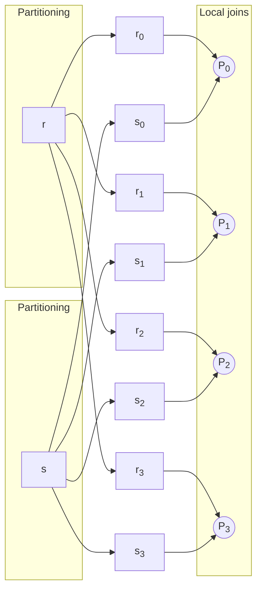

AALBORG UNIVERSITET
SIDE 59


---


AALBORG UNIVERSITET
SIDE 60

# Fragment-and-Replicate Join

* Partitioning not possible for some join conditions
    * E.g., *non-equijoin* conditions, such as r.A > s.B.
* For joins where partitioning is not applicable, parallelization can be accomplished by **fragment and replicate** technique
    * To be explained on next slide
* Special case – **asymmetric fragment-and-replicate**:
    * One of the relations, say *r*, is partitioned.
        - Any partitioning technique can be used.
    * The other relation, *s*, is replicated across *all* the processors.
    * Processor *P<sub>i</sub>* then locally computes the join of *r<sub>i</sub>* with all of s using any join technique.

---

# Fragment-and-Replicate Join: General Case

* General case: reduces the sizes of the relations at each processor.
* $$r$$ is partitioned into $$n$$ partitions: $$r_0, r_1, \dots, r_{n-1}$$; $$s$$ is partitioned into $$m$$ partitions: $$s_0, s_1, \dots, s_{m-1}$$.
* Any partitioning technique may be used.
* There must be at least $$m*n$$ processors.
* Label the processors as $$P_{0,0}, P_{0,1}, \dots, P_{0,m-1}, P_{1,0}, \dots, P_{n-1,m-1}$$.
* $$P_{i,j}$$ computes the join of $$r_i$$ with $$s_j$$. In order to do so, $$r_i$$ is replicated to $$P_{i,0}, P_{i,1}, \dots, P_{i,m-1}$$, while $$s_j$$ is replicated to $$P_{0,j}, P_{1,j}, \dots, P_{n-1,j}$$.
* Any join technique can be used at each processor $$P_{i,j}$$.

AALBORG UNIVERSITET
SIDE 61


---


# Illustration of Fragment-and-Replicate Joins

* Join conditions don't support partitioning
* Two cases

### Case 1: Asymmetric
In this case, one relation is fragmented and the other is replicated.
- **Relation r**: Fragmented
- **Relation s**: Replicated

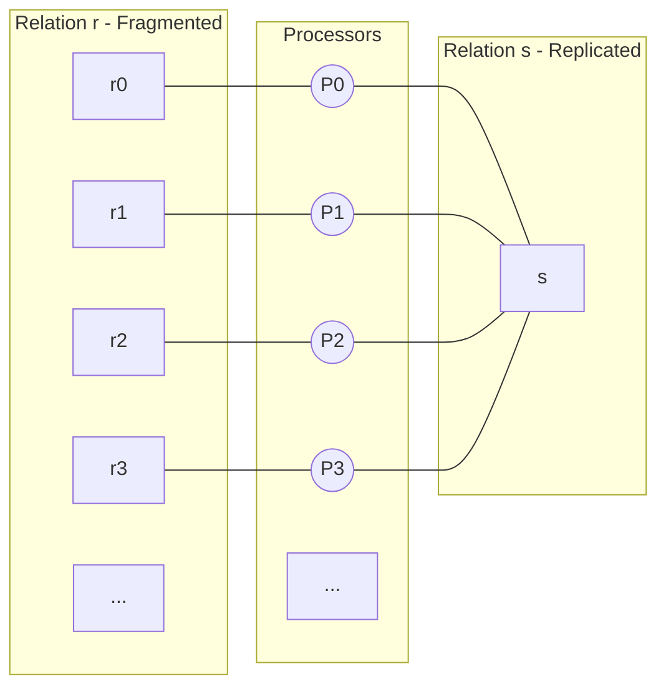

### Case 2: Symmetric
In this case, both relations are fragmented and replicated across a grid of processors.
- **Relation r**: Fragmented & replicated
- **Relation s**: Fragmented & replicated

<table>
  <thead>
    <tr>
        <th colspan="2">s	s&lt;sub&gt;0&lt;/sub&gt;	s&lt;sub&gt;1&lt;/sub&gt;	s&lt;sub&gt;2&lt;/sub&gt;	s&lt;sub&gt;3&lt;/sub&gt;	...	s&lt;sub&gt;m-1&lt;/sub&gt;</th>
        <th colspan="3"></th>
    </tr>
  </thead>
  <tbody>
    <tr>
        <td>r	r&lt;sub&gt;0&lt;/sub&gt;	P&lt;sub&gt;0,0&lt;/sub&gt;	P&lt;sub&gt;0,1&lt;/sub&gt;	P&lt;sub&gt;0,2&lt;/sub&gt;	P&lt;sub&gt;0,3&lt;/sub&gt;	.	.</td>
        <td colspan="4"></td>
    </tr>
<tr>
        <td>|	r&lt;sub&gt;1&lt;/sub&gt;	P&lt;sub&gt;1,0&lt;/sub&gt;	P&lt;sub&gt;1,1&lt;/sub&gt;	P&lt;sub&gt;1,2&lt;/sub&gt;</td>
<td>.	.</td>
        <td colspan="3"></td>
    </tr>
<tr>
        <td>|	r&lt;sub&gt;2&lt;/sub&gt;	P&lt;sub&gt;2,0&lt;/sub&gt;	P&lt;sub&gt;2,1&lt;/sub&gt;</td>
<td></td>
<td>.	.</td>
        <td colspan="2"></td>
    </tr>
<tr>
        <td>|	r&lt;sub&gt;3&lt;/sub&gt;</td>
<td></td>
<td></td>
<td></td>
<td>.	.</td>
    </tr>
<tr>
        <td>|	...	.	.	.	.	.	.</td>
        <td colspan="4"></td>
    </tr>
<tr>
        <td>|	r&lt;sub&gt;n-1&lt;/sub&gt;	.	.	.	.	.	P&lt;sub&gt;n-1,m-1&lt;/sub&gt;</td>
        <td colspan="4"></td>
    </tr>
  </tbody>
</table>

AALBORG UNIVERSITET
Case 1: Asymmetric
Case 2: Symmetric
SIDE 62


---

# Fragment-and-Replicate Join

## Person

<table>
  <thead>
    <tr>
        <th>id</th>
        <th>Name</th>
        <th>rooms</th>
        <th>min_price</th>
        <th>max_price</th>
        <th>apartment_id</th>
    </tr>
  </thead>
  <tbody>
    <tr>
        <td>1</td>
<td>Anne</td>
<td>2</td>
<td>40,000</td>
<td>1,50,000</td>
<td>2</td>
    </tr>
<tr>
        <td>2</td>
<td>John</td>
<td>1</td>
<td>20,000</td>
<td>50,000</td>
<td>2</td>
    </tr>
<tr>
        <td>3</td>
<td>Michael</td>
<td>2</td>
<td>2,00,000</td>
<td>3,00,000</td>
<td>6</td>
    </tr>
<tr>
        <td>4</td>
<td>Oliver</td>
<td>4</td>
<td>30,000</td>
<td>1,00,000</td>
<td>7</td>
    </tr>
  </tbody>
</table>

## Apartment

<table>
  <thead>
    <tr>
        <th>id</th>
        <th>rooms</th>
        <th>price</th>
        <th>city</th>
    </tr>
  </thead>
  <tbody>
    <tr>
        <td>1</td>
<td>2</td>
<td>30,000</td>
<td>Houston</td>
    </tr>
<tr>
        <td>2</td>
<td>2</td>
<td>45,000</td>
<td>Dallas</td>
    </tr>
<tr>
        <td>3</td>
<td>3</td>
<td>1,25,000</td>
<td>Chicago</td>
    </tr>
<tr>
        <td>4</td>
<td>5</td>
<td>2,45,000</td>
<td>Los Angeles</td>
    </tr>
<tr>
        <td>5</td>
<td>4</td>
<td>3,40,000</td>
<td>San Jose</td>
    </tr>
<tr>
        <td>6</td>
<td>4</td>
<td>2,20,000</td>
<td>San Diego</td>
    </tr>
<tr>
        <td>7</td>
<td>1</td>
<td>36,000</td>
<td>Cleveland</td>
    </tr>
  </tbody>
</table>

```sql
SELECT Name, min_price, max_price, price, city
FROM person JOIN apartment ON apartment.id !=person.apartment_id
AND price BETWEEN min_price AND max_price;
```

AALBORG UNIVERSITET SIDE 63


---

# Fragment-and-Replicate Join

### Original Table

<table>
  <thead>
    <tr>
        <th>id</th>
        <th>Name</th>
        <th>rooms</th>
        <th>min_price</th>
        <th>max_price</th>
        <th>apartm ent_id</th>
    </tr>
  </thead>
  <tbody>
    <tr>
        <td>1</td>
<td>Anne</td>
<td>2</td>
<td>40,000</td>
<td>1,50,000</td>
<td>2</td>
    </tr>
<tr>
        <td>2</td>
<td>John</td>
<td>1</td>
<td>20,000</td>
<td>50,000</td>
<td>2</td>
    </tr>
<tr>
        <td>3</td>
<td>Michael</td>
<td>2</td>
<td>2,00,000</td>
<td>3,00,000</td>
<td>6</td>
    </tr>
<tr>
        <td>4</td>
<td>Oliver</td>
<td>4</td>
<td>30,000</td>
<td>1,00,000</td>
<td>7</td>
    </tr>
  </tbody>
</table>

## Fragmentation

### Fragment 1

<table>
  <thead>
    <tr>
        <th>id</th>
        <th>Name</th>
        <th>rooms</th>
        <th>min_price</th>
        <th>max_price</th>
        <th>apartm ent_id</th>
    </tr>
  </thead>
  <tbody>
    <tr>
        <td>2</td>
<td>John</td>
<td>1</td>
<td>20,000</td>
<td>50,000</td>
<td>2</td>
    </tr>
<tr>
        <td>4</td>
<td>Oliver</td>
<td>4</td>
<td>30,000</td>
<td>1,00,000</td>
<td>7</td>
    </tr>
  </tbody>
</table>

### Fragment 2

<table>
  <thead>
    <tr>
        <th>id</th>
        <th>Name</th>
        <th>rooms</th>
        <th>min_price</th>
        <th>max_price</th>
        <th>apartm ent_id</th>
    </tr>
  </thead>
  <tbody>
    <tr>
        <td>1</td>
<td>Anne</td>
<td>2</td>
<td>40,000</td>
<td>1,50,000</td>
<td>2</td>
    </tr>
<tr>
        <td>3</td>
<td>Michael</td>
<td>2</td>
<td>2,00,000</td>
<td>3,00,000</td>
<td>6</td>
    </tr>
  </tbody>
</table>

## Replication

### Replicated Table

<table>
  <thead>
    <tr>
        <th>id</th>
        <th>rooms</th>
        <th>price</th>
        <th>city</th>
    </tr>
  </thead>
  <tbody>
    <tr>
        <td>1</td>
<td>2</td>
<td>30,000</td>
<td>Houston</td>
    </tr>
<tr>
        <td>2</td>
<td>2</td>
<td>45,000</td>
<td>Dallas</td>
    </tr>
<tr>
        <td>3</td>
<td>3</td>
<td>1,25,000</td>
<td>Chicago</td>
    </tr>
<tr>
        <td>4</td>
<td>5</td>
<td>2,45,000</td>
<td>Los Angeles</td>
    </tr>
<tr>
        <td>5</td>
<td>4</td>
<td>3,40,000</td>
<td>San Jose</td>
    </tr>
<tr>
        <td>6</td>
<td>4</td>
<td>2,20,000</td>
<td>San Diego</td>
    </tr>
<tr>
        <td>7</td>
<td>1</td>
<td>36,000</td>
<td>Cleveland</td>
    </tr>
  </tbody>
</table>

### Process Diagram
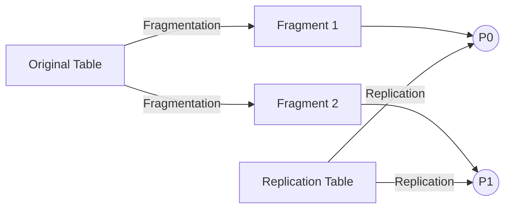

AALBORG UNIVERSITET
SIDE 64


---

# Fragment-and-Replicate Join

## Person

<table>
  <thead>
    <tr>
        <th>id</th>
        <th>Name</th>
        <th>rooms</th>
        <th>min_price</th>
        <th>max_price</th>
        <th>apartment_id</th>
    </tr>
  </thead>
  <tbody>
    <tr>
        <td>1</td>
<td>Anne</td>
<td>2</td>
<td>40,000</td>
<td>1,50,000</td>
<td>2</td>
    </tr>
<tr>
        <td>2</td>
<td>John</td>
<td>1</td>
<td>20,000</td>
<td>50,000</td>
<td>2</td>
    </tr>
<tr>
        <td>3</td>
<td>Michael</td>
<td>2</td>
<td>2,00,000</td>
<td>3,00,000</td>
<td>6</td>
    </tr>
<tr>
        <td>4</td>
<td>Oliver</td>
<td>4</td>
<td>30,000</td>
<td>1,00,000</td>
<td>7</td>
    </tr>
  </tbody>
</table>

## Apartment

<table>
  <thead>
    <tr>
        <th>id</th>
        <th>rooms</th>
        <th>price</th>
        <th>city</th>
    </tr>
  </thead>
  <tbody>
    <tr>
        <td>1</td>
<td>2</td>
<td>30,000</td>
<td>Houston</td>
    </tr>
<tr>
        <td>2</td>
<td>2</td>
<td>45,000</td>
<td>Dallas</td>
    </tr>
<tr>
        <td>3</td>
<td>3</td>
<td>1,25,000</td>
<td>Chicago</td>
    </tr>
<tr>
        <td>4</td>
<td>5</td>
<td>2,45,000</td>
<td>Los Angeles</td>
    </tr>
<tr>
        <td>5</td>
<td>4</td>
<td>3,40,000</td>
<td>San Jose</td>
    </tr>
<tr>
        <td>6</td>
<td>4</td>
<td>2,20,000</td>
<td>San Diego</td>
    </tr>
<tr>
        <td>7</td>
<td>1</td>
<td>36,000</td>
<td>Cleveland</td>
    </tr>
  </tbody>
</table>

```sql
SELECT Name, min_price, max_price, price, city
FROM person JOIN apartment ON apartment.id != person.apartment_id
AND price BETWEEN min_price AND max_price;
```

## Result

<table>
  <thead>
    <tr>
        <th>Name</th>
        <th>min_price</th>
        <th>max_price</th>
        <th>price</th>
        <th>city</th>
    </tr>
  </thead>
  <tbody>
    <tr>
        <td>John</td>
<td>20,000</td>
<td>50,000</td>
<td>30,000</td>
<td>Houston</td>
    </tr>
<tr>
        <td>John</td>
<td>20,000</td>
<td>50,000</td>
<td>36,000</td>
<td>Cleveland</td>
    </tr>
<tr>
        <td>Anne</td>
<td>40,000</td>
<td>1,50,000</td>
<td>1,25,000</td>
<td>Chicago</td>
    </tr>
<tr>
        <td>Michael</td>
<td>2,00,000</td>
<td>3,00,000</td>
<td>2,45,000</td>
<td>Los Angeles</td>
    </tr>
<tr>
        <td>Oliver</td>
<td>30,000</td>
<td>1,00,000</td>
<td>45,000</td>
<td>Dallas</td>
    </tr>
<tr>
        <td>Oliver</td>
<td>30,000</td>
<td>1,00,000</td>
<td>30,000</td>
<td>Houston</td>
    </tr>
  </tbody>
</table>

AALBORG UNIVERSITET
SIDE 65


---


AALBORG UNIVERSITET

# Fragment-and-Replicate Join

### Main Table (Table 1)

<table>
  <thead>
    <tr>
        <th>id</th>
        <th>rooms</th>
        <th>price</th>
        <th>city</th>
    </tr>
  </thead>
  <tbody>
    <tr>
        <td>1</td>
<td>2</td>
<td>30,000</td>
<td>Houston</td>
    </tr>
<tr>
        <td>2</td>
<td>2</td>
<td>45,000</td>
<td>Dallas</td>
    </tr>
<tr>
        <td>3</td>
<td>3</td>
<td>1,25,000</td>
<td>Chicago</td>
    </tr>
<tr>
        <td>4</td>
<td>5</td>
<td>2,45,000</td>
<td>Los Angeles</td>
    </tr>
<tr>
        <td>5</td>
<td>4</td>
<td>3,40,000</td>
<td>San Jose</td>
    </tr>
<tr>
        <td>6</td>
<td>4</td>
<td>2,20,000</td>
<td>San Diego</td>
    </tr>
<tr>
        <td>7</td>
<td>1</td>
<td>36,000</td>
<td>Cleveland</td>
    </tr>
  </tbody>
</table>

The main table is fragmented horizontally into two parts:

#### Table 1 Fragment 1

<table>
  <thead>
    <tr>
        <th>id</th>
        <th>rooms</th>
        <th>price</th>
        <th>city</th>
    </tr>
  </thead>
  <tbody>
    <tr>
        <td>2</td>
<td>2</td>
<td>45,000</td>
<td>Dallas</td>
    </tr>
<tr>
        <td>4</td>
<td>5</td>
<td>2,45,000</td>
<td>Los Angeles</td>
    </tr>
<tr>
        <td>6</td>
<td>4</td>
<td>2,20,000</td>
<td>San Diego</td>
    </tr>
  </tbody>
</table>

#### Table 1 Fragment 2

<table>
  <thead>
    <tr>
        <th>id</th>
        <th>rooms</th>
        <th>price</th>
        <th>city</th>
    </tr>
  </thead>
  <tbody>
    <tr>
        <td>1</td>
<td>2</td>
<td>30,000</td>
<td>Houston</td>
    </tr>
<tr>
        <td>3</td>
<td>3</td>
<td>1,25,000</td>
<td>Chicago</td>
    </tr>
<tr>
        <td>5</td>
<td>4</td>
<td>3,40,000</td>
<td>San Jose</td>
    </tr>
<tr>
        <td>7</td>
<td>1</td>
<td>36,000</td>
<td>Cleveland</td>
    </tr>
  </tbody>
</table>

----

### Replicated Table (Table 2)
*Note: This table is shown rotated 90 degrees counter-clockwise in the original document.*

<table>
  <thead>
    <tr>
        <th>id</th>
        <th>Name</th>
        <th>rooms</th>
        <th>min_price</th>
        <th>max_price</th>
        <th>apartment_id</th>
    </tr>
  </thead>
  <tbody>
    <tr>
        <td>1</td>
<td>Anne</td>
<td>2</td>
<td>40,000</td>
<td>1,50,000</td>
<td>2</td>
    </tr>
<tr>
        <td>2</td>
<td>John</td>
<td>1</td>
<td>20,000</td>
<td>50,000</td>
<td>2</td>
    </tr>
<tr>
        <td>3</td>
<td>Michael</td>
<td>2</td>
<td>2,00,000</td>
<td>3,00,000</td>
<td>6</td>
    </tr>
<tr>
        <td>4</td>
<td>Oliver</td>
<td>4</td>
<td>30,000</td>
<td>1,00,000</td>
<td>7</td>
    </tr>
  </tbody>
</table>

Table 2 is also split into two fragments:

#### Table 2 Fragment A

<table>
  <thead>
    <tr>
        <th>id</th>
        <th>Name</th>
        <th>rooms</th>
        <th>min_price</th>
        <th>max_price</th>
        <th>apartment_id</th>
    </tr>
  </thead>
  <tbody>
    <tr>
        <td>2</td>
<td>John</td>
<td>1</td>
<td>20,000</td>
<td>50,000</td>
<td>2</td>
    </tr>
<tr>
        <td>4</td>
<td>Oliver</td>
<td>4</td>
<td>30,000</td>
<td>1,00,000</td>
<td>7</td>
    </tr>
  </tbody>
</table>

#### Table 2 Fragment B

<table>
  <thead>
    <tr>
        <th>id</th>
        <th>Name</th>
        <th>rooms</th>
        <th>min_price</th>
        <th>max_price</th>
        <th>apartment_id</th>
    </tr>
  </thead>
  <tbody>
    <tr>
        <td>1</td>
<td>Anne</td>
<td>2</td>
<td>40,000</td>
<td>1,50,000</td>
<td>2</td>
    </tr>
<tr>
        <td>3</td>
<td>Michael</td>
<td>2</td>
<td>2,00,000</td>
<td>3,00,000</td>
<td>6</td>
    </tr>
  </tbody>
</table>

----

### Data Distribution to Processor Grid
The fragments are distributed to a grid of processors (P00, P01, P10, P11) for the join operation.

```mermaid
graph TD
    subgraph Grid
        direction TB
        subgraph Row0
            direction LR
            P00((P00)) --- P01((P01))
        end
        subgraph Row1
            direction LR
            P10((P10)) --- P11((P11))
        end
        P00 --- P10
        P01 --- P11
    end

    T1_F1[Table 1 Fragment 1<br/>(IDs: 2, 4, 6)] --- P00
    T1_F2[Table 1 Fragment 2<br/>(IDs: 1, 3, 5, 7)] --- P01
    T2_FA[Table 2 Fragment A<br/>(IDs: 2, 4)] --- P00
    T2_FB[Table 2 Fragment B<br/>(IDs: 1, 3)] --- P10
```

SIDE 66


---

# Fragment-and-Replicate Join

## Person

<table>
  <thead>
    <tr>
        <th>id</th>
        <th>Name</th>
        <th>rooms</th>
        <th>min_price</th>
        <th>max_price</th>
        <th>apartment_id</th>
    </tr>
  </thead>
  <tbody>
    <tr>
        <td>1</td>
<td>Anne</td>
<td>2</td>
<td>40,000</td>
<td>1,50,000</td>
<td>2</td>
    </tr>
<tr>
        <td>2</td>
<td>John</td>
<td>1</td>
<td>20,000</td>
<td>50,000</td>
<td>2</td>
    </tr>
<tr>
        <td>3</td>
<td>Michael</td>
<td>2</td>
<td>2,00,000</td>
<td>3,00,000</td>
<td>6</td>
    </tr>
<tr>
        <td>4</td>
<td>Oliver</td>
<td>4</td>
<td>30,000</td>
<td>1,00,000</td>
<td>7</td>
    </tr>
  </tbody>
</table>

## Apartment

<table>
  <thead>
    <tr>
        <th>id</th>
        <th>rooms</th>
        <th>price</th>
        <th>city</th>
    </tr>
  </thead>
  <tbody>
    <tr>
        <td>1</td>
<td>2</td>
<td>30,000</td>
<td>Houston</td>
    </tr>
<tr>
        <td>2</td>
<td>2</td>
<td>45,000</td>
<td>Dallas</td>
    </tr>
<tr>
        <td>3</td>
<td>3</td>
<td>1,25,000</td>
<td>Chicago</td>
    </tr>
<tr>
        <td>4</td>
<td>5</td>
<td>2,45,000</td>
<td>Los Angeles</td>
    </tr>
<tr>
        <td>5</td>
<td>4</td>
<td>3,40,000</td>
<td>San Jose</td>
    </tr>
<tr>
        <td>6</td>
<td>4</td>
<td>2,20,000</td>
<td>San Diego</td>
    </tr>
<tr>
        <td>7</td>
<td>1</td>
<td>36,000</td>
<td>Cleveland</td>
    </tr>
  </tbody>
</table>

```sql
SELECT Name, min_price, max_price, price, city
FROM person JOIN apartment ON apartment.id != person.apartment_id
AND price BETWEEN min_price AND max_price;
```

## Result

<table>
  <thead>
    <tr>
        <th>Name</th>
        <th>min_price</th>
        <th>max_price</th>
        <th>price</th>
        <th>city</th>
    </tr>
  </thead>
  <tbody>
    <tr>
        <td>John</td>
<td>20,000</td>
<td>50,000</td>
<td>30,000</td>
<td>Houston</td>
    </tr>
<tr>
        <td>John</td>
<td>20,000</td>
<td>50,000</td>
<td>36,000</td>
<td>Cleveland</td>
    </tr>
<tr>
        <td>Anne</td>
<td>40,000</td>
<td>1,50,000</td>
<td>1,25,000</td>
<td>Chicago</td>
    </tr>
<tr>
        <td>Michael</td>
<td>2,00,000</td>
<td>3,00,000</td>
<td>2,45,000</td>
<td>Los Angeles</td>
    </tr>
<tr>
        <td>Oliver</td>
<td>30,000</td>
<td>1,00,000</td>
<td>45,000</td>
<td>Dallas</td>
    </tr>
<tr>
        <td>Oliver</td>
<td>30,000</td>
<td>1,00,000</td>
<td>30,000</td>
<td>Houston</td>
    </tr>
  </tbody>
</table>

AALBORG UNIVERSITET
SIDE 67


---


# Fragment-and-Replicate Join: Notes

* Both versions of fragment-and-replicate work with *any* join condition, since every tuple in *r* can be tested with *every* tuple in *s*.
* Usually, this join has a higher cost than partitioned parallel join, since one of the relations (*for asymmetric fragment-and-replicate*) or both relations (*for general fragment-and-replicate*) must be replicated.
* Sometimes asymmetric fragment-and-replicate is preferable even though partitioning could be used.
    - E.g., say *s* is small, and *r* is large and already partitioned. It may be cheaper to replicate *s* across all processors, rather than repartition *r* and *s* on the join attributes.

AALBORG UNIVERSITET
SIDE 68


---

# Partitioned Parallel Hash Join

* Assume *s* is smaller than *r*.
* Therefore, *s* is chosen as the *build* relation, and *r probe* relation.
* A hash function *h*<sub>1</sub> takes the join attribute value of each tuple in *s* and maps this tuple to one of the *n* processors.

1. Each processor *P*<sub>i</sub> reads the tuples of *s* that are on its disk *D*<sub>i</sub> and sends each tuple to the appropriate processor based on hash function *h*<sub>1</sub>. Let *s*<sub>i</sub> denote the tuples of relation *s* that are sent to processor *P*<sub>i</sub>.
2. As tuples of relation *s* are received at the destination processors, they are partitioned further using another hash function, *h*<sub>2</sub>, which is used to compute the hash-join locally. (*to be continued*)

AALBORG UNIVERSITET
SIDE 69


---

# Partitioned Parallel Hash Join, cont.

3. Once the tuples of $$s$$ have been distributed, the larger relation $$r$$ is also distributed across the $$m$$ processors using hash function $$h_1$$
    * Let $$r_i$$ denote the tuples of relation $$r$$ that are sent to processor $$P_i$$.
4. As the $$r$$ tuples are received at the destination processors, they are repartitioned using the function $$h_2$$
    * (just as the probe relation is partitioned in the sequential hash-join algorithm).
5. Each processor $$P_i$$ executes the build and probe phases of the hash-join algorithm on the local partitions $$r_i$$ and $$s_i$$ of $$r$$ and $$s$$ to produce a partition of the final result of the hash-join.

AALBORG UNIVERSITET
SIDE 70


---

# Partitioned Parallel Hash Join, cont.

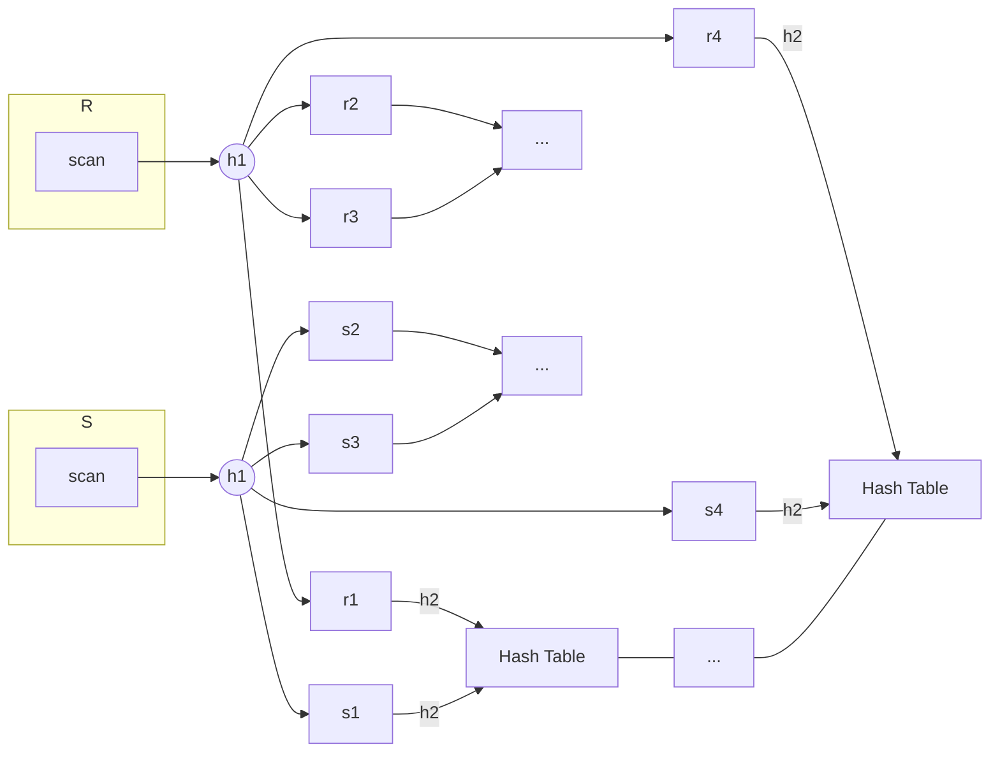

AALBORG UNIVERSITET
SIDE 71


---


# Example of Partitioned Parallel Hash Join

$R \bowtie_{R.A=T.A} T$

> **Hash partitioning:**
> $h_1(A) = A \mod 3$
> $h_2(A) = A \mod 4$

<table>
  <thead>
    <tr>
        <th>R</th>
        <th>A</th>
        <th>B</th>
        <th>T</th>
        <th>A</th>
        <th>C</th>
    </tr>
  </thead>
  <tbody>
    <tr>
        <td></td>
<td>1</td>
<td>a</td>
<td></td>
<td>1</td>
<td>x</td>
    </tr>
<tr>
        <td></td>
<td>2</td>
<td>b</td>
<td></td>
<td>2</td>
<td>x</td>
    </tr>
<tr>
        <td></td>
<td>4</td>
<td>a</td>
<td></td>
<td>3</td>
<td>x</td>
    </tr>
<tr>
        <td></td>
<td>7</td>
<td>a</td>
<td></td>
<td>7</td>
<td>z</td>
    </tr>
<tr>
        <td></td>
<td>8</td>
<td>a</td>
<td></td>
<td>8</td>
<td>w</td>
    </tr>
<tr>
        <td></td>
<td>9</td>
<td>b</td>
<td></td>
<td>9</td>
<td>y</td>
    </tr>
  </tbody>
</table>

<table>
  <thead>
    <tr>
        <th colspan="2">P₁</th>
        <th colspan="2">P₂</th>
        <th colspan="2">P₃</th>
    </tr>
  </thead>
  <tbody>
    <tr>
        <td>R1</td>
<td>T1</td>
<td>R2</td>
<td>T2</td>
<td>R3</td>
<td>T3</td>
    </tr>
<tr>
        <td>(1, a)</td>
<td>(1, x)</td>
<td>(2, b)</td>
<td>(2, x)</td>
<td>(9, b)</td>
<td>(3, x)</td>
    </tr>
<tr>
        <td>(4, a)</td>
<td>(7, z)</td>
<td>(8, a)</td>
<td>(8, w)</td>
<td></td>
<td>(9, y)</td>
    </tr>
<tr>
        <td>(7, a)</td>
<td></td>
<td></td>
<td></td>
<td></td>
<td></td>
    </tr>
<tr>
        <td colspan="6">Parallel local joins (each node uses a local hash function $h_2$)</td>
    </tr>
<tr>
        <td colspan="2">$R1 \bowtie T1$</td>
        <td colspan="2">$R2 \bowtie T2$</td>
        <td colspan="2">$R3 \bowtie T3$</td>
    </tr>
<tr>
        <td>(1, a, x),</td>
<td></td>
<td>(2, b, x),</td>
<td></td>
<td>(9, b, y)</td>
<td></td>
    </tr>
<tr>
        <td>(7, a, z)</td>
<td></td>
<td>(8, a, w)</td>
        <td colspan="3"></td>
    </tr>
  </tbody>
</table>

UNIVERSITET
SIDE 72


---


# Parallel Nested-Loop Join

* Assume that
    - relation *s* is much smaller than relation *r*
    - relation *r* is stored by partitioning
    - (optional) there is an **index** on a join attribute of relation *r* at each of its partitions
* Use **asymmetric fragment-and-replicate**, with relation *s* being replicated, and using the existing partitioning of relation *r*.

1. Each processor *P<sub>j</sub>* where a partition of relation *s* is stored reads the tuples of relation *s* stored in *D<sub>j</sub>* and replicates the tuples to every other processor *P<sub>i</sub>*.
    - At the end of this phase, relation *s* is replicated at all sites that store tuples of relation *r*.
2. Each processor *P<sub>i</sub>* performs an (indexed) **nested-loop join** of relation *s* with the *i<sup>th</sup>* (indexed) partition of relation *r*.

AALBORG UNIVERSITET
SIDE 73


---


# Example of Parallel Nested-Loop Join

* $R \bowtie_{R.B=S.B} S$
* $|R| \gg |S|$

### Input Tables

**Fragmented Table R**

<table>
  <thead>
    <tr>
        <th>R</th>
        <th>A</th>
        <th>B</th>
    </tr>
  </thead>
  <tbody>
    <tr>
        <td></td>
<td>1</td>
<td>a</td>
    </tr>
<tr>
        <td></td>
<td>2</td>
<td>b</td>
    </tr>
<tr>
        <td></td>
<td>4</td>
<td>a</td>
    </tr>
<tr>
        <td></td>
<td>7</td>
<td>a</td>
    </tr>
<tr>
        <td></td>
<td>8</td>
<td>a</td>
    </tr>
<tr>
        <td></td>
<td>9</td>
<td>b</td>
    </tr>
  </tbody>
</table>

**Replicated Table S**

<table>
  <thead>
    <tr>
        <th>S</th>
        <th>B</th>
        <th>C</th>
    </tr>
  </thead>
  <tbody>
    <tr>
        <td></td>
<td>a</td>
<td>x</td>
    </tr>
<tr>
        <td></td>
<td>b</td>
<td>x</td>
    </tr>
<tr>
        <td></td>
<td>a</td>
<td>y</td>
    </tr>
<tr>
        <td></td>
<td>d</td>
<td>z</td>
    </tr>
<tr>
        <td></td>
<td>a</td>
<td>w</td>
    </tr>
<tr>
        <td></td>
<td>c</td>
<td>y</td>
    </tr>
  </tbody>
</table>

### Parallel Join Process

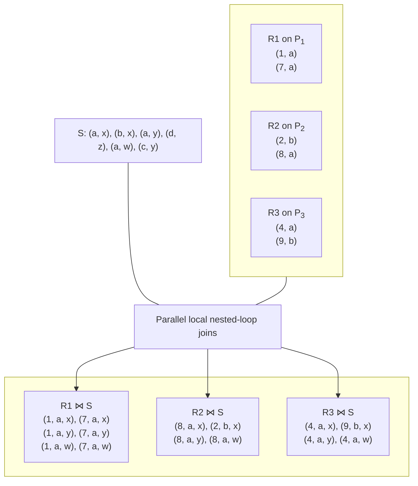

SIDE 74


---

# Summary

* Parallel Database Architectures
    - Shared Nothing
    - Shared Memory
    - Shared Disk
    - Hierarchical
* IO Parallelism and Partitioning
    - Round-robin partitioning
    - Hash partitioning
    - Range partitioning
* Other Types of Parallelism
    - Parallel sort algorithms
    - Parallel join algorithms

AALBORG UNIVERSITET
SIDE 75


---


AALBORG UNIVERSITET
SIDE 76

# Readings

* Mandatory readings (for both Lectures 2 and 3)
    * A. Silberschatz, H. F. Korth, S. Sudarshan: Database System Concepts (7th edition), McGraw-Hill.
      Chapter 20, 21, 22, 23.
        - Among these chapters, the following sections are *optional*:
          21.3, 21.5, 22.6, 22.7, 22.8, 23.4, 23.5, 23.6, 23.7, 23.8

---


# Exercises

1. We want to count *each* hashtag that appears in the ID-Hashtag file (in Moodle). If you have a shared-nothing cluster with m processors, how can that help to speed up the counting? Describe your data partitioning strategy and counting algorithm.

2. If we only want to know the frequency of a given specific hashtag, how can you make use of the shared-nothing architecture? Describe your data partitioning strategy and counting algorithm.

For each exercises:

* Suppose one of the m processors is designated as the ‘master’ node
    - It has the original data file, and it needs to store the final result.
    - It can ‘tell’ all other nodes what to do in some form of message.
* You’re encouraged to also write codes (in Python or another language) to simulate the parallelism of your algorithmic solutions.

AALBORG UNIVERSITET
SIDE 77
