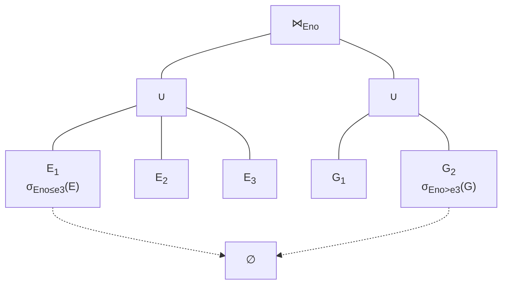
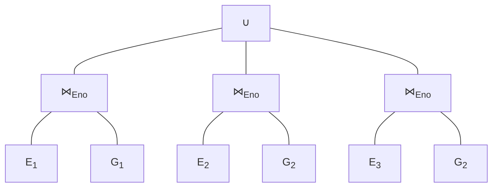
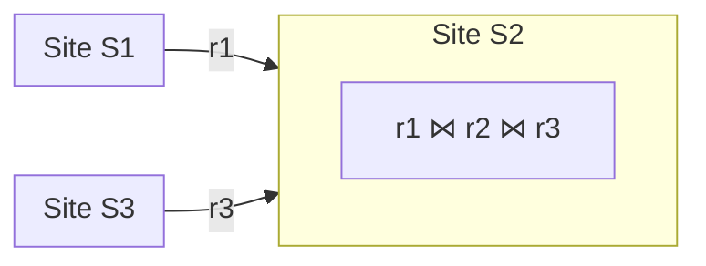
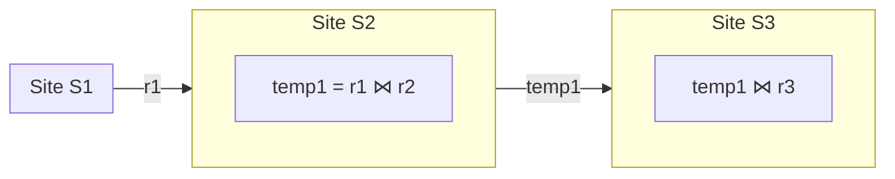
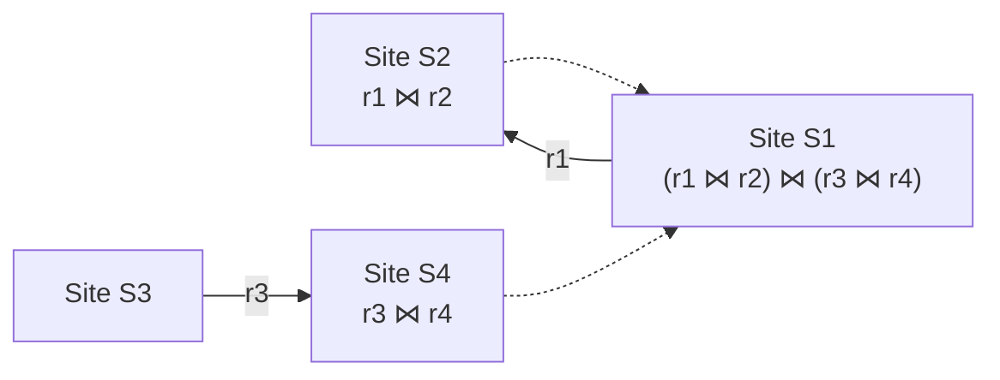
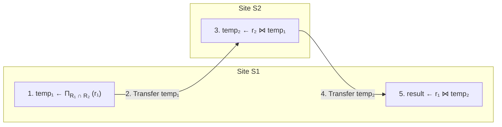
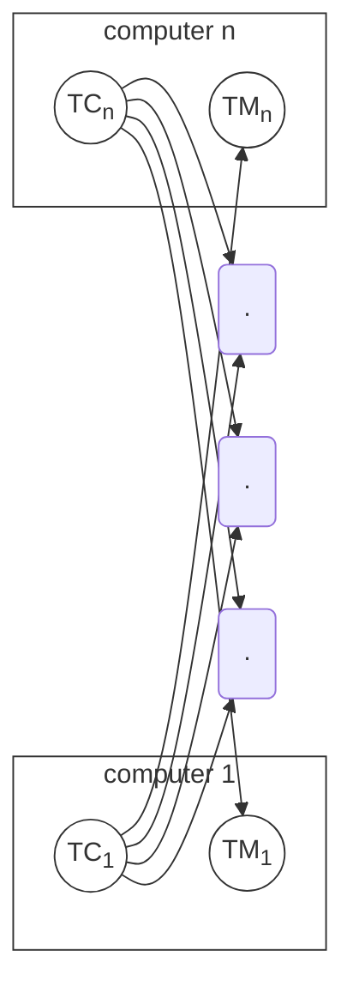
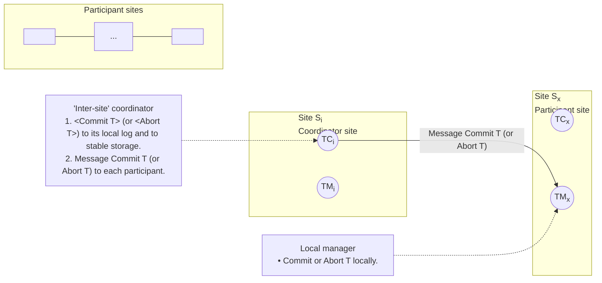

# Data Intensive Systems (DIS)
## KBH-SW7 E25
### 3. Distributed Databases

The background of the slide is a photograph of a large, modern, multi-story indoor atrium. The building features multiple levels with wooden-slatted railings. The ground floor is a wide-open space with various seating arrangements, including tables and chairs where people are working or socializing. Large windows at the far end look out onto an outdoor area. Numerous white square panels are suspended from the ceiling at different heights.

AALBORG UNIVERSITY


---

# Agenda

* Introduction
    * Heterogeneous and Homogeneous Databases
* Distributed Data Storage
* Distributed Query Processing and Optimization
* Distributed Transactions

AALBORG UNIVERSITET
SIDE 2


---

# Distributed Database System

* A distributed database system consists of loosely coupled sites that share no physical component.
* Database systems that run on different *sites* are independent of each other.
* Transactions and queries may access data at one or more sites.

AALBORG UNIVERSITET
SIDE 3


---

# Parallel DB vs. Distributed DB

* Parallel Databases
    - Machines are physically close to each other, e.g., same server room
    - Machines connect with dedicated high-speed LANs and switches, and thus communication cost is assumed to be small
    - Can share memory, share disk, or share nothing
* Distributed Databases
    - Machines can be far away from each other, e.g., in different continents
    - Can be connected using public-purpose network, e.g., Internet
    - Communication cost and problems cannot be ignored
    - Usually built using shared-nothing architecture

AALBORG UNIVERSITET
SIDE 4


---

# Distributed Databases

* In a **homogeneous** distributed database
    - All sites have identical software
    - All sites are aware of each other and agree to cooperate in processing user requests.
    - Each site surrenders part of its autonomy in terms of right to change schemas or software.
    - Appears to user as a single system.
* In a **heterogeneous** distributed database
    - Different sites may use different schemas and software.
        - Difference in schema is a major problem for query processing.
            - Data integration, schema matching
        - Difference in software is a major problem for transaction processing.
    - Sites may not be aware of each other and may provide only limited facilities for cooperation in transaction processing.

AALBORG UNIVERSITET
SIDE 5


---

# Agenda

* Introduction
* Distributed Data Storage
* Distributed Query Processing and Optimization
* Distributed Transactions

AALBORG UNIVERSITET
SIDE 6


---

# Distributed Data Storage

* Distributed Database Design:
    - How should the database and applications on top of it be place *across the sites*?
    - We assume relational data model, but the techniques can be applicable to others.
* Replication
    - System maintains multiple copies of data, stored in different sites, for **faster retrieval** and **fault tolerance**.
* Fragmentation (partitioning)
    - A relation is partitioned into several fragments stored in distinct sites.
* Replication and fragmentation can be combined.
    - Relation is partitioned into several fragments: system maintains several identical replicas of each such fragment.

AALBORG UNIVERSITET
SIDE 7


---


AALBORG UNIVERSITET
SIDE 8

# Data Replication

* A relation or fragment of a relation is **replicated** if it is stored redundantly in two or more sites.
* **Full replication** of a relation is the case where the relation is stored at all sites.
* **Fully redundant** databases are those in which every site contains a copy of the entire database.
* Advantages of Replication
    * **Availability**: failure of site containing relation $r$ does not result in unavailability of $r$ if replicas exist.
    * **Parallelism**: queries on $r$ may be processed by several sites in parallel.
    * **Reduced data transfer**: relation $r$ is available locally at each site that has a replica of $r$.

---


# Data Replication, cont.

* Disadvantages of Replication
    - Increased cost of updates
        - Each replica of relation $r$ must be updated.
    - Increased complexity of concurrency control
        - Concurrent updates to distinct replicas may lead to inconsistent data unless special concurrency control mechanisms are implemented.
            - E.g., consider money transfer between replicates on different sites.
            - One solution: choose one copy as **primary copy** and apply concurrency control operations on primary copy

AALBORG UNIVERSITET
SIDE 9


---

# Data Fragmentation

* A relation *r* is partitioned into fragments *r*<sub>1</sub>, *r*<sub>2</sub>, ..., *r*<sub>n</sub> which contain sufficient information to reconstruct relation *r*.
* **Horizontal fragmentation**: each tuple of *r* is assigned to one or more fragments
* **Vertical fragmentation**: the schema for relation *r* is split into several smaller schemas
    - All schemas must contain a common key to ensure *lossless join property*.
    - A special attribute, e.g., the tuple-id attribute, may be added to each schema to serve as the key.

AALBORG UNIVERSITET
SIDE 10


---


# Example Relations

* Relation *account*

<table>
  <thead>
    <tr>
        <th>branch_name</th>
        <th>account_number</th>
        <th>balance</th>
    </tr>
  </thead>
</table>

* Relation *employee*

<table>
  <thead>
    <tr>
        <th>account_number</th>
        <th>balance</th>
        <th>branch_name</th>
        <th>customer_name</th>
    </tr>
  </thead>
</table>

AALBORG UNIVERSITET
SIDE 11


---


# Horizontal Fragmentation of *account* Relation

<table>
  <thead>
    <tr>
        <th>branch_name</th>
        <th>account_number</th>
        <th>balance</th>
    </tr>
  </thead>
  <tbody>
    <tr>
        <td>Hillside</td>
<td>A-305</td>
<td>500</td>
    </tr>
<tr>
        <td>Hillside</td>
<td>A-226</td>
<td>336</td>
    </tr>
<tr>
        <td>Hillside</td>
<td>A-155</td>
<td>62</td>
    </tr>
  </tbody>
</table>

$$account_1 = \sigma_{branch\_name = "Hillside"}(account)$$

<table>
  <thead>
    <tr>
        <th>branch_name</th>
        <th>account_number</th>
        <th>balance</th>
    </tr>
  </thead>
  <tbody>
    <tr>
        <td>Valleyview</td>
<td>A-177</td>
<td>205</td>
    </tr>
<tr>
        <td>Valleyview</td>
<td>A-402</td>
<td>10000</td>
    </tr>
<tr>
        <td>Valleyview</td>
<td>A-408</td>
<td>1123</td>
    </tr>
<tr>
        <td>Valleyview</td>
<td>A-639</td>
<td>750</td>
    </tr>
  </tbody>
</table>

$$account_2 = \sigma_{branch\_name = "Valleyview"}(account)$$

AALBORG UNIVERSITET
SIDE 12


---

# Vertical Fragmentation of employee Relation

<table>
  <thead>
    <tr>
        <th>branch_name</th>
        <th>customer_name</th>
        <th>tuple_id</th>
    </tr>
  </thead>
  <tbody>
    <tr>
        <td>Hillside</td>
<td>Lowman</td>
<td>1</td>
    </tr>
<tr>
        <td>Hillside</td>
<td>Camp</td>
<td>2</td>
    </tr>
<tr>
        <td>Valleyview</td>
<td>Camp</td>
<td>3</td>
    </tr>
<tr>
        <td>Valleyview</td>
<td>Kahn</td>
<td>4</td>
    </tr>
<tr>
        <td>Hillside</td>
<td>Kahn</td>
<td>5</td>
    </tr>
<tr>
        <td>Valleyview</td>
<td>Kahn</td>
<td>6</td>
    </tr>
<tr>
        <td>Valleyview</td>
<td>Green</td>
<td>7</td>
    </tr>
  </tbody>
</table>

$$deposit_1 = \Pi_{branch\_name, customer\_name, tuple\_id}(employee)$$

<table>
  <thead>
    <tr>
        <th>account_number</th>
        <th>balance</th>
        <th>tuple_id</th>
    </tr>
  </thead>
  <tbody>
    <tr>
        <td>A-305</td>
<td>500</td>
<td>1</td>
    </tr>
<tr>
        <td>A-226</td>
<td>336</td>
<td>2</td>
    </tr>
<tr>
        <td>A-177</td>
<td>205</td>
<td>3</td>
    </tr>
<tr>
        <td>A-402</td>
<td>10000</td>
<td>4</td>
    </tr>
<tr>
        <td>A-155</td>
<td>62</td>
<td>5</td>
    </tr>
<tr>
        <td>A-408</td>
<td>1123</td>
<td>6</td>
    </tr>
<tr>
        <td>A-639</td>
<td>750</td>
<td>7</td>
    </tr>
  </tbody>
</table>

$$deposit_2 = \Pi_{account\_number, balance, tuple\_id}(employee)$$

AALBORG UNIVERSITET
SIDE 13


---

# Advantages of Fragmentation

* Horizontal fragmentation:
    - allows parallel processing on fragments of a relation
    - allows a relation to be split so that tuples are located where they are most frequently accessed
* Vertical fragmentation:
    - allows parallel processing on a relation
    - allows tuples to be split so that each part of the tuple is stored where it is most frequently accessed
    - tuple-id attribute allows efficient joining of vertical fragments
* Vertical and horizontal fragmentation can be mixed.
    - Fragments may be successively fragmented to an arbitrary depth.

AALBORG UNIVERSITET
SIDE 14


---

# Data Transparency

* Data transparency
    * Degree to which a system user may remain *unaware* of the details of *how* and *where* the data items are stored in a distributed system.
* Consider transparency issues in relation to:
    * Fragmentation transparency
    * Replication transparency
    * Location transparency

* *NB*: Similar ideas are used in distributed file systems like HDFS

AALBORG UNIVERSITET
SIDE 15


---

# Agenda

* Introduction
* Distributed Data Storage
* Distributed Query Processing and Optimization
    * Fragmented storage
    * Non-fragmented storage
* Distributed Transactions

AALBORG UNIVERSITET
SIDE 16


---


# Distributed Query Processing

* For centralized systems, the primary criterion for measuring the cost of a particular query strategy is the number of disk accesses (IOs).
* In a distributed system, other issues must be considered:
    - Data transmission cost over the network (often critical).
    - The potential gain in performance: several sites process parts of the query in parallel.
* Translating algebraic queries on fragments
    - It must be possible to construct relation $r$ from its fragments.
    - Replace relation $r$ by the expression to construct relation $r$ from its fragments.

AALBORG UNIVERSITET
SIDE 17


---

# Query Transformation Example

* Consider the horizontal fragmentation of the *account* relation
  $$account_1 = \sigma_{branch\_name = "Hillside"} (account)$$
  $$account_2 = \sigma_{branch\_name = "Valleyview"} (account)$$
* The query $$\sigma_{branch\_name = "Hillside"} (account)$$ becomes
  $$\sigma_{branch\_name = "Hillside"} (account_1 \cup account_2)$$
  which is optimized into
  $$\sigma_{branch\_name = "Hillside"} (account_1) \cup \sigma_{branch\_name = "Hillside"} (account_2)$$
  * Since *account*<sub>1</sub> has only tuples of the Hillside branch, we can eliminate the selection operation.
  * Apply the definition of *account*<sub>2</sub> to obtain
    $$\sigma_{branch\_name = "Hillside"} (\sigma_{branch\_name = "Valleyview"} (account))$$
    - This expression always gives an empty set.
* Finally, the Hillside site returns its whole *account*<sub>1</sub> as the result of the query.

AALBORG UNIVERSITET
SIDE 18


---

# Reduced Query due to Fragmentation

Two relations with corresponding schemas:

**E(Eno, Ename, Title)** &emsp;&emsp; **G(Eno, Jno, Resp, Dur)**

* E is *horizontally* fragmented into E<sub>1</sub>, E<sub>2</sub> and E<sub>3</sub> as follows:
    * E<sub>1</sub> = $\sigma_{Eno \le e3}(E)$
    * E<sub>2</sub> = $\sigma_{e3 < Eno \le e6}(E)$
    * E<sub>3</sub> = $\sigma_{Eno > e6}(E)$
* G is *horizontally* fragmented into G<sub>1</sub> and G<sub>2</sub> as follows:
    * G<sub>1</sub> = $\sigma_{Eno \le e3}(G)$
    * G<sub>2</sub> = $\sigma_{Eno > e3}(G)$
* Consider the following *natural join* query-1:
    ```sql
    SELECT *
    FROM E, G
    WHERE E.Eno = G.Eno
    ```

AALBORG UNIVERSITET
SIDE 19


---

# Query Tree for query-1:

<table>
  <thead>
    <tr>
        <th>SELECT</th>
        <th>*</th>
    </tr>
<tr>
        <th>FROM</th>
        <th>E, G</th>
    </tr>
<tr>
        <th>WHERE</th>
        <th>E.Eno = G.Eno</th>
    </tr>
  </thead>
</table>

### Steps
1. Get E by union
2. Get G by union
3. Join E and G

Steps 1 and 2 can be parallelized. But, not all $E_i$s match $G_j$s

### Fragments
* $E_1 = \sigma_{Eno \le e3}(E)$
* $E_2 = \sigma_{e3 < Eno \le e6}(E)$
* $E_3 = \sigma_{Eno > e6}(E)$
* $G_1 = \sigma_{Eno \le e3}(G)$
* $G_2 = \sigma_{Eno > e3}(G)$



### Empty joins
* $E_1 \bowtie G_2$
* $E_2 \bowtie G_1$
* $E_3 \bowtie G_1$

AALBORG UNIVERSITET
SIDE 20


---

# Reduced Query Tree for query-1:

* Advantages of the reduced query tree:
    * Provide parallelism
    * Eliminate unnecessary work

<table>
  <tbody>
    <tr>
        <td>SELECT</td>
<td>*</td>
    </tr>
<tr>
        <td>FROM</td>
<td>E, G</td>
    </tr>
<tr>
        <td>WHERE</td>
<td>E.Eno = G.Eno</td>
    </tr>
  </tbody>
</table>

### Fragments
* $$E_1 = \sigma_{Eno \le e3}(E)$$
* $$E_2 = \sigma_{e3 < Eno \le e6}(E)$$
* $$E_3 = \sigma_{Eno > e6}(E)$$
* $$G_1 = \sigma_{Eno \le e3}(G)$$
* $$G_2 = \sigma_{Eno > e3}(G)$$

### Empty joins
* $$E_1 \bowtie G_2$$
* $$E_2 \bowtie G_1$$
* $$E_3 \bowtie G_1$$



AALBORG UNIVERSITET SIDE 21


---


# Another Reduced Query Example

**E(Eno, Ename, Title)**
**G(Eno, Jno, Resp, Dur)**

Fragmentation is as follows:

$E_1 = \sigma_{Title='Programmer'}(E)$

$E_2 = \sigma_{Title \neq 'Programmer'}(E)$

$G_1 = G \ltimes_{Eno} E_1$: Those G records that contribute to $G \bowtie E_1$.

$G_2 = G \ltimes_{Eno} E_2$: Those G records that contribute to $G \bowtie E_2$.

> **Left semijoin $R \ltimes S$**
> * The result is the set of all records in R for which there is a record in S that is equal on their common attributes.
> * Unlike a natural join, the other columns of S do not appear in the result.

**Query-2:**

```sql
SELECT    *
FROM      E, G
WHERE     E.Eno = G.Eno AND
          E.Title = "Mech. Eng."
```

AALBORG UNIVERSITET
SIDE 22


---

# Query Tree for query-2:

* Again, not all E<sub>i</sub>s match G<sub>j</sub>s

<table>
  <tbody>
    <tr>
        <td>SELECT</td>
<td>*</td>
    </tr>
<tr>
        <td>FROM</td>
<td>E, G</td>
    </tr>
<tr>
        <td>WHERE</td>
<td>E.Eno = G.Eno AND</td>
    </tr>
<tr>
        <td></td>
<td>E.Title = Mech. Eng.</td>
    </tr>
  </tbody>
</table>

```tsv
[thead]Fragments
* E<sub>1</sub> = σ<sub>Title='Programmer'</sub>(E)
* E<sub>2</sub> = σ<sub>Title≠'Programmer'</sub>(E)
* G<sub>1</sub> = G ⋉<sub>Eno</sub> E<sub>1</sub>
* G<sub>2</sub> = G ⋉<sub>Eno</sub> E<sub>2</sub>
```

```mermaid
graph TD
    Node1["σ<sub>Title=\"Mech.Eng\"</sub>"] --- Node2["⋈<sub>Eno</sub>"]
    Node2 --- Node3["∪"]
    Node2 --- Node4["∪"]
    Node3 --- Node5["E<sub>1</sub>"]
    Node3 --- Node6["E<sub>2</sub>"]
    Node4 --- Node7["G<sub>1</sub>"]
    Node4 --- Node8["G<sub>2</sub>"]
```

AALBORG UNIVERSITET
SIDE 23


---


# Reduced Query Tree for query-2:

<table>
  <tbody>
    <tr>
        <td>SELECT</td>
<td>*</td>
    </tr>
<tr>
        <td>FROM</td>
<td>E, G</td>
    </tr>
<tr>
        <td>WHERE</td>
<td>E.Eno = G.Eno AND E.Title = Mech. Eng.</td>
    </tr>
  </tbody>
</table>

* Only $E_2$ is needed for the selection on Title
* Only $G_2$ is needed for the join

```mermaid
graph TD
    Join["⋈<sub>Eno</sub>"]
    Select["σ<sub>Title=\"Mech.Eng\"</sub>"]
    G2["G<sub>2</sub><br/>G ⋉<sub>Eno</sub> E<sub>2</sub>"]
    E2["E<sub>2</sub><br/>σ<sub>Title≠'Programmer'</sub>(E)"]

    Join --- Select
    Join --- G2
    Select --- E2
```

```tsv
[thead]Fragments
"• E<sub>1</sub> = σ<sub>Title='Programmer'</sub>(E)
• E<sub>2</sub> = σ<sub>Title≠'Programmer'</sub>(E)
• G<sub>1</sub> = G ⋉<sub>Eno</sub> E<sub>1</sub>
• G<sub>2</sub> = G ⋉<sub>Eno</sub> E<sub>2</sub>"
```

> We will see more semijoins shortly.

AALBORG UNIVERSITET
SIDE 24


---

# Distributed Join Processing

* Distributed query processing must consider following factors:
    * amount of data to be shipped between sites
    * cost of transmitting a data block between sites
    * relative processing speed at each site
* Consider the following relational algebra expression in which the three relations are *neither* replicated *nor* fragmented:
    *account* $\bowtie$ *depositor* $\bowtie$ *branch*
    * *account* is stored at site S<sub>1</sub>
    * *depositor* at S<sub>2</sub>
    * *branch* at S<sub>3</sub>
* For a query issued at site S<sub>I</sub>, the system needs to produce the result at site S<sub>I</sub>

AALBORG UNIVERSITET
SIDE 25


---

# Simple Join Processing Strategies

* Ship copies of all three relations to site $S_1$ and choose a strategy for processing the entire locally at site $S_1$. (*centralized*)
* Ship a copy of the account relation to site $S_2$ and compute $temp_1 = account \bowtie depositor$ at $S_2$. Ship $temp_1$ from $S_2$ to $S_3$, and compute $temp_2 = temp_1 \bowtie branch$ at $S_3$. Ship the result $temp_2$ to $S_1$. (*serialized*)
* Similar strategies, exchanging the roles $S_1, S_2, S_3$.





AALBORG UNIVERSITET
SIDE 26


---

# Parallel Distributed Join Strategy

Consider $r_1 \bowtie r_2 \bowtie r_3 \bowtie r_4$ where each relation $r_i$ is stored at site $S_i$.
Suppose the result must be presented at site $S_1$.

* $r_1$ is shipped to $S_2$ and $r_1 \bowtie r_2$ is computed at $S_2$; simultaneously, $r_3$ is shipped to $S_4$ and $r_3 \bowtie r_4$ is computed at $S_4$.
* $S_2$ sends tuples of $(r_1 \bowtie r_2)$ to $S_1$ as they are being produced; $S_4$ sends tuples of $(r_3 \bowtie r_4)$ to $S_1$ as they are being produced.
* Once tuples of $(r_1 \bowtie r_2)$ and $(r_3 \bowtie r_4)$ arrive at $S_1$, $(r_1 \bowtie r_2) \bowtie (r_3 \bowtie r_4)$ is computed *in parallel* with the computation of $(r_1 \bowtie r_2)$ at $S_2$ and the computation of $(r_3 \bowtie r_4)$ at $S_4$.

* Pipeline
* Parallelism



AALBORG UNIVERSITET
SIDE 27


---

# Semijoin Strategy

* Let $r_1$ be a relation with schema $R_1$ stores at site $S_1$.
  Let $r_2$ be a relation with schema $R_2$ stores at site $S_2$.
* Evaluate the expression $r_1 \bowtie r_2$ and obtain the result at $S_1$.
* **Motivation**: Shipping whole $r_1$ or $r_2$ can be very expensive!

1. Compute $temp_1 \leftarrow \Pi_{R_1 \cap R_2}(r_1)$ at $S_1$.
2. Ship $temp_1$ from $S_1$ to $S_2$.
3. Compute $temp_2 \leftarrow r_2 \bowtie temp_1$ at $S_2$
4. Ship $temp_2$ from $S_2$ to $S_1$.
5. Compute $r_1 \bowtie temp_2$ at $S_1$. This is the same as $r_1 \bowtie r_2$.

AALBORG UNIVERSITET
SIDE 28 28


---


# Illustration of Semijoin Strategy

* Say we need $r_1 \bowtie r_2$ at site $S_1$.
* **Performance gain**: the total size of $temp_1$ and $temp_2$ is much smaller than that of $r_1$ or $r_2$.



**Explanatory Notes:**

* **Regarding $temp_1$:** $temp_1$ contains only the common attribute values. They decide the join result.
* **Regarding $temp_2$:**
  $$temp_2$$
  $$= r_2 \bowtie temp_1$$
  $$= r_2 \bowtie \Pi_{R_1 \cap R_2} (r_1)$$
  $$= \Pi_{R_2} (r_2 \bowtie r_1)$$
  $$= r_2 \ltimes r_1$$
  i.e., those $r_2$ tuples that contribute to the join.
* **Regarding the final result at Site $S_1$:**
  $r_1 \bowtie temp_2 = r_1 \bowtie r_2$ ☺

AALBORG UNIVERSITET
SIDE 29


---

# Formal Definition of Semijoin

* The **semijoin** of $r_i$ with $r_j$ is denoted by:
    - $r_i \ltimes r_j = \Pi_{R_i} (r_i \bowtie r_j)$, where $R_i$ is $r_i$'s schema.
    - Thus, $r_i \ltimes r_j$ selects only those tuples of $r_i$ that contribute to $r_i \bowtie r_j$.
* In step 3 on the previous slide
    - $temp_2 = r_2 \bowtie temp_1 = r_2 \bowtie \Pi_{R_1 \cap R_2} (r_1) = \Pi_{R_2} (r_2 \bowtie r_1) = r_2 \ltimes r_1$
    - That's why this strategy gets its name
* If we need $r_1 \bowtie r_2$ at site $S_2$, then we need to initiate the whole process at $S_2$ *s.t.* it will receive $r_1 \ltimes r_2$.
* For joins of several relations, the strategy can be extended to a series of semijoin steps.

AALBORG UNIVERSITET
SIDE 30 30


---


# Distributed Join Example: Naïve Strategies

* Consider the following setting and statistics:
* r<sub>1</sub> with schema R(A, B) at site S<sub>1</sub>
* r<sub>2</sub> with schema S(B, C) at site S<sub>2</sub>
* card(R) = 10,000
* card(S) = 50,000
* Attribute data value size:
    * A: 116 bytes; B: 4 bytes; C: 76 bytes.
* Basic costs:
    * c<sub>0</sub>: initial set-up cost between any two sites = 10
    * c<sub>1</sub>: transmission cost per data unit between any two sites = 1 per 1000 bytes
* Two naïve strategies and their costs
    * Join at S<sub>1</sub>: Cost = $$10 + (76 + 4) * 50000 / 1000 = 4010$$ (shipping r<sub>2</sub> to S<sub>1</sub>)
    * Join at S<sub>2</sub>: Cost = $$10 + (116 + 4) * 10000 / 1000 = 1210$$ (shipping r<sub>1</sub> to S<sub>2</sub>)
        * Shipping the smaller relation ☺

AALBORG UNIVERSITET
SIDE 31


---

# Distributed Join Example: Semijoin Strategy

Consider the following setting and statistics:

* $r_1$ with schema $R(A, B)$ at site $S_1$
    * $card(R) = 10,000$
    * ① $card(\Pi_B(r_1)) = 2,000$
        * # of distinct values on the join attribute
    * ② $card(r_1 \ltimes r_2) = 2,500$
        * # of $r_1$ tuples that contribute to the join

* $r_2$ with schema $S(B, C)$ at site $S_2$
    * $card(S) = 50,000$
    * ① $card(\Pi_B(r_2)) = 5,000$
        * # of distinct values on the join attribute
    * ② $card(r_2 \ltimes r_1) = 5,000$
        * # of $r_2$ tuples that contribute to the join

* Attribute data value size:
    * A: 116 bytes; B: 4 bytes; C: 76 bytes.

**Semijoin cardinality**

* Basic costs:
    * $c_0$: initial set-up cost between any two sites = 10
    * $c_1$: transmission cost per data unit between any two sites = 1 per 1000 bytes

* Semijion strategy costs
    * Result at $S_1$: Cost = $10 + 4 * 2000 / 1000 + 10 + (76 + 4) * 5000 / 1000 = 428$
    * Result at $S_2$: Cost = $10 + 4 * 5000 / 1000 + 10 + (116 + 4) * 2500 / 1000 = 340$

32


---


# Agenda

* Introduction
* Distributed Data Storage
* Distributed Query Processing and Optimization
* Distributed Transactions

AALBORG UNIVERSITET
SIDE 33 33


---

# Distributed Transactions

* Transaction may access data at several sites.
* Each site has a local **transaction manager** that is responsible for:
    * *Maintaining a log for recovery purposes.*
    * *Participating in coordinating the concurrent execution of the transactions executing at that site.*

> **Transaction Manager**
> * Local role
> * Used in centralized DBS

* Each site has a **transaction coordinator** that is responsible for:
    * *Starting the execution of a transaction that originates at the site.*
    * *Breaking the transaction to a number of subtransactions.*
    * *Distributing the subtransactions to the appropriate sites for execution.*
    * *Coordinating the termination of the transaction, which may result in the transaction being committed at all sites or aborted at all sites.*

> **Transaction Coordinator**
> * Global role
> * Not used in centralized DBS

AALBORG UNIVERSITET
SIDE 34 34


---


# Distributed Transaction System Architecture

*   TC proactively communicates with TMs at other sites
*   TM only receives messages from remote TCs



### transaction coordinator
**'Inter-site' coordinator**
*   Starts a transaction
*   Breaks it into subtransactions
*   Distributes them to other sites
*   Coordinate among participating sites

### transaction manager
**Local manager**
*   Maintains a log
*   Participates in transactions coordinated by other sites

AALBORG UNIVERSITET
SIDE 35 35


---


# System Failures

* Failures unique to distributed systems:
    - Failure of a site.
    - Loss of messages
        - Handled by network transmission control protocols such as TCP/IP
    - Failure of a communication link
        - Handled by network protocols, by routing messages via alternative links
    - Network partition
        - A network is said to be partitioned when it has been split into two or more subsystems that lack any connection between them
            - Note: a subsystem may consist of a single node
* Network partitioning and site failures are generally *indistinguishable*.

AALBORG UNIVERSITET
SIDE 36


---


AALBORG UNIVERSITET
SIDE 37 37

# Commit Protocols

* Commit protocols are used to ensure *atomicity* across sites
    - A transaction which executes at multiple sites must either be *committed at all* the sites or *aborted at all* the sites.
    - It's unacceptable to have a transaction committed at one site and aborted at another.
    - Consider the cross-site money transfer example again.
* The **two-phase commit** (2PC) protocol is widely used.

---


# Two-Phase Commit Protocol (2PC)

* Assumes **fail-stop** model
    - Failed sites simply stop working, and do not cause any other harm, such as sending incorrect messages to other sites.
* Execution of the protocol is initiated by the **Transaction Coordinator** after the *last step* of the transaction has been reached.
* The protocol involves all the sites at which the transaction is executed.
    - All participants
* Let $$T$$ be a transaction initiated at site $$S_i$$, and let the transaction coordinator at $$S_i$$ be $$TC_i$$

AALBORG UNIVERSITET
SIDE 38 38


---

# Phase 1: Obtaining a Decision

* Coordinator asks all participants to *prepare* to commit transaction *T*.
  - TC<sub>i</sub> adds the entry **<prepare *T*>** to the log and forces log to stable storage.
  - TC<sub>i</sub> sends **prepare** *T* messages to all participants.
* Upon receiving the message, the **Transaction Manager** at a site determines if it can commit the transaction.
  - If not, add an entry **<no *T*>** to the log and send **abort** *T* message to TC<sub>i</sub>
  - If the transaction can be committed, then:
    - Adds the entry **<ready *T*>** to the log
    - Forces *all entries* for *T* to stable storage
    - Send **ready** *T* message to TC<sub>i</sub>

AALBORG UNIVERSITET SIDE 39 39


---


# Phase 2: Recording the Decision

* $$T$$ can be committed if $$TC_i$$ receives a **ready** $$T$$ message from *all* the participating sites; otherwise, $$T$$ must be aborted.
    - If no message from a participant, then also failure/abort.
* Coordinator adds a decision entry, **<commit $$T$$>** or **<abort $$T$$>**, to the log and forces the entry onto stable storage. Once the entry reaches stable storage it is irrevocable (even if failures occur).
* Coordinator sends a message to each participant, informing it of the decision (commit or abort).
* Each participant takes the appropriate action locally.

> 2PC is able to handle different types of failures.

AALBORG UNIVERSITET
SIDE 40 40


---

# Illustration of Obtaining a Decision

```mermaid
sequenceDiagram
    participant TCi as TC<sub>i</sub> (Site S<sub>i</sub>: Coordinator site)
    participant TMx as TM<sub>x</sub> (Site S<sub>x</sub>: Participant sites)

    Note over TCi: 'Inter-site' coordinator
    Note over TCi: 1. &lt;prepare T&gt; to its local log
    TCi->>TMx: 2. Message prepare T to each participant

    Note over TMx: Local manager
    Note over TMx: Can I commit T locally?
    alt Yes
        Note over TMx: 1. &lt;ready T&gt; to the local log
        Note over TMx: 2. All T's entries to stable storage
        TMx-->>TCi: 3. Ready T to TC<sub>i</sub>
    else No
        Note over TMx: 1. &lt;No T&gt; to the local log
        TMx-->>TCi: 2. Abort T to TC<sub>i</sub>
    end

    Note over TCi: Decision
    Note over TCi: • Commit T if Ready T from all
    Note over TCi: • Otherwise, Abort T
    Note over TCi:   - No message from a participant => failure/abort
```

**'Inter-site' coordinator**
1. `<prepare T>` to its local log
2. Message **prepare T** to each participant

**Decision**
* **Commit T** if **Ready T** from all
* Otherwise, **Abort T**
    * No message from a participant => failure/abort

**Local manager**
* Can I commit T locally?
* **Yes**:
    1. `<ready T>` to the local log
    2. All T's entries to stable storage
    3. **Ready T** to $TC_i$
* **No**:
    1. `<No T>` to the local log
    2. **Abort T** to $TC_i$

**Site S<sub>i</sub>**
**Coordinator site**
$TC_i$
$TM_i$

...

**Site S<sub>x</sub>**
**Participant sites**
$TC_x$
$TM_x$

AALBORG UNIVERSITET
SIDE 41 41


---


# Illustration of Recording The Decision



**'Inter-site' coordinator**
1. **<Commit T>** (or **<Abort T>**) to its local log and to stable storage.
2. Message **Commit T** (or **Abort T**) to each participant.

**Local manager**
* Commit or Abort **T** locally.

**Diagram Components:**
* **Coordinator site (Site S<sub>i</sub>):**
    * **TC<sub>i</sub>**: Transaction Coordinator
    * **TM<sub>i</sub>**: Transaction Manager
* **Participant sites:**
    * Represented by multiple boxes and ellipses.
    * **Site S<sub>x</sub>**: A specific participant site.
    * **TC<sub>x</sub>**: Transaction Coordinator at site S<sub>x</sub>.
    * **TM<sub>x</sub>**: Transaction Manager at site S<sub>x</sub>.
* **Interaction:**
    * The 'Inter-site' coordinator (TC<sub>i</sub>) sends a message containing the decision (**Commit T** or **Abort T**) to the local manager (TM<sub>x</sub>) at the participant site.

AALBORG UNIVERSITET
SIDE 42 42


---

# Handling of Participant Failure

* When site $S_x$ recovers, it examines its log to determine the fate of transactions active at the time of the failure.
    * Log contain <**commit** $T$> entry: site executes **redo** ($T$)
    * Log contains <**abort** $T$> entry: site executes **undo** ($T$)
    * Log contains <**ready** $T$> entry: site must consult $TC_i$ to determine the fate of $T$.
        - If $T$ committed, **redo** ($T$)
        - If $T$ aborted, **undo** ($T$)

* If the log contains no control entries concerning $T$, $S_x$ got failed before responding to the **prepare** $T$ message from $TC_i$
    * Since the failure of $S_x$ precludes the sending of such a response, $C_i$ must abort $T$
    * $S_x$ must execute **undo** ($T$)

AALBORG UNIVERSITET
SIDE 43 43


---


# Handling of Coordinator Failure

* If a coordinator fails while the commit protocol for $$T$$ is executing, then participating sites must decide on $$T$$'s fate:
    - If an active site contains a **<commit $$T$$>** record in its log, then $$T$$ must be committed.
    - If an active site contains an **<abort $$T$$>** record in its log, then $$T$$ must be aborted.
    - If some active participating site does not contain a **<ready $$T$$>** record in its log, then the failed coordinator $$TC_{i}$$ cannot have decided to commit $$T$$. Can therefore abort $$T$$.
    - If none of the above cases holds, then all active sites must have a **<ready $$T$$>** record in their logs, but no additional control records (such as **<abort $$T$$>** or **<commit $$T$$>**). In this case active sites must wait for $$TC_{i}$$ to recover, to find decision.

* **Blocking problem**: active sites may have to wait for failed coordinator to recover.

AALBORG UNIVERSITET SIDE 44 44


---


# Handling of Network Partition

* If the coordinator and all its participants remain in one partition, the failure has no effect on the commit protocol.
* If the coordinator and its participants belong to several partitions:
    - Sites that are not in the coordinator's partition think the coordinator has failed and execute the protocol to deal with failure of the coordinator.
        - No harm results, but sites may still have to wait for decision from coordinator.
    - The coordinator and the sites in the same partition think that the sites in the other partition(s) have failed and follow the usual commit protocol.
        - Again, no harm results

AALBORG UNIVERSITET SIDE 45 45


---

# Summary

* Distributed Data Storage
    - Replication and fragmentation
* Distributed Query Processing
    - Cost measure
    - Query tree transformation in the presence of fragments
    - Join strategies, semijoin
* Distributed Transactions
    - Two phase commit protocol

AALBORG UNIVERSITET
SIDE 46 46


---


# Readings

* Mandatory readings (for both Lectures 2 and 3)
    * A. Silberschatz, H. F. Korth, S. Sudarshan: Database System Concepts (7th edition), McGraw-Hill. Chapters 20, 21, 22 and 23
        - Optional: 21.3, 21.5, 22.6, 22.7, 22.8, 23.4, 23.5, 23.6, 23.7, 23.8

AALBORG UNIVERSITET
SIDE 47 47


---


# Exercise 1

Consider the following setting and statistics

* r<sub>1</sub> with schema R(A, B) at site S<sub>1</sub>
  $$ \text{card}(R) = 10,000 $$
* r<sub>2</sub> with schema S(A, C) at site S<sub>2</sub>
  $$ \text{card}(S) = 50,000 $$
* $$ \text{card}(\Pi_A(r_1)) = 1,000 $$
  $$ \text{card}(\Pi_B(r_1)) = 2,000 $$
* $$ \text{card}(\Pi_A(r_2)) = 3,000 $$
  $$ \text{card}(\Pi_C(r_2)) = 5,000 $$
* $$ \text{card}(r_1 \ltimes r_2) = 1,500 $$
* $$ \text{card}(r_2 \ltimes r_1) = 3,500 $$

* Attribute data value size:
    * A: 10 bytes; B: 20 bytes; C: 30 bytes.
* Basic costs:
    * c<sub>0</sub>: initial set-up cost between any two sites = 20
    * c<sub>1</sub>: transmission cost per data unit between any two sites = 1 per 500 bytes
* **Questions**: If we use the semijoin strategy to obtain $$ r_1 \bowtie r_2 $$,
    * What is the total cost to obtain the result at S<sub>1</sub>?
    * What is the total cost to obtain the result at S<sub>2</sub>?

48


---

# Exercise 2

Site 1: **EMPLOYEE**
* Schema: (EID, Name, Salary, DID)
    - EID: 10 bytes
    - Name: 20 bytes
    - Salary: 20 bytes
    - DID: 10 bytes
    - Totally 1000 tuples

Site 2: **DEPARTMENT**
* Schema: (DID, DName)
    - DID: 10 types
    - Dname: 20 types
    - Totally 50 tuples

* **Question**: Site 3 needs to find the name of employees and their department names. Figure out at least 3 strategies for this distributed join query and calculate the total amount of data transfer for each strategy.

49
