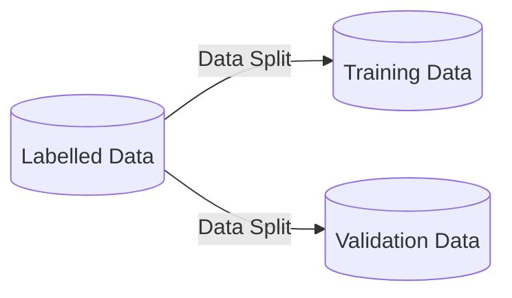
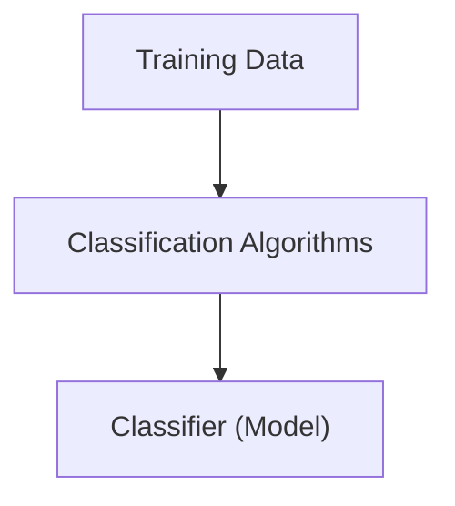
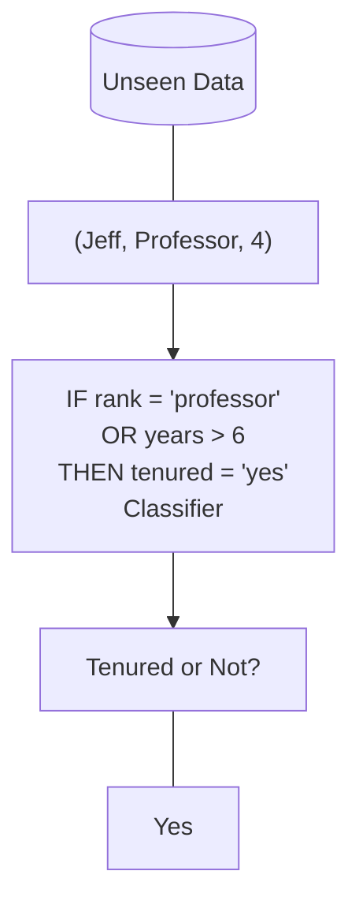
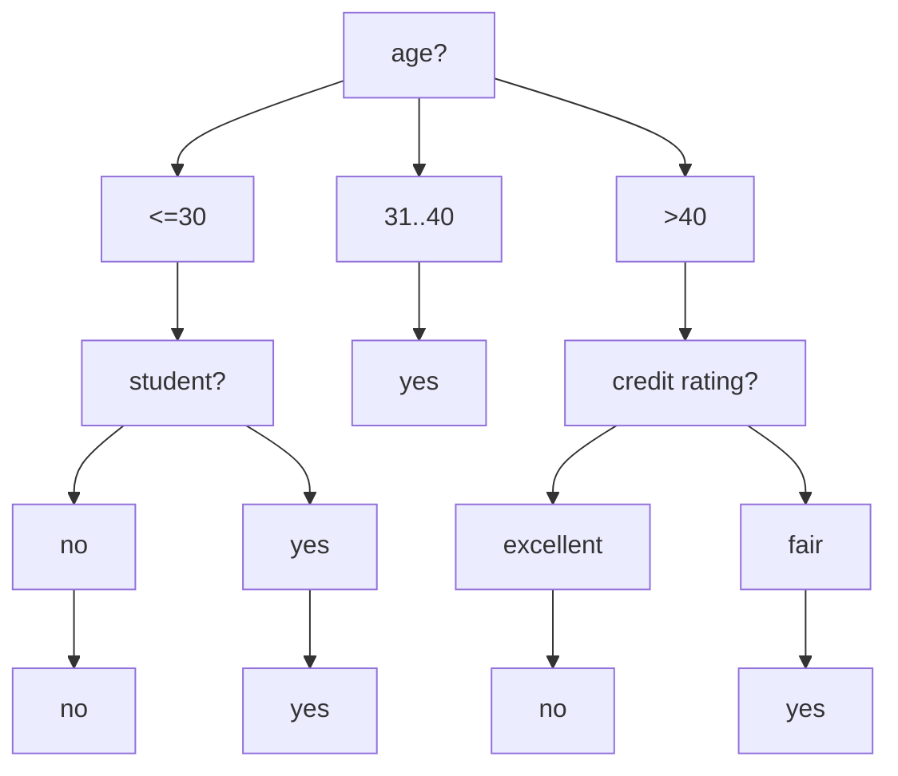
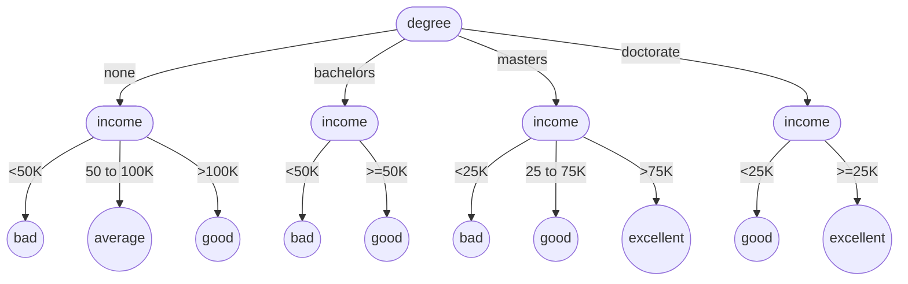
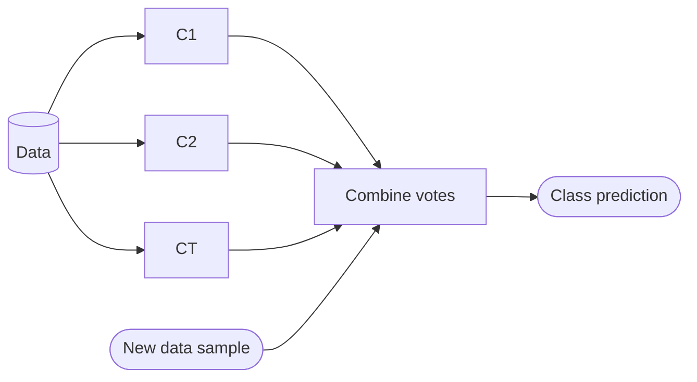
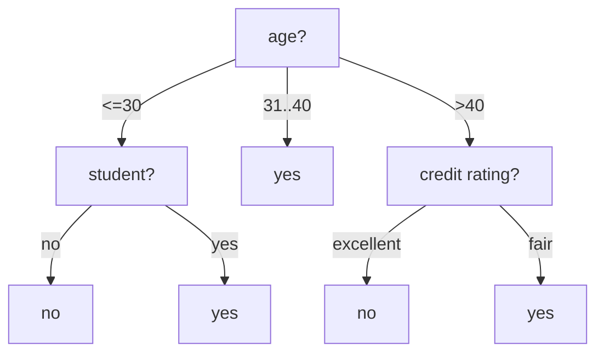
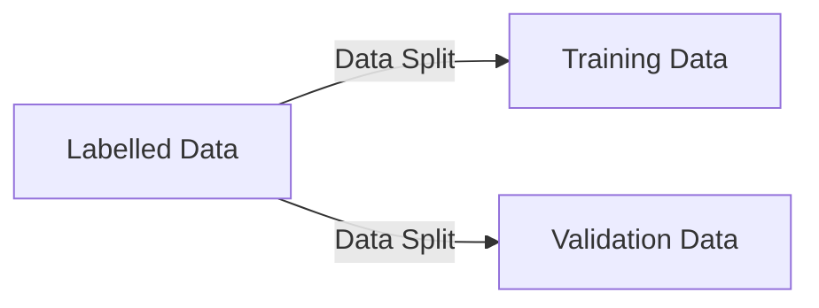
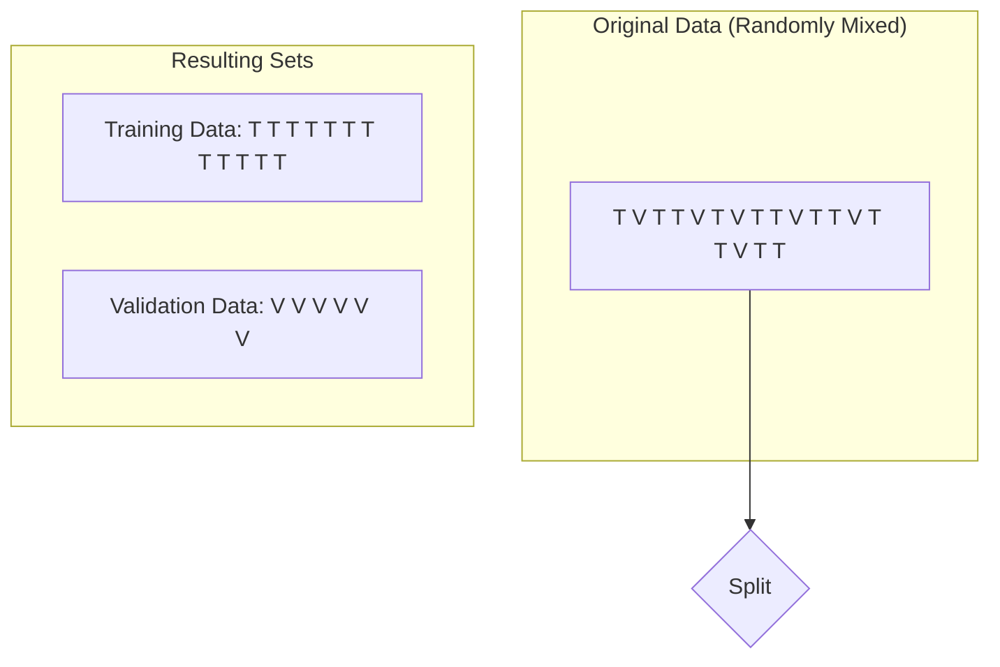
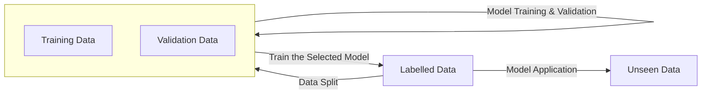

# Data Intensive Systems (DIS)
## KBH-SW7 E25

### 7. Classification

AALBORG UNIVERSITY


---


# PYTHON FOR DATA SCIENCE CHEAT SHEET
## Python Scikit-Learn

### Introduction
Scikit-learn: "sklearn" is a machine learning library for the Python programming language. Simple and efficient tool for data mining, Data analysis and Machine Learning.

**Importing Convention** - `import sklearn`

----

### Preprocessing

#### Data Loading
* **Using NumPy:**
  ```python
  import numpy as np
  a = np.array([(1,2,3,4),(7,8,9,10)], dtype=int)
  data = np.loadtxt('file_name.csv', delimiter=',')
  ```
* **Using Pandas:**
  ```python
  import pandas as pd
  df = pd.read_csv('file_name.csv', header=0)
  ```

#### Train-Test Data
```python
from sklearn.model_selection import train_test_split

X_train, X_test, y_train, y_test = train_test_split(X, y, random_state=0)
```

#### Data Preparation
* **Standardization**
  ```python
  from sklearn.preprocessing import StandardScaler
  get_names = df.columns
  scaler = preprocessing.StandardScaler()
  scaled_df = scaler.fit_transform(df)
  scaled_df = pd.DataFrame(scaled_df, columns=get_names)
  ```
* **Normalization**
  ```python
  from sklearn.preprocessing import Normalizer
  pd.read_csv("File_name.csv")
  x_array = np.array(df['Column']) # Normalize Column
  normalized_X = preprocessing.normalize([x_array])
  ```

----

### Working On Model

#### Model Choosing
* **Supervised Learning Estimator:**
  * **Linear Regression:**
    ```python
    from sklearn.linear_model import LinearRegression
    new_lr = LinearRegression(normalize=True)
    ```
  * **Support Vector Machine:**
    ```python
    from sklearn.svm import SVC
    new_svc = SVC(kernel='linear')
    ```
  * **Naive Bayes:**
    ```python
    from sklearn.naive_bayes import GaussianNB
    new_gnb = GaussianNB()
    ```
  * **KNN:**
    ```python
    from sklearn import neighbors
    knn = neighbors.KNeighborsClassifier(n_neighbors=1)
    ```
* **Unsupervised Learning Estimator:**
  * **Principal Component Analysis (PCA):**
    ```python
    from sklearn.decomposition import PCA
    new_pca = PCA(n_components=0.95)
    ```
  * **K Means:**
    ```python
    from sklearn.cluster import KMeans
    k_means = KMeans(n_clusters=5, random_state=0)
    ```

#### Train-Test Data
* **Supervised:**
  ```python
  new_lr.fit(X, y)
  knn.fit(X_train, y_train)
  new_svc.fit(X_train, y_train)
  ```
* **Unsupervised:**
  ```python
  k_means.fit(X_train)
  pca_model_fit = new_pca.fit_transform(X_train)
  ```

----

### Post-Processing

#### Prediction
* **Supervised:**
  ```python
  y_predict = new_svc.predict(np.random.random((3,5)))
  y_predict = new_lr.predict(X_test)
  y_predict = knn.predict_proba(X_test)
  ```
* **Unsupervised:**
  ```python
  y_pred = k_means.predict(X_test)
  ```

#### Model Tuning
* **Grid Search:**
  ```python
  from sklearn.grid_search import GridSearchCV
  params = {"n_neighbors": np.arange(1,3), "metric": ["euclidean", "cityblock"]}
  grid = GridSearchCV(estimator=knn, param_grid=params)
  grid.fit(X_train, y_train)
  print(grid.best_score_)
  print(grid.best_estimator_.n_neighbors)
  ```
* **Randomized Parameter Optimization:**
  ```python
  from sklearn.grid_search import RandomizedSearchCV
  params = {"n_neighbors": range(1,5), "weights": ["uniform", "distance"]}
  rsearch = RandomizedSearchCV(estimator=knn, param_distributions=params, cv=4, n_iter=8, random_state=5)
  rsearch.fit(X_train, y_train)
  print(rsearch.best_score_)
  ```

#### Evaluate Performance
* **Classification:**
  1. **Confusion Matrix:**
     ```python
     from sklearn.metrics import confusion_matrix
     print(confusion_matrix(y_test, y_pred))
     ```
  2. **Accuracy Score:**
     ```python
     knn.score(X_test, y_test)
     from sklearn.metrics import accuracy_score
     accuracy_score(y_test, y_pred)
     ```
* **Regression:**
  1. **Mean Absolute Error:**
     ```python
     from sklearn.metrics import mean_absolute_error
     y_true = [3, -0.5, 2]
     mean_absolute_error(y_true, y_predict)
     ```
  2. **Mean Squared Error:**
     ```python
     from sklearn.metrics import mean_squared_error
     mean_squared_error(y_test, y_predict)
     ```
  3. **R² Score:**
     ```python
     from sklearn.metrics import r2_score
     r2_score(y_true, y_predict)
     ```
* **Clustering:**
  1. **Homogeneity:**
     ```python
     from sklearn.metrics import homogeneity_score
     homogeneity_score(y_true, y_predict)
     ```
  2. **V-measure:**
     ```python
     from sklearn.metrics import v_measure_score
     metrics.v_measure_score(y_true, y_predict)
     ```
* **Cross-validation:**
  ```python
  from sklearn.cross_validation import cross_val_score
  print(cross_val_score(knn, X_train, y_train, cv=4))
  print(cross_val_score(new_lr, X, y, cv=2))
  ```

AALBORG UNIVERSITET
SIDE 2
FURTHERMORE:
Python for Data Science Certification Training Course
IntelliPaat


---


scikit-learn algorithm cheat-sheet

# scikit-learn algorithm cheat-sheet

```mermaid
graph TD
    START((START)) -- orange line --> samples50{>50 samples}
    samples50 -- NO --> get_more_data([get more data])
    samples50 -- YES --> predicting_category{predicting a category}

    subgraph classification [classification]
    predicting_category -- YES --> labeled_data{do you have labeled data}
    labeled_data -- YES --> samples100k_class{<100K samples}
    samples100k_class -- YES --> linear_svc[Linear SVC]
    linear_svc -- NOT WORKING --> text_data{Text Data}
    text_data -- YES --> naive_bayes[Naive Bayes]
    text_data -- NO --> kneighbors[KNeighbors Classifier]
    kneighbors -- NOT WORKING --> svc_ensemble[SVC Ensemble Classifiers]
    samples100k_class -- NO --> sgd_classifier[SGD Classifier]
    sgd_classifier -- NOT WORKING --> kernel_approx_class[kernel approximation]
    end

    subgraph regression [regression]
    predicting_category -- NO --> predicting_quantity{predicting a quantity}
    predicting_quantity -- YES --> samples100k_reg{<100K samples}
    samples100k_reg -- NO --> sgd_regressor[SGD Regressor]
    samples100k_reg -- YES --> few_features{few features should be important}
    few_features -- YES --> elasticnet_lasso[ElasticNet Lasso]
    few_features -- NO --> ridge_svr_linear["RidgeRegression\nSVR\n(kernel='linear')"]
    ridge_svr_linear -- NOT WORKING --> svr_rbf_ensemble["SVR(kernel='rbf')\nEnsembleRegressors"]
    end

    subgraph clustering [clustering]
    labeled_data -- NO --> categories_known{number of categories known}
    categories_known -- YES --> samples10k_clust_yes{<10K samples}
    samples10k_clust_yes -- YES --> kmeans[KMeans]
    kmeans -- NOT WORKING --> spectral_gmm[Spectral Clustering\nGMM]
    samples10k_clust_yes -- NO --> minibatch_kmeans[MiniBatch KMeans]
    categories_known -- NO --> samples10k_clust_no{<10K samples}
    samples10k_clust_no -- YES --> meanshift_vbgmm[MeanShift\nVBGMM]
    samples10k_clust_no -- NO --> tough_luck
    end

    subgraph dimensionality_reduction [dimensionality reduction]
    predicting_quantity -- NO --> just_looking{just looking}
    just_looking -- YES --> randomized_pca[Randomized PCA]
    randomized_pca -- NOT WORKING --> samples10k_dim{<10K samples}
    samples10k_dim -- YES --> isomap_spectral[Isomap\nSpectral\nEmbedding]
    isomap_spectral -- NOT WORKING --> lle[LLE]
    samples10k_dim -- NO --> kernel_approx_dim[kernel\napproximation]
    just_looking -- NO --> predicting_structure{predicting structure}
    predicting_structure -- YES --> randomized_pca
    predicting_structure -- NO --> tough_luck
    end

    tough_luck([tough luck])

    %% Styling
    style START fill:#f90,stroke:#333,stroke-width:2px
    style samples50 fill:#9cf,stroke:#333
    style get_more_data fill:#9cf,stroke:#333
    style predicting_category fill:#9cf,stroke:#333
    style labeled_data fill:#9cf,stroke:#333
    style samples100k_class fill:#9cf,stroke:#333
    style text_data fill:#9cf,stroke:#333
    style predicting_quantity fill:#9cf,stroke:#333
    style samples100k_reg fill:#9cf,stroke:#333
    style few_features fill:#9cf,stroke:#333
    style just_looking fill:#9cf,stroke:#333
    style predicting_structure fill:#9cf,stroke:#333
    style categories_known fill:#9cf,stroke:#333
    style samples10k_clust_yes fill:#9cf,stroke:#333
    style samples10k_clust_no fill:#9cf,stroke:#333
    style samples10k_dim fill:#9cf,stroke:#333
    style tough_luck fill:#9cf,stroke:#333

    linkStyle 0,1,14,15,24,25,34,35 stroke:#f90,stroke-width:2px; %% Orange lines
    linkStyle 2,4,6,9,17,19,21,27,29,31,37,39 stroke:#0a0,stroke-width:2px; %% Green lines (YES)
    linkStyle 3,5,10,16,18,20,26,28,32,36,38,40 stroke:#f00,stroke-width:2px; %% Red lines (NO)
    linkStyle 7,11,13,22,30,33 stroke:#f90,stroke-width:2px; %% Orange lines (NOT WORKING)
```

AALBORG UNIVERSITET SIDE 3
scikit-


---


# Agenda

* Classification and model evaluation
    - Classification steps
    - Classification performance
* Typical classification models
* Data scaling
* Model evaluation and selection

AALBORG UNIVERSITET
SIDE 4


---

# Supervised vs. Unsupervised Learning

* Supervised learning generalizes from *known examples* to automate decision-making processes.
    * **Classification**: Predict a discrete value from a *pre-defined* set of class labels
        - E.g., given a loan applicant, predict if she/he is a *good* or *bad* client. (*Approval* or *rejection*)
        - More examples: digital recognition from handwritings, fraud detection in banking, spam filtering.
    * **Regression**: Predict a continuous value from a continuous range
        - E.g., predict the price of a stock

* Unsupervised learning does *not* need any known examples. It works on input data directly. (*Future lectures*)
    * E.g., similarity-based client grouping, outlier detection for website access patterns

AALBORG UNIVERSITET
SIDE 5


---


# Classification: Three Major Steps

1. **Model construction**: describing a set of *predetermined* classes
    * Each tuple/sample is assumed to belong to a predefined class, as determined by the **class label** column
    * The set of tuples used for model construction is **training set**
    * A model is created using an algorithm on selected features.
        - Simply speaking, features are columns or generated based on columns.
        - Not all columns are used for creating a model.
        - **Feature selection** or **engineering** decides which features (columns) to be used.
    * The model is represented as classification rules, a decision tree, or mathematical formulae.
    * The model can predict the class label for a given (unseen) tuple
2. **Model validation**
3. **Model application/test**

AALBORG UNIVERSITET
SIDE 6


---

# Classification: Three Steps (cont.)

2. **Model validation**: to *evaluate* how good your model is for the given validation data set; to tune the parameters of a model (*parameter tuning*).
    * **Estimate accuracy** of the model using **validation set** (data set for validation)
        - The known label of test sample is compared with the classified result from the model
        - **Accuracy** rate is the percentage of test set samples that are correctly classified by the model
        - **Validation set** should be independent of training set (otherwise **overfitting**)
    * If the accuracy is *acceptable*, the model can be used to *classify new/unseen data* (model application/test)
    * Different models may be compared for selection of the best
    * *NB*: Sometimes validation is also called test (e.g., in sklearn)

3. **Model application/test**: for classifying future or *unseen* objects
    * For those objects, you don't know their classes!

AALBORG UNIVERSITET
SIDE 7


---


# Split Labelled Data

* `sklearn.model_selection.train_test_split`
* `X_train, X_test, y_train, y_test = train_test_split(X, y, test_size=0.30, random_state=42)`
    * `X_train`: features of training data; `y_train`: class labels of training data
    * `X_test`: features of validation data; `y_test`: class labels of validation data
    * `test_size`: percentage of validation data
    * `random_state`: randomization of the split. A fixed number will enable reproducibility.
* Different ways of split can result in different models and performance
    * We will see more next week



AALBORG UNIVERSITET
SIDE 8


---


# Step 1: Model Construction

* Two classes
    * Tenured
    * Not tenured



### Training Data

<table>
  <thead>
    <tr>
        <th>NAME</th>
        <th>RANK</th>
        <th>YEARS</th>
        <th>TENURED</th>
    </tr>
  </thead>
  <tbody>
    <tr>
        <td>Mike</td>
<td>Assistant Prof</td>
<td>3</td>
<td>no</td>
    </tr>
<tr>
        <td>Mary</td>
<td>Assistant Prof</td>
<td>7</td>
<td>yes</td>
    </tr>
<tr>
        <td>Bill</td>
<td>Professor</td>
<td>2</td>
<td>yes</td>
    </tr>
<tr>
        <td>Jim</td>
<td>Associate Prof</td>
<td>7</td>
<td>yes</td>
    </tr>
<tr>
        <td>Dave</td>
<td>Assistant Prof</td>
<td>6</td>
<td>no</td>
    </tr>
<tr>
        <td>Anne</td>
<td>Associate Prof</td>
<td>3</td>
<td>no</td>
    </tr>
  </tbody>
</table>

*(Note: The "TENURED" column contains the Class labels)*

### Classifier (Model)
> IF rank = ‘professor’
> OR years > 6
> THEN tenured = ‘yes’

AALBORG UNIVERSITET
SIDE 9


---


# Step 2: Model Validation

* Two classes
    * Tenured
    * Not tenured

### Classifier
```
IF rank = 'professor'
OR years > 6
THEN tenured = 'yes'
```

### Validation Data
* How good is the results on the validation data?
* Evaluate your model

<table>
  <thead>
    <tr>
        <th>NAME</th>
        <th>RANK</th>
        <th>YEARS</th>
        <th>TENURED (groundtruth)</th>
        <th>predicted</th>
    </tr>
  </thead>
  <tbody>
    <tr>
        <td>Tom</td>
<td>Assistant Prof</td>
<td>2</td>
<td>no</td>
<td>no</td>
    </tr>
<tr>
        <td>Merlisa</td>
<td>Associate Prof</td>
<td>7</td>
<td>no</td>
<td>yes</td>
    </tr>
<tr>
        <td>George</td>
<td>Professor</td>
<td>5</td>
<td>yes</td>
<td>yes</td>
    </tr>
<tr>
        <td>Joseph</td>
<td>Assistant Prof</td>
<td>7</td>
<td>yes</td>
<td>yes</td>
    </tr>
  </tbody>
</table>

**Model accuracy is 75%**

AALBORG UNIVERSITET
SIDE 10


---


# Step 3: Model Application/Test

* Two classes
    * Tenured
    * Not tenured



AALBORG UNIVERSITET
SIDE 11


---

# Classifier Performance

* Consider a binary classifier
    - Target class A: *positive*
    - Target class NOT A: *negative*
* Consider the *ground truth* and classification result. There are four cases.
    - Put it simply, ground truth is the 'fact' we know.

<table>
  <tbody>
    <tr>
        <td>**True Positive (TP)**</td>
    </tr>
<tr>
        <td>$t \in A$, and classified as A	**False Negative (FN)**</td>
    </tr>
<tr>
        <td>$t \in A$, but classified as not A</td>
    </tr>
<tr>
        <td>**False Positive (FP)**</td>
    </tr>
<tr>
        <td>$t \notin A$, but classified as A	**True Negative (TN)**</td>
    </tr>
<tr>
        <td>$t \notin A$, and classified as not A</td>
    </tr>
  </tbody>
</table>

AALBORG UNIVERSITET
SIDE 12


---

# Performance Metrics (for One Class A)

* **Precision** (exactness)
    * How often the positive classification is correct.
    * $$TP / (TP+FP)$$
* **Recall** (completeness)
    * How many of the actual positive cases are classified as positive.
    * $$TP / (TP+FN)$$
* **Accuracy**
    * The fraction of the time when the classifier gives the correct classification.
    * $$(TP+TN) / (TP+FP+TN+FN)$$

> This is easy to understand for binary classification.

<table>
  <thead>
    <tr>
        <th>TP</th>
        <th>FN</th>
    </tr>
<tr>
        <th>FP</th>
        <th>TN</th>
    </tr>
  </thead>
  <tbody>
    <tr>
        <td>$t \in A$, and classified as A</td>
<td>$t \in A$, but classified as not A</td>
    </tr>
<tr>
        <td>$t \notin A$, but classified as A</td>
<td>$t \notin A$, and classified as not A</td>
    </tr>
  </tbody>
</table>

AALBORG UNIVERSITET SIDE 13


---

# Precision, Recall and F-measures

* Perfect score for Precision and Recall is 1
* Inverse relationship exists between Precision and Recall
* **F measure** ($F_1$ or **F-score**): harmonic mean of Precision and Recall
$$F = \frac{2 \times precision \times recall}{precision + recall}$$
* $F_\beta$: weighted measure of precision and recall
    - assigns $\beta$ times as much weight to recall as to precision
$$F = \frac{(1 + \beta^2) \times precision \times recall}{\beta^2 \times precision + recall}$$

> What if more than two class labels?

AALBORG UNIVERSITET SIDE 14


---


# Confusion Matrix

* Three pre-defined classes A, B, C
* Ground truth and classification result

<table>
  <thead>
    <tr>
        <th>Object</th>
        <th>Ground Truth</th>
        <th>Classification Result</th>
    </tr>
  </thead>
  <tbody>
    <tr>
        <td>object-1</td>
<td>A</td>
<td>A</td>
    </tr>
<tr>
        <td>object-2</td>
<td>B</td>
<td>A</td>
    </tr>
<tr>
        <td>object-3</td>
<td>C</td>
<td>C</td>
    </tr>
<tr>
        <td>object-4</td>
<td>C</td>
<td>C</td>
    </tr>
<tr>
        <td>object-5</td>
<td>B</td>
<td>B</td>
    </tr>
<tr>
        <td>object-6</td>
<td>A</td>
<td>B</td>
    </tr>
<tr>
        <td>object-7</td>
<td>B</td>
<td>B</td>
    </tr>
  </tbody>
</table>

*Note: In the table above, the classification of object-2 (Ground Truth B, Result A) is circled in red, and the classification of object-6 (Ground Truth A, Result B) is circled in blue.*

* Confusion Matrix (N x N for N classes)
    - The cell M[$i, j$] counts the case that groundtruth $i$ is classified as $j$

<table>
  <thead>
    <tr>
        <th>[colspan=2 rowspan=2]</th>
        <th colspan="3">Classification result</th>
        <th rowspan="2">Total</th>
        <th colspan="2"></th>
    </tr>
<tr>
        <th></th>
        <th>A</th>
        <th>B</th>
        <th>C</th>
        <th></th>
        <th colspan="2"></th>
    </tr>
<tr>
        <th rowspan="3">Ground truth</th>
        <th>A</th>
        <th>1</th>
        <th>1</th>
        <th>0</th>
        <th>2</th>
        <th></th>
    </tr>
<tr>
        <th></th>
        <th>B</th>
        <th>1</th>
        <th>2</th>
        <th>0</th>
        <th>3</th>
    </tr>
<tr>
        <th></th>
        <th>C</th>
        <th>0</th>
        <th>0</th>
        <th>2</th>
        <th>2</th>
        <th></th>
    </tr>
<tr>
        <th>Total</th>
        <th>2</th>
        <th>3</th>
        <th>2</th>
        <th>7</th>
        <th colspan="2"></th>
    </tr>
  </thead>
</table>

**Annotations on the Confusion Matrix:**
* **FN for A**: The values in the first row (Ground truth A) for columns B and C (1 and 0) are circled in blue.
* **FP for A**: The values in the first column (Classification result A) for rows B and C (1 and 0) are circled in red.
* **TP for one class, and TN for others**: The diagonal values (1, 2, 2) are circled in green.

* **Accuracy** = $(TP+TN) / All$
    - In this example, Accuracy = $(1+2+2)/7 = 71.4\%$

AALBORG UNIVERSITET
SIDE 15


---

# Precision/Recall in Confusion Matrix

* Calculate the precision $p_i$ for each class $C_i$
    * Overall precision is the average of all $p_i$s
* Calculate the recall $r_i$ for each class $C_i$
    * Overall recall is the average of all $r_i$s

* Example
    * $p_A = 30/60 = 1/2$, $r_A = 30/100 = 3/10$
    * $p_B = 60/120 = 1/2$, $r_B = 60/100 = 3/5$
    * $p_C = 80/120 = 2/3$, $r_C = 80/100 = 4/5$
    * Overall precision = 5/9, overall recall = 17/30

### Confusion matrix

<table>
  <thead>
    <tr>
        <th rowspan="2">Ground truth</th>
        <th colspan="4">Classification result</th>
        <th></th>
    </tr>
<tr>
        <th></th>
        <th>A</th>
        <th>B</th>
        <th>C</th>
        <th>Total</th>
        <th></th>
    </tr>
  </thead>
  <tbody>
    <tr>
        <td>A</td>
<td>30</td>
<td>50</td>
<td>20</td>
<td>100</td>
<td></td>
    </tr>
<tr>
        <td>B</td>
<td>20</td>
<td>60</td>
<td>20</td>
<td>100</td>
<td></td>
    </tr>
<tr>
        <td>C</td>
<td>10</td>
<td>10</td>
<td>80</td>
<td>100</td>
<td></td>
    </tr>
<tr>
        <td>Total</td>
<td>60</td>
<td>120</td>
<td>120</td>
<td>300</td>
<td></td>
    </tr>
  </tbody>
</table>

**Annotations on the confusion matrix:**
* The first row (Ground truth A) is highlighted to indicate the calculation for **Recall for A: $r_A$**.
* The first column (Classification result A) is highlighted to indicate the calculation for **Precision for A: $p_A$**.

AALBORG UNIVERSITET
SIDE 16


---

# Analyze Your Confusion Matrix

* Essentially, the more zeroes or smaller the numbers on all cells but the diagonal, the better a classifier is. So you may analyze your confusion matrix and tweak your features accordingly.
* Confusion matrix gives strong clues as to where your classifier is going wrong.
    - E.g., if for Class A you can see that the classifier incorrectly predicts Class B for majority of the mislabeled cases, it indicates the classifier is somehow confused between classes A and B.
    - One way to fix this is to add biasing features to improve classification of class A, e.g., more training data of A.

AALBORG UNIVERSITET SIDE 17


---

# Agenda

* Classification and model evaluation
* Typical classification models
    - Rule based classifier (the previous tenure example)
    - Decision tree
    - Random forest
    - K nearest neighbors (KNN)
* Data scaling
* Model evaluation and selection

AALBORG UNIVERSITET
SIDE 18


---


AALBORG UNIVERSITET
SIDE 19

# Classification Using Decision Trees

*   The classification model (classifier) is organized as a tree for decision making.
    *   It's thus called a **decision tree**.
*   Internal nodes are associated with an *attribute/column* and arcs with *values* for that attribute.
*   A leaf node tells the predicted class label.

*   Each person has attributes/columns:
    *   (age, student [yes/no], credit rating)
    *   p1(18, yes, fair)
    *   p2(55, no, excellent)
*   Two classe labels
    *   Buy computer
    *   Not buy computer



---

# Another Decision Tree Example

* Each client has attributes/columns:
    * (degree, income, ...)
    * E.g., c1(bachelor, 55K, ...)

### Decision Tree Structure

* **Partitioning (or splitting) on attribute degree**: The root node of the tree.
* **Partitioning on attribute income**: The internal nodes following the first split.
* **A leaf node predicts a class label**: The final nodes of the tree representing the classification.



### Class Labels (Credit Levels)

* Four class labels (credit levels):

<table>
  <tbody>
    <tr>
        <td>Icon</td>
<td>Label</td>
    </tr>
<tr>
        <td>Solid Black Circle</td>
<td>bad</td>
    </tr>
<tr>
        <td>Light Grey Circle</td>
<td>average</td>
    </tr>
<tr>
        <td>Patterned Circle</td>
<td>good</td>
    </tr>
<tr>
        <td>White Circle</td>
<td>excellent</td>
    </tr>
  </tbody>
</table>

AALBORG UNIVERSITET
SIDE 20


---

# Construction/Optimization of Decision Trees

* Input:
    * Training data: a set of data in which the classes are already known.
* Ouput:
    * A decision tree that can be used for classification.
* Basic idea:
    * Generating a decision tree *top-down* using the training data.
    * Each internal node of the tree partitions the training data into groups based on a **splitting attribute** and a **splitting condition** for the node.
        * Measure of the quality of a split: **gini** index and **entropy**.
        * **Best** split vs. **Random** split (in sklearn)
        
        > **NB: You can specify how a DT is constructed.**

    * In a leaf node, all the items at the node belong to the same class, or all attributes have been considered and no further partitioning is possible.

AALBORG UNIVERSITET
SIDE 21


---

# Random Forest (of Decision Trees)

* Decision trees’ main drawback: tendency to overfit the training data.
    * Overfitting: A model focuses so much on training data that it does not generalize well to unseen data in predication.
* A random forest
    * A collection of decision trees (DT)
    * Each DT is slightly different from the others
    * With many DTs, we can maintain good prediction and reduce overfitting by using all trees’ majority vote as the classification result.

AALBORG UNIVERSITET
SIDE 22


---

# Random Forest, *cont.*

* Two ways of introducing randomness to the tree building
    * Randomly selecting the training data points
    * Randomly selecting the features in each tree node split
* Random forest is an example of ensemble learning
    * Use a combination of models to increase prediction accuracy
    * Combine a series of T learned models/classifiers, C<sub>1</sub>, C<sub>2</sub>, ..., C<sub>T</sub>, with the aim of creating an improved model C*
        * A simple combination: majority vote



AALBORG UNIVERSITET
SIDE 23


---


# Comments on Decision Trees

* Given the same training data set, different decision trees may be constructed by different methods (with different parameters)
* A decision tree may be unbalanced
* At the same level, different nodes in a decision tree may split on different attributes.
* Decision trees belong to *eager learners*



AALBORG UNIVERSITET
SIDE 24


---

# Eager vs Lazy Learning

* **Eager learning** (model-based methods): Given a set of training samples, constructs a classification model before receiving new (e.g., test) data to classify.
    - More time in training but less time in predicting/classification
    - E.g., we need to construct a decision tree before using it.
* **Lazy learning** (e.g., instance-based learning): Simply stores training data as instances (or only minor processing) and waits until a new instance must be classified
    - Less time in training but more time in predicting/classification
    - E.g., k nearest neighbors: Instances represented as points for which *distances* can be measured.

AALBORG UNIVERSITET SIDE 25


---


# K Nearest Neighbors (KNN)

* Instance data set (training data)
    - A set $D$ contains $|D| (\ge K)$ items, each is labeled with a class.
    - $D = \{(item, class)\}$
    - $D$ should cover *all* pre-defined class: $|D| \ge C$ (totally $C$ classes)
* Classification
    - For a given item $t$ to be classified, we find its **$K$** nearest neighbor items (**decision set**) from $D$.
        - Distance measurement: Usually Euclidean distance
    - Count the class labels in the KNNs and give $t$ the most frequent class label.
        - In other words, item $t$ is placed in the class with the highest number of NNs.
        - NB: the **decision rule** can be different.

AALBORG UNIVERSITET
SIDE 26


---


# KNN Example

* Different $K$s may lead to different classification results.
    * $K = 1$: Class A
    * $K = 3$: Class C

The following table represents the data points and their classifications as shown in the scatter plot. The plot includes a query point (red dot) and two concentric dashed circles representing the nearest neighbors for $K=1$ and $K=3$.

<table>
  <thead>
    <tr>
        <th>X-coordinate</th>
        <th>Y-coordinate</th>
        <th>Classification</th>
    </tr>
  </thead>
  <tbody>
    <tr>
        <td>0.5</td>
<td>7.5</td>
<td>Class A</td>
    </tr>
<tr>
        <td>1.5</td>
<td>9.0</td>
<td>Class A</td>
    </tr>
<tr>
        <td>4.0</td>
<td>7.0</td>
<td>Class A</td>
    </tr>
<tr>
        <td>5.5</td>
<td>8.0</td>
<td>Class A</td>
    </tr>
<tr>
        <td>6.5</td>
<td>9.0</td>
<td>Class A</td>
    </tr>
<tr>
        <td>7.5</td>
<td>8.5</td>
<td>Class A</td>
    </tr>
<tr>
        <td>0.5</td>
<td>5.0</td>
<td>Class B</td>
    </tr>
<tr>
        <td>1.5</td>
<td>5.5</td>
<td>Class B</td>
    </tr>
<tr>
        <td>1.0</td>
<td>2.0</td>
<td>Class B</td>
    </tr>
<tr>
        <td>2.5</td>
<td>4.5</td>
<td>Class B</td>
    </tr>
<tr>
        <td>3.0</td>
<td>3.5</td>
<td>Class B</td>
    </tr>
<tr>
        <td>4.0</td>
<td>2.0</td>
<td>Class B</td>
    </tr>
<tr>
        <td>4.5</td>
<td>5.5</td>
<td>Class C</td>
    </tr>
<tr>
        <td>5.5</td>
<td>4.5</td>
<td>Class C</td>
    </tr>
<tr>
        <td>5.0</td>
<td>2.0</td>
<td>Class C</td>
    </tr>
<tr>
        <td>6.0</td>
<td>1.5</td>
<td>Class C</td>
    </tr>
<tr>
        <td>7.0</td>
<td>2.0</td>
<td>Class C</td>
    </tr>
<tr>
        <td>7.5</td>
<td>5.0</td>
<td>Class C</td>
    </tr>
<tr>
        <td>4.5</td>
<td>6.0</td>
<td>Query Point (Red Dot)</td>
    </tr>
  </tbody>
</table>

*   **$K=1$ circle**: Centered at (4.5, 6.0), it encompasses the nearest point at (4.0, 7.0), which belongs to **Class A**.
*   **$K=3$ circle**: Centered at (4.5, 6.0), it encompasses the three nearest points: (4.0, 7.0) from Class A, (4.5, 5.5) from Class C, and (5.5, 4.5) from Class C. The majority classification is **Class C**.

AALBORG UNIVERSITET
SIDE 27


---

# Appropriate Value for K

* Different $K$s may lead to different classification results.
* Too small $K$: High sensitivity to outliers
* Too large $K$: Decision set contains many items from other classes.
* Empirically, $1 \ll K < 10$ yields a high classification accuracy in many cases.

The following diagram illustrates the decision sets for different values of $k$ around a query point $q$. The data points consist of black dots and red dots.

<table>
  <thead>
    <tr>
        <th>Boundary Style</th>
        <th>Description</th>
    </tr>
  </thead>
  <tbody>
    <tr>
        <td>Solid circle</td>
<td>decision set for $k = 1$</td>
    </tr>
<tr>
        <td>Dashed circle</td>
<td>decision set for $k = 7$</td>
    </tr>
<tr>
        <td>Dotted ellipse</td>
<td>decision set for $k = 17$</td>
    </tr>
  </tbody>
</table>

The diagram shows a central query point $q$.
- The decision set for $k = 1$ (solid circle) is the smallest and contains only the query point itself.
- The decision set for $k = 7$ (dashed circle) is larger and encompasses several nearby black dots.
- The decision set for $k = 17$ (dotted ellipse) is the largest and includes both black dots and several red dots further away.

AALBORG UNIVERSITET
SIDE 28


---


# Decision Rules of KNN

* Using unit weights (i.e., no weights) for the decision set
    * Simply "majority vote" or **standard rule**
    * For k=5 in the example, the rule yields class "-"
* Using the *reciprocal square of the distances* as weights
    * For k=5 in the example, the rule yields class "+"
* Using *a-priori probability (frequency)* of classes as weight
    * For k=5 in the example, the rule yields class "+"
        * "-": $$3/15 = 1/5$$
        * "+": $$2/6 = 1/3$$

The diagram illustrates a classification scenario with two classes, "+" and "-", and a central query point. It shows the decision sets for $k=1$ and $k=5$.

<table>
  <thead>
    <tr>
        <th>Decision Set</th>
        <th>Count of +</th>
        <th>Count of -</th>
        <th>Result (Majority Vote)</th>
    </tr>
  </thead>
  <tbody>
    <tr>
        <td>k = 1 (solid circle)</td>
<td>1</td>
<td>0</td>
<td>+</td>
    </tr>
<tr>
        <td>k = 5 (dashed circle)</td>
<td>2</td>
<td>3</td>
<td>-</td>
    </tr>
<tr>
        <td>Total in dataset</td>
<td>6</td>
<td>15</td>
<td>n/a</td>
    </tr>
  </tbody>
</table>

**Legend and Notes:**
* Classes + and -
* Solid circle: decision set for $k = 1$
* Dashed circle: decision set for $k = 5$
* The a-priori weights are calculated as (count in decision set) / (total count in dataset).

AALBORG UNIVERSITET
SIDE 29


---

# Pros and Cons of KNN

* Applicability: sample (training) data required only without training
* High classification accuracy in many applications
* Easy incremental adaptation to new sample objects
* Also useful for prediction
* Robust to noisy data by averaging K nearest neighbors

* Naïve implementation is inefficient
    - KNN search is not straightforward. Support by database in query processing may help.
* Does not produce explicit knowledge about classes but some explanation information.
* Curse of dimensionality: distance could be dominated by irrelevant attributes
    - To overcome it, axes stretch or elimination of the least relevant attributes

AALBORG UNIVERSITET
SIDE 30


---


# Agenda

* Classification and model evaluation
* Typical classification models
* Data scaling
    - Why, what and how
* Model evaluation and selection

AALBORG UNIVERSITET
SIDE 31


---


# A Motivation Example

The following charts demonstrate the effect of data scaling on the k-Nearest Neighbors (k-NN) algorithm.

### Comparison of Data Scaling

<table>
  <thead>
    <tr>
        <th>Feature</th>
        <th>Original data</th>
        <th>With data scaling</th>
    </tr>
  </thead>
  <tbody>
    <tr>
        <td>X-axis ($x_1$)</td>
<td>Range: -20 to 50. Data points are concentrated between approximately 0 and 5.</td>
<td>Range: -2 to 2. Data points are distributed between -2 and 2.</td>
    </tr>
<tr>
        <td>Y-axis ($x_2$)</td>
<td>Range: -20 to 50. Data points are spread from approximately -15 to 50.</td>
<td>Range: -2 to 2. Data points are distributed between -2 and 2.</td>
    </tr>
<tr>
        <td>k-NN Behavior</td>
<td>The 10-nearest neighbors (highlighted in green) for the central black point are selected primarily based on their proximity along the $x_2$ axis. Because the scale of $x_2$ is much larger than $x_1$, it dominates the distance calculation.</td>
<td>The 10-nearest neighbors (highlighted in green) for the central black point are selected based on proximity in both the $x_1$ and $x_2$ dimensions, as both features have been scaled to a similar range.</td>
    </tr>
  </tbody>
</table>

### Legend

<table>
  <thead>
    <tr>
        <th>Symbol</th>
        <th>Label</th>
    </tr>
  </thead>
  <tbody>
    <tr>
        <td>Red circle</td>
<td>Class 0</td>
    </tr>
<tr>
        <td>Blue circle</td>
<td>Class 1</td>
    </tr>
<tr>
        <td>Green-filled circle</td>
<td>10-Nearest Neighbors</td>
    </tr>
  </tbody>
</table>

AALBORG UNIVERSITET
https://stats.stackexchange.com/questions/287425/why-do-you-need-to-scale-data-in-knn
SIDE 32


---

# Data Scaling

<table>
  <thead>
    <tr>
        <th></th>
        <th>Original Data</th>
        <th>Standardization</th>
        <th>Normalization</th>
    </tr>
  </thead>
  <tbody>
    <tr>
        <td rowspan="2"></td>
<td>**Scatter plot of raw data**</td>
        <td colspan="2"></td>
    </tr>
<tr>
        <td>Red cluster: x ≈ [11, 15], y ≈ [6, 9]</td>
        <td colspan="3"></td>
    </tr>
<tr>
        <td>Blue cluster: x ≈ [11, 15], y ≈ [2, 6]</td>
        <td colspan="3"></td>
    </tr>
<tr>
        <td>X-axis: -10 to 15</td>
        <td colspan="3"></td>
    </tr>
<tr>
        <td>Y-axis: -7.5 to 10.0</td>
<td>**StandardScaler**</td>
        <td colspan="2"></td>
    </tr>
<tr>
        <td>Data centered at (0,0).</td>
        <td colspan="3"></td>
    </tr>
<tr>
        <td>Red cluster: x ≈ [-0.5, 1.5], y ≈ [0.5, 1.5]</td>
        <td colspan="3"></td>
    </tr>
<tr>
        <td>Blue cluster: x ≈ [-0.5, 1.5], y ≈ [-1.5, 0.5]</td>
        <td colspan="3"></td>
    </tr>
<tr>
        <td>Axes: -2 to 2</td>
<td>**MinMaxScaler**</td>
        <td colspan="2"></td>
    </tr>
<tr>
        <td>Data scaled to [0, 1].</td>
        <td colspan="3"></td>
    </tr>
<tr>
        <td>Red cluster: x ≈ [0.7, 1.0], y ≈ [0.6, 0.9]</td>
        <td colspan="3"></td>
    </tr>
<tr>
        <td>Blue cluster: x ≈ [0.7, 1.0], y ≈ [0.2, 0.6]</td>
        <td colspan="3"></td>
    </tr>
<tr>
        <td>Axes: -2 to 2</td>
        <td colspan="3"></td>
    </tr>
<tr>
        <td></td>
<td>**RobustScaler**</td>
        <td colspan="2"></td>
    </tr>
<tr>
        <td>Data centered at (0,0).</td>
        <td colspan="3"></td>
    </tr>
<tr>
        <td>Red cluster: x ≈ [-0.5, 1.5], y ≈ [0.2, 1.2]</td>
        <td colspan="3"></td>
    </tr>
<tr>
        <td>Blue cluster: x ≈ [-0.5, 1.5], y ≈ [-1.2, 0.2]</td>
        <td colspan="3"></td>
    </tr>
<tr>
        <td>Axes: -2 to 2</td>
<td>**Normalizer**</td>
        <td colspan="2"></td>
    </tr>
<tr>
        <td>Data points projected onto unit circle.</td>
        <td colspan="3"></td>
    </tr>
<tr>
        <td>All points have distance 1 from (0,0).</td>
        <td colspan="3"></td>
    </tr>
<tr>
        <td>Axes: -2 to 2</td>
        <td colspan="3"></td>
    </tr>
  </tbody>
</table>

* **StandardScaler**
    * For each feature: mean=0 and variance=1
* **MinMaxScaler**
    * Shifts the data, each feature falls in [0..1]
* **RobustScaler**
    * Similar to SS but uses median and quartile to avoid outliers
* **Normalizer**
    * Scales each data point *s.t.* its Euclidean distance to (0, 0) is 1
    * Used when *only* the direction matters

AALBORG UNIVERSITET
SIDE 33


---

# Notes on Data Scaling

* Observe and/or plot your data to see how it skews
* Choose the right scaler you want to use
* Apply the scaler to *both* training and testing data
    - Apply the scaling on the whole original dataset
    - Then split the scaled dataset
* Standardization *or* Normalization? (Rule of thumb)
    - Normal data distribution: standardization; otherwise normalization
    - If uncertain: normalization; or standardization followed by normalization
    - Try different ways and decide the option with the best model performance

AALBORG UNIVERSITET
SIDE 34


---

# Agenda

* Classification and model evaluation
* Typical classification models
* Data scaling
* Model evaluation and selection
    - Data split and model evaluation
    - ROC and AUC for binary classification

AALBORG UNIVERSITET SIDE 35


---

# Split Labelled Data

* `sklearn.model_selection.train_test_split`
* `X_train, X_test, y_train, y_test = train_test_split(X, y, test_size=0.30, random_state=42)`
    * `test_size`: validation/test data percentage
    * `random_state`: randomization of the split
* Different ways of split can result in different models and performance



AALBORG UNIVERSITET
SIDE 36


---


# Model Evaluation and Selection

* Use validation set of labeled data samples instead of training set when assessing model accuracy
    * Otherwise, overfitting!
        * A model focuses so much on the training data that it does not generalize well to unseen data in predication.
* All labeled samples form $D$. How to split $D$ into training and validation sets?
    * Holdout method, random subsampling
    * Cross-validation (k-fold)
    * Bootstrap (use it only when your data is not sufficient)
* These methods differ in how you partition/split all your labelled sample data into training set and validation set

AALBORG UNIVERSITET
SIDE 37


---


AALBORG UNIVERSITET
SIDE 38

# Holdout

* Split the given labelled data *randomly* into two independent sets `sklearn.model_selection.train_test_split(.)`
    * Training set (e.g., 2/3) for model construction
    * Validation set (e.g., 1/3) for accuracy assessment

The following diagram illustrates the process of splitting a dataset into training and validation sets:



<table>
  <thead>
    <tr>
        <th></th>
        <th>Color</th>
        <th>Description</th>
    </tr>
  </thead>
  <tbody>
    <tr>
        <td></td>
<td>Light-brown</td>
<td>Training data</td>
    </tr>
<tr>
        <td></td>
<td>Green</td>
<td>Validation data</td>
    </tr>
  </tbody>
</table>

* **Random sampling**: a variant of holdout
    * Repeat holdout $k$ times, accuracy = *average* of the accuracies obtained

---

# Standard Cross-Validation (CV)

* Aka **k-fold** ($k = 10$ is most popular)
    * Split the sample data $D$ into $k$ mutually exclusive subsets, each of approximately equal size: $D_1 \dots D_k$. Each $D_i$ is called a *fold*.
    * Do model construction and evaluation for $k$ time. Use the *average* accuracy.
        - At the $i$-th iteration, use fold $D_i$ as the validation set and the others as the training set.
* Example of standard 3-fold cross validation

**Legend:**
* Training data (represented by light beige boxes)
* Validation data (represented by green boxes)

<table>
  <thead>
    <tr>
        <th>Iteration</th>
        <th>Fold 1</th>
        <th>Fold 2</th>
        <th>Fold 3</th>
    </tr>
<tr>
        <th></th>
        <th>Fold 1</th>
        <th>Fold 2</th>
        <th>Fold 3</th>
    </tr>
  </thead>
  <tbody>
    <tr>
        <td>Iteration 1</td>
<td>Validation data</td>
<td>Training data</td>
<td>Training data</td>
    </tr>
<tr>
        <td>Iteration 2</td>
<td>Training data</td>
<td>Validation data</td>
<td>Training data</td>
    </tr>
<tr>
        <td>Iteration 3</td>
<td>Training data</td>
<td>Training data</td>
<td>Validation data</td>
    </tr>
<tr>
        <td></td>
<td>Class 1</td>
<td>Class 2</td>
<td>Class 3</td>
    </tr>
  </tbody>
</table>

> If the class distribution is like this, the standard k-fold won't work well.

AALBORG UNIVERSITET
SIDE 39


---


# Variants of k-fold

*   **Stratified cross-validation**
    *   folds are stratified so that *class distribution* in each fold is approximately the same as that in the initial given data.

<table>
  <thead>
    <tr>
        <th></th>
        <th>Iteration</th>
        <th></th>
        <th></th>
        <th></th>
    </tr>
<tr>
        <th></th>
        <th></th>
        <th>Class 1</th>
        <th>Class 2</th>
        <th>Class 3</th>
    </tr>
<tr>
        <th></th>
        <th></th>
        <th>Fold 1</th>
        <th>Fold 2</th>
        <th>Fold 3</th>
    </tr>
  </thead>
  <tbody>
    <tr>
        <td>Iteration 1</td>
<td>Validation, Training, Training</td>
<td>Validation, Training, Training</td>
<td>Validation, Training, Training</td>
<td></td>
    </tr>
<tr>
        <td>Iteration 2</td>
<td>Training, Validation, Training</td>
<td>Training, Validation, Training</td>
<td>Training, Validation, Training</td>
<td></td>
    </tr>
<tr>
        <td>Iteration 3</td>
<td>Training, Training, Validation</td>
<td>Training, Training, Validation</td>
<td>Training, Training, Validation</td>
<td></td>
    </tr>
  </tbody>
</table>

**Legend:**
*   Light beige box: Training data
*   Green box: Validation data

*   **Leave-one-out**: $k$-fold where $k = \text{# of sample points}$
    *   Use it only for small sized data; otherwise too many models to construct.

AALBORG UNIVERSITET
SIDE 40


---


# k-fold Cross Validation

## Standard 3-fold cross validation

**Legend:**

<table>
  <thead>
    <tr>
        <th>Color</th>
        <th>Description</th>
    </tr>
  </thead>
  <tbody>
    <tr>
        <td>Beige</td>
<td>Training data</td>
    </tr>
<tr>
        <td>Green</td>
<td>Test data</td>
    </tr>
  </tbody>
</table>

**Standard 3-fold cross validation process:**

<table>
  <thead>
    <tr>
        <th>Iteration</th>
        <th>Fold 1</th>
        <th>Fold 2</th>
        <th>Fold 3</th>
    </tr>
  </thead>
  <tbody>
    <tr>
        <td>Iteration 1</td>
<td>Test data</td>
<td>Training data</td>
<td>Training data</td>
    </tr>
<tr>
        <td>Iteration 2</td>
<td>Training data</td>
<td>Test data</td>
<td>Training data</td>
    </tr>
<tr>
        <td>Iteration 3</td>
<td>Training data</td>
<td>Training data</td>
<td>Test data</td>
    </tr>
  </tbody>
</table>

## Stratified 3-fold cross validation

> Default in scikit-learn: Stratified 5-fold

**Stratified 3-fold cross validation process:**

<table>
  <thead>
    <tr>
        <th>Iteration</th>
        <th>Class 1</th>
        <th>Class 2</th>
        <th>Class 3</th>
    </tr>
<tr>
        <th></th>
        <th>Fold 1</th>
        <th>Fold 2</th>
        <th>Fold 3</th>
    </tr>
  </thead>
  <tbody>
    <tr>
        <td>Iteration 1</td>
<td>Test / Train / Train</td>
<td>Test / Train / Train</td>
<td>Test / Train / Train</td>
    </tr>
<tr>
        <td>Iteration 2</td>
<td>Train / Test / Train</td>
<td>Train / Test / Train</td>
<td>Train / Test / Train</td>
    </tr>
<tr>
        <td>Iteration 3</td>
<td>Train / Train / Test</td>
<td>Train / Train / Test</td>
<td>Train / Train / Test</td>
    </tr>
  </tbody>
</table>

AALBORG UNIVERSITET
SIDE 41


---

# Notes on Cross-Validation

* CV is not a way to construct an applicable model.
* The function `cross_val_score(.)` builds multiple models *internally*, but these models are not returned.
* The purpose of CV is to evaluate how well a *type* of model will generalize when it is trained on a specific dataset.
  - Model type: decision tree, random forest, KNN, SVM, ...
* By using CV, we can decide what type of model to use, and tune hyperparameters for constructing a model
  - Hyperparameters: algorithm parameters that can be set by the user before training a model. E.g., `gini` or `entropy` for a DT, `K` for KNN, `test_size` and `random_state` for `train_test_split(.)` ...
  - In contrast, model parameters are learned internally from training data
    - E.g., how many levels actually in a DT?

AALBORG UNIVERSITET
SIDE 42


---

# Bootstrap

**Advanced**

## Bootstrap
* Given a data set D with *m* tuples, sample uniformly *with replacement*
    - Select one tuple randomly, put it in a set D’, and put it back to D.
    - Repeat *m* times
* Training set: D’ (with *m* tuples that may repeat)
* Validation set: D \ D’ (D is not changed)

## Remarks
* No overfitting
    - It can be proved at about 36.8% tuples in D do not enter D’
    - When *m* is infinite, $$(1 - 1/m)^m \approx e^{-1} = 0.368$$
    - This is a.k.a. **.632 bootstrap**
* Works well with a small data set D
* But the original data distribution is distorted. So don’t use bootstrap when your training data is sufficient.

AALBORG UNIVERSITET
SIDE 43


---

# Issues Affecting Model Selection

* **Accuracy**
    - Classifier accuracy: predicting class label
* **Speed**
    - Time to construct the model (training time)
    - Time to use the model (classification/prediction time)
* **Robustness**
    - How well to handle noise and missing values
* **Scalability**
    - Efficiency in disk-resident databases
* **Interpretability**
    - Understanding and insight provided by the model
* **Other measures, e.g., decision tree size**

AALBORG UNIVERSITET SIDE 44


---


# Classification of Class-Imbalanced Data Sets

* Class-imbalance problem: Rare positive example but numerous negative ones, e.g., COVID-19 tests, fraud, oil-spill, fault, etc.
* Traditional methods assume a balanced distribution of classes and equal error costs: not suitable for class-imbalanced data
* Typical methods for imbalance data in binary class classification:
    - Oversampling: re-sampling of data from positive class
    - Under-sampling: randomly eliminate tuples from negative class
    - Threshold-moving: moves the decision threshold, t, so that the rare class tuples are easier to classify, and hence, less chance of costly false negative errors
    - Ensemble techniques: Ensemble multiple classifiers to be introduced next
* Still difficult for class imbalance problem on multiclass tasks

AALBORG UNIVERSITET
SIDE 45


---

# After Validation: Making Use of All Labelled Data

* CV enables us to select the type of model (including hyperparameters) with the *best expected generalization ability* (to unseen data)
* We train the selected model using all labelled data
* We apply the final model to unseen data (test in applications)



AALBORG UNIVERSITET SIDE 46


---

# Binary Classification Performance Metrics

* **Sensitivity / True Positive Rate / Recall**
    * $$TPR = TP / (TP + FN)$$
* **False Negative Rate**
    * $$FNR = FN / (TP + FN) = 1 - TPR$$
* **Specificity / True Negative Rate**
    * $$TNR = TN / (TN + FP)$$
* **False Positive Rate**
    * $$FPR = FP / (TN + FP) = 1 - TNR$$

<table>
  <thead>
    <tr>
        <th rowspan="2">[colspan=2]</th>
        <th colspan="2">Prediction</th>
        <th></th>
    </tr>
<tr>
        <th>POSITIVE</th>
        <th>NEGATIVE</th>
        <th colspan="2"></th>
    </tr>
<tr>
        <th rowspan="2">Groundtruth</th>
        <th>POSITIVE</th>
        <th>TP</th>
        <th>FN</th>
    </tr>
<tr>
        <th>NEGATIVE</th>
        <th>FP</th>
        <th>TN</th>
        <th></th>
    </tr>
  </thead>
</table>

AALBORG UNIVERSITET
SIDE 47


---


# Prediction Probability

* To predict a data object's *probability* of belonging to different classes.
* A **threshold** can be used to control how to decide the predicted class label.
* E.g., KNN's decision rule can be changed to do so

> * Differen thresholds lead to different metric valuess.
> * This requires us to generate different confusion matrixes ☹

<table>
<thead>
<tr>
<th>ID</th>
<th>Actual</th>
<th>Prediction Probability</th>
<th>&gt;0.6</th>
<th>&gt;0.7</th>
<th>&gt;0.8</th>
<th>Metric</th>
<th></th>
</tr>
</thead>
<tbody>
<tr>
<td>1</td>
<td>0</td>
<td>0.98</td>
<td>1</td>
<td>1</td>
<td>1</td>
<td></td>
<td></td>
</tr>
<tr>
<td>2</td>
<td>1</td>
<td>0.67</td>
<td>1</td>
<td>0</td>
<td>0</td>
<td></td>
<td></td>
</tr>
<tr>
<td>3</td>
<td>1</td>
<td>0.58</td>
<td>0</td>
<td>0</td>
<td>0</td>
<td></td>
<td></td>
</tr><tr>
<td>4</td>
<td>0</td>
<td>0.78</td>
<td>1</td>
<td>1</td>
<td>0</td>
<td></td>
<td></td>
</tr><tr>
<td>5</td>
<td>1</td>
<td>0.85</td>
<td>1</td>
<td>1</td>
<td>1</td>
<td></td>
<td></td>
</tr><tr>
<td>6</td>
<td>0</td>
<td>0.86</td>
<td>1</td>
<td>1</td>
<td>1</td>
<td></td>
<td></td>
</tr><tr>
<td>7</td>
<td>0</td>
<td>0.79</td>
<td>1</td>
<td>1</td>
<td>0</td>
<td></td>
<td></td>
</tr>
<tr>
<td>8</td>
<td>0</td>
<td>0.89</td>
<td>1</td>
<td>1</td>
<td>1</td>
<td></td>
<td></td>
</tr>
<tr>
<td>9</td>
<td>1</td>
<td>0.82</td>
<td>1</td>
<td>1</td>
<td>1</td>
<td></td>
<td></td>
</tr>
<tr>
<td>10</td>
<td>0</td>
<td>0.86</td>
<td>1</td>
<td>1</td>
<td>1</td>
<td></td>
<td></td>
</tr>
<tr>
<td colspan="3"></td>
<td></td>
<td>0.75</td>
<td>0.5</td>
<td>0.5</td>
<td>TPR</td>
</tr>
<tr>
<td colspan="3"></td>
<td></td>
<td>1</td>
<td>1</td>
<td>0.66</td>
<td>FPR</td>
</tr>
<tr>
<td colspan="3"></td>
<td></td>
<td>0</td>
<td>0</td>
<td>0.33</td>
<td>TNR</td>
</tr>
<tr>
<td colspan="3"></td>
<td></td>
<td>0.25</td>
<td>0.5</td>
<td>0.5</td>
<td>FNR</td>
</tr>
</tbody>
</table>

**For positive label** (refers to Prediction Probability column)

AALBORG UNIVERSITET
SIDE 48


---


# ROC Curves

* **Receiver Operating Characteristics** curves: for visual comparison of binary classifiers
    * Rank your classification results in *descending* order of prediction probabilities
    * Calculate TPR and FPR for each current tuple in the ranked order
    * Mark each (FPR, TPR) point on the graph.
    * Connect all such points using a *convex hull*
* **NB:** TP, FP, TN, FN (and **TPR** and **FPR**) change as you seen more tuples in classification result

### Classification Results Table
The following table shows classification results ranked in descending order of probability (indicated by a downward arrow). The TPR and FPR columns (highlighted with a red dashed oval) are used to plot the ROC curve.

<table>
  <thead>
    <tr>
        <th>Tuple #</th>
        <th>Class</th>
        <th>Prob.</th>
        <th>TP</th>
        <th>FP</th>
        <th>TN</th>
        <th>FN</th>
        <th>TPR</th>
        <th>FPR</th>
    </tr>
  </thead>
  <tbody>
    <tr>
        <td>1</td>
<td>P</td>
<td>0.90</td>
<td>1</td>
<td>0</td>
<td>5</td>
<td>4</td>
<td>0.2</td>
<td>0</td>
    </tr>
<tr>
        <td>2</td>
<td>P</td>
<td>0.80</td>
<td>2</td>
<td>0</td>
<td>5</td>
<td>3</td>
<td>0.4</td>
<td>0</td>
    </tr>
<tr>
        <td>3</td>
<td>N</td>
<td>0.70</td>
<td>2</td>
<td>1</td>
<td>4</td>
<td>3</td>
<td>0.4</td>
<td>0.2</td>
    </tr>
<tr>
        <td>4</td>
<td>P</td>
<td>0.60</td>
<td>3</td>
<td>1</td>
<td>4</td>
<td>2</td>
<td>0.6</td>
<td>0.2</td>
    </tr>
<tr>
        <td>5</td>
<td>P</td>
<td>0.55</td>
<td>4</td>
<td>1</td>
<td>4</td>
<td>1</td>
<td>0.8</td>
<td>0.2</td>
    </tr>
<tr>
        <td>6</td>
<td>N</td>
<td>0.54</td>
<td>4</td>
<td>2</td>
<td>3</td>
<td>1</td>
<td>0.8</td>
<td>0.4</td>
    </tr>
<tr>
        <td>7</td>
<td>N</td>
<td>0.53</td>
<td>4</td>
<td>3</td>
<td>2</td>
<td>1</td>
<td>0.8</td>
<td>0.6</td>
    </tr>
<tr>
        <td>8</td>
<td>N</td>
<td>0.51</td>
<td>4</td>
<td>4</td>
<td>1</td>
<td>1</td>
<td>0.8</td>
<td>0.8</td>
    </tr>
<tr>
        <td>9</td>
<td>P</td>
<td>0.50</td>
<td>5</td>
<td>4</td>
<td>0</td>
<td>1</td>
<td>1.0</td>
<td>0.8</td>
    </tr>
<tr>
        <td>10</td>
<td>N</td>
<td>0.40</td>
<td>5</td>
<td>5</td>
<td>0</td>
<td>0</td>
<td>1.0</td>
<td>1.0</td>
    </tr>
  </tbody>
</table>

### ROC Curve Graph
The graph plots the True Positive Rate (TPR) against the False Positive Rate (FPR).

* **Y-axis:** True positive rate (TPR), also labeled as **Sensitivity**.
* **X-axis:** False positive rate (FPR), also labeled as **1- specificity**.
* **Diagonal line:** Represents "Random guessing".
* **Blue stepped line:** Represents the "ROC" curve.
* **Outer boundary line:** Labeled as "Convex hull".

The data points plotted on the graph are as follows:

<table>
  <thead>
    <tr>
        <th>False positive rate (FPR)</th>
        <th>True positive rate (TPR)</th>
    </tr>
  </thead>
  <tbody>
    <tr>
        <td>0</td>
<td>0.2</td>
    </tr>
<tr>
        <td>0</td>
<td>0.4</td>
    </tr>
<tr>
        <td>0.2</td>
<td>0.4</td>
    </tr>
<tr>
        <td>0.2</td>
<td>0.6</td>
    </tr>
<tr>
        <td>0.2</td>
<td>0.8</td>
    </tr>
<tr>
        <td>0.4</td>
<td>0.8</td>
    </tr>
<tr>
        <td>0.6</td>
<td>0.8</td>
    </tr>
<tr>
        <td>0.8</td>
<td>0.8</td>
    </tr>
<tr>
        <td>0.8</td>
<td>1.0</td>
    </tr>
<tr>
        <td>1.0</td>
<td>1.0</td>
    </tr>
  </tbody>
</table>

AALBORG UNIVERSITET
SIDE 49


---


# ROC Curves and AUC

* A ROC curve shows the trade-off between the True Positive Rate and the False Positive Rate
* The diagonal represents *random guessing*
* The *area under the ROC curve* (**AUC**) is a measure of the accuracy of the model
* The closer to the diagonal line (i.e., the closer the area is to 0.5), the less accurate is the model
* A model with perfect accuracy will have an area of 1.0

### ROC

<table>
  <thead>
    <tr>
        <th>FPR: False Positive Rate</th>
        <th>TPR: 3NN (AUC = 0.67)</th>
        <th>TPR: 4NN (AUC = 0.68)</th>
        <th>TPR: 5NN (AUC = 0.72)</th>
        <th>TPR: Random Guessing</th>
    </tr>
  </thead>
  <tbody>
    <tr>
        <td>0.0</td>
<td>0.0</td>
<td>0.0</td>
<td>0.0</td>
<td>0.0</td>
    </tr>
<tr>
        <td>0.2</td>
<td>0.40</td>
<td>0.45</td>
<td>0.50</td>
<td>0.2</td>
    </tr>
<tr>
        <td>0.4</td>
<td>0.60</td>
<td>0.65</td>
<td>0.72</td>
<td>0.4</td>
    </tr>
<tr>
        <td>0.6</td>
<td>0.78</td>
<td>0.80</td>
<td>0.88</td>
<td>0.6</td>
    </tr>
<tr>
        <td>0.8</td>
<td>0.88</td>
<td>0.90</td>
<td>0.95</td>
<td>0.8</td>
    </tr>
<tr>
        <td>1.0</td>
<td>1.0</td>
<td>1.0</td>
<td>1.0</td>
<td>1.0</td>
    </tr>
  </tbody>
</table>

AALBORG UNIVERSITET
SIDE 50


---

# Summary

* Classification process
    - Model construction/training, validation, test
    - Labelled data splitting
* Classification models
    - Decision tree
    - Random forest
    - KNN
* Classification performance evaluation and model selection
    - Precision, recall, accuracy
    - Confusion matrix
    - Holdout, Cross-validation (k-fold)
    - ROC and AUC
* Data scaling
    - Necessary when distances are involved in modelling and columns are of different scales

AALBORG UNIVERSITET
SIDE 51


---

# Readings and References

* Mandatory reading
    * Jiawei Han, Micheline Kamber, and Jian Pei (Data Mining: Concepts and Techniques, 3rd Edition 2011): Chapter 1, 8.1, 8.2, and 8.5

* Further reading
    * Decision tree
        - **Tutorial:** https://www.datacamp.com/community/tutorials/decision-tree-classification-python
        - **Doc:** https://scikit-learn.org/stable/modules/enerated/sklearn.tree.DecisionTreeClassifier.html
    * Random forest
        - **Tutorial:** https://www.datacamp.com/community/tutorials/random-forests-classifier-python
        - **Doc:** https://scikit-learn.org/stable/modules/generated/sklearn.ensemble.RandomForestClassifier.html
    * ROC and AUC
        - https://www.analyticsvidhya.com/blog/2020/06/auc-roc-curve-machine-learning/
        - https://scikit-learn.org/stable/auto_examples/model_selection/plot_roc.html

AALBORG UNIVERSITET
SIDE 52


---

# Exercises (1)

1. Given two classes: $A = \{(1, 3), (2, 2), (3.5, 1), (5, 4), (1.5, 4), (4, 2)\}$ and $B = \{(2, 3), (3, 0.5), (4, 3), (3.5, 2), (1, 2.5), (2, 1)\}$ and three unclassified points $(4, 1), (1.5, 2.5)$ and $(3, 4)$.
    1. Use the kNN classification approach and Euclidean distance to decide the classes for the three points, for $k = 1, 2, 3$.
    2. Repeat 1.1 but use Manhattan distance instead. The Manhattan distance between $(x_1, y_1)$ and $(x_2, y_2)$ is defined as $|x_1 - x_2| + |y_1 - y_2|$.
    3. Compare the results of 1.1 and 1.2.

2. Suppose that labelled data is distributed in $M$ sites and we need to run kNN to decide the class label for a new point at site $S_0$.
    1. Describe a parallel algorithm for it. How much data do you need to transfer?
    2. Can it make a difference whether you run local kNN at $S_0$ or not?

AALBORG UNIVERSITET
SIDE 53


---

# Exercises (2, hands-on, optional)

Using the Diabetes dataset (available in Moodle), do the following
1. Split the dataset D into two parts: 80% for training (D<sub>T</sub>) and 20% for validation/test D<sub>v</sub>.
   > NB: You may use different ratios, do the subsequent steps, and see the effect
   1. Build a decision tree for predicting if a person has diabetes or not. Use D<sub>T</sub> to train the model, apply the model to D<sub>v</sub>, and evaluate the classification accuracy.
      > Try to build a number of different trees using different parameters, see their accuracy
   2. Build a random forest on the same training/test datasets, obtain its accuracy, and plot the important features for it.
2. Apply KNN and cross validation
   1. Use a default KNN (K=5) to see the effect of data scaling (with vs. without).
   2. Try different K’s (2 to 8) for KNN, validate each classifier using stratified 3-fold, and plot the ROC with AUC for each model.

AALBORG UNIVERSITET
SIDE 54
